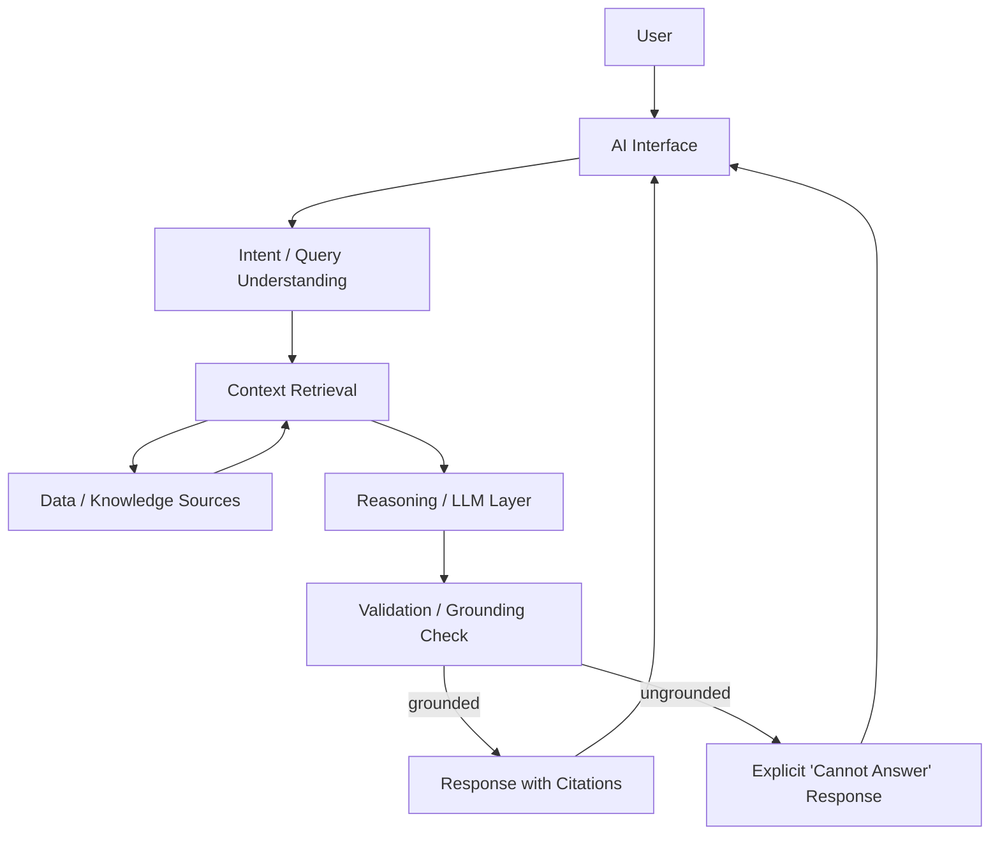
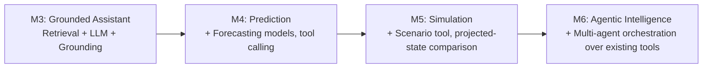

# AI Architecture

## 1. Purpose

This document defines the high-level architecture of DistrictMind's AI/ML layer, covering the Grounded AI Assistant (M3), Predictive Intelligence (M4), Scenario Simulation (M5), and Agentic Intelligence (M6). It defines boundaries, responsibilities, and safety mechanisms. No final LLM/model provider is selected (per [technology-stack.md](../00_Engineering_Overview/technology-stack.md) §4.5, all Candidate/To Be Evaluated).

## 2. AI Boundaries

The AI/ML layer, per [system-architecture.md](system-architecture.md) AD-001, sits horizontally beside Domain services and is invoked through a defined internal service interface. It is bounded as follows:

- **In scope for AI/ML layer:** query understanding, context retrieval, grounding/citation, LLM-based response generation, forecasting models, scenario simulation computation, (M6) agent orchestration.
- **Out of scope for AI/ML layer:** authentication/authorization (handled by API layer before a request reaches AI/ML), persistence of validated data (handled via the Data Access Layer, not written directly by AI/ML components), and any automated action on system state without human review (Human-in-the-Loop principle — see Section 12).

## 3. High-Level Pipeline

This pipeline is the architecture for the Grounded AI Assistant (M3). Later milestones extend it rather than replace it (Section 8).

## 4. LLM Role

The LLM (Large Language Model) is responsible for natural-language understanding of the user's query and for composing a response from retrieved, grounded context. The LLM is **not** treated as a source of factual district data — it operates only on data explicitly retrieved and passed to it (Grounded AI principle, [engineering-principles.md](../00_Engineering_Overview/engineering-principles.md)). This is an architectural constraint on how the LLM is used, independent of which provider is eventually selected.

## 5. RAG Role

Retrieval-Augmented Generation (RAG) is the mechanism by which district data is surfaced to the LLM at query time (per [engineering-glossary.md](../00_Engineering_Overview/engineering-glossary.md) definition). The Retrieval System ([component-architecture.md](component-architecture.md)) is responsible for:
- Interpreting the user's query well enough to identify relevant district(s), indicator(s), or domain(s).
- Retrieving matching structured data (via the Data Access Layer) and, where applicable, unstructured knowledge (via vector similarity search over embeddings, Section 6).
- Returning retrieved context, with enough source information to support citation, to the Reasoning/LLM Layer.

## 6. Structured Data Access

Where a user's query maps cleanly to structured district data (e.g., "What is the literacy rate in District X?"), the Retrieval System queries the relational/spatial store directly (via Data Access Layer repositories), rather than relying on the LLM to "recall" or approximate a number. This is the preferred grounding path wherever structured data can directly answer the query, since it is the most verifiable.

## 7. Unstructured Knowledge

Where relevant information exists only in less structured form (e.g., narrative reports, ingested documents), the Retrieval System uses vector similarity search over embeddings (per [database-architecture.md](database-architecture.md) Section 7) to find and retrieve relevant passages, which are then passed to the LLM as context alongside any structured data retrieved.

## 8. Tool Calling

From M4 onward, the AI/ML layer is expected to invoke defined internal "tools" (e.g., "run forecast for indicator X," "run scenario simulation Y") rather than only retrieving passive context. This is architected as an extension of the same Reasoning/LLM Layer, where the LLM (or, in M6, an orchestrated set of agents) can call a constrained set of backend-provided functions, each of which maps to an existing Domain service capability (Prediction, Simulation) — the AI/ML layer does not gain any capability that doesn't already exist as a governed Domain service.

## 9. Context Management

- Each AI interaction's context window is assembled explicitly (query + retrieved data + minimal conversational history), not left to accumulate unbounded prior conversation, to keep responses grounded in current, relevant data (Context Engineering, per glossary) and to bound cost/latency.
- Context assembly logic lives in the AI/ML layer, not the frontend, so it is Provider-agnostic and can be adjusted without a client release.

## 10. Grounding

Every AI Assistant response is checked against the Validation/Grounding stage (Section 3) before being returned: if the response cannot be tied to specific retrieved data, it is not presented as a factual answer. This directly implements FR-021 and FR-022, and NFR-031/NFR-033.

## 11. Hallucination Mitigation

Architectural mitigations (independent of model choice):
- Retrieval-first design (Sections 5–7): the LLM answers from provided context, not open-ended recall.
- Explicit grounding validation stage (Section 3) that can reject/flag a response lacking traceable source data.
- Citations are structural, not decorative: the Retrieval System's output format requires a source reference per retrieved fact, which the LLM is instructed (at the prompt/context-construction level) to preserve in its response.
- No mitigation strategy here relies on the LLM "policing itself" as the sole safeguard — the Validation/Grounding stage is a separate architectural step.

## 12. Confidence

- Forecasts and risk scores (M4) expose a confidence indicator or uncertainty range where methodologically feasible (NFR-032) — this is a requirement on the Prediction module's output contract, not merely a UI presentation choice.
- AI Assistant responses do not currently have a numeric confidence score architecture (no such requirement is documented in ED-M1); the binary grounded/ungrounded distinction (Section 3) is the confirmed mechanism. A richer confidence model is an open decision (Section 16).

## 13. Explainability

Every AI-influenced output type has an explainability requirement traced to a specific FR/NFR:
- AI Assistant responses: cited sources (FR-021, NFR-033).
- Forecasts/risk scores: exposed confidence/basis (FR-028's acceptance criteria, NFR-032).
- Recommendations (M6): documented evidence linkage to the specific data/predictions/simulations behind them (FR-031, NFR-034) — architecturally enforced via the data model relationship in [database-architecture.md](database-architecture.md) Section 10 (`RECOMMENDATION` linked to `FORECAST`/`SIMULATION_RESULT`).

## 14. Human Oversight

Per the Human-in-the-Loop principle, the AI/ML layer never triggers an automated action on system state:
- Recommendations (M6) are generated in a "draft" state and require explicit human review before being marked accepted (FR-032); this is enforced by the Recommendation module's Domain logic, not merely a UI convention — the API does not expose a path to "accepted" status except through a recorded human action.
- The Audit System logs every human review/acceptance action (FR-037).

## 15. AI Failure Handling

| Failure Scenario | Architectural Response |
|---|---|
| LLM provider unavailable/timeout | AI/ML layer returns an explicit failure status; no cached/stale answer is presented as current (Fail-Safe Behavior). |
| Retrieval returns no relevant data | Assistant returns the explicit "cannot answer" response (FR-022) rather than falling back to ungrounded LLM knowledge. |
| Forecast model has insufficient historical data | Prediction module returns an explicit "insufficient data" status (NFR-031's principle extended to prediction, consistent with Fail-Safe Behavior). |
| Grounding validation stage rejects a response | The rejected response is not shown to the user; the interaction is logged for review, and the user receives the "cannot answer" fallback. |

## 16. Preparing for Future AI Capability

Each stage reuses the pipeline in Section 3 and the tool-calling pattern in Section 8, rather than introducing a parallel AI architecture per milestone. The Agent Orchestrator (M6) coordinates multiple specialized agents, each of which is architected as a constrained caller of the same Domain-service tools already exposed to the single-assistant pipeline in M3–M5 — it is an orchestration layer over existing capability, not a new capability surface.

## 17. Milestone Traceability

| AI Capability | Milestone |
|---|---|
| Query understanding, retrieval, grounded response, citation | M3 — Future |
| Forecasting, risk scoring, tool-calling for prediction | M4 — Future |
| Scenario simulation tool, projected-state generation | M5 — Future |
| Multi-agent orchestration, recommendation generation | M6 — Future |

## 18. Open Decisions

- Final LLM/AI provider (Candidate: Claude/Anthropic, self-hosted open-weight models, other hosted providers — [technology-stack.md](../00_Engineering_Overview/technology-stack.md) §4.5).
- Final RAG/vector retrieval technology (Candidate: pgvector, Chroma, Qdrant/Weaviate).
- Whether AI Assistant responses require a numeric confidence score beyond the binary grounded/ungrounded distinction (Section 12).
- Whether/how the Agent Orchestrator (M6) requires asynchronous/event-driven communication, per the open question flagged in [system-architecture.md](system-architecture.md) Section 22.
- Data-sensitivity restrictions on sending district data to a third-party hosted AI provider (**Constraint requires confirmation**, per [constraints.md](../01_Requirements/constraints.md) AI/LLM Constraints) — this may materially affect the provider decision above.
