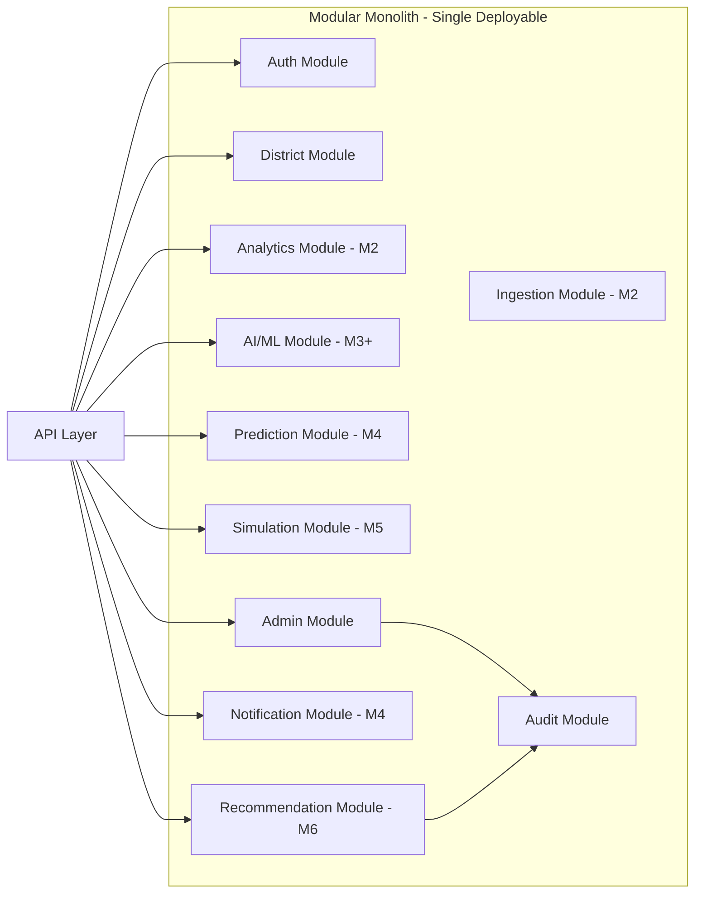

# Backend Architecture

## 1. Purpose

This document defines the architecture of the DistrictMind backend, spanning the API/Application, Domain/Intelligence Services, and Data Access layers from [system-architecture.md](system-architecture.md) (AD-001). It resolves the monolith-vs-microservices question explicitly, as required by the milestone brief.

## 2. Monolith vs. Modular Monolith vs. Microservices

| Criterion | Monolith (undifferentiated) | Modular Monolith | Microservices |
|---|---|---|---|
| Operational complexity | Low | Low–Medium | High (multiple deployments, service discovery, network reliability) |
| Fit for unconfirmed/small team ([constraints.md](../01_Requirements/constraints.md) Development-Team Constraints) | Good | Good | Poor at current stage |
| Fit for current scale target (~50 concurrent users, NFR-006) | Good | Good | Unnecessary overhead |
| Enforces module boundaries (Modularity principle) | Poor (no structural enforcement) | Good (structural + code-review enforcement) | Strongest (network boundary) |
| Ease of local development/testing | Good | Good | Harder (multi-service orchestration) |
| Independent scaling of AI/ML workloads | Not possible | Possible only if later extracted | Native |
| Alignment with "do not overengineer" guidance | — | Best fit | Overengineered for current requirements |

**AD-BE-001 — Modular Monolith Backend Architecture**
- **Decision:** The backend is architected as a single deployable application internally organized into clearly bounded modules (District, Auth, Analytics, Data Ingestion, AI/ML, Prediction, Simulation, Recommendation, Notification, Admin, Audit), each with an explicit internal interface. This restates and elaborates AD-002 from [system-architecture.md](system-architecture.md).
- **Context:** Team size unconfirmed and assumed modest; current scale requirements do not justify microservices operational overhead; the system must still support extensibility across M1–M6.
- **Alternatives considered:** Undifferentiated monolith (no enforced module boundaries); full microservices per domain.
- **Evaluation criteria:** See table above — operational complexity vs. team capacity vs. scalability vs. extensibility.
- **Trade-offs:** A modular monolith gives most of microservices' organizational benefit (clear boundaries, independent reasoning about modules) without its operational cost, at the price of shared deployment/scaling for all modules until one is deliberately extracted.
- **Consequences:** The AI/ML module and, later, the M6 Agent Orchestrator are the explicitly flagged candidates for future extraction into independently deployed services if their latency, compute (e.g., GPU), or scaling profile diverges materially from the rest of the backend. This is a future option, not a current commitment.
- **Status:** Proposed.

## 3. Application Server

The backend exposes its capability through a single application server process (or a small, horizontally-replicable set of identical processes — see Section 14, Scalability). No specific runtime/framework is confirmed; candidates (FastAPI, Node.js/Express/NestJS, Django) are listed in [technology-stack.md](../00_Engineering_Overview/technology-stack.md) §4.2, all currently status Candidate.

## 4. API Layer

- Exposes versioned REST endpoints (AD-BE-002 below), documented via an OpenAPI specification (technical-requirements.md API Requirements).
- Responsible for: request parsing/validation, authentication enforcement, routing to the appropriate Domain service, and response shaping — but **not** business logic itself (Separation of Concerns).

**AD-BE-002 — REST + OpenAPI as the API Style**
- **Decision:** Use REST over HTTPS as the primary API style, documented with OpenAPI.
- **Context:** ED-M1 already marks REST and OpenAPI/Swagger as Proposed in [technology-stack.md](../00_Engineering_Overview/technology-stack.md) §4.10; this decision formalizes that as the architecture's chosen style rather than leaving it purely as a candidate list.
- **Alternatives considered:** GraphQL (flagged in ED-M1 as To Be Evaluated, relevant if complex multi-domain dashboard queries later justify it).
- **Evaluation criteria:** Simplicity, tooling maturity, team familiarity, contract-first development support.
- **Trade-offs:** REST is simpler to document, cache, and secure per-endpoint; GraphQL would offer more flexible client-driven queries at the cost of additional complexity (query cost control, caching). GraphQL remains an option to revisit if Analytics/Dashboard (M2) query patterns become highly variable.
- **Consequences:** All backend endpoints follow REST conventions and are captured in an OpenAPI document as the source of truth for the API contract.
- **Status:** Proposed.

## 5. Service Layer

Each bounded module (Section 2) exposes a service layer implementing its business logic, called by the API layer and, where applicable, by other modules through declared interfaces only (never by reaching into another module's data access or internal state).

## 6. Domain Layer

The Domain layer holds core business rules and entities (District, Mandal, Indicator, User, Scenario, Recommendation, etc.) independent of how they are delivered (API) or stored (database). This separation allows storage technology (Section 6 of [database-architecture.md](database-architecture.md)) to change without rewriting business rules.

## 7. Repository / Data Access Layer

- Implements the Data Access Layer from [system-architecture.md](system-architecture.md) AD-001.
- Every module accesses persistent storage exclusively through repository interfaces specific to its domain (e.g., `DistrictRepository`, `AuditRepository`), never via raw queries scattered through service code.
- This isolation is what allows the database technology (Section 22 of system-architecture.md) to remain an open decision without blocking the rest of the architecture.

## 8. Validation

- Input validation occurs at the API layer boundary (structural/type validation of incoming requests) and again at the Domain layer boundary (business-rule validation, e.g., a scenario parameter within a valid range) — a deliberate two-stage approach so Domain logic never trusts unvalidated input even if invoked from a non-API caller (e.g., a background job).
- Data ingestion validation (schema/range rules, per FR-015) is a distinct validation stage within the Data Ingestion module, not reused from API-layer validation, since ingested data has a different shape and trust profile than user-submitted API requests.

## 9. Authentication

Implemented as a dedicated module (Authentication Service, per [component-architecture.md](component-architecture.md)) issuing and validating sessions/tokens. Candidate mechanisms (OAuth 2.0/OIDC — Proposed in ED-M1; Auth0/Keycloak — Candidate; custom JWT — Candidate) are evaluated in [security-architecture.md](security-architecture.md).

## 10. Authorization

Enforced as a cross-cutting concern applied at the API layer (via middleware/guard pattern) before a request reaches Domain logic, using role-based access control (RBAC) — see [security-architecture.md](security-architecture.md) Section 4.

## 11. Error Handling

- All API responses use a consistent, structured error format (technical-requirements.md API Requirements).
- Domain-layer exceptions are translated to appropriate HTTP status codes and structured error bodies at the API layer boundary — Domain logic does not format HTTP responses directly, preserving Separation of Concerns.
- Errors are never swallowed silently (Fail-Safe Behavior principle); every caught error is logged (Section 15) even if a generic message is returned to the client.

## 12. Background Jobs

Background/asynchronous processing (per AD-003 in system-architecture.md) is scoped to:
- Data ingestion runs (M2 — Future)
- Forecasting/risk model execution (M4 — Future)
- Scenario simulation runs, where computation exceeds a request/response-appropriate duration (M5 — Future)
- (M6 — Future) potentially, multi-agent orchestration runs, pending resolution of the async/messaging open decision in system-architecture.md Section 22.

No background job/queue technology is confirmed; this remains a **To Be Evaluated** decision, deferred until M2 data ingestion architecture is designed.

## 13. Caching

- Backend-layer caching (e.g., of frequently requested, slow-to-compute Analytics aggregates) is architecturally permitted but not assumed necessary at M1 launch scale.
- Any caching layer introduced must have an explicit invalidation strategy tied to the underlying data's update path, to avoid violating Data Integrity by serving stale district data as current.

## 14. Logging

- Structured logs are emitted per request (API layer) and per significant business event (Domain layer), per NFR-025.
- Audit-relevant events (administrative actions, AI recommendation review) are logged through the dedicated Audit System, not the general application logger, per technical-requirements.md Logging Requirements.

## 15. Observability

- Health-check endpoints are exposed per deployable unit (NFR-026).
- Metrics/tracing instrumentation is a **Proposed**, not yet implemented, addition — candidate tooling (OpenTelemetry) is listed in [technology-stack.md](../00_Engineering_Overview/technology-stack.md) §4.13 as Candidate.

## 16. Configuration

All environment-specific and domain-specific-but-changeable values (database connection details, API keys, indicator thresholds) are externalized from code (Configuration Over Hardcoding principle; technical-requirements.md Configuration Requirements). Configuration loading is centralized in one module read by all others, rather than scattered environment-variable reads throughout the codebase.

## 17. External Services

Backend interaction with external services (AI providers, external data sources, identity providers) is routed exclusively through the External Integration Adapters component ([component-architecture.md](component-architecture.md)), never called directly from Domain or API code — this preserves the ability to change providers without touching business logic, per [technical-requirements.md](../01_Requirements/technical-requirements.md) AI Requirements ("AI/ML components shall be isolated... so model/provider changes do not require... unrelated backend changes").

## 18. Backend Module Boundaries Summary

## 19. Milestone Traceability

| Backend Capability | Milestone |
|---|---|
| Auth, District, Admin, Audit modules; API layer; Data Access layer | M1 |
| Ingestion, Analytics modules | M2 — Future |
| AI/ML module (Grounded Assistant) | M3 — Future |
| Prediction, Notification modules | M4 — Future |
| Simulation module | M5 — Future |
| Recommendation module, Agent Orchestrator | M6 — Future |

## 20. Open Decisions

- Backend language/framework (Candidate: FastAPI, Node.js, Django).
- Background job/queue technology.
- Metrics/tracing tooling.
- Whether/when AI/ML or Agent Orchestrator is extracted from the modular monolith into a separate service (Section 2).
