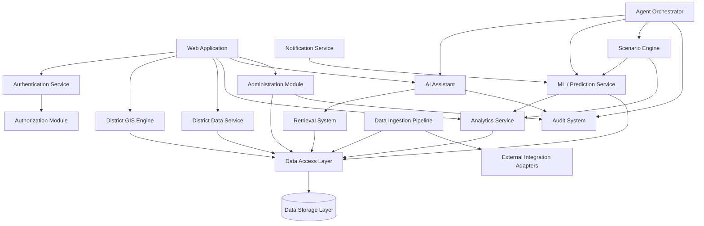

# Component Architecture

## 1. Purpose

This document inventories the major components of DistrictMind, their responsibilities, and their dependencies, within the seven-layer logical architecture defined in [system-architecture.md](system-architecture.md) (AD-001). It clarifies which components exist for which milestone and explicitly avoids implying that future-milestone components are already built.

## 2. Component Inventory

| Component | Responsibility | Inputs | Outputs | Dependencies | Milestone | Status |
|---|---|---|---|---|---|---|
| Web Application | Renders UI, GIS map, dashboards, AI chat; manages client state and navigation. | User interaction, API responses | Rendered views, API requests | API/Application layer | M1 | Not Started |
| Authentication Service | Verifies user identity; issues/validates sessions or tokens. | Credentials, tokens | Session/token, auth status | User Management data store | M1 | Not Started |
| Authorization Module | Enforces role-based access control on API requests. | User role, requested resource/action | Allow/deny decision | Authentication Service | M1 | Not Started |
| District GIS Engine | Serves and renders district/mandal boundary geometry; supports spatial queries (containment, selection). | Spatial queries, boundary data | Geometry payloads, query results | Spatial data store | M1 | Not Started |
| District Data Service | Manages core district/mandal reference data (identifiers, metadata). | District/mandal metadata | District/mandal records | Data Storage Layer | M1 | Not Started |
| Data Ingestion Pipeline | Ingests, validates, and transforms external multi-domain district datasets. | Raw external data files/feeds | Validated, stored records with provenance | External Data/Integration Layer, Data Storage | M2 — Future | Not Started |
| Analytics Service | Aggregates indicators/KPIs; supports dashboard queries, comparisons, trends. | Indicator queries | Aggregated indicator data | District Data Service, Data Storage | M2 — Future | Not Started |
| AI Assistant (Grounded) | Accepts natural-language queries; retrieves grounded context; generates cited responses. | User query, retrieved context | Grounded response with citations, or explicit "cannot answer" | Retrieval System, AI/ML Layer | M3 — Future | Not Started |
| Retrieval System (RAG) | Retrieves relevant district data/documents for a given query to ground AI responses. | Query embedding/terms | Ranked relevant data/context | Vector/data store | M3 — Future | Not Started |
| ML/Prediction Service | Executes forecasting and risk-scoring models against stored indicator data. | Historical indicator data | Forecasts, risk scores, confidence indicators | Analytics Service, Data Storage | M4 — Future | Not Started |
| Scenario Engine | Accepts scenario definitions; simulates projected effect on indicators. | Scenario parameters, baseline data | Projected indicator values | ML/Prediction Service, Analytics Service | M5 — Future | Not Started |
| Agent Orchestrator | Coordinates multiple specialized AI agents to analyze data and produce recommendations. | Detected issues, available agents/tools | Draft recommendations for human review | AI Assistant, ML/Prediction Service, Scenario Engine | M6 — Future | Not Started |
| Notification Service | Delivers notifications when configured thresholds (e.g., risk score) are breached. | Risk/threshold events | Delivered notifications | ML/Prediction Service | M4 — Future | Not Started |
| Administration Module | Manages users, roles, data source configuration. | Admin actions | Updated user/role/config records | Authentication Service, Data Storage | M1 (user/role mgmt), M2 — Future (data source config) | Not Started |
| Audit System | Records immutable audit log entries for administrative and AI-review actions. | System/admin/AI-review events | Audit log entries | All layers (cross-cutting) | M1 (admin actions), M6 — Future (AI recommendation review) | Not Started |
| Data Access / Repository Layer | Abstracts persistence operations from Domain services. | Domain-layer read/write calls | Persisted/retrieved records | Data Storage Layer | M1 | Not Started |
| External Integration Adapters | Connect to external boundary data, indicator data, identity, and AI provider sources. | External API/file responses | Normalized data for ingestion or AI grounding | External systems (Candidate, unconfirmed) | M1 (GIS source), M2+ (data sources), M3+ (AI provider) | Not Started |

## 3. Cross-Cutting Components

Some components are not tied to a single milestone but apply across the system:

- **Audit System** — cross-cutting from M1 (administrative actions) onward, extended in M6 (AI recommendation review, per FR-037).
- **Authorization Module** — enforced on every protected component from M1 onward as new components are added.
- **Data Access / Repository Layer** — used by every Domain service and, per AD-001 layer rules, by the AI/ML layer for grounding reads.

## 4. Component Dependency View

## 5. Notes on Status

Every component listed above is **Not Started** as of this document's creation — this milestone (ED-M2 Part 1) is architecture documentation only, consistent with the restriction against implementation. "Milestone" indicates when the component is first required, not when it will be built relative to today's date.
