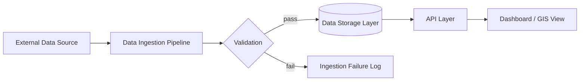
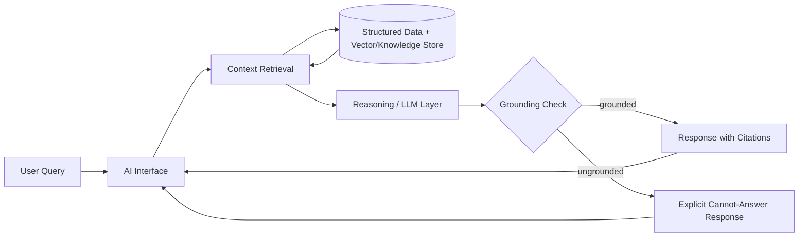
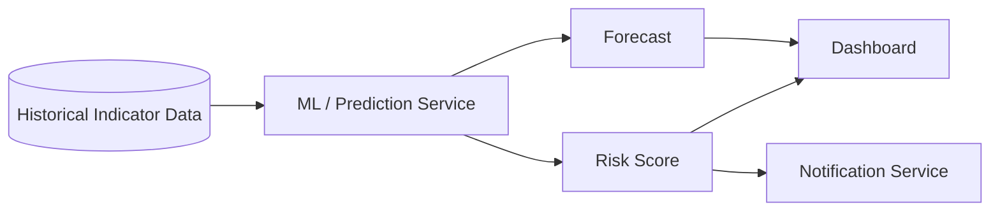
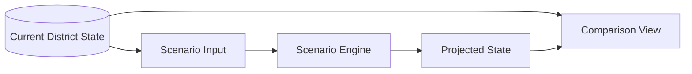
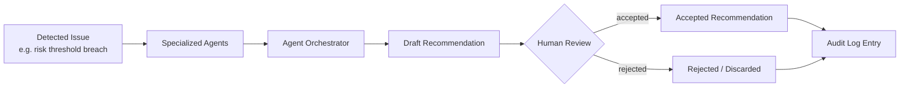

# Data Flow Architecture

## 1. Purpose

This document traces DistrictMind's major data flows end to end, across the layers defined in [system-architecture.md](system-architecture.md). Each flow specifies its trigger, processing, data movement, validation, output, failure cases, and auditability. These flows describe intended future behavior, spanning M1–M6 — none are implemented as of this document's creation.

---

## Flow A — External Data Ingestion to Dashboard

**Milestone:** M1 (GIS boundary data), M2 — Future (multi-domain indicator data)

- **Trigger:** A scheduled or manually initiated ingestion run against a configured external data source ([integration-architecture.md](integration-architecture.md)).
- **Processing:** The Data Ingestion Pipeline fetches raw data via an External Integration Adapter, normalizes format/CRS/units, and passes it to validation.
- **Data movement:** External source → Ingestion Pipeline → Validation stage → (on success) Data Storage Layer → API Layer → Presentation (dashboard/GIS view).
- **Validation:** Schema and range validation against defined rules (FR-015); records failing validation are rejected, not silently stored (Data Integrity principle).
- **Output:** Validated records persisted with source and ingestion-timestamp provenance (FR-014); available to the API/Dashboard immediately after commit.
- **Failure cases:** Source unreachable (ingestion run fails, logged per NFR-009); validation failure (individual records or whole batch rejected depending on ingestion design, logged with reason); partial-write is never committed (transactional boundary, per [database-architecture.md](database-architecture.md) Section 13).
- **Auditability:** Ingestion run outcomes (success/failure, record counts) are logged; this is operational logging, distinct from the Audit System, unless the ingestion was manually triggered by an administrator (in which case that trigger action is itself an auditable admin action per FR-036).

---

## Flow B — Grounded AI Assistant Query

**Milestone:** M3 — Future

- **Trigger:** A user submits a natural-language question about a district (FR-020).
- **Processing:** Detailed in [ai-architecture.md](ai-architecture.md) Section 3 — intent understanding, context retrieval (structured + unstructured), LLM response composition, grounding validation.
- **Data movement:** User query → AI Interface → Retrieval System (reads via Data Access Layer) → Reasoning/LLM Layer → Validation/Grounding stage → back to AI Interface → User.
- **Validation:** The grounding check (Section 3 of ai-architecture.md) verifies the response is traceable to retrieved data before it is returned as a factual answer.
- **Output:** Either a cited, grounded response (FR-021) or an explicit "cannot answer" indication (FR-022) — never an unlabeled, ungrounded answer.
- **Failure cases:** No relevant data retrieved → cannot-answer response; LLM provider unavailable/timeout → explicit failure surfaced to user (not a silent retry loop or fabricated fallback); grounding check rejects the drafted response → cannot-answer response, drafted response discarded.
- **Auditability:** Individual assistant queries are not treated as admin actions and are not required by any documented FR/NFR to be written to the Audit System; general application logging (NFR-025) still captures the interaction for operational/debugging purposes. This is flagged as a scope note, not a gap, since FR-036/FR-037 scope auditability to administrative and AI-recommendation-review actions specifically.

---

## Flow C — Historical Data to Prediction

**Milestone:** M4 — Future

- **Trigger:** A scheduled model run, or an on-demand forecast request for a specific district/indicator (FR-027).
- **Processing:** The ML/Prediction Service reads historical indicator data via the Data Access Layer, executes the applicable forecasting/risk model, and produces a forecast and/or risk score with an associated confidence indicator where feasible (NFR-032).
- **Data movement:** Historical Data (Storage Layer) → ML/Prediction Service (AI/ML Layer) → Forecast/Risk Score → Data Storage (persisted with model/version metadata, per [database-architecture.md](database-architecture.md) Section 8) → Dashboard (via API) and, if a configured threshold is breached, → Notification Service (FR-033).
- **Validation:** The Prediction module verifies sufficient historical data exists before producing a result; insufficient data yields an explicit "insufficient data" status rather than a low-confidence guess (Fail-Safe Behavior, Section 15 of ai-architecture.md).
- **Output:** A forecast/risk score record, versioned and traceable to the model and input snapshot used (Reproducibility principle).
- **Failure cases:** Insufficient historical data (explicit non-result); model execution failure (logged, no partial/corrupt forecast persisted).
- **Auditability:** Forecast generation itself is not an administrative action and is not required to be Audit-System-logged by any documented FR; its provenance (model/version/input snapshot) is retained as data-quality/reproducibility metadata (Section 8 of database-architecture.md), which serves a related but distinct purpose from the Audit System.

---

## Flow D — Scenario Simulation

**Milestone:** M5 — Future

- **Trigger:** A user defines a hypothetical intervention scenario (FR-029).
- **Processing:** The Scenario Engine takes the current baseline state (from Analytics Service / Data Storage) and the user-defined scenario parameters, and computes a projected state, potentially reusing the ML/Prediction Service's models as inputs (per [component-architecture.md](component-architecture.md) dependency: Scenario Engine → ML/Prediction Service).
- **Data movement:** Current State (Storage) + Scenario Input (user) → Scenario Engine (AI/ML Layer) → Projected State (Storage, linked to the originating scenario) → Comparison View (Presentation, showing baseline vs. projected side by side).
- **Validation:** Scenario parameters are validated at the Domain layer boundary (per [backend-architecture.md](backend-architecture.md) Section 8) before simulation runs — e.g., parameters within a plausible/defined range.
- **Output:** A simulation result distinct from the baseline (FR-030 acceptance criteria), stored with a link back to its originating scenario definition for later reference (e.g., by a future recommendation, per [database-architecture.md](database-architecture.md) Section 10).
- **Failure cases:** Invalid/out-of-range scenario parameters (rejected before simulation runs, per validation above); simulation computation failure (logged, no partial projected state persisted as if complete).
- **Auditability:** Not currently required by any documented FR to be Audit-System-logged; scenario definitions and results are retained as data (for later evidence linkage into recommendations, Flow E) rather than as audit-log entries specifically.

---

## Flow E — Detected Issue to Recommendation

**Milestone:** M6 — Future

- **Trigger:** A detected issue — e.g., a risk score breaching a configured threshold (Flow C output) or an administrator-initiated analysis request.
- **Processing:** The Agent Orchestrator coordinates specialized agents (each a constrained caller of existing AI Assistant, Prediction, and Simulation tools, per [ai-architecture.md](ai-architecture.md) Section 16) to analyze the issue and assemble a draft recommendation, with explicit evidence links to the forecasts/simulations that justify it (FR-031).
- **Data movement:** Detected Issue → Specialized Agents (each reading via existing Retrieval/Prediction/Simulation paths) → Agent Orchestrator (aggregates agent outputs) → Draft Recommendation (Storage, status = draft) → Human Review (Presentation, Recommendation review UI) → Accepted or Rejected status (Domain-layer-enforced transition, FR-032).
- **Validation:** A recommendation cannot transition to "accepted" without a recorded human action (FR-032 acceptance criteria) — this is enforced as a Domain-layer state-machine constraint, not merely a UI convention.
- **Output:** A recommendation record with documented evidentiary basis (NFR-034) and a final human-determined status (accepted/rejected).
- **Failure cases:** An agent fails to produce usable output (Orchestrator proceeds with available agent outputs or surfaces a partial/failed analysis explicitly, per Fail-Safe Behavior — no recommendation is presented as complete if its underlying analysis was incomplete); Orchestrator failure (no recommendation is generated; failure is logged operationally).
- **Auditability:** Every human review/acceptance action on a recommendation produces an Audit System entry, recording actor and timestamp (FR-037) — this is the one AI-output flow with an explicit, ED-M1-documented audit requirement beyond administrative actions.

---

## 2. Cross-Flow Observations

- Flows A, C, D, and E are chained: Flow A supplies the historical data Flow C forecasts from; Flow C's risk scores can trigger Flow E; Flow D's simulation results and Flow C's forecasts both serve as evidence for Flow E's recommendations (per [database-architecture.md](database-architecture.md) Section 10 entity relationships).
- Flow B (AI Assistant) is largely independent of C/D/E — it grounds against current/historical data directly, not against prediction or simulation outputs, though a future refinement could allow the assistant to answer questions about existing forecasts/scenarios (not currently scoped by any FR).
- Every flow's failure handling follows the same Fail-Safe Behavior principle: explicit failure/insufficient-data signaling over silent degradation, consistent across Flows A–E.

## 3. Milestone Traceability

| Flow | Milestone |
|---|---|
| A — Ingestion to Dashboard | M1 (GIS boundaries), M2 — Future (indicators) |
| B — AI Assistant Query | M3 — Future |
| C — Prediction | M4 — Future |
| D — Scenario Simulation | M5 — Future |
| E — Recommendation | M6 — Future |
