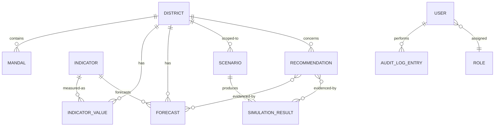

# Database Architecture

## 1. Purpose

This document describes the architectural approach to data persistence for DistrictMind — the categories of data the system must store, how they relate, and the structural strategy (indexing, transactions, migrations, backup) that governs them. It is explicitly **not** a schema: table/column-level design is deferred to ED-M2 Part 2 (data engineering / database design), per the milestone brief.

## 2. Data Categories

| Category | Description | Milestone |
|---|---|---|
| Relational (structured) data | Users, roles, districts, mandals, indicators, KPIs, scenarios, recommendations, notifications | M1–M6 (grows per milestone) |
| Spatial data | District/mandal boundary geometry, coordinates | M1 |
| Time-series-like data | Historical indicator values, forecasts over time | M2 (historical), M4 — Future (forecasts) |
| Document/semi-structured data | Ingested source documents or irregularly structured indicator data not cleanly relational | M2 — Future |
| Vector data | Embeddings for retrieval-augmented grounding | M3 — Future |
| Metadata | Data provenance (source, ingestion timestamp), schema versions | M1 (district metadata), M2 — Future (ingestion provenance) |
| Audit data | Immutable log of administrative and AI-review actions | M1 (admin actions), M6 — Future (AI review) |

## 3. Relational Data

The bulk of DistrictMind's structured data (users, districts, mandals, indicators, scenarios, recommendations) is inherently relational: districts contain mandals, indicators belong to districts and domains, recommendations reference the predictions/simulations that justify them. A relational model with enforced referential integrity is therefore the primary data paradigm (technical-requirements.md Database Requirements: "shall enforce referential integrity").

## 4. Spatial Data

District and mandal boundaries require storage of polygon/multipolygon geometry with support for spatial operations (containment, intersection) per [gis-architecture.md](gis-architecture.md) and FR-010–FR-012. This is architected as an extension of the primary relational store (a spatially-capable relational database) rather than a separate spatial database product, to avoid the operational overhead of managing two database systems for closely related data (district metadata and district geometry).

**AD-DB-001 — Spatial Capability as an Extension of the Primary Store, Not a Separate System**
- **Decision:** Store spatial geometry in the same database system as relational district/mandal data, using that system's spatial extension/capability, rather than a dedicated spatial database product.
- **Context:** District metadata and boundary geometry are tightly coupled (every district has exactly one boundary); splitting them across two systems would require cross-system consistency management for no clear benefit at current scale.
- **Alternatives considered:** Dedicated spatial database or spatial data server (e.g., GeoServer) separate from the relational store.
- **Evaluation criteria:** Operational simplicity, data consistency, query capability (joining spatial and non-spatial attributes in one query), "do not overengineer" guidance.
- **Trade-offs:** A single spatially-capable relational database is simpler to operate and query than a split system, at the cost of relying on that database's spatial extension maturity (evaluated in [technology-stack.md](../00_Engineering_Overview/technology-stack.md) §4.4 — e.g., PostGIS as a Candidate extension for PostgreSQL). A dedicated GIS server (e.g., GeoServer) remains a future option if standards-based map serving (WMS/WFS) becomes a requirement for external consumers.
- **Consequences:** The database product decision (Section 22 of system-architecture.md) must weigh spatial extension maturity as a primary criterion, consistent with [technology-stack.md](../00_Engineering_Overview/technology-stack.md) Evaluation Criterion 1 ("Fit for geospatial/district-scale data").
- **Status:** Proposed.

## 5. Time-Series Considerations

Historical indicator values and forecasts are time-ordered but are not expected, at DistrictMind's scale (district/mandal-level indicators, not high-frequency sensor data), to require a specialized time-series database. They are architected as relational tables with a time dimension (indicator, district, period, value), indexed for range queries (Section 10). This is a deliberate simplicity choice; it should be revisited only if indicator granularity or ingestion frequency grows far beyond periodic (e.g., annual/quarterly/monthly) district reporting.

## 6. Document Data

Some ingested source data (M2 — Future) may arrive in irregular or semi-structured form (e.g., government reports, mixed-schema datasets) before being normalized into the relational model. The architecture allows for a staging area (structured as document/semi-structured storage or a raw-data landing table) that holds pre-validation data separately from the validated relational store, so ingestion failures never contaminate trusted data (Data Integrity principle, FR-015).

## 7. Vector Data

Embeddings required for RAG-based grounding (M3 — Future, per [ai-architecture.md](ai-architecture.md)) are architected as a distinct data category, logically separate from transactional relational data even if physically co-located in the same database product (e.g., via a vector extension such as pgvector, Candidate per [technology-stack.md](../00_Engineering_Overview/technology-stack.md) §4.6) or in a standalone vector store, depending on the eventual AI architecture decision. This is intentionally left open pending M3 architecture design.

## 8. Metadata

Every ingested data record retains provenance metadata (source, ingestion timestamp) as a structural requirement, not an optional field (FR-014, NFR-030, technical-requirements.md Data Pipeline Requirements). Schema/version metadata for AI/ML model outputs (Section 9 of [ai-architecture.md](ai-architecture.md)) follows the same principle: reproducibility requires knowing which model version and input snapshot produced a given prediction (technical-requirements.md Versioning Requirements).

## 9. Audit Data

Audit log entries (FR-036, FR-037) are architected as **append-only** records, structurally distinct from mutable operational data, to satisfy the "immutable" requirement in FR-036's acceptance criteria. Audit data is written by the Audit System component ([component-architecture.md](component-architecture.md)) and is not modified or deleted by any other module.

## 10. Relationships

Core entity relationships (conceptual, not a schema):

This diagram is illustrative of the conceptual model this architecture must support (particularly: recommendations must reference the forecasts/simulations that justify them, per FR-031 and NFR-034). It is not a finalized entity list — the actual schema is ED-M2 Part 2 scope.

## 11. Data Isolation

- Environment separation (development/staging/production, per [system-requirements.md](../01_Requirements/system-requirements.md)) implies fully isolated database instances per environment — no shared database across environments.
- Within an environment, the staging/raw-ingestion area (Section 6) is logically isolated from the validated relational store so that ingestion failures cannot leak unvalidated data into user-facing queries.

## 12. Indexing Strategy

- Spatial indexes on boundary geometry, required for performant containment/intersection queries at map interaction speed (NFR-035).
- Standard indexes on foreign keys and frequently filtered/sorted columns (district identifier, indicator + district + period composite for time-series queries).
- Vector indexes (M3 — Future) for approximate nearest-neighbor search over embeddings, technology-dependent on the eventual vector storage decision (Section 7).
- Specific index definitions are deferred to ED-M2 Part 2; this section establishes that indexing is a first-class architectural concern, not an afterthought, given GIS and dashboard performance targets (NFR-001, NFR-002, NFR-035).

## 13. Transactions

- Operations that must be atomic (e.g., recording an ingestion run's outcome alongside the records it produced; recording an audit log entry alongside the administrative action it documents) are architected to use database transactions, not best-effort sequential writes, to preserve Data Integrity.
- The Repository/Data Access Layer ([backend-architecture.md](backend-architecture.md) Section 7) is responsible for transaction boundaries — Domain services declare intent (e.g., "ingest this validated batch"), not raw transaction control.

## 14. Migration Strategy

- All schema changes are made via versioned, repeatable migrations (technical-requirements.md Versioning Requirements; NFR-022).
- Migrations are forward-only in normal operation; rollback strategy for a failed migration is a deployment-process concern to be defined alongside the eventual CI/CD design (out of scope here).
- Reference/boundary data updates (e.g., a district boundary correction) are treated as versioned/auditable data changes, not silent overwrites (system-requirements.md Data Requirements).

## 15. Backup / Recovery Concept

- Regular backups of the persistent store are a baseline requirement (NFR-037); backup frequency and retention are **To Be Finalized During Architecture Design** / infrastructure planning.
- Recovery Time Objective (RTO) and Recovery Point Objective (RPO) are explicitly undefined at this stage (NFR-038) — this document does not invent figures for either.
- Because spatial, relational, and (future) vector data are architected within the same primary store (AD-DB-001), backup/recovery strategy can be unified rather than needing to coordinate consistency across multiple database systems — a direct benefit of that decision.

## 16. Milestone Traceability

| Data Capability | Milestone |
|---|---|
| District/mandal relational + spatial data | M1 |
| Indicator/KPI time-series data, ingestion staging area | M2 — Future |
| Vector/embedding storage | M3 — Future |
| Forecast storage with model/version metadata | M4 — Future |
| Scenario/simulation result storage | M5 — Future |
| Recommendation storage with evidence linkage | M6 — Future |

## 17. Open Decisions

- Final database product (Candidate: PostgreSQL, MySQL/MariaDB, MongoDB — per [technology-stack.md](../00_Engineering_Overview/technology-stack.md)).
- Final spatial extension/product (Candidate: PostGIS).
- Final vector storage approach (Candidate: pgvector vs. standalone vector store — Qdrant/Weaviate/Chroma).
- Backup frequency, retention, RTO/RPO targets.
- Whether a dedicated document store is needed for ingestion staging, or whether the primary relational store's own semi-structured capabilities (if any, product-dependent) suffice.
