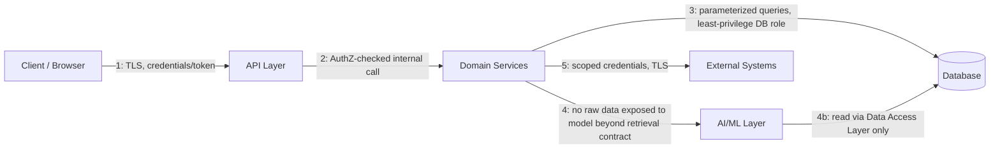

# Security Architecture

## 1. Purpose

This document defines DistrictMind's architectural security boundaries and mechanisms. It is architecture-level only — detailed security policies, threat models, and compliance procedures are future work, not produced in this milestone.

## 2. Security Boundary Model

Per the milestone brief, security boundaries are evaluated across: Client → API → Services → Database → AI → External Systems. Every arrow below is a trust boundary: the receiving side never implicitly trusts the sending side.

| Boundary | Control |
|---|---|
| 1. Client → API | TLS in transit (NFR-011); authentication required before any protected request is processed (FR-004, FR-005). |
| 2. API → Services | Authorization (RBAC) enforced at the API layer before Domain logic executes (Section 4). |
| 3. Services → Database | Parameterized/prepared queries only (injection prevention); database access uses a least-privilege service account, not an administrative credential. |
| 4. Services → AI/ML | AI/ML layer receives only the data explicitly retrieved for a given query (Section 6 below) — not open access to the database. |
| 4b. AI/ML → Database | Even the AI/ML layer's own retrieval reads go through the same Data Access Layer/repository interfaces as Domain services (per [system-architecture.md](system-architecture.md) Section 6.2), not a separate, less-governed path. |
| 5. Services → External Systems | Outbound calls are TLS-encrypted, use scoped credentials, and go through the Integration layer's adapters ([integration-architecture.md](integration-architecture.md) Section 16). |

## 3. Authentication

- All access to protected resources requires authentication (FR-004; system-requirements.md Security Requirements).
- Candidate mechanisms — OAuth 2.0/OIDC (Proposed protocol), Auth0/Keycloak (Candidate provider), custom JWT-based auth (Candidate) — remain as listed in [technology-stack.md](../00_Engineering_Overview/technology-stack.md) §4.9; no mechanism is confirmed.
- Regardless of mechanism chosen, credentials are never stored in plaintext (NFR-012); passwords/secrets are hashed using an industry-standard algorithm with per-credential salting.

## 4. Authorization (RBAC)

- Role-based access control is the confirmed authorization model direction (FR-003, NFR-013), distinguishing at minimum administrator and standard user roles at M1, extensible to finer-grained roles as new modules (Prediction, Simulation, Recommendation) are added.
- Authorization checks occur at the API layer, before a request reaches Domain logic (per [backend-architecture.md](backend-architecture.md) Section 10) — Domain services are not individually responsible for re-checking permissions already validated at the boundary, but must not assume they can be called from an unauthenticated/unauthorized context either (defense in depth: Domain-layer operations still validate business-rule-level constraints, e.g., "can this role approve a recommendation," per Section 9 below).

## 5. Session / Token Management

- Sessions/tokens are issued on successful login (FR-005) and invalidated on logout (FR-006).
- Token/session lifetime, refresh mechanism, and storage location (e.g., HTTP-only cookie vs. client-stored token) are implementation-time decisions dependent on the chosen authentication mechanism (Section 3) — not fixed here, but must satisfy the constraint that tokens are never exposed to client-side script in a way that enables trivial theft (e.g., preferring HTTP-only, secure cookies over `localStorage` token storage where the chosen framework supports it) — a **Recommended** direction, not yet a binding decision.

## 6. Input Validation

- All external input (API requests, ingested data files, user-submitted AI queries) is treated as untrusted (Security by Design principle).
- Validation occurs at layer boundaries as defined in [backend-architecture.md](backend-architecture.md) Section 8 (API-layer structural validation, Domain-layer business-rule validation, Ingestion-specific schema/range validation) — this is the same mechanism, not a separate security-only validation pass, since duplicating validation logic invites drift.
- AI query input specifically requires this same discipline: a user's natural-language query is treated as untrusted input to the Retrieval System, not passed unsanitized into any downstream system call (Section 12).

## 7. API Security

- Every protected endpoint enforces authentication and authorization (NFR-013).
- API responses do not leak internal implementation detail in error messages (structured, generic error responses per [backend-architecture.md](backend-architecture.md) Section 11).
- Rate limiting on the API layer is a **Proposed** control to prevent abuse (e.g., of the AI Assistant endpoint, which is the most expensive per-request operation) — no specific limits are set here (Section 13).

## 8. Secrets

- Secrets (database credentials, API keys for external/AI providers) are never committed to version control (technical-requirements.md Security Requirements) and are loaded via the centralized configuration mechanism ([backend-architecture.md](backend-architecture.md) Section 16).
- Secrets management approach (e.g., a dedicated secrets manager vs. environment-variable injection at deploy time) is **To Be Finalized During Architecture Design**, pending hosting/infrastructure decisions.

## 9. Database Security

- Database access from the application uses a least-privilege service account (Section 2, boundary 3) — not a superuser/administrative credential.
- Audit data (Section 11) is written through a path that ordinary Domain service database roles cannot modify or delete, preserving its immutability guarantee (FR-036 acceptance criteria).
- Encryption-at-rest is **To Be Finalized During Architecture Design** (system-requirements.md Security Requirements) — not assumed implemented by default.

## 10. Encryption

- In transit: TLS is mandatory for all client-server and server-external-provider communication (NFR-011, Section 16 of [integration-architecture.md](integration-architecture.md)).
- At rest: not yet decided (Section 9 above); flagged as an open decision, not silently assumed.

## 11. Audit Logging

- The Audit System ([component-architecture.md](component-architecture.md)) is architecturally separate from general application logging (technical-requirements.md Logging Requirements), specifically so audit trail integrity does not depend on the same code paths/log levels used for routine debugging.
- Audit-relevant events, at minimum: administrative actions on users/roles/data-source configuration (FR-036), and human review/acceptance of AI recommendations (FR-037, M6 — Future).
- Audit entries are append-only (per [database-architecture.md](database-architecture.md) Section 9) and record actor identity and timestamp (NFR-014).

## 12. AI Prompt Injection

- Because the LLM operates only on explicitly retrieved, structured context (Grounded AI, [ai-architecture.md](ai-architecture.md) Section 4), the attack surface for prompt injection via ingested or retrieved data is architecturally reduced but not eliminated — retrieved document content (Section 7 of ai-architecture.md, unstructured knowledge) could itself contain adversarial text.
- Mitigation direction (Proposed, implementation-time detail deferred): the Reasoning/LLM Layer treats retrieved content as data to be summarized/cited, not as instructions to be followed — this is a prompt-construction and system-instruction discipline enforced in the AI/ML layer, not a guarantee provided by any specific model.
- Tool-calling (M4+, Section 8 of ai-architecture.md) is constrained to a fixed, backend-defined set of functions; retrieved or user-supplied content cannot expand the set of callable tools or their permissions.

## 13. Data Leakage

- The AI/ML layer's access to district data is scoped to what the Retrieval System explicitly fetches for a given, authorized query — not a standing, unscoped connection to the full database (Section 2, boundary 4b still goes through governed Data Access, but retrieval queries themselves are scoped per-request).
- Data sent to a third-party hosted LLM provider (if that path is eventually chosen — see [integration-architecture.md](integration-architecture.md) Section 8/18) is subject to the unresolved sensitivity constraint in [constraints.md](../01_Requirements/constraints.md) AI/LLM Constraints; this document does not assume that constraint has been cleared.
- Authorization scoping (Section 4) applies to AI Assistant queries the same as any other request — a user cannot retrieve, via the assistant, district data their role would not otherwise permit them to see through the dashboard.

## 14. Model Abuse

- Rate limiting (Section 7) applies specifically to AI-driven endpoints given their cost/latency profile relative to standard CRUD endpoints.
- Tool-calling scope limits (Section 12) also serve as an abuse-prevention control — a compromised or manipulated AI interaction cannot be used to trigger arbitrary backend actions, only the same bounded set of Domain-service tools available to legitimate use.

## 15. Rate Limiting

Architecturally required at the API layer (Section 7), with the AI Assistant and data-ingestion endpoints flagged as priority targets given their resource cost. Specific thresholds are implementation-time tuning, not defined in this document.

## 16. Secure Integrations

Covered in depth in [integration-architecture.md](integration-architecture.md) Section 16 (TLS, scoped credentials, adapter-mediated access). This document's Section 2 boundary 5 restates that no external integration is exempt from the same trust-boundary discipline applied internally.

## 17. Least Privilege

Applied at every boundary in Section 2: the API layer's Domain-service calls are scoped to what a given authenticated role permits (Section 4); the Services-to-Database boundary uses a restricted database role (Section 9); external integration credentials are scoped to only the access each specific integration needs (Section 16 of integration-architecture.md).

## 18. Security Monitoring

- Security-relevant events (authentication attempts, authorization failures, administrative actions) are logged per NFR-014 and system-requirements.md Security Requirements.
- Alerting/monitoring tooling on top of these logs (e.g., anomaly detection on failed-login patterns) is **Future** — not evaluated in ED-M1 or committed to any milestone here; the architectural prerequisite (the events being logged at all) is what this milestone establishes.

## 19. Milestone Traceability

| Security Capability | Milestone |
|---|---|
| Authentication, RBAC, TLS, audit logging (admin actions), secrets handling | M1 |
| Data-source/ingestion input validation | M2 — Future |
| AI-specific boundaries (prompt injection mitigation, data leakage scoping, AI rate limiting) | M3 — Future |
| Audit logging extended to AI recommendation review | M6 — Future |

## 20. Open Decisions

- Final authentication mechanism/provider.
- Token/session storage mechanism.
- Encryption-at-rest approach.
- Secrets management tooling.
- Specific rate-limit thresholds.
- Formal compliance/regulatory review (per [constraints.md](../01_Requirements/constraints.md) Regulatory/Privacy Considerations — **Constraint requires confirmation**).
