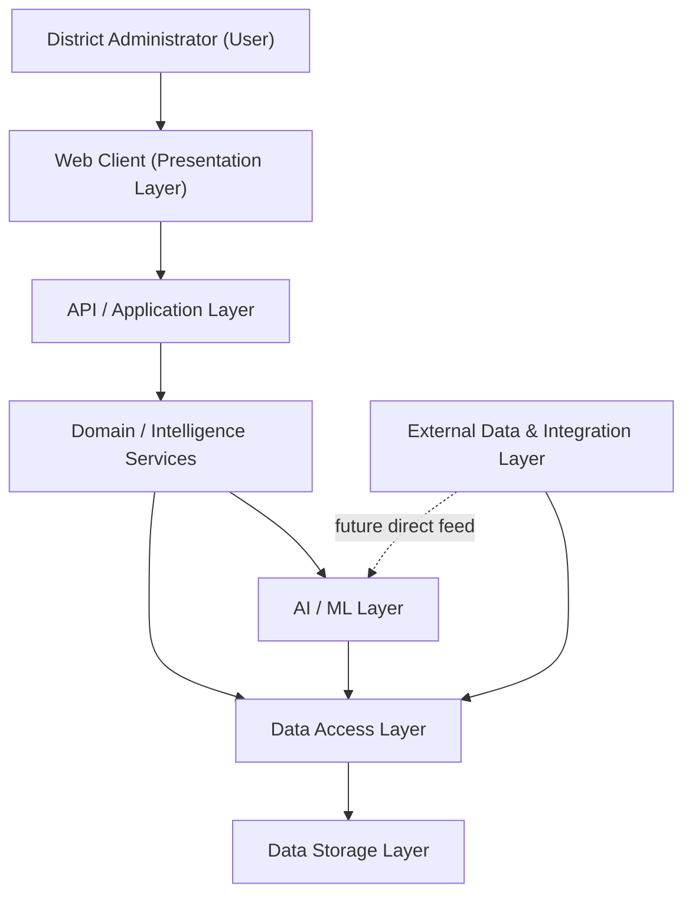
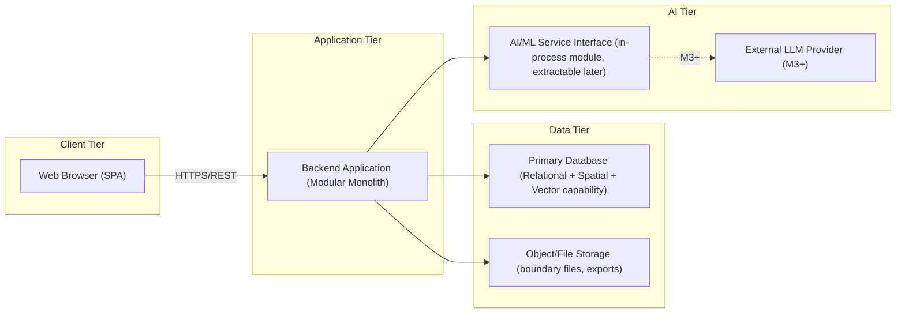
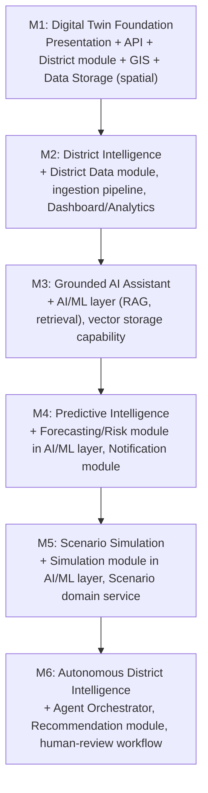

# System Architecture

## 1. Purpose

This document defines the target logical and physical architecture for DistrictMind. It translates the requirements and principles established in ED-M1 (`docs/engineering/00_Engineering_Overview/`, `docs/engineering/01_Requirements/`) into a coherent architectural structure capable of supporting all six product milestones (M1–M6) without requiring a full rewrite between them.

This document does not select final vendor technologies where ED-M1's [technology-stack.md](../00_Engineering_Overview/technology-stack.md) has not already confirmed one. Where this document proposes an architectural *pattern* (e.g., "modular monolith," "layered architecture") that is new relative to ED-M1, it is recorded as an Architecture Decision (AD) with explicit status, per the discipline in Section 22.

## 2. Architecture Goals

1. Support the incremental delivery of M1 → M6 without architectural rewrites at milestone boundaries (extensibility).
2. Keep the system simple enough for a small, evolving team to build, test, and operate (per [constraints.md](../01_Requirements/constraints.md), team size is unconfirmed and assumed modest — [assumptions.md](../01_Requirements/assumptions.md) AS-005).
3. Isolate AI/ML capability behind clear internal interfaces so model or provider changes do not ripple into unrelated code (per [technical-requirements.md](../01_Requirements/technical-requirements.md) AI Requirements).
4. Ensure every AI-influenced output (assistant answer, prediction, simulation, recommendation) is traceable to its underlying data, consistent with the Explainable AI and Grounded AI principles in [engineering-principles.md](../00_Engineering_Overview/engineering-principles.md).
5. Provide accurate, performant geospatial representation of Telangana districts and mandals (FR-007–FR-012, NFR-035–NFR-036).
6. Maintain a single, coherent security boundary model from client through to data storage and AI (see [security-architecture.md](security-architecture.md)).
7. Avoid overengineering: no architectural pattern is adopted unless the current or near-term milestone genuinely requires it (Section 26 of the milestone brief; also see Section 21 below).

## 3. Architecture Principles

This architecture inherits all principles from [engineering-principles.md](../00_Engineering_Overview/engineering-principles.md) without modification. The principles most directly shaping structural decisions in this document are: Modularity, Separation of Concerns, API-First Design, Grounded AI, Human-in-the-Loop, Observability, Scalability, and Configuration Over Hardcoding.

## 4. System Boundaries

Unchanged from [engineering-overview.md](../00_Engineering_Overview/engineering-overview.md) Section 5. This architecture covers: district-level geospatial visualization, multi-domain district data, a grounded AI assistant, predictive analytics, scenario simulation, and multi-agent recommendation generation. It excludes citizen-facing applications, real-time physical infrastructure control, and financial transaction processing.

## 5. High-Level Architecture

DistrictMind is architected as a single logical platform composed of a web client, a modular backend, a primary data store with spatial and (future) vector capability, and an isolated AI/ML layer. The diagram below shows the high-level shape; component-level detail is in [component-architecture.md](component-architecture.md).

## 6. Logical Architecture

### 6.1 Layer Definition

The milestone brief suggested a seven-layer starting point (Presentation → API/Application → Domain/Intelligence Services → AI/ML → Data Access → Data Storage → External Data/Integration). Evaluated against DistrictMind's actual requirements, this structure is largely justified and is adopted as **AD-001**, with one adaptation: the AI/ML layer is positioned as a **horizontal layer invoked by Domain services**, not a separate top-to-bottom pipeline, because AI capability (M3 assistant, M4 prediction, M5 simulation, M6 agents) is consumed by multiple domain services rather than being a single linear stage.

| Layer | Responsibility | Primary Milestone Driver |
|---|---|---|
| Presentation | Renders UI, GIS map, dashboards, AI chat interface; manages client-side state and interaction. | M1 (map/nav), all later milestones (new views) |
| API / Application | Exposes versioned REST endpoints; handles request validation, authentication/authorization enforcement, response shaping. | M1 |
| Domain / Intelligence Services | Encapsulates business logic per domain: District, Analytics/KPI, Prediction, Simulation, Recommendation, Admin, Audit. | M1–M6 (grows per milestone) |
| AI / ML | Hosts RAG retrieval, LLM orchestration, forecasting models, simulation engines, and (M6) agent orchestration, behind an internal service interface. | M3–M6 |
| Data Access | Repository/ORM abstractions over persistent stores; isolates Domain layer from storage technology. | M1 |
| Data Storage | Relational, spatial, (future) vector, and audit/log storage. | M1–M6 |
| External Data / Integration | Adapters for external boundary/indicator data sources, identity providers, and hosted AI providers. | M1–M6 |

**AD-001 — Layered Logical Architecture**
- **Decision:** Adopt a seven-layer logical architecture as described above.
- **Context:** DistrictMind must support six milestones of growing capability without repeated structural rewrites.
- **Alternatives considered:** (a) Flat MVC-style structure with no explicit Domain/AI separation; (b) event-driven architecture with layers replaced by asynchronous pub/sub stages.
- **Evaluation criteria:** Extensibility across M1–M6, team-size appropriateness, alignment with Separation of Concerns and Modularity principles.
- **Trade-offs:** More upfront structural discipline than a flat MVC approach; less operational complexity than an event-driven system, at the cost of not natively supporting asynchronous, loosely-coupled scaling (deferred — see Section 20).
- **Consequences:** All subsequent architecture documents (component, frontend, backend, database, GIS, AI, integration, security) are organized around these seven layers.
- **Status:** Proposed.

### 6.2 Layer Interaction Rules

- Presentation communicates only with the API/Application layer — never directly with Data Storage or AI/ML.
- Domain/Intelligence Services communicate with AI/ML and Data Access layers; they do not call External Data/Integration adapters directly (adapters are invoked via Data Access or a dedicated ingestion pathway — see [data-flow.md](data-flow.md) Flow A).
- AI/ML components read from Data Access (for grounding/retrieval) but must not write to Data Storage except through the same validated Data Access interfaces used by Domain services, preserving Data Integrity.
- Every cross-layer call is synchronous REST/internal-function-call by default (**AD-002**, see Section 8); asynchronous processing is scoped narrowly to background jobs (data ingestion, model runs) rather than the whole architecture.

## 7. Physical / Deployment Architecture Concept

No hosting provider or deployment topology is confirmed (per [constraints.md](../01_Requirements/constraints.md) Infrastructure Constraints). The concept below is vendor-neutral and describes deployable units, not infrastructure providers.

**AD-002 — Deployable Units: Single Backend Application (Modular Monolith), Separate Web Client**
- **Decision:** Deploy the backend as a single application process internally divided into bounded modules, and the frontend as a separately deployed static/SPA build.
- **Context:** Team size and operational capacity are unconfirmed and assumed modest (AS-005); current scale target is tens of concurrent users (NFR-006).
- **Alternatives considered:** (a) Microservices per domain (District, AI, Prediction, Simulation, Recommendation each independently deployed); (b) Full monolith including frontend server-rendering.
- **Evaluation criteria:** Operational complexity vs. team capacity, deployment/testing simplicity, alignment with "do not overengineer" guidance, ability to extract services later if justified.
- **Trade-offs:** A modular monolith is simpler to build, test, and deploy than microservices, but requires internal discipline (module boundaries, no shared mutable state) to avoid becoming a tangled monolith over time. It also means the whole backend scales as one unit initially.
- **Consequences:** Internal module boundaries (District, Auth, Analytics, AI, Prediction, Simulation, Recommendation, Admin, Audit) must be enforced by code organization and interfaces (see [backend-architecture.md](backend-architecture.md), [backend-structure.md](../03_Project_Structure/backend-structure.md)), not by network boundaries. The AI/ML module and, later, the M6 Agent Orchestrator are explicitly flagged as the most likely first candidates for extraction into a separately deployed service if latency, GPU/compute, or scaling needs diverge from the rest of the backend.
- **Status:** Proposed.

## 8. Major Subsystems

See [component-architecture.md](component-architecture.md) for the full component inventory. At the subsystem level:

1. **Web Application Subsystem** — presentation layer, GIS rendering, dashboards, AI chat UI.
2. **Platform Backend Subsystem** — API, authentication/authorization, domain services, data access.
3. **AI/ML Subsystem** — retrieval, grounding, LLM orchestration, forecasting, simulation, agent orchestration (M6).
4. **Data Platform Subsystem** — primary data store, ingestion pipelines, audit/log storage.
5. **Integration Subsystem** — adapters to external boundary/indicator data sources, identity providers, AI providers.

## 9. Component Responsibilities

Delegated in full to [component-architecture.md](component-architecture.md) to avoid duplication; this document defines the layers those components live in.

## 10. Communication Patterns

| Pattern | Where Used | Status |
|---|---|---|
| Synchronous REST over HTTPS | Client ↔ API layer; API layer ↔ AI/ML service interface | Proposed |
| In-process function/module calls | Domain services ↔ Data Access layer (within the modular monolith) | Proposed |
| Background job / worker queue | Data ingestion (M2), forecasting model runs (M4), simulation runs (M5) | Future — pattern proposed, no queue technology selected |
| Event-driven messaging | Not adopted at this stage | Deferred — see Section 20 |

**AD-003 — Synchronous-First Communication**
- **Decision:** Default to synchronous REST/in-process calls; introduce asynchronous background jobs only for genuinely long-running work (data ingestion, model training/inference batches), not as a general architectural style.
- **Context:** Avoids the operational complexity of a message broker or event bus before the system has a proven need for one (Section 26 guidance).
- **Alternatives considered:** Event-driven architecture with a message broker for all inter-module communication.
- **Evaluation criteria:** Operational simplicity, debuggability, team capacity, actual latency/throughput needs at current scale.
- **Trade-offs:** Simpler to reason about and operate; may require revisiting if M6 agent orchestration needs fan-out/fan-in patterns better served by async messaging.
- **Consequences:** A message broker is explicitly deferred, not rejected outright — flagged as an open question for M6 architecture (Section 21).
- **Status:** Proposed.

## 11. Data Flow

Full flow diagrams are in [data-flow.md](data-flow.md). Summary: External Data → Ingestion → Validation → Storage → API → Presentation (Flow A); User → AI Assistant → Retrieval → LLM → Grounded Response (Flow B); Historical Data → ML → Prediction/Risk → Dashboard (Flow C); Current State → Scenario Input → Simulation → Projected State (Flow D); Detected Issue → Agents → Orchestration → Recommendation → Human Review (Flow E).

## 12. External Integrations

Detailed in [integration-architecture.md](integration-architecture.md). At the architecture level: no external integration is currently Confirmed. Candidates include government/public GIS boundary data sources, district indicator data sources, a hosted or self-hosted LLM provider, and (optionally) an identity provider for SSO.

## 13. Security Boundaries

Detailed in [security-architecture.md](security-architecture.md). At the architecture level, every layer boundary (Client→API, API→Domain, Domain→AI, Domain→Data Access, Data Access→Storage, Backend→External) is treated as a trust boundary requiring explicit authentication/authorization or input validation — no layer implicitly trusts its caller.

## 14. Scalability Strategy

- Stateless API layer (no server-side session state held in application memory) to allow horizontal replication of the backend process without sticky sessions, once scaling is needed (supports NFR-006, technical-requirements.md "Backend shall support horizontal scaling").
- Database scaling (read replicas, connection pooling, indexing) deferred until real load data exists; the architecture does not assume a specific scaling mechanism today.
- GIS rendering performance is addressed client-side (see [frontend-architecture.md](frontend-architecture.md) and [gis-architecture.md](gis-architecture.md)) via geometry simplification and layer-level caching rather than server scaling alone.
- AI/ML workloads are isolated behind a service interface specifically so they can be scaled or relocated (e.g., to GPU-backed infrastructure) independently of the rest of the backend, without the module boundary itself needing to change.

## 15. Reliability Strategy

- Layer interaction rules (Section 6.2) ensure failures in one module (e.g., AI/ML) do not directly corrupt data written by another (Data Integrity principle).
- Fail-safe behavior (per [engineering-principles.md](../00_Engineering_Overview/engineering-principles.md)): AI/ML and prediction components must return an explicit "cannot ground" / "insufficient data" result rather than a degraded guess when they fail (NFR-031).
- Automatic recovery from transient failures (e.g., dropped DB connection) is a backend requirement (NFR-010); connection pooling and retry-with-backoff at the Data Access layer are the proposed mechanism, technology TBD.

## 16. Performance Strategy

Addressed per-layer in the corresponding architecture documents: [frontend-architecture.md](frontend-architecture.md) (UI/GIS rendering, code splitting, virtualization), [backend-architecture.md](backend-architecture.md) (API latency), [database-architecture.md](database-architecture.md) (indexing, query design), [ai-architecture.md](ai-architecture.md) (AI response latency), and [gis-architecture.md](gis-architecture.md) (map rendering). All performance targets referenced trace to NFR-001–NFR-003, NFR-035–NFR-036, marked Initial Target / To Be Validated in ED-M1.

## 17. Observability Strategy

- Structured logging at the API and Domain layers (NFR-025), with audit-specific logging kept distinct from general application logs (technical-requirements.md Logging Requirements).
- Health-check endpoints per deployable unit (NFR-026).
- Tracing across layer boundaries (Presentation → API → Domain → AI/Data Access) is a **Proposed** future addition once a specific tool is selected (see [technology-stack.md](../00_Engineering_Overview/technology-stack.md) §4.13, currently Candidate/To Be Evaluated) — not assumed implemented now.

## 18. Extensibility Strategy

The layered, modular-monolith structure exists specifically so that:
- New domain services (e.g., Prediction in M4, Simulation in M5, Recommendation in M6) can be added as new modules without modifying existing modules' internals, only their declared interfaces where genuinely new data is needed.
- The AI/ML layer can grow from a single RAG pipeline (M3) to forecasting (M4), simulation support (M5), and multi-agent orchestration (M6) behind the same external service interface used by Domain services.
- The database schema is expected to grow (new tables/domains) rather than be redesigned; see [database-architecture.md](database-architecture.md).

## 19. Failure Handling

| Failure Scenario | Architectural Response |
|---|---|
| External data source unavailable during ingestion | Ingestion job fails loudly, logs the failure, does not partially write unvalidated data (NFR-009). |
| AI/LLM provider unavailable or times out | AI/ML layer returns an explicit failure/"assistant unavailable" response; Presentation layer surfaces this to the user rather than retrying silently or fabricating an answer. |
| Database connection lost | Data Access layer retries with backoff; if recovery fails, API layer returns a structured error, not a partial/cached stale response presented as current. |
| Forecast/simulation model cannot produce a result (insufficient data) | AI/ML layer returns an explicit "insufficient data" status rather than a low-confidence guess presented as a normal result (NFR-031, Fail-Safe Behavior principle). |
| Authorization check fails | API layer rejects the request before it reaches Domain logic; failure is logged as a security-relevant event (NFR-014). |

## 20. Six-Milestone Evolution

Each milestone adds modules within the existing seven-layer structure rather than introducing a new architectural pattern. The AI/ML layer is the layer expected to grow the most (M3–M6); it is deliberately isolated (AD-001, AD-002) so this growth does not require restructuring the Presentation, API, or Data layers.

## 21. Architecture Risks

| Risk | Description | Mitigation Direction |
|---|---|---|
| Modular monolith discipline erosion | Without enforced module boundaries, the backend could become a tangled monolith, undermining Modularity. | Enforce boundaries via code structure (see [backend-structure.md](../03_Project_Structure/backend-structure.md)) and code review discipline; revisit extraction into services if boundaries are repeatedly violated. |
| AI/ML latency and cost unknowns | No LLM provider is confirmed; response-time and cost characteristics are unknown, affecting NFR-003 achievability. | Validate against a selected provider during M3 architecture; keep AI/ML behind a swappable interface (AD-002). |
| Boundary/indicator data availability | AS-001/AS-002 (unvalidated) — data sources for GIS boundaries and multi-domain indicators are not yet confirmed. | Architecture assumes standard formats (GeoJSON/shapefile) are importable; actual sourcing is a research/data-engineering concern outside this document. |
| Synchronous-only communication limiting M6 orchestration | AD-003 defers event-driven messaging; M6's multi-agent orchestration may need fan-out/fan-in patterns not well served by pure synchronous calls. | Explicitly flagged as an open decision for M6 architecture design (Section 22). |
| Undefined infrastructure/hosting | No deployment target is confirmed (constraints.md), so the physical architecture (Section 7) is necessarily generic. | Revisit Section 7 once hosting constraints (data residency, budget) are confirmed. |

## 22. Open Architecture Decisions

The following are explicitly **not decided** by this document and must be resolved in later architecture work:

- Final backend language/framework (Candidate: FastAPI, Node.js, Django — per [technology-stack.md](../00_Engineering_Overview/technology-stack.md)).
- Final database product (Candidate: PostgreSQL, MySQL/MariaDB, MongoDB).
- Final GIS/map rendering technology (Candidate: PostGIS, Leaflet, Mapbox GL JS).
- Final LLM/AI provider (Candidate: Claude/Anthropic, open-weight self-hosted, other hosted providers).
- Whether/when a message broker or event-driven pattern is introduced for M6 agent orchestration.
- Whether the AI/ML module or Agent Orchestrator is extracted into a separately deployed service, and at what milestone.
- Hosting/deployment provider and data residency approach.

## 23. Architecture Decision Register (Summary)

| ID | Decision | Status |
|---|---|---|
| AD-001 | Seven-layer logical architecture with horizontal AI/ML layer | Proposed |
| AD-002 | Backend as modular monolith; frontend as separate SPA deployment | Proposed |
| AD-003 | Synchronous-first communication; async limited to background jobs | Proposed |

Additional ADs specific to frontend, backend, database, GIS, AI, integration, and security are recorded in their respective documents and cross-referenced here as they are added.
