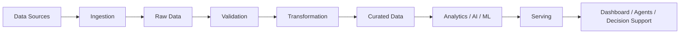
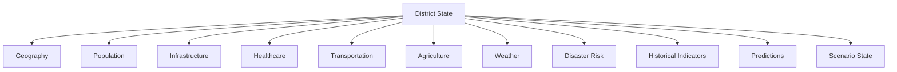

# Data Architecture

## 1. Purpose

This document defines the complete data architecture for DistrictMind: the layers data moves through, the categories of data the platform holds, and how that architecture supports DistrictMind's actual purpose — an Agentic AI-powered Digital Twin for district planning and decision support, not a generic enterprise data platform. It is the anchor document for `04_Data_Engineering/`; the other twelve documents in this folder elaborate on specific aspects introduced here.

This document was authored after reading, in priority order: the current ED-M1 documentation (`00_Engineering_Overview/`, `01_Requirements/`), the current ED-M2 Part 1 documentation (`02_System_Architecture/`, `03_Project_Structure/`), the original **DistrictMind Abstract** (`DistricMind_Abstract.pdf`, Vardhaman College of Engineering mini-project submission), and the original **DistrictMind Software Architecture & Development Blueprint** (`DistrictMind_Architecture_Blueprint.pdf`, v1.0). Section 33 of this document records where the original source material and the current documentation set diverge, and how that divergence is resolved.

## 2. Scope

In scope: the conceptual architecture of data storage layers, data categories (structured, spatial, temporal, unstructured, semantic/vector), the digital twin state model, AI data-access boundaries, and the data foundations required for prediction, simulation, and recommendations. Out of scope, per the milestone restrictions: table/column-level schema (deferred to ED-M2 Part 2B), SQL, ORM models, ETL implementation, ML implementation, and any application code.

## 3. Relationship to DistrictMind

DistrictMind's own framing — confirmed identically by the Abstract and the Blueprint — is that it is **not** a dashboard, **not** a GIS map, and **not** a chatbot, but an integrated reasoning substrate: "a live, queryable virtual model of a district by fusing government datasets... into a single reasoning substrate" (Blueprint §1.1). The data architecture exists to make that fusion real. A dataset that cannot be joined against other domains — spatially, temporally, or referentially — cannot participate in the cross-domain reasoning the Blueprint's own example depends on: *"If rainfall increases by 30%, which villages lose road access to their nearest hospital?"* (Blueprint §1.1, §13.2). Every layer and domain defined below is designed so that question, and questions like it, remain answerable.

## 4. Data Architecture Goals

1. **Support cross-domain reasoning**, not isolated per-domain datasets — every domain entity must be joinable to Geography (spatially) and, where relevant, to Time.
2. **Ground AI in verifiable data** — every AI-facing data access is controlled and typed, never raw/unrestricted (Blueprint §2.1, §8.1; consistent with [ai-architecture.md](../02_System_Architecture/ai-architecture.md)).
3. **Preserve the observed/derived/predicted/scenario/recommended distinction** (Section 20) so nothing generated by a model or an agent is ever mistaken for source-reported fact.
4. **Remain simple enough to build and operate** for a small project team (consistent with [engineering-principles.md](../00_Engineering_Overview/engineering-principles.md) and the "do not overengineer" guidance repeated throughout ED-M1/ED-M2).
5. **Make every output traceable to its inputs** — a forecast, a simulation result, or a recommendation must be explainable back to the data and transformations that produced it (Data Lineage, Section 33 of [engineering-principles.md](../00_Engineering_Overview/engineering-principles.md)'s Explainable AI and Evidence-Based Recommendations principles).

## 5. Data Architecture Principles

Inherits all principles from [engineering-principles.md](../00_Engineering_Overview/engineering-principles.md) without exception. Most directly load-bearing here: Data Integrity, Grounded AI, Explainable AI, Human-in-the-Loop, Evidence-Based Recommendations, Fail-Safe Behavior, and Reproducibility.

## 6. Data Lifecycle

This is the canonical flow every dataset in DistrictMind passes through, regardless of domain (geography, health, transport, agriculture, weather, disaster, infrastructure). No domain is permitted to skip validation or bypass the curated layer to reach analytics/AI directly — this is what keeps AI grounding trustworthy (Section 21).

## 7. Data Layers

| Layer | Contents | Consumers |
|---|---|---|
| Source | External raw feeds/files as received | Ingestion only |
| Raw | Unmodified copies of source data, as landed | Validation |
| Validation | Source data checked against schema/domain/spatial/temporal/numerical/referential rules ([data-validation.md](data-validation.md)) | Transformation |
| Curated | Validated, normalized, deduplicated data in the canonical schema | Analytics, AI/ML, Serving |
| Analytical | Aggregated indicators, KPIs, derived metrics | Dashboard, AI |
| AI/ML-ready | Feature-ready datasets, embeddings, retrieval indices | Prediction, Grounded AI, Agents |
| Serving | API-facing, access-controlled views of curated + analytical + AI outputs | Dashboard, Agents, Decision Support |

### 7.1 Source Layer
Raw, unmodified inputs from government datasets, OSM, weather feeds, and departmental exports, exactly as received — never queried directly by any downstream consumer. See [data-sources.md](data-sources.md).

### 7.2 Raw Layer
A landed, immutable copy of source data (per ingestion run), retained for auditability and reprocessing (e.g. if a validation rule changes, the raw layer allows reprocessing without re-fetching from the source). See [data-ingestion.md](data-ingestion.md).

### 7.3 Validation Layer
Structural, domain, spatial, temporal, numerical, and referential checks are applied here; failing records are quarantined, not silently dropped or silently accepted. See [data-validation.md](data-validation.md).

### 7.4 Curated Layer
The canonical, trusted version of DistrictMind's data — normalized units, matched entities, deduplicated records — organized by the domain model in [data-domain-model.md](data-domain-model.md). This is the layer the digital twin's "current state" is built from (Section 20).

### 7.5 Analytical Layer
Derived indicators and KPIs computed from curated data (e.g. hospital coverage percentage per mandal, population density per village) — descriptive, not predictive. See [data-transformation.md](data-transformation.md).

### 7.6 AI/ML-Ready Layer
Feature-engineered datasets for the Prediction Engine (Section 22), embeddings and retrieval indices for the Knowledge Base/RAG (Section 21), and the typed tool interfaces agents call. This layer is where curated data becomes usable by AI without exposing raw storage.

### 7.7 Serving Layer
The access-controlled boundary through which the dashboard, the agent/tool-calling layer, and any future external consumer read data — no consumer queries Curated, Analytical, or AI/ML-ready storage directly; every read passes through Serving, which is also where authorization ([security-architecture.md](../02_System_Architecture/security-architecture.md)) is enforced.

## 8. Data Access Patterns

| Pattern | Used By | Notes |
|---|---|---|
| Typed, declared query/tool calls | AI agents (Section 21) | No free-form SQL ever reaches an agent (Blueprint §2.1, §8.1) |
| Paginated REST reads | Dashboard | Bounded response size (Section 25) |
| Spatial query (containment, proximity, routing) | GIS-driven features | See [spatial-data.md](spatial-data.md) |
| Time-range query | Trend/history views, forecasting inputs | See [temporal-data.md](temporal-data.md) |
| Sandboxed read-clone | Simulation Engine | Never writes back to Curated/Serving (Section 23) |

## 9. Structured Data

Relational, tabular data: districts, mandals, villages, hospitals, schools, roads, population records, agricultural records, government offices, water bodies — the bulk of DistrictMind's data by table count. See [data-domain-model.md](data-domain-model.md).

## 10. Spatial Data

Geometry-bearing data (points, lines, polygons) representing district/mandal/village boundaries, facility locations, and road networks. Full treatment in [spatial-data.md](spatial-data.md).

## 11. Temporal Data

Time-stamped observations, historical snapshots, and versioned states (population over census years, rainfall over time, forecasts over a future horizon). Full treatment in [temporal-data.md](temporal-data.md).

## 12. Unstructured Data

Policy documents, government guidelines, and prior planning reports referenced by the Blueprint's Knowledge Base (§3.2) — text that does not fit the relational model but is needed to ground recommendations in policy context, not just raw numbers.

## 13. Semantic / Vector Data

Embeddings generated from unstructured knowledge (Section 12) to support retrieval-augmented grounding (M3 — Future). Consistent with [ai-architecture.md](../02_System_Architecture/ai-architecture.md) Sections 5–7; specific embedding/vector-store technology status is tracked in [data-sources.md](data-sources.md) and Section 28.

## 14. Derived Indicators

Computed, not observed, values — e.g., "villages without hospital coverage within 10 km," "population density per mandal." Derived indicators are recomputed from curated data on a defined cadence or on demand; they are never themselves treated as a primary source (Section 20 — Derived State).

## 15. Prediction Outputs

Forecast and risk-score records produced by the ML/Prediction layer (flood risk, rainfall, population growth, traffic volume, crop yield — per Blueprint §12). See Section 22 for the full data-for-prediction treatment.

## 16. Simulation Outputs

What-if scenario results (Section 23) — always computed against a sandboxed clone of curated state, never persisted back into the production digital twin (Blueprint §9.4, §13.1).

## 17. Recommendation Outputs

Ranked, justified candidate outputs from the Recommendation Engine (Section 24), each citing the specific curated data, forecasts, and simulation results that produced its ranking (Blueprint §14.3).

## 18. Audit Information

Every AI tool call, every administrative action, and every human review/acceptance of a recommendation is logged, per FR-036/FR-037 and [security-architecture.md](../02_System_Architecture/security-architecture.md) Section 11, and consistent with the Blueprint's explicit "Observability" tool-calling design principle (§8.1: "every tool call, its arguments, and its result are logged").

## 19. Provenance

Every record in the Curated layer and every derived/predicted/simulated/recommended output retains a traceable link to its origin — source, ingestion run, transformation version, and (for AI/ML outputs) model/version. Full treatment in [data-lineage.md](data-lineage.md).

## 20. Digital Twin State Model

DistrictMind represents an evolving district as a composite state:

Five distinct kinds of state must never be conflated:

| State | Definition | Example | Milestone |
|---|---|---|---|
| **Observed State** | What source data currently reports, as ingested and validated. | "Village X has 3,200 residents per the last census upload." | M1–M2 |
| **Derived State** | What DistrictMind calculates from observed state via deterministic transformation. | "Village X has 0 hospitals within 10 km, computed via spatial join." | M2 |
| **Predicted State** | What a trained model estimates about the future. | "Village X's population is projected at 3,800 in 5 years (Prophet model, 80% CI)." | M4 — Future |
| **Scenario State** | What a sandboxed simulation estimates under a hypothetical, never-enacted condition. | "If road R42 closes, Village X's nearest-hospital travel time becomes 27 minutes (was 12)." | M5 — Future |
| **Recommended State / Action** | What the decision-intelligence layer proposes, pending human review — never itself authoritative. | "Recommend a new PHC near Village X, citing uncovered population 4,200 and 18% projected growth." | M6 — Future |

This five-way distinction is the single most important invariant in the DistrictMind data architecture: every table, API response, and AI-generated statement must be unambiguously classified into exactly one of these five categories, and consumers (dashboard, agents, human reviewers) must always be able to tell which one they are looking at. This is elaborated fully in [temporal-data.md](temporal-data.md) Section 3, and enforced at the governance level in [data-governance.md](data-governance.md) Section 6.

## 21. AI Data Grounding

This mirrors, at the data layer, the pipeline already defined at the AI-architecture level in [ai-architecture.md](../02_System_Architecture/ai-architecture.md) Section 3. The data-architecture-specific commitment is: **the AI layer has no unrestricted database access.** Per the Blueprint's own explicit design (§2.1: *"The AI agents never touch the database directly with free-form SQL; they call declared, validated tools"*; §8.1: *"Least privilege — a tool exposes exactly one capability... rather than a generic 'run SQL' capability"*), every AI data access is:

- **Typed/controlled** — a declared tool with a fixed input schema and documented return shape, never an open query surface.
- **Evidenced** — every retrieved fact carries enough source metadata (dataset, ingestion timestamp, transformation version) to be cited (Section 19).
- **Freshness-aware** — retrieval results expose the data's last-validated timestamp so the AI layer (and, ultimately, the user) knows how current the grounding is.
- **Explicit about missing/conflicting data** — if no data satisfies a query, or two sources disagree, the tool result says so; the AI layer must surface this rather than silently picking one value (Fail-Safe Behavior).
- **Explicit about unsupported questions** — a question with no corresponding tool is refused, not answered from the model's unverified general knowledge (Grounded AI principle; NFR-031).
- **Logged** — every tool call, its arguments, and its result are recorded for audit (Section 18).

AI-generated content (a response, a forecast narrative, a recommendation justification) is never written back into the Curated layer as if it were observed data — this boundary is enforced in [data-governance.md](data-governance.md) Section 6.

## 22. Data for Prediction (M4 — Future)

Per Blueprint §12, prediction requires: historical observations (time-series indicator data, Section 11), geographic context (spatial join to the relevant village/mandal/district, Section 10), feature-ready data (engineered from curated data, e.g. terrain elevation, proximity to water bodies for flood risk), training and validation splits, and model/version metadata retained alongside every prediction output (Reproducibility principle; [database-architecture.md](../02_System_Architecture/database-architecture.md) Section 8). This document does not build any model and makes no accuracy claims — it defines only the data foundation prediction will require. Full ingestion/feature detail is deferred to ED-M2 Part 2B.

## 23. Data for Simulation (M5 — Future)

Per Blueprint §9.4 and §13.1, simulation requires: a baseline (a snapshot of current curated + derived state), scenario parameters (the hypothetical modification — e.g., "+30% rainfall," "close road R42"), the relevant Prediction Engine models (to recompute affected indicators under the hypothetical), and a sandboxed execution context that clones only the relevant subset of state, applies the change, recomputes, and is discarded — **the production Curated layer is never mutated by a simulation.** Outputs are Scenario State records (Section 20) linked back to their originating scenario definition and baseline snapshot, enabling before/after comparison. This document does not implement any simulation logic.

## 24. Data for Recommendations (M6 — Future)

Per Blueprint §14, recommendations require: geographic data (candidate locations, typically uncovered village centroids), demographic data (population uncovered within a service radius), infrastructure data (existing facility locations, for gap analysis), accessibility data (travel-time/distance, from the GIS/routing layer), risk data (where relevant, e.g. avoiding flood-prone candidate sites), forecast data (projected growth, from Section 22), and domain-specific constraints (e.g. policy documents from the unstructured/semantic layer, Sections 12–13). Every recommendation must retain a citable link to each of these inputs (Evidence-Based Recommendations principle) so a human reviewer can verify, not just trust, the justification. This document defines only the data foundation; scoring/ranking algorithm design is out of scope here and deferred to future ED-M2 Part 2B / ML design work.

## 25. Performance and UI Responsiveness

The data architecture must not allow data operations to freeze or stutter the UI (per [frontend-architecture.md](../02_System_Architecture/frontend-architecture.md) Section 18's performance requirements). Strategies:

| Strategy | Applies To | Rationale |
|---|---|---|
| Efficient, indexed queries | All layers | Spatial and standard indexes per [database-architecture.md](../02_System_Architecture/database-architecture.md) Section 12; spatial indexing specifically per Blueprint §10.2's GiST index example |
| Aggregation at the Analytical layer | Dashboard indicator views | Avoids repeated on-the-fly aggregation of raw curated data per request |
| Caching | Hot/frequent queries (e.g., district boundary geometry) | Consistent with Blueprint §5.3's Redis rationale — "reduces repeated-query latency... without hitting PostGIS every time" |
| Pre-computation | Coverage-gap and derived indicators that change infrequently | Avoids recomputing expensive spatial joins per dashboard load |
| Materialized analytical views (where justified) | High-read, low-change aggregates | Only where recomputation cost is empirically shown to matter — not applied by default (avoid overengineering) |
| Pagination | List/table API responses | Per [technical-requirements.md](../01_Requirements/technical-requirements.md) API requirements |
| Filtering pushed to the query layer | Dashboard/search | Avoids transferring unfiltered datasets to the client |
| Data partitioning (where justified) | Large time-series tables, if volume warrants it | Not committed by default; a future scaling decision |
| GIS layer optimization | Boundary rendering | Per [gis-architecture.md](../02_System_Architecture/gis-architecture.md) Section 15 (geometry simplification, level-of-detail loading) |
| Bounded API response size | All Serving-layer reads | Prevents any single request from returning an unbounded payload |
| Background/asynchronous processing | Ingestion, model inference, simulation runs | Per [backend-architecture.md](../02_System_Architecture/backend-architecture.md) Section 12 — long-running work never blocks a request/response cycle |
| Progressive loading | Dashboard widgets, map layers | Consistent with skeleton-state UX in [frontend-architecture.md](../02_System_Architecture/frontend-architecture.md) Section 10 |

Caching specifically (e.g., Redis, per the Blueprint's proposal) is treated as **Proposed**, not Confirmed — see Section 28.

## 26. Data Security

Data-specific security concerns only; the full security boundary model is owned by [security-architecture.md](../02_System_Architecture/security-architecture.md) and is not duplicated here.

- **Access control**: enforced at the Serving layer (Section 7.7); AI agents receive the same authorization scoping as the user on whose behalf they act ([security-architecture.md](../02_System_Architecture/security-architecture.md) Section 13).
- **Sensitive fields**: population/health-adjacent data may carry higher sensitivity than boundary/road data; classification is addressed in [data-governance.md](data-governance.md) Section 3.
- **Encryption, dataset permissions, backups, retention**: addressed in [data-governance.md](data-governance.md) and [security-architecture.md](../02_System_Architecture/security-architecture.md); not re-specified here to avoid duplication, per the milestone brief's explicit instruction.

## 27. Governance

Ownership, stewardship, classification, and the official/verified/external/derived/AI-generated source-trust hierarchy are defined in full in [data-governance.md](data-governance.md).

## 28. Architectural Decisions

| ID | Decision | Status |
|---|---|---|
| AD-DE-001 | Spatially-capable relational store as the primary data platform (PostgreSQL + PostGIS as the leading candidate) | Proposed |
| AD-DE-002 | ELT over ETL for the curated-layer build (validate/transform after landing raw data, not before) | Proposed |
| AD-DE-003 | Batch/scheduled ingestion as the default; no streaming ingestion committed for M1–M2 | Proposed |
| AD-DE-004 | Sandboxed, discard-after-use simulation execution; production data is never mutated by a what-if query | Proposed |
| AD-DE-005 | Typed, tool-mediated AI data access; no direct/free-form database access for any AI agent | Proposed |

### AD-DE-001 — Spatially-Capable Relational Store as the Primary Data Platform
- **Decision:** Adopt a single relational database with native spatial capability (PostgreSQL + PostGIS, per the original Blueprint's specific and well-justified choice, §10.1–10.2) as the leading candidate for the Curated/Analytical layers, consistent with the pattern already decided in [database-architecture.md](../02_System_Architecture/database-architecture.md) AD-DB-001.
- **Context:** ED-M2 Part 1 already committed to the *pattern* of spatial-as-extension-of-primary-store; the original Blueprint goes further and names PostgreSQL + PostGIS specifically, with a concrete technical justification (indexed `ST_DWithin`/`ST_Distance`/`ST_Contains` vs. unindexed application-level trigonometry, Blueprint §10.2).
- **Alternatives considered:** A separate spatial data server (rejected in AD-DB-001 for the same operational-simplicity reasons); a document store for irregular multi-domain data (rejected — DistrictMind's domains are relationally structured with clear entity relationships, per Blueprint §10.3–10.5).
- **Evaluation criteria:** Indexed spatial query support, ability to join spatial and tabular attributes in one query, operational simplicity, fit with the existing AD-DB-001 pattern decision.
- **Trade-offs:** Commits the eventual implementation to a database with mature spatial extension support; narrows [technology-stack.md](../00_Engineering_Overview/technology-stack.md)'s three-way Candidate list (PostgreSQL, MySQL/MariaDB, MongoDB) toward PostgreSQL specifically, based on new evidence (the original Blueprint) not available when ED-M1 was authored.
- **Consequences:** See Section 33 — this is a **contradiction-resolution** relative to ED-M1's flatter Candidate listing, resolved by promotion to Proposed, not Confirmed.
- **Status:** Proposed.

### AD-DE-002 — ELT Over ETL for Curated-Layer Construction
- **Decision:** Land raw source data first (Section 7.2), then validate and transform it into the Curated layer (Extract → Load raw → Transform), rather than transforming before storage.
- **Context:** Preserves an unmodified raw copy for reprocessing if a validation/transformation rule changes or a bug is found — without needing to re-fetch from a potentially unavailable or rate-limited external source.
- **Alternatives considered:** Classic ETL (transform in-flight, never persist raw); the Blueprint's own described pipeline (§9.3) is closer to ELT in spirit (raw files land, then validate/upsert) though it does not use the term explicitly.
- **Evaluation criteria:** Reprocessability, auditability, alignment with the Blueprint's described ETL pipeline behavior.
- **Trade-offs:** Requires storage for the raw layer in addition to curated data; justified by the reprocessing and audit benefit for a project whose source data quality is explicitly uncertain (Section 33; [constraints.md](../01_Requirements/constraints.md) Data Constraints).
- **Consequences:** [data-ingestion.md](data-ingestion.md) and [data-lineage.md](data-lineage.md) both assume a persisted raw layer exists.
- **Status:** Proposed.

### AD-DE-003 — Batch/Scheduled Ingestion as Default
- **Decision:** Government/GIS/weather data is ingested on a scheduled, batch basis (Blueprint §9.3: "scheduled ETL pipeline that re-ingests updated source files"); no streaming ingestion is committed for the current milestone scope.
- **Context:** Matches the nature of the identified source categories (census, boundary files, departmental exports, periodic weather feeds — Section 33) which do not update in real time; the Blueprint's own Future Scope (§16) explicitly places "Real-time IoT" as a later extension, not current scope.
- **Alternatives considered:** Streaming/event-driven ingestion — rejected as premature, consistent with [system-architecture.md](../02_System_Architecture/system-architecture.md) AD-003's synchronous/batch-first default and the "do not overengineer" guidance.
- **Evaluation criteria:** Fit to actual source update cadence, operational simplicity.
- **Trade-offs:** Disaster/weather data will not be real-time in early milestones — an explicit, accepted limitation, not a silent gap (see Section 33's disaster-domain note).
- **Consequences:** [data-ingestion.md](data-ingestion.md) is scoped around batch/scheduled/manual ingestion; a future real-time extension is documented as out-of-scope-for-now.
- **Status:** Proposed.

### AD-DE-004 — Sandboxed, Discard-After-Use Simulation Execution
- **Decision:** Every scenario simulation clones only the relevant subset of Curated state into an ephemeral sandbox, applies the hypothetical change, recomputes affected derived/predicted values, and discards the sandbox — the production Curated layer is never written to by a simulation.
- **Context:** Directly adopted from the Blueprint's explicit design (§9.4, §13.1), which treats this as a hard safety guarantee: *"no what-if question can ever corrupt the real district model."*
- **Alternatives considered:** Writing simulation results into a separate persisted "scenario" table without full sandbox isolation of the computation itself — rejected because it does not prevent an implementation bug from touching production state during computation, only after.
- **Evaluation criteria:** Data integrity guarantee strength, alignment with Human-in-the-Loop and Fail-Safe Behavior principles.
- **Trade-offs:** Requires the compute layer to support cheap, ephemeral cloning of the relevant state subset (a design constraint on the eventual Simulation Engine implementation, not specified further here).
- **Consequences:** [data-for-simulation content, Section 23] and [temporal-data.md](temporal-data.md)'s Scenario State are defined consistently with this guarantee.
- **Status:** Proposed.

### AD-DE-005 — Typed, Tool-Mediated AI Data Access
- **Decision:** No AI agent or LLM component ever receives direct/free-form database access; all data reaches AI components through declared, typed tools with fixed schemas (Section 21).
- **Context:** This is already the direction of [ai-architecture.md](../02_System_Architecture/ai-architecture.md) Section 6 ("structured data access") and Section 12 (hallucination mitigation); the original Blueprint provides a stronger, more specific formulation (§2.1, §8.1) that this decision formally adopts at the data-architecture level.
- **Alternatives considered:** Giving agents a scoped read-only SQL interface — rejected per the Blueprint's explicit reasoning: harder to audit, harder to guarantee safety, harder to debug a wrong answer back to its cause.
- **Evaluation criteria:** Auditability, safety, debuggability, consistency with Grounded AI and Explainable AI principles.
- **Trade-offs:** Every new data-access need for an agent requires a new declared tool rather than an ad hoc query — more upfront design work, in exchange for a hard safety and auditability guarantee.
- **Consequences:** [ai-architecture.md](../02_System_Architecture/ai-architecture.md)'s Section 8 (tool calling) is the mechanism this decision depends on; this document's Section 21 restates the data-layer half of the same guarantee.
- **Status:** Proposed.

## 29. Traceability Matrix

Problem → Requirement → Architecture → Data Requirement → Consumer → Milestone

| Problem (Blueprint §1.2.1 / Abstract) | Requirement | Architecture | Data Requirement | Consumer | Milestone |
|---|---|---|---|---|---|
| Data fragmentation — "population, GIS, health, education, and disaster data exist in disconnected spreadsheets, PDFs, and departmental portals" | FR-013, FR-023 ([functional-requirements.md](../01_Requirements/functional-requirements.md)) | Unified layered data architecture (Section 7) | Cross-domain, spatially-joinable curated datasets ([data-domain-model.md](data-domain-model.md)) | Dashboard, AI Assistant | M1 / M2 / M3 |
| No predictive capability — "planning is reactive; there is no systematic way to simulate 'what happens if'" | FR-027, FR-029 | Predictive Intelligence + Scenario Simulation layers ([ai-architecture.md](../02_System_Architecture/ai-architecture.md)) | Historical, temporal, feature-ready time-series datasets (Section 22, [temporal-data.md](temporal-data.md)) | ML/Prediction Service, Scenario Engine | M4 / M5 |
| Manual spatial analysis — "identifying underserved villages... is done manually or not at all" | FR-010, FR-012 | GIS/spatial architecture ([gis-architecture.md](../02_System_Architecture/gis-architecture.md)) | Queryable spatial datasets with indexed containment/proximity operations ([spatial-data.md](spatial-data.md)) | GIS Engine, AI Assistant, Recommendation Engine | M1 / M2 / M5 |
| No natural-language access — "officials without GIS or data-science skills cannot interrogate the data directly" | FR-020, FR-021 | Grounded AI Assistant architecture ([ai-architecture.md](../02_System_Architecture/ai-architecture.md)) | Typed, tool-accessible, evidenced curated + derived data (Section 21) | AI Assistant | M3 |
| Disconnected disaster response — "weather, road, and population data are not fused in real time" | FR-028, FR-033 | Cross-domain linked data model ([data-domain-model.md](data-domain-model.md) §9.7, §9.6 relationships) | Weather, transportation, and population data joined spatially and temporally | Disaster Agent, Notification Service | M2 / M4 |

This is a representative, not exhaustive, set of traceability chains; additional chains follow the same pattern for other FR/NFR entries.

## 30. Retention

Retention periods are not established by any current source (ED-M1, ED-M2 Part 1, the Abstract, or the Blueprint) and are **not invented here**. This is recorded as an open decision (Section 32) and a governance responsibility in [data-governance.md](data-governance.md) Section 5.

## 31. Backup / Recovery Considerations

Per [database-architecture.md](../02_System_Architecture/database-architecture.md) Section 15, backup frequency and RTO/RPO remain undefined (NFR-037, NFR-038). This document adds no new commitment; it notes only that, because spatial, relational, and (future) vector data are unified in one primary store (AD-DE-001), backup/recovery strategy can remain unified rather than needing cross-system consistency coordination — a direct, inherited benefit of AD-DB-001/AD-DE-001.

## 32. Open Decisions

- Final database product confirmation beyond "Proposed" (AD-DE-001) — requires a formal architecture decision, not made in this documentation milestone.
- Caching technology (Redis, per Blueprint §5.3) — Proposed, not Confirmed; see [data-sources.md](data-sources.md)/[technology-stack.md](../00_Engineering_Overview/technology-stack.md) reconciliation in Section 33.
- Retention periods for raw, curated, and audit data (Section 30).
- Whether/when partitioning or materialized views become necessary (Section 25) — deferred until real data volume exists.
- Vector store technology for the Semantic/Vector layer (Section 13) — see [data-sources.md](data-sources.md).

## 33. Source Consistency Notes — Contradictions and Resolutions

Per the source-priority hierarchy in this milestone's instructions (current ED-M1 → current ED-M2 Part 1 → Abstract → Blueprint → engineering inference), the following divergences between the original source material and the current, more cautious documentation set were identified:

1. **Technology specificity.** ED-M1's [technology-stack.md](../00_Engineering_Overview/technology-stack.md) lists PostgreSQL, PostGIS, Leaflet, FastAPI, etc. only as *Candidate* — no preference established. The original Blueprint presents these same technologies as deliberately chosen, with detailed justification (§5, §10.2, §11). **Resolution:** this document and its siblings treat Blueprint-specified technologies as **Proposed** (a documented, justified engineering recommendation), never **Confirmed** — Confirmed status requires a formal architecture decision this documentation milestone does not have authority to make. [technology-stack.md](../00_Engineering_Overview/technology-stack.md) itself is **not modified**, per the instruction to avoid altering completed prior milestones; this note, plus Section 32, records the recommendation that a future revision formally reconcile the two documents.
2. **AI provider specificity.** [technology-stack.md](../00_Engineering_Overview/technology-stack.md) §4.5 lists Claude/Anthropic, self-hosted open-weight models, and other hosted providers as undifferentiated Candidates. The Blueprint specifically proposes Llama 3 via Ollama (local, for data-sensitivity reasons) with OpenAI GPT as an optional cloud fallback (§5.4) — it does not mention Claude/Anthropic. **Resolution:** this documentation set does not resolve this discrepancy in either direction; both the ED-M1 Candidate list and the Blueprint's specific local-first proposal are preserved, and [constraints.md](../01_Requirements/constraints.md)'s unresolved AI/LLM data-sensitivity constraint is noted as the deciding factor a future architecture decision will need to weigh (local/offline deployment, as the Blueprint proposes, directly addresses that unresolved constraint).
3. **Disaster domain data model gap.** The Blueprint's narrative repeatedly references disaster/flood risk data and a Disaster Agent (§1.1, §7.1, §13.2), but its own worked-example Core Tables list (§10.3) has no dedicated `disaster_events`-equivalent table — only `weather` is schematized. **Resolution:** [data-domain-model.md](data-domain-model.md) §9.7 proposes disaster-domain entities inferred from the Blueprint's narrative and the current FR-028/FR-033 requirements, explicitly marked as **Proposed** (engineering inference), not sourced directly from a Blueprint schema.
4. **Milestone-numbering scheme.** The Blueprint organizes work into nine sequential *development phases* (data collection → GIS → APIs → agent core → tool calling → ML → simulation → recommendation → dashboard), which is a different axis from the current documentation's M1–M6 *product milestones* ([engineering-overview.md](../00_Engineering_Overview/engineering-overview.md) Section 8). **Resolution:** this document and its siblings use only the M1–M6 notation, per [naming-conventions.md](../03_Project_Structure/naming-conventions.md) Section 14's rule that the two numbering schemes must never be conflated; the Blueprint's nine phases are treated as illustrative implementation sequencing context, not as a competing milestone scheme.
5. **"Digital Twin" scope.** [engineering-glossary.md](../00_Engineering_Overview/engineering-glossary.md) defines Digital Twin narrowly for M1 as "GIS-based district/mandal boundary visualization and navigation... not a real-time sensor-fed simulation." The Blueprint's definition is broader and more active from the outset — "a live, queryable virtual model... the twin functions as the ground truth the AI reasons over" (§9.1). **Resolution:** no contradiction in substance — both agree the twin is not merely visual — but the current glossary is deliberately scoped to what M1 delivers, while the Blueprint describes the twin's full, later-milestone behavior. This document's Section 20 (Digital Twin State Model) reflects the Blueprint's fuller framing, explicitly labeled by milestone so no capability is implied to exist at M1 that is actually M2–M6 scope.

No other material contradictions were identified between the current documentation and the original source material; where the Blueprint provides detail ED-M1/ED-M2 Part 1 left open (e.g., specific core tables, specific tool examples, specific scenario types), that detail is incorporated as **Proposed** illustrative content throughout this folder, never as settled fact.
