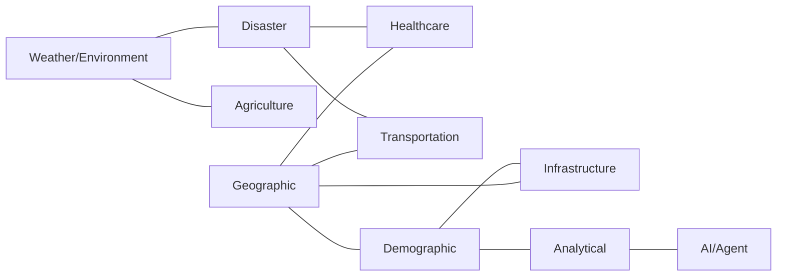

# Data Domain Model

## 1. Purpose

This document defines DistrictMind's data domains — the entities within each domain, their relationships, and, critically, their **cross-domain** relationships, since DistrictMind's value depends on domains being reasoned over together (per [data-architecture.md](data-architecture.md) Section 3). Entities are drawn from the original Blueprint's Core Tables (§10.3) where available, and from the Blueprint's narrative/Abstract where a domain is named but not schematized — the latter are explicitly marked **Proposed (inferred)**.

## 2. Domain Summary Table

| Domain | Purpose | Core Entities | Relationships | Spatial? | Temporal? | Primary Consumers | Milestones |
|---|---|---|---|---|---|---|---|
| Geographic | Administrative/spatial hierarchy underpinning every other domain | District, Mandal, Village, Boundary | Village → Mandal → District (hierarchical containment) | Yes | Low (boundaries change rarely, but are versioned) | GIS Engine, all domains (via spatial join) | M1 |
| Demographic | Population characteristics per geographic unit | Population Record | Population → Village (FK) | No (attached to geography) | Yes (per census year) | Planning, Prediction | M2 |
| Healthcare | Health facility coverage and capacity | Hospital, PHC | Hospital → nearest Village/Mandal (spatial join, not FK) | Yes | Low | Healthcare Agent, Recommendation Engine | M2 |
| Transportation | Road network and connectivity | Road, Road Segment | Road network graph (nodes/edges) | Yes | Low | Traffic Agent, Simulation Engine | M2 |
| Agriculture | Crop and land-use conditions | Agricultural Record | Agriculture → Village (FK) | No (attached to geography) | Yes (per season) | Agriculture Agent, Prediction | M2 |
| Weather / Environment | Observed and forecast atmospheric conditions | Weather Observation, Weather Station | Weather → nearest Village (spatial lookup, not FK) | Yes (station location) | Yes (time series) | Weather Agent, Prediction | M2 |
| Disaster | Hazard risk and impact | Disaster Event, Risk Score *(Proposed — inferred)* | Disaster → affected Village/Mandal (spatial + temporal) | Yes | Yes | Disaster Agent, Notification Service | M2 (data), M4 (risk scoring) |
| Infrastructure | Public facilities beyond healthcare | School, Government Office, Water Body | Facility → nearest Village/Mandal (spatial join) | Yes | Low | Planning Agent, Recommendation Engine | M2 |
| Analytical | Computed indicators, forecasts, scenario/recommendation outputs | Indicator, Forecast, Scenario Result, Recommendation | References source entities across all domains | Indirect (via source entities) | Yes | Dashboard, AI, Prediction, Simulation | M2 / M4 / M5 / M6 |
| AI / Agent | Query, retrieval, and agent-execution metadata | Query, Intent, Evidence, Tool Call, Agent Execution, AI Response | References Analytical + source domains as evidence | No | Yes (per interaction) | AI Assistant, Agent Orchestrator, Audit System | M3 / M6 |

## 3. Geographic Domain

**Entities:** District, Mandal, Village, (Urban/Local Administrative Unit — **Proposed**, not named in the Blueprint's own tables but implied by real Telangana administrative structure), Boundary geometry, Coordinates.

**Hierarchy:** District → Mandal → Village, matching both [engineering-glossary.md](../00_Engineering_Overview/engineering-glossary.md)'s District/Mandal definitions and the Blueprint's `mandals.district_id → ` / `villages.mandal_id →` foreign-key structure (§10.3–10.4). The Blueprint's own Core Tables list does not include a standalone `districts` table, but its `mandals.district_id` foreign key implies one; this document treats **District** as a first-class entity consistent with ED-M1's Telangana-district scope ([constraints.md](../01_Requirements/constraints.md) Geographic Constraints) — this is a **Proposed (inferred)** completion of an implicit gap in the Blueprint's table list, not a contradiction of it.

Every other domain's entities are, wherever they carry a geometry, attached to this hierarchy either by direct foreign key (e.g., `villages.mandal_id`) or by spatial join at query time (e.g., a hospital's containing village, computed via `ST_Contains` rather than stored as a fixed FK — per Blueprint §10.4: *"coverage is a computed, not fixed, relationship"*). This distinction matters: a hospital does not "belong" to a village in the way a village belongs to a mandal; it is merely located within one, and that containment can be recomputed if boundaries are corrected.

## 4. Demographic Domain

**Entities:** Population Record (village-level count, by year — Blueprint §10.3 `population` table), Age Distribution (**Proposed** — the Blueprint's `population` table lists an `age_band` column implying age-distribution support, but no separate schema detail is given).

Population is explicitly a **time-series fact attached to a village** (Blueprint §10.4), not a static attribute — see [temporal-data.md](temporal-data.md). This is the primary input to the Population Growth prediction model (M4 — Future, [data-architecture.md](data-architecture.md) Section 22).

## 5. Healthcare Domain

**Entities:** Hospital, PHC (Primary Health Centre — named explicitly throughout the Blueprint, e.g. §8.2, §14.1), facility capacity, facility type.

Healthcare coverage (Section 8 below) is DistrictMind's single most repeated worked example across both source documents ("which villages don't have a hospital within 10 km," Blueprint §2.1, §11.4) — the Healthcare domain is therefore treated as a primary, load-bearing domain, not a peripheral one.

## 6. Transportation Domain

**Entities:** Road, Road Segment, Road Class, routable road-network graph (derived from OSM via OSMnx per Blueprint §5.7, §11.6 — graph representation is a **derived**, not source, structure — see [data-transformation.md](data-transformation.md)).

Roads are represented both as geometry (LineString, for rendering — Blueprint §10.3) and as a navigable graph (nodes/edges, for routing — Blueprint §11.6). These are two representations of the same source data, not two separate domains.

## 7. Agriculture Domain

**Entities:** Agricultural Record (crop, area in hectares, season — Blueprint `agriculture` table, §10.3), attached to Village by foreign key, matching the Population Record pattern (Section 4).

Agriculture data has an explicit cross-domain dependency on Weather (Section 9) for crop-yield prediction (M4 — Future, Blueprint §12.5).

## 8. Weather / Environment Domain

**Entities:** Weather Observation (station, date, rainfall_mm, temp_c — Blueprint `weather` table, §10.3), Weather Station (point geometry).

Weather relates to villages via **nearest-station spatial lookup, not a fixed foreign key**, since one station serves many villages (Blueprint §10.4) — this is the same computed-relationship pattern as facility coverage (Section 3).

## 9. Disaster Domain

**Entities (Proposed — inferred):** Disaster Event, Flood Risk Classification, Vulnerable Area, Impact Indicator, Risk Score.

As noted in [data-architecture.md](data-architecture.md) Section 33 (#3), the Blueprint names disaster/flood risk extensively in its narrative (Abstract: *"forecast events such as flood risks"*; Blueprint §1.1: *"disaster records"* among the fused datasets; §7.1: a dedicated Disaster Agent; §12.1: a Flood Prediction model; §13.2: Flood and Bridge Collapse simulation scenarios) but its own Core Tables table (§10.3) has no dedicated disaster-event table. This document proposes the entities above as the natural completion of that gap, consistent with FR-028 (risk score generation) and FR-033 (threshold-based notification). These entities are **not** sourced from a Blueprint schema and must be validated/refined during ED-M2 Part 2B.

## 10. Infrastructure Domain

**Entities:** School, Government Office, Water Body (Blueprint `schools`, `government_offices`, `water_bodies` tables, §10.3), all following the same spatial-join-to-geography pattern as Hospitals (Section 5).

## 11. Analytical Domain

**Entities:** Indicator, KPI, Risk Score, Forecast, Scenario Result, Recommendation — the derived/predicted/scenario/recommended categories defined in [data-architecture.md](data-architecture.md) Section 20. Every entity here references one or more source-domain entities as its evidentiary basis (Section 24 of [data-architecture.md](data-architecture.md); Blueprint §14.3's justification requirement).

## 12. AI / Agent Domain

**Entities:** User Query, Intent (classification output), Evidence (retrieved, citable data), Retrieval Result, Tool Call (with arguments and result, logged per Blueprint §8.1), Agent Execution (a single agent's contribution within a Coordinator-orchestrated run, per Blueprint §7), AI Response, Confidence indicator, Provenance metadata, Human review/audit metadata (FR-037).

**AI-generated information in this domain is never treated as authoritative source data** (per the milestone brief's explicit instruction and [data-governance.md](data-governance.md) Section 6). A Tool Call record and its logged result are themselves audit/observability data (Section 18 of [data-architecture.md](data-architecture.md)), not a new source of district facts — the underlying data a tool call *returns* is still sourced from the domains in Sections 3–10, or from the Analytical domain (Section 11) if the tool invoked a prediction/simulation.

## 13. Cross-Domain Relationships

DistrictMind's central architectural claim — that it supports reasoning no single-domain system can — depends entirely on these relationships being real, queryable joins, not documentation-only associations.

| Relationship | Nature of the Join | Example Question It Enables | Source |
|---|---|---|---|
| Healthcare ↔ Geography | Spatial containment/proximity (`ST_Contains`, `ST_DWithin`) | "Which villages don't have a hospital within 10 km?" | Blueprint §2.1, §10.4 |
| Transportation ↔ Geography | Road-network graph nodes mapped to geographic coordinates | "What is the travel time from Village X to the nearest hospital?" | Blueprint §11.6 |
| Weather ↔ Agriculture | Nearest-station spatial lookup + temporal alignment (season/date) | "How does rainfall affect crop yield in Mandal Y this season?" | Blueprint §12.5 |
| Weather ↔ Disaster | Rainfall value as a direct model input feature | "If rainfall increases by 30%, what is the flood risk?" | Blueprint §12.1, §13.2 |
| Disaster ↔ Transportation | Affected-area geometry intersected with the road graph | "If a bridge collapses, which villages become harder to reach?" | Blueprint §1.1, §7.2 (Disaster Agent → GIS Agent) |
| Disaster ↔ Healthcare | Affected-area geometry intersected with facility coverage | "If Village X floods, which hospitals remain reachable?" | Blueprint §1.1's full worked example |
| Demographics ↔ Infrastructure | Population figures joined against facility coverage gaps | "Where is the largest uncovered population for a new school?" | Blueprint §14.2 |
| Demographics ↔ Planning (Analytical) | Population growth forecast feeding the Recommendation Engine's scoring | "Where should the next PHC be built, accounting for 5-year growth?" | Blueprint §8.2, §14.1 |

## 14. Cross-Domain Relationship Diagram

## 15. Milestone Traceability

| Domain | Data Available From | Notes |
|---|---|---|
| Geographic | M1 | Foundational — required before any other domain is meaningful |
| Demographic, Healthcare, Transportation, Agriculture, Weather, Infrastructure | M2 — Future | "District Intelligence" milestone; per [engineering-overview.md](../00_Engineering_Overview/engineering-overview.md) |
| Disaster (data ingestion) | M2 — Future | Data required early; risk *scoring* is M4 |
| Analytical (indicators/KPIs) | M2 — Future | Descriptive only at this stage |
| Analytical (forecasts, risk scores) | M4 — Future | Predictive Intelligence |
| Analytical (scenario results) | M5 — Future | Scenario Simulation |
| Analytical (recommendations) | M6 — Future | Autonomous District Intelligence |
| AI/Agent | M3 — Future (query/retrieval/evidence), M6 — Future (multi-agent execution) | Per [ai-architecture.md](../02_System_Architecture/ai-architecture.md) |

## 16. Open Items

- Disaster domain entities (Section 9) require validation against an actual authoritative disaster-data source once one is identified ([data-sources.md](data-sources.md)); they are currently Proposed/inferred, not sourced.
- Urban/local administrative unit (Section 3) status relative to Telangana's actual administrative structure requires confirmation during ED-M2 Part 2B.
- Age-distribution granularity (Section 4) is implied by the Blueprint's `age_band` column but not further specified.
