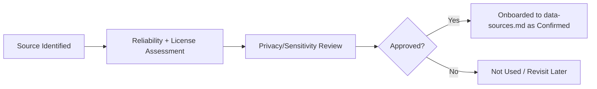

# Data Governance

## 1. Purpose

This document defines data governance for DistrictMind: ownership, stewardship, classification, access control, retention, versioning, provenance, quality responsibility, auditability, change management, dataset approval, and — most importantly for an agentic AI system — the strict separation between source-of-truth data and AI-generated content.

## 2. Data Ownership and Stewardship

| Role (Conceptual) | Responsibility |
|---|---|
| Data Owner | Accountable for a given domain's data correctness and its relationship with the originating source/department. Specific individuals/roles are not assigned in this documentation milestone — this is an organizational decision outside engineering documentation scope. |
| Data Steward | Operationally responsible for ingestion configuration, validation-rule maintenance, and quarantine review for a domain ([data-ingestion.md](data-ingestion.md), [data-validation.md](data-validation.md)). |
| System Administrator | Manages user/role access to data (FR-034), per [security-architecture.md](../02_System_Architecture/security-architecture.md). |

No specific person or department is named as owner/steward in this document — DistrictMind currently has no operational team structure documented ([constraints.md](../01_Requirements/constraints.md) Development-Team Constraints remains unconfirmed).

## 3. Data Classification

| Classification | Definition | Example |
|---|---|---|
| Public/Open | Freely shareable, no sensitivity concern | District/mandal boundary geometry, road network |
| Administrative-Sensitive | Not freely public but not individually identifying | Facility capacity figures, aggregated population counts |
| Potentially Sensitive | Requires care — could reveal information about individuals or vulnerable groups if mishandled, depending on granularity | Fine-grained health-facility-adjacent data, disaster-vulnerability data about specific small communities |
| Restricted (Future) | Reserved for any future data category requiring formal access restriction beyond role-based control | Not currently populated — no such category has been identified in current source material |

This classification scheme is **Proposed**, not sourced from either the Abstract or the Blueprint (neither discusses data classification explicitly) — it is an engineering-inference extension needed to satisfy the milestone's governance requirements, and should be validated against actual data once sourced.

## 4. Access Control

Enforced at the Serving layer ([data-architecture.md](data-architecture.md) Section 7.7) via the role-based access control model already defined in [security-architecture.md](../02_System_Architecture/security-architecture.md) Section 4 — not re-specified here. Data-specific note: AI agents inherit the requesting user's authorization scope (per [ai-architecture.md](../02_System_Architecture/ai-architecture.md) and [security-architecture.md](../02_System_Architecture/security-architecture.md) Section 13) — an agent never has broader data access than the human on whose behalf it is acting.

## 5. Retention

No retention period is established by any current source document. This is recorded here as an explicit governance gap, not filled with an invented number, consistent with [data-architecture.md](data-architecture.md) Section 30 and the milestone brief's instruction to mark uncertain constraints as requiring confirmation.

## 6. Source Trust Hierarchy — Official, Verified, External, Derived, AI-Generated

This is the most important governance boundary in this document, directly responding to the milestone brief's mandatory instruction: **"AI-generated content must never silently become authoritative source information."**

| Trust Level | Definition | Examples | Can It Become "Source Data"? |
|---|---|---|---|
| **Official Source** | Data originating from a recognized government department, census authority, or equivalent authoritative body | Census population figures, departmental facility registries | Yes — this *is* Source Data by definition |
| **Verified Source** | Data from a source that has undergone DistrictMind's own validation pipeline ([data-validation.md](data-validation.md)) and passed | OSM road data, once validated | Yes — becomes Curated Data, still tagged with its original provenance |
| **External Source** | Public data not government-issued but broadly reliable (e.g., OpenStreetMap community contributions) | OSM buildings/places | Yes, subject to validation — but retains a distinct provenance tag from Official Source data, since community-maintained data carries different reliability characteristics (Section 7 of [data-sources.md](data-sources.md)) |
| **Derived Data** | Computed from the above via a defined transformation ([data-transformation.md](data-transformation.md) Section 4) | Coverage-gap indicators, aggregated KPIs | No — it is downstream of Source Data, always traceable back to it, never re-labeled as an independent source |
| **AI-Generated Output** | A response, forecast narrative, simulation explanation, or recommendation justification produced by an LLM or agent | An AI Assistant's answer, a recommendation's natural-language justification | **Never.** AI-generated output is never written back into the Curated layer, never re-ingested as if it were an external source, and never treated as evidence for a *future* AI response without being re-derived from its original underlying data each time. |

### 6.1 The Governance Rule, Stated Explicitly

An AI Assistant response, a recommendation's justification text, or any other AI-generated content:
1. Is always stored (if stored at all) in the AI/Agent domain ([data-domain-model.md](data-domain-model.md) Section 12), never in the Curated/Analytical domains.
2. Is never used as an input to a future ingestion, transformation, or prediction run.
3. Is never presented to a user or another agent without a clear indication that it is AI-generated, distinct from the Official/Verified/External/Derived data it may cite.
4. If an AI-generated recommendation is accepted by a human reviewer (FR-032), the *acceptance* — a human action — is what gets recorded as an auditable governance event; the AI's underlying justification text does not thereby become "official" data. Only the human decision does, and even then, it is recorded as a decision, not as a new geographic/demographic/domain fact.

This rule is what keeps the Digital Twin State Model's five-way distinction ([data-architecture.md](data-architecture.md) Section 20) from collapsing over time — without it, a sufficiently confident-sounding AI response could eventually contaminate the Observed State it was supposed to be reasoning about.

## 7. Versioning

Every Curated record and every AI/ML output (forecast, simulation result, recommendation) carries version/timestamp metadata ([data-ingestion.md](data-ingestion.md) Section 7; [database-architecture.md](../02_System_Architecture/database-architecture.md) Section 8). Governance responsibility: no version is overwritten in place — a correction produces a new version, and the prior version remains available for audit ([data-lineage.md](data-lineage.md)).

## 8. Provenance

Provenance tracking is mandatory for every record, per FR-014/NFR-030 and elaborated in full in [data-lineage.md](data-lineage.md). Governance responsibility here is limited to the policy statement: **no record may enter the Curated layer without a resolvable source and ingestion-run reference.**

## 9. Quality Responsibility

Data Stewards (Section 2) are responsible for maintaining validation rules and reviewing quarantined records ([data-validation.md](data-validation.md) Section 8); quality metrics themselves ([data-quality.md](data-quality.md)) are computed automatically by the pipeline, not manually assessed.

## 10. Auditability

All governance-relevant actions — dataset approval (Section 11), access grants, manual data corrections, quarantine review decisions, and AI recommendation review (FR-037) — are logged through the Audit System defined in [security-architecture.md](../02_System_Architecture/security-architecture.md) Section 11, not a separate governance-specific log.

## 11. Change Management and Dataset Approval

No dataset in [data-sources.md](data-sources.md) is currently approved for use (per that document's Section 4). A conceptual approval workflow is proposed:

This workflow is **Proposed** — no such process has been executed for any source listed in [data-sources.md](data-sources.md), and none will be until this milestone's engineering documentation is reviewed and a governance owner is assigned (Section 2).

## 12. Milestone Traceability

| Governance Capability | Milestone |
|---|---|
| Basic access control, audit logging (administrative actions) | M1 |
| Source classification, dataset approval workflow | M2 — Future |
| AI-generated content boundary enforcement | M3 — Future |
| Human-review audit trail for recommendations | M6 — Future |

## 13. Open Decisions

- Assignment of actual Data Owner/Steward roles to people or teams (organizational, not engineering, decision).
- Formal retention periods (Section 5).
- Whether a "Restricted" data classification tier will ever be populated, and under what criteria.
- Formal dataset-approval sign-off authority.
