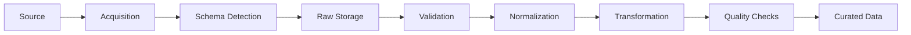

# Data Ingestion

## 1. Purpose

This document defines the conceptual ingestion architecture that moves data from external sources ([data-sources.md](data-sources.md)) into DistrictMind's Raw and Curated layers ([data-architecture.md](data-architecture.md) Section 7). It is a conceptual design, not an ETL implementation — no pipeline code, scheduler configuration, or connector is created by this document.

## 2. Ingestion Pipeline Overview

This mirrors and elaborates the Blueprint's own described pipeline (§9.3): *"a scheduled ETL pipeline that re-ingests updated source files, validates them against the existing schema, and upserts changed records into PostGIS."* Each stage below explains what happens, what triggers it, and what happens on failure.

## 3. Stage Definitions

| Stage | What Happens | Trigger | On Failure |
|---|---|---|---|
| Acquisition | Fetch the source file/API response (Section 5) | Scheduled run, manual trigger, or API poll (Section 4) | Retry with backoff (Section 9); after exhausted retries, log failure and skip this run without partial acquisition |
| Schema Detection | Compare the incoming file/response structure against the last-known schema for this source | Immediately after acquisition | If structure has changed unexpectedly, flag for schema-evolution review (Section 12) rather than silently proceeding |
| Raw Storage | Persist an unmodified copy of the acquired data, tagged with source and ingestion-run timestamp | After successful acquisition | N/A — this stage does not fail independently of acquisition |
| Validation | Apply structural, domain, spatial, temporal, numerical, and referential rules ([data-validation.md](data-validation.md)) | After raw storage | Failing records are quarantined (Section 8); a wholesale schema failure halts the run |
| Normalization | Standardize units, formats, and entity references ([data-transformation.md](data-transformation.md)) | After validation passes | Normalization errors are treated as validation failures for the affected records |
| Transformation | Apply domain-specific derivations (e.g., CRS reprojection, entity matching) | After normalization | Same as above |
| Quality Checks | Assess the batch against the quality framework ([data-quality.md](data-quality.md)) | After transformation | Below-threshold batches are flagged for review, not silently accepted (Section 8) |
| Curated Data | Upsert validated, transformed, quality-checked records into the Curated layer, versioned/timestamped | After quality checks pass | N/A — this is the successful terminal state |

## 4. Ingestion Modes

| Mode | Used For | Notes |
|---|---|---|
| **Batch ingestion** | Departmental CSV/GeoJSON exports, census data | The default mode (AD-DE-003, [data-architecture.md](data-architecture.md)) — matches the actual update cadence of the identified source categories |
| **API ingestion** | OpenStreetMap via Overpass API | Pull-based, on a schedule; not a live subscription |
| **File ingestion** | Any manually supplied dataset (e.g., a one-off government export) | Same pipeline stages apply regardless of how the file arrived |
| **GIS ingestion** | Boundary/geometry data (shapefile, GeoJSON) | Includes CRS reprojection to the canonical CRS ([gis-architecture.md](../02_System_Architecture/gis-architecture.md) Section 6) as part of Transformation |
| **Historical/backfill ingestion** | Initial load of multi-year census, weather, or population history | A one-time, larger-volume run through the same pipeline, not a separate mechanism |
| **Incremental updates** | Recurring re-ingestion of a source that changes over time (e.g., quarterly weather updates) | Detected via schema/content diff against the last successful ingestion (Section 12) |
| **Scheduled ingestion** | The default operating mode, per source-specific cadence | Cadence is source-dependent and not fixed by this document (e.g., weather may run more often than census) |
| **Manual ingestion** | Administrator-triggered runs (FR-035, [functional-requirements.md](../01_Requirements/functional-requirements.md)) | Goes through the identical pipeline; the only difference is the trigger, not the processing |

## 5. Source-to-Mode Mapping

| Source (from [data-sources.md](data-sources.md)) | Mode | Rationale |
|---|---|---|
| OpenStreetMap | API, scheduled | Overpass API is a pull interface; OSM itself updates continuously but DistrictMind polls on a schedule (AD-DE-003) |
| Census portals | File/batch, historical + scheduled | Census data is inherently periodic |
| Weather (IMD or equivalent) | API or file, scheduled | Exact mechanism depends on the specific provider eventually identified |
| Departmental exports (hospitals, schools, roads, offices, water bodies) | File/batch, manual + scheduled | Matches the Blueprint's own acknowledgment that these are irregular, often manually maintained exports |
| Agricultural records | File/batch, scheduled (seasonal) | Matches the seasonal nature of the data itself |
| Disaster/hazard records | File/batch, event-triggered + scheduled | Historical records batch-loaded; live event data is explicitly Future scope (not real-time in current milestones) |
| Policy documents (Knowledge Base) | File, manual | Documents are added/updated by an administrator, not polled |

## 6. Retry, Failure Handling, and Idempotency

- **Retry**: transient acquisition failures (network errors, rate limits) are retried with backoff, per [integration-architecture.md](../02_System_Architecture/integration-architecture.md) Section 13; retries are bounded, not infinite.
- **Failure handling**: a failed ingestion run is logged with its failure reason and does not commit any partial data to the Curated layer (Data Integrity principle; NFR-009). This is a hard requirement inherited unchanged from ED-M2 Part 1's [data-flow.md](../02_System_Architecture/data-flow.md) Flow A.
- **Idempotency**: re-running an ingestion for the same source snapshot must not create duplicate Curated records. Idempotency is achieved through an **upsert** pattern keyed on a stable natural or assigned identifier per entity (e.g., a village's stable identifier), consistent with the Blueprint's own description (§9.3: "upserts changed records into PostGIS").
- **Deduplication**: within a single ingestion batch, records that resolve to the same entity (e.g., two rows describing the same hospital with slightly different spellings) are deduplicated during Normalization/Transformation, not left for downstream consumers to reconcile — see [data-transformation.md](data-transformation.md) Section 5.

## 7. Schema Evolution and Versioning

- Every source's expected schema is tracked; a detected structural change (Section 3, Schema Detection) does not silently pass through — it is flagged for review before Validation rules (which assume a known schema) are applied against it.
- Every Curated record carries a **version/timestamp** marking which ingestion run produced or last updated it (Blueprint §9.3's "version timestamp column"), enabling the system to distinguish current from historical state — this is the mechanism [temporal-data.md](temporal-data.md) builds on.
- Schema and rule changes themselves (e.g., a new required field) are versioned artifacts, not silent edits — consistent with [technical-requirements.md](../01_Requirements/technical-requirements.md) Versioning Requirements.

## 8. Quarantine, Correction, and Reprocessing

Records failing Validation or falling below the Quality Checks threshold are **quarantined** — held in a rejected/pending state, visible for review, never silently discarded and never promoted to Curated by default. Because Raw Storage persists an unmodified copy (AD-DE-002, [data-architecture.md](data-architecture.md)), a correction to a validation rule or a source data fix can trigger **reprocessing** of already-landed raw data without needing to re-fetch from the external source. Full detail on validation rule categories and quarantine handling is in [data-validation.md](data-validation.md) Section 8.

## 9. Audit Logging

Every ingestion run logs: source, trigger (scheduled/manual), start/end time, record counts (acquired, validated, quarantined, curated), and failure reason if applicable — per NFR-009 and [technical-requirements.md](../01_Requirements/technical-requirements.md) Data Pipeline Requirements ("shall log ingestion outcomes"). This is operational/audit logging distinct from the AI tool-call audit trail described in [data-architecture.md](data-architecture.md) Section 18.

## 10. Milestone Support

| Milestone | Ingestion Requirement |
|---|---|
| M1 | GIS boundary data ingestion (district/mandal geometry) — the minimum needed for the Digital Twin Foundation |
| M2 — Future | Full multi-domain ingestion: demographic, healthcare, transportation, agriculture, weather, infrastructure, disaster data |
| M3 — Future | Ingestion of unstructured policy documents into the Knowledge Base (embedding generation is a Transformation-stage concern, not ingestion itself — see [ai-architecture.md](../02_System_Architecture/ai-architecture.md) Section 7) |
| M4 — Future | Sufficient historical/temporal depth in already-ingested data to support model training (no new ingestion *mechanism*, but a data-sufficiency dependency) |
| M5 — Future | No new ingestion requirement — simulation operates on already-curated data via sandboxing ([data-architecture.md](data-architecture.md) Section 23) |
| M6 — Future | No new ingestion requirement — recommendations and agent orchestration consume existing curated/analytical data |

## 11. What This Document Does Not Do

Per the milestone restrictions, this document does not: implement an ETL pipeline, write ingestion code, define a scheduler configuration, or name a specific orchestration tool ([technology-stack.md](../00_Engineering_Overview/technology-stack.md) §4.8 lists Apache Airflow as **To Be Evaluated**, unchanged by this document).

## 12. Open Decisions

- Source-specific ingestion cadence (exact schedule per source).
- Orchestration tooling (Apache Airflow, a simpler scheduler, or an in-application job runner — all remain **To Be Evaluated**).
- Schema-evolution review process ownership (which role reviews a flagged schema change).
- Historical/backfill volume and depth for each domain, pending confirmation of actual source data availability ([data-sources.md](data-sources.md) Section 9).
