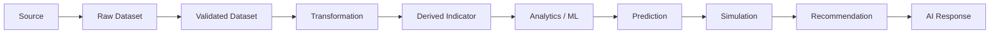

# Data Lineage

## 1. Purpose

Every important DistrictMind output must be traceable back to the inputs that produced it. This document defines the lineage chain from source data through to AI response, what metadata each stage retains, and why this matters specifically for a system whose outputs (recommendations, predictions) are meant to inform real government decisions.

## 2. The Lineage Chain

This chain is the traceability backbone referenced throughout [data-architecture.md](data-architecture.md) (Section 19, Section 24) and is what makes the Blueprint's own stated goal achievable: *"a defensible, explainable decision trail: every AI recommendation is traceable to the tools and data it used"* (Blueprint §1.2.3).

## 3. Metadata Retained Per Stage

| Stage | Source | Transformation | Version | Timestamp | Owner | Quality Status | Provenance |
|---|---|---|---|---|---|---|---|
| Source | The external provider itself ([data-sources.md](data-sources.md)) | N/A | N/A | Acquisition time | Data Owner (conceptual, [data-governance.md](data-governance.md) Section 2) | N/A — not yet assessed | N/A — this is the root |
| Raw Dataset | Reference to the Source stage | None (unmodified copy, per AD-DE-002) | Ingestion-run ID | Ingestion timestamp | Data Steward | Not yet assessed | Points to Source |
| Validated Dataset | Reference to Raw Dataset | Validation rules applied ([data-validation.md](data-validation.md)) | Validation rule-set version | Validation timestamp | Data Steward | Pass/fail per rule, quarantine status | Points to Raw Dataset |
| Transformation | Reference to Validated Dataset | Specific transformation(s) applied ([data-transformation.md](data-transformation.md)) | Transformation logic version | Transformation timestamp | Data Steward | Inherited + transformation-specific checks | Points to Validated Dataset |
| Derived Indicator | Reference to one or more Curated records | Aggregation/derivation logic | Computation version | Computation timestamp | Analytical layer owner (conceptual) | Completeness/freshness of inputs | Points to all contributing Curated records |
| Analytics / ML | Reference to Derived Indicators and/or Curated data | Feature engineering, model training reference | Model/feature-set version | Training/computation timestamp | AI/ML layer owner (conceptual) | Input data quality summary | Points to Derived Indicators + Curated data used |
| Prediction | Reference to the ML model and its input feature set | Model inference | Model version (per [database-architecture.md](../02_System_Architecture/database-architecture.md) Section 8) | Inference timestamp | AI/ML layer owner | Confidence indicator (NFR-032) | Points to Analytics/ML stage |
| Simulation | Reference to a specific baseline snapshot + scenario parameters | Sandboxed recomputation (AD-DE-004) | Simulation-run ID | Execution timestamp | AI/ML layer owner | Baseline data quality/freshness ([data-quality.md](data-quality.md) Section 5) | Points to baseline Curated/Analytical snapshot + Prediction stage (if invoked) |
| Recommendation | Reference to contributing Analytics, Prediction, and/or Simulation records | Scoring/ranking logic | Scoring logic version | Generation timestamp | AI/ML layer owner | Evidence completeness ([data-architecture.md](data-architecture.md) Section 24) | Points to all cited evidence records |
| AI Response | Reference to retrieved Evidence (structured data and/or Recommendation) | Reasoning/composition by the LLM/agent | Model/prompt version (implementation-time detail) | Response timestamp | AI/ML layer owner | Grounded/ungrounded status ([ai-architecture.md](../02_System_Architecture/ai-architecture.md) Section 3) | Points to every Evidence item cited |

## 4. Lineage and the Digital Twin State Model

Each stage in Section 2 corresponds to a category in [data-architecture.md](data-architecture.md) Section 20 and [data-transformation.md](data-transformation.md) Section 4:

| Lineage Stage | State Category |
|---|---|
| Source, Raw, Validated, Transformation | Observed State (once validated) |
| Derived Indicator | Derived State |
| Prediction | Predicted State |
| Simulation | Scenario State |
| Recommendation | Recommended State / Action |
| AI Response | Not itself a state category — a composed narrative citing the states above ([data-governance.md](data-governance.md) Section 6) |

## 5. How Lineage Supports Trust

A user or reviewer who receives an AI Response, a Recommendation, or a dashboard indicator can, in principle, walk backward through this chain to the original government dataset that ultimately grounds it. This is what makes the output defensible in a government/administrative context, not merely plausible-sounding.

## 6. How Lineage Supports Debugging

When a value looks wrong (Blueprint §2.1: "a wrong answer can always be traced to a specific tool call and its result"), lineage metadata identifies exactly which stage introduced the error — a bad source record, a validation rule that let something through it shouldn't have, a transformation bug, or a stale model — rather than requiring a full re-investigation of the entire pipeline.

## 7. How Lineage Supports Auditability

Lineage metadata is retained alongside, and is consistent with, the Audit System's own event log ([security-architecture.md](../02_System_Architecture/security-architecture.md) Section 11) — an administrative action or an AI recommendation review (FR-036, FR-037) references the specific lineage-tracked records it acted on.

## 8. How Lineage Supports AI Grounding

This is the data-layer mechanism that makes [ai-architecture.md](../02_System_Architecture/ai-architecture.md)'s citation requirement (Section 10, "grounding") actually implementable: a citation in an AI response is a reference into this lineage chain, not a free-text claim about where the information came from.

## 9. How Lineage Supports Reproducibility

Given the same Source-stage data and the same versioned transformation/model logic, the chain in Section 2 should be able to reproduce the same Derived/Prediction/Simulation output — this is the practical meaning of the Reproducibility principle for DistrictMind's data pipeline, and it is why every stage in Section 3 retains a version, not just a value.

## 10. How Lineage Supports Explainability

Explainability (per the Explainable AI principle) is lineage exposed in human-readable form: "this recommendation is based on a coverage gap computed from hospital data ingested on [date], a population forecast trained on census data through [year], and a policy constraint from [document]" — each clause in that sentence is a pointer into the chain in Section 2.

## 11. Milestone Traceability

| Lineage Capability | Milestone |
|---|---|
| Source → Raw → Validated → Curated lineage for GIS boundary data | M1 |
| Full lineage across all domains, through Derived Indicators | M2 — Future |
| Lineage extended to AI Response / Evidence citation | M3 — Future |
| Lineage extended to Prediction (model/version metadata) | M4 — Future |
| Lineage extended to Simulation (baseline + scenario reference) | M5 — Future |
| Lineage extended to Recommendation (full evidence chain) + human review | M6 — Future |

## 12. Open Decisions

- Specific storage mechanism for lineage metadata (a dedicated lineage/graph store vs. metadata columns on existing tables) — **To Be Evaluated**, deferred to ED-M2 Part 2B schema design.
- Retention period for lineage metadata itself, relative to the retention of the data it describes (Section 5, [data-governance.md](data-governance.md)).
