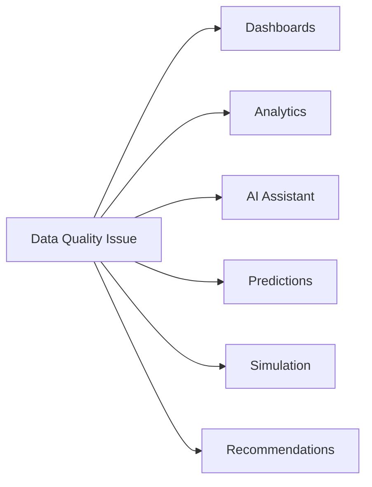

# Data Quality

## 1. Purpose

This document defines DistrictMind's data quality framework: the dimensions of quality that matter, how they are measured, and — explicitly — how degraded quality propagates into dashboards, analytics, AI, predictions, simulation, and recommendations. No numeric threshold in this document is asserted as fact; every threshold is marked **Proposed / Initial Target** consistent with ED-M1's own convention ([non-functional-requirements.md](../01_Requirements/non-functional-requirements.md)).

## 2. Quality Dimensions

| Dimension | Definition | Relevant Domains |
|---|---|---|
| Accuracy | Data correctly reflects the real-world value it claims to represent | All |
| Completeness | Required fields/records are present, not missing | All |
| Consistency | The same fact is represented the same way across sources/records | Cross-domain, especially Section 6 of [data-transformation.md](data-transformation.md) |
| Timeliness | Data is current enough for its intended use | Weather, disaster, population |
| Validity | Data conforms to defined rules ([data-validation.md](data-validation.md)) | All |
| Uniqueness | No unintended duplicate records for the same real-world entity | Especially facility/infrastructure data (entity matching) |
| Spatial accuracy | Geometry correctly represents real-world location/shape | Geographic, Healthcare, Transportation, Infrastructure |
| Temporal consistency | Time-series data is internally coherent (no impossible sequences, no unflagged gaps) | Demographic, Weather, Agriculture |
| Provenance | Every record's source and lineage is known ([data-lineage.md](data-lineage.md)) | All |

## 3. Measurable Quality Metrics (Proposed / Initial Target)

| Metric | Definition | Initial Target | Status |
|---|---|---|---|
| Completeness percentage | Share of required fields populated across a dataset | Not set — no empirical baseline exists yet | Proposed / Initial Target — To Be Validated |
| Validity percentage | Share of ingested records passing all applicable [data-validation.md](data-validation.md) rules | Not set | Proposed / Initial Target — To Be Validated |
| Duplicate rate | Share of records identified as duplicates during entity matching ([data-transformation.md](data-transformation.md) Section 6) | Not set | Proposed / Initial Target — To Be Validated |
| Spatial validity percentage | Share of geometries passing spatial validation ([data-validation.md](data-validation.md) Section 4) | Not set | Proposed / Initial Target — To Be Validated |
| Freshness | Time elapsed since a dataset's last successful validated ingestion | Not set | Proposed / Initial Target — To Be Validated |
| Source reliability | A qualitative or scored assessment of a source's historical accuracy/completeness track record within DistrictMind | Not set — requires operating history to assess | Proposed / Initial Target — To Be Validated |

No arbitrary numeric threshold (e.g., "95% completeness required") is set in this document, per the milestone brief's explicit instruction not to invent thresholds. Where DistrictMind eventually sets such a threshold, it must be recorded here with its justification and marked **Proposed / Initial Target** until validated against real operating data.

## 4. Why This Matters for DistrictMind Specifically

The original source material itself identifies data quality as a named project risk, not a generic concern: Blueprint §17 (Data row) states government datasets are "often incomplete, inconsistently formatted, or infrequently updated." This is not a hypothetical enterprise-data-quality concern — it is the specific, acknowledged condition DistrictMind's data architecture must be designed to survive.

## 5. Quality Propagation — How Low Quality Affects Downstream Consumers

| Consumer | Effect of Low-Quality Input | Mitigation |
|---|---|---|
| **Dashboards** | Displayed indicators may be incomplete, stale, or misleading | Freshness/completeness metadata surfaced alongside the value, not hidden (Explainable AI / transparency principle) |
| **Analytics** | Aggregates computed over incomplete data may understate or skew results | Aggregation logic explicitly accounts for known gaps (e.g., excluding, not zero-filling, missing periods — [data-transformation.md](data-transformation.md) Section 7) |
| **AI Assistant** | A grounded answer built on stale or incomplete data may mislead a user who assumes it is current | Freshness is part of the Evidence returned to the AI layer ([data-architecture.md](data-architecture.md) Section 21); the assistant must surface data age, not only the value |
| **Predictions** | Models trained or run on low-quality historical data produce less reliable forecasts | Confidence indicators (NFR-032) are required precisely because prediction quality is bounded by input quality — a forecast is never presented without its uncertainty |
| **Simulation** | A simulation baseline built on stale/incomplete curated data produces a scenario comparison that is only as good as that baseline | The baseline snapshot's quality/freshness is retained alongside the simulation result (Section 23, [data-architecture.md](data-architecture.md)) |
| **Recommendations** | A recommendation whose evidentiary basis (Section 24, [data-architecture.md](data-architecture.md)) includes low-quality data inherits that weakness | Evidence-Based Recommendations principle requires the underlying data's quality status to be visible to the human reviewer, not just the recommendation's final score |

The consistent pattern across every consumer: DistrictMind does not attempt to hide data-quality problems from the user or the AI layer — it surfaces them, consistent with Fail-Safe Behavior and Explainable AI.

## 6. Quality Checks in the Ingestion Pipeline

Quality Checks are a distinct stage in [data-ingestion.md](data-ingestion.md) Section 3, occurring after Transformation and before promotion to Curated data. A batch falling below a (future, empirically-set) quality threshold is flagged for review, not silently accepted — consistent with the quarantine/review pattern in [data-validation.md](data-validation.md) Section 8.

## 7. Quality Reporting

The Blueprint's own Phase 1 deliverables (§4.2) explicitly include "a data-quality report noting gaps" as an expected output of the data-collection phase — this document adopts that as a standing practice, not a one-time deliverable: every ingestion run's quality metrics (Section 3) are retained and reportable, not computed once and discarded.

## 8. Milestone Traceability

| Quality Capability | Milestone |
|---|---|
| Spatial accuracy, completeness (GIS boundary data) | M1 |
| Full quality framework across all domains | M2 — Future |
| Confidence/uncertainty exposure tied to input quality | M4 — Future (predictions), M5 — Future (simulation) |
| Evidence quality visibility for human review | M6 — Future |

## 9. Open Decisions

- Numeric thresholds for every metric in Section 3 — deliberately left unset pending real operating data.
- Source reliability scoring methodology — **To Be Evaluated**.
- Quality-report distribution/ownership (who reviews it, how often).
