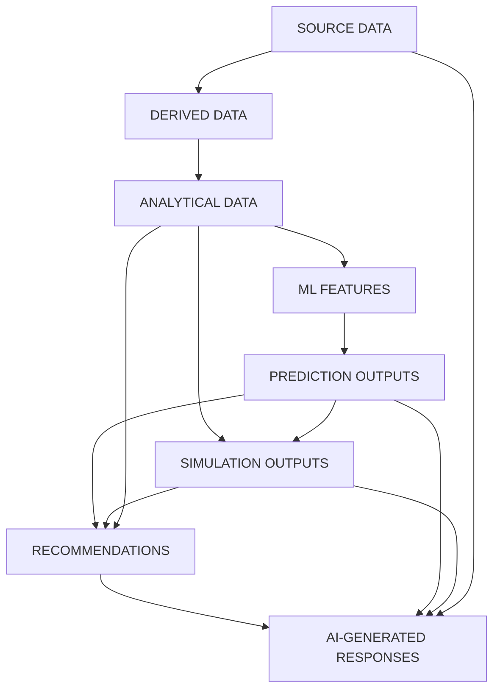

# Data Transformation

## 1. Purpose

This document defines the transformations required to convert validated raw data into usable curated, analytical, and AI-ready data, and — critically — draws a hard line between categories of data that must never be confused with one another (Section 4). No transformation logic is implemented here.

## 2. Transformation Operations

| Operation | Purpose | Example |
|---|---|---|
| Normalization | Convert values into the canonical structural form | Splitting a combined "Village, Mandal" text field into separate references |
| Standardization | Apply consistent formatting/casing/naming | Standardizing facility-type strings to a fixed enumeration ([data-validation.md](data-validation.md) Section 3) |
| Unit conversion | Convert all values of a given field to one canonical unit | Converting agricultural area from acres to hectares uniformly |
| Geographic normalization | Reproject geometry to the canonical CRS | Per [gis-architecture.md](../02_System_Architecture/gis-architecture.md) Section 6 |
| Entity matching | Resolve records from different sources describing the same real-world entity | Matching a hospital listed in two different departmental exports with slightly different name spellings |
| Deduplication | Collapse matched duplicate records into one | Following entity matching, keeping the most authoritative/recent version |
| Aggregation | Combine multiple records into a summary value | Village-level population summed to mandal-level population |
| Temporal aggregation | Combine time-series values over a period | Daily rainfall summed to monthly rainfall |
| Spatial aggregation | Combine values across a geographic grouping | Facility counts aggregated from village to mandal to district |
| Derived indicator computation | Compute a new value from existing curated data | "Villages without hospital coverage within 10 km" computed via spatial join ([spatial-data.md](spatial-data.md)) |
| Feature engineering | Construct model-input features from curated data | Terrain elevation + proximity-to-water-body features for flood-risk prediction (Blueprint §12.1) |
| Missing-value handling | Explicitly mark or (where justified) impute missing values | A gap in a weather time series is marked as missing, not silently zero-filled |
| Outlier handling | Apply a defined treatment to values flagged during validation | Retaining a flagged outlier with a visible flag, rather than silently excluding it |

## 3. Transformation Lineage Diagram

## 4. Category Definitions — Never to Be Conflated

| Category | Definition | Who/What Produces It | Trust Level |
|---|---|---|---|
| **Source Data** | Exactly what was ingested, post-validation, pre-derivation | External providers ([data-sources.md](data-sources.md)) | Trusted as "what the source reported," not independently verified by DistrictMind |
| **Derived Data** | Deterministically computed from Source Data via a defined, reproducible transformation | The Transformation stage of ingestion ([data-ingestion.md](data-ingestion.md)) | Trusted to the extent the transformation logic and inputs are trusted; always traceable (Section 5) |
| **Analytical Data** | Aggregated/summarized Derived or Source Data for dashboard/reporting consumption | The Analytical layer ([data-architecture.md](data-architecture.md) Section 7.5) | Same trust basis as Derived Data — descriptive, not predictive |
| **ML Features** | Data specifically shaped/engineered as model input | Feature engineering (Section 2) | An intermediate artifact, not itself a user-facing fact |
| **Prediction Outputs** | Model-generated estimates of future or unobserved state | The Prediction Engine (M4 — Future) | Explicitly a **Predicted State** ([data-architecture.md](data-architecture.md) Section 20) — never presented as observed fact |
| **Simulation Outputs** | Model/GIS-recomputed results under a hypothetical, sandboxed condition | The Simulation Engine (M5 — Future) | Explicitly a **Scenario State** — discarded sandbox, never written to production ([data-architecture.md](data-architecture.md) Section 23) |
| **Recommendations** | Ranked, justified suggestions derived from Analytical + Prediction + Simulation data | The Recommendation Engine (M6 — Future) | Explicitly a **Recommended State/Action** — requires human review before any acceptance (FR-032) |
| **AI-Generated Responses** | Natural-language output composed by an LLM/agent from retrieved Evidence | The AI/ML layer ([ai-architecture.md](../02_System_Architecture/ai-architecture.md)) | Never itself a source of fact — grounded only insofar as it cites the categories above; see [data-governance.md](data-governance.md) Section 6 |

This table operationalizes the milestone brief's explicit instruction to keep these categories distinct, and is the transformation-layer counterpart to the Digital Twin State Model in [data-architecture.md](data-architecture.md) Section 20.

## 5. Traceability Requirement

Every Derived, Analytical, ML Feature, Prediction, Simulation, and Recommendation record retains a reference back to the Source Data and transformation logic version that produced it (Reproducibility principle). This is the transformation-stage half of [data-lineage.md](data-lineage.md)'s full lineage chain.

## 6. Entity Matching and Deduplication — Detail

Because DistrictMind explicitly expects "reconciling data from multiple departments into one consistent schema" to require "significant cleaning effort" (Blueprint §17), entity matching is treated as a first-class transformation step, not an afterthought:

- Matching is attempted on stable identifiers first (if a source provides one), falling back to a combination of name similarity + spatial proximity (e.g., two "Village X" records within a small distance of each other are candidates for the same real-world village).
- A match is never assumed silently — ambiguous matches (e.g., two candidates with similar confidence) are flagged for review rather than auto-resolved, consistent with the Fail-Safe Behavior principle.
- Deduplication retains provenance for *all* matched source records, even after collapsing them into one curated entity, so a data-quality question ("why does this hospital have two different reported capacities?") remains answerable.

## 7. Missing-Value and Outlier Handling — Detail

- Missing values are never silently defaulted to zero or a placeholder that could be mistaken for a real observation; they are explicitly marked as missing.
- Any imputation (estimating a missing value) is itself a Derived Data operation (Section 4) and must be labeled as such — an imputed rainfall value is not the same category as an observed one, and downstream consumers (including AI grounding, [data-architecture.md](data-architecture.md) Section 21) must be able to tell the difference.
- Outliers flagged during validation ([data-validation.md](data-validation.md) Section 6) are carried through transformation with their flag intact, not silently dropped from aggregates unless a specific, documented aggregation rule excludes them.

## 8. Milestone Traceability

| Transformation Capability | Milestone |
|---|---|
| Geographic normalization (CRS reprojection) | M1 |
| Normalization, standardization, unit conversion, entity matching, deduplication, aggregation | M2 — Future |
| Feature engineering for prediction | M4 — Future |
| Simulation-specific sandboxed transformation | M5 — Future |
| Recommendation-scoring transformation | M6 — Future |

## 9. Open Decisions

- Entity-matching confidence thresholds and the specific similarity method (e.g., string-distance algorithm) — **To Be Evaluated**, dependent on actual source data once identified.
- Imputation policy (whether/when to impute missing time-series values at all, versus always leaving gaps explicit) — **Proposed** default is to leave gaps explicit unless a specific downstream need justifies imputation; not yet formally decided.
