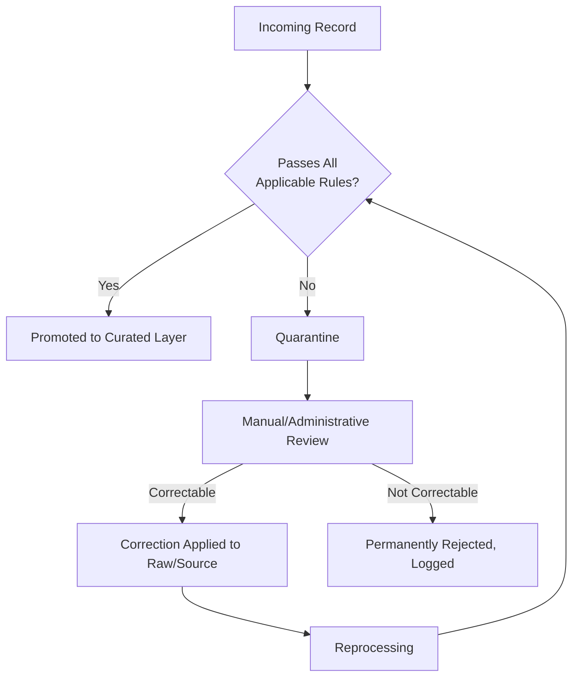

# Data Validation

## 1. Purpose

This document defines the validation rule categories applied during the Validation stage of ingestion ([data-ingestion.md](data-ingestion.md) Section 3), before data enters the Curated layer. No rule below specifies an implementation (a schema library, a validation framework) — these remain **To Be Evaluated**, consistent with [technology-stack.md](../00_Engineering_Overview/technology-stack.md).

## 2. Structural Validation

| Rule | Checks | Example Failure |
|---|---|---|
| Schema conformance | Incoming record matches the expected field set for its entity type | A `villages` record missing a `geom` field |
| Required fields | Mandatory fields are present and non-null | A hospital record with no `name` |
| Data types | Field values match their expected type | `population.count` containing text instead of an integer |
| Field names | Field names match the canonical naming convention ([naming-conventions.md](../03_Project_Structure/naming-conventions.md) Section 10) | A source using `pop_count` where the canonical field is `count` — normalized here, not silently accepted under the wrong name |

## 3. Domain Validation

| Rule | Checks | Example Failure |
|---|---|---|
| Valid district | Referenced district exists in the current Geographic domain reference set | A record citing a district not in Telangana's known set |
| Valid mandal | Referenced mandal exists and belongs to the stated district | A mandal ID that doesn't resolve, or resolves under the wrong district |
| Valid village / local entity | Referenced village exists and belongs to the stated mandal | Same pattern, one level down |
| Valid facility type | Facility `type` matches a known enumeration (e.g., hospital type: PHC, general, specialty) | An unrecognized facility type string |
| Valid indicator | Indicator/KPI code matches a defined indicator in the Analytical domain | A dashboard query referencing an indicator that doesn't exist |

## 4. Spatial Validation

| Rule | Checks | Example Failure |
|---|---|---|
| Geometry validity | Geometry is well-formed (no self-intersecting polygons, no null geometry) | A malformed village boundary polygon |
| Coordinate validity | Coordinates fall within plausible bounds for Telangana | A coordinate at (0,0) — a common "null island" data-entry error |
| CRS consistency | Incoming geometry's coordinate reference system is known and reprojectable to the canonical CRS ([gis-architecture.md](../02_System_Architecture/gis-architecture.md) Section 6) | A file with no CRS metadata at all |
| Polygon validity | Boundary polygons are closed and non-degenerate | A polygon with fewer than 3 distinct vertices |
| Duplicate geometry | The same geometry is not ingested twice as separate entities | Two "hospital" records at the identical point with different names |
| Boundary consistency | A village's geometry falls within (or is consistent with) its stated parent mandal's geometry | A village polygon that spatially falls outside its declared mandal — flagged per Blueprint's own emphasis on validating "no duplicate points, correct SRID" (§4.2 Phase 2 Objectives) |

## 5. Temporal Validation

| Rule | Checks | Example Failure |
|---|---|---|
| Valid timestamps | Timestamp fields are well-formed and parseable | An unparseable or malformed date string |
| Date ranges | Dates fall within a plausible range for the domain (e.g., not before Telangana's formation, not far in the future) | A population record dated to a nonsensical year |
| Future dates | Observed-state records (Section 20 of [data-architecture.md](data-architecture.md)) do not carry a future observation date — only Predicted/Scenario state may reference the future | A "current" population record dated next year |
| Duplicate observations | The same entity does not have two conflicting observations for the same period without one being marked superseded | Two rainfall readings for the same station and date with different values, neither flagged |
| Missing periods | Gaps in an expected time series are detected and recorded, not silently interpolated during ingestion | A weather station with no readings for several months — flagged, not filled in without marking it as an interpolation (interpolation, if ever performed, is a Transformation-stage, explicitly-labeled derived value — see [data-transformation.md](data-transformation.md)) |

## 6. Numerical Validation

| Rule | Checks | Example Failure |
|---|---|---|
| Range checks | Values fall within a plausible domain-specific range | Rainfall recorded as a negative number |
| Outlier detection | Values are flagged (not automatically rejected) when far outside the historical distribution for that entity | A population figure 100x the prior recorded value for the same village |
| Invalid negative values | Fields that cannot be negative (population, capacity, area) are rejected if negative | A hospital `capacity` of -5 |
| Unit consistency | Numerical values are validated against the expected unit before storage | Area recorded in acres in one file and hectares in another, without unit normalization — this is caught here and corrected in [data-transformation.md](data-transformation.md) |

## 7. Referential Validation

| Rule | Checks | Example Failure |
|---|---|---|
| Entity relationships | Foreign-key-style references resolve to an existing entity | A population record referencing a `village_id` that does not exist |
| Geographic hierarchy | Village → Mandal → District references are internally consistent (Section 3's domain checks, applied here as a relationship-integrity check) | A village whose mandal reference points to a mandal in a different district than expected |
| Foreign-key-style integrity | Applies even where the underlying store enforces this natively (e.g., a relational database's own FK constraints) — validation catches violations before they reach the database layer, since some relationships (e.g., facility-to-village) are computed spatial joins, not stored FKs (per [data-domain-model.md](data-domain-model.md) Section 3), and therefore need this validation stage rather than relying solely on database constraints | A facility geometry that spatially resolves to no containing village at all (e.g., a coordinate outside all known boundaries) |

## 8. Validation Failure Handling

- **Validation failure**: a record failing any rule in Sections 2–7 does not proceed to Transformation or Curated storage.
- **Quarantine**: failing records are held in a visible, queryable quarantine state — not deleted, not silently merged into Curated data. Outlier-detection failures (Section 6) are quarantined for *review*, not automatic rejection, since an outlier may be a legitimate but unusual value.
- **Correction**: a quarantined record may be corrected at the source (e.g., the providing department fixes a file) or via an administrative override, both of which are auditable actions (Section 9).
- **Reprocessing**: because Raw Storage persists the original ingested data (AD-DE-002, [data-architecture.md](data-architecture.md)), a rule fix or source correction can be reprocessed against already-landed raw data without re-fetching.
- **Audit**: every validation failure, quarantine, correction, and reprocessing event is logged with the specific rule violated, consistent with [data-ingestion.md](data-ingestion.md) Section 9 and the Blueprint's own emphasis on data-quality reporting (§4.2 Phase 1 Deliverables: "a data-quality report noting gaps").

## 9. Relationship to Data Quality

Validation is the gate that keeps invalid data out of the Curated layer; it is distinct from, but feeds directly into, the measurable quality metrics defined in [data-quality.md](data-quality.md) (e.g., validity percentage is derived from this stage's pass/fail outcomes).

## 10. Milestone Traceability

| Validation Category | First Needed |
|---|---|
| Structural, Spatial | M1 (GIS boundary ingestion) |
| Domain, Temporal, Numerical, Referential | M2 — Future (multi-domain ingestion) |

## 11. Open Decisions

- Specific plausible-range thresholds per numerical field (Section 6) — not invented here; to be derived from actual source data distributions during ED-M2 Part 2B.
- Outlier-detection method (e.g., statistical threshold vs. domain-expert-defined bounds) — **To Be Evaluated**.
- Ownership of the quarantine-review process (which role/team reviews and corrects flagged records).
