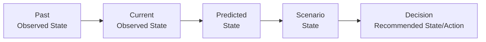

# Temporal Data

## 1. Purpose

DistrictMind is a **digital twin** — a live, structured counterpart of a physical district (Blueprint §9.1) — and a digital twin without rigorous time modeling is just a snapshot. This document defines how DistrictMind represents current state, historical state, forecasts, event timelines, scenario timelines, and the versioned-state mechanism that ties them together. It also carries the full **Digital Twin State Model**, first introduced in [data-architecture.md](data-architecture.md) Section 20, since temporal modeling is where that distinction is structurally enforced.

## 2. Why Time Is Central to DistrictMind

The Blueprint is explicit that government datasets "are not static; population figures are revised, new roads are built, facility registries are updated" (§9.3), and that DistrictMind's own synchronization mechanism exists specifically to distinguish "current state" from "historical state" — the Blueprint gives the concrete reason: "trend-based predictions... need historical snapshots, not just the latest figure" (§9.3). Time modeling is therefore not a generic data-engineering nicety for DistrictMind; it is the specific precondition for the Predictive Intelligence milestone (M4) to function at all.

Time matters differently across domains:

| Domain | Why Time Matters |
|---|---|
| Population | Growth trends require multi-year snapshots, not a single figure (Blueprint §12.3) |
| Rainfall | Seasonal/trend patterns require a time series, not a point value (Blueprint §12.2) |
| Healthcare | Facility capacity and coverage can change as new facilities open — a coverage-gap answer is only correct as of a specific point in time |
| Agriculture | Crop yield is inherently seasonal; a single reading has no meaning without its season/date |
| Transportation | Road-network state changes (new roads, closures) directly affect routing correctness |
| Disaster | Risk assessment is meaningless without knowing when an event or a rainfall condition occurred |
| Infrastructure | Facility openings/closures change coverage over time, same as Healthcare |
| Prediction | A forecast is defined *as* a statement about a future time period — it cannot exist without a temporal axis |
| Simulation | A scenario is compared against a specific baseline snapshot in time, not an undated "current" |

## 3. The Digital Twin State Model

Five categories of state must never be conflated. This restates and elaborates [data-architecture.md](data-architecture.md) Section 20, since temporal semantics are where the distinction is actually implemented.

| State | Definition | Temporal Anchor | Mutability |
|---|---|---|---|
| **Observed State** | What source data currently reports, as validated and curated | A specific observation timestamp / effective date | Immutable once recorded; a correction creates a new version (Section 8), not an edit in place |
| **Derived State** | Deterministically computed from Observed State | Inherits the effective date of its inputs, plus its own computation timestamp | Recomputed when inputs change; each computation is versioned |
| **Predicted State** | A model's estimate of a *future* point or period | A stated future target date/horizon, plus the timestamp the prediction was made | Never mutated after creation — a new forecast run creates a new record, the old one remains for audit (Reproducibility principle) |
| **Scenario State** | A simulation's estimate under a *hypothetical* condition, not tied to any real calendar date beyond its baseline reference | References a specific baseline snapshot's timestamp | Ephemeral by design (AD-DE-004) — computed, compared, and (per the Blueprint's sandbox model) not persisted into the twin's real timeline |
| **Recommended State / Action** | A proposed action, pending human decision | Timestamped at generation; a separate timestamp records human review/acceptance (FR-037) | Status changes (draft → accepted/rejected) are themselves audit events, not silent field updates |

## 4. The Temporal Progression

This progression is directional: a Recommendation is built from Scenario and Predicted state, which are built from Current (and historical Past) Observed state — never the reverse. An AI-generated Recommendation never becomes a new "Past" observation (per [data-governance.md](data-governance.md) Section 6).

## 5. Current State vs. Historical State

- **Current state** is defined as the most recent, validated, non-superseded Observed (or Derived) record for a given entity and field.
- **Historical state** is every prior version of that record, retained, not deleted, and queryable — this is what makes trend analysis and model training possible (Section 2).
- A "current state" query and a "state as of date X" query are both first-class, supported access patterns — the second is what makes reproducibility possible for a prediction that was trained on data "as it looked" at a specific past date.

## 6. Observation Timestamps and Effective Dates

Every Observed State record carries two potentially distinct temporal fields:
- **Observation/ingestion timestamp** — when DistrictMind ingested and validated the record ([data-ingestion.md](data-ingestion.md)).
- **Effective date** — the date the underlying fact actually describes (e.g., a census figure's effective date is the census year, which may be ingested much later).

These are not interchangeable. A dashboard or AI response referencing "current population" must be able to state both: how old the underlying fact is (effective date) and how recently DistrictMind refreshed its copy of it (ingestion timestamp) — both are part of the Evidence returned to the AI layer ([data-architecture.md](data-architecture.md) Section 21's "freshness-aware" requirement).

## 7. Data Freshness

Freshness is computed per-record (or per-dataset) as the gap between "now" and the more relevant of the two timestamps in Section 6, depending on context (effective date for "how current is this fact," ingestion timestamp for "how current is DistrictMind's copy"). Freshness is a measurable quality dimension — see [data-quality.md](data-quality.md) Section 3.

## 8. Versioned States

Every Curated record's version/timestamp (per [data-ingestion.md](data-ingestion.md) Section 7 and the Blueprint's own §9.3 "version timestamp column" mechanism) is what makes "current vs. historical" queryable without a separate historical-archive system: a query for "current state" filters to the latest non-superseded version per entity; a query for "state as of a past date" filters to the version that was current as of that date. This single mechanism underlies Sections 5–7 above.

## 9. Event Timelines

Disaster and infrastructure-change events (a flood occurring, a road opening) are modeled as discrete, timestamped events distinct from continuous time-series observations (like daily rainfall) — an event has a start (and often an end) rather than a regular sampling interval. Event timelines are what the Disaster domain ([data-domain-model.md](data-domain-model.md) Section 9) is built around.

## 10. Scenario Timelines

A Scenario State (Section 3) does not sit on DistrictMind's real calendar timeline — it is a hypothetical branch computed against a specific baseline snapshot (Section 5's "state as of date X") and discarded after producing its result (AD-DE-004, [data-architecture.md](data-architecture.md) Section 23). Multiple scenario runs against the same baseline are independent and do not interact with each other's hypothetical state.

## 11. Milestone Traceability

| Temporal Capability | Milestone |
|---|---|
| Observation timestamps, effective dates on boundary/reference data | M1 |
| Full historical time-series across all domains | M2 — Future |
| Forecast horizon modeling (Predicted State) | M4 — Future |
| Scenario baseline snapshotting (Scenario State) | M5 — Future |
| Recommendation timestamping + human-review timestamping | M6 — Future |

## 12. Open Decisions

- Exact granularity of historical retention per domain (daily vs. monthly rainfall history, annual vs. multi-year population snapshots) — dependent on actual source data cadence, not invented here ([data-sources.md](data-sources.md)).
- Whether/how gaps in historical time series are surfaced to the Prediction Engine as an explicit confidence-reducing factor (M4 — Future design question, not resolved in this document).
