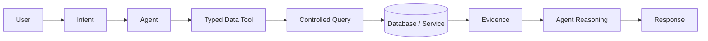

# AI Data Access Model

## 1. Purpose

This document defines the conceptual database-layer boundary between AI agents and DistrictMind's data — the mechanism that keeps AI grounded rather than hallucinating, per [ai-architecture.md](../02_System_Architecture/ai-architecture.md), [data-architecture.md](../04_Data_Engineering/data-architecture.md) Section 21, and the Blueprint's own explicit design (§2.1, §8.1). **No tool is implemented here** — only the logical categories and the access-control rules they must satisfy.

## 2. The Access Pipeline

This is the database-layer instantiation of [ai-architecture.md](../02_System_Architecture/ai-architecture.md) Section 3's pipeline and [data-architecture.md](../04_Data_Engineering/data-architecture.md) Section 21's grounding pipeline — restated here to specify exactly what the *database* must expose and refuse.

## 3. The Hard Rule

**No AI agent, LLM, or orchestrator component ever holds a database credential capable of arbitrary/free-form querying.** Every data access an agent performs is mediated by a Typed Data Tool with a fixed input schema and a bounded, well-defined output shape. This restates [data-architecture.md](../04_Data_Engineering/data-architecture.md) AD-DE-005 at the database layer and is recorded formally here as **AD-DB-006** (Section 9), since it has direct database-role implications (Section 4).

## 4. Database-Role Implication

Consistent with [security-architecture.md](../02_System_Architecture/security-architecture.md) Section 9 (least-privilege database roles): the service account backing the Typed Data Tool layer is itself scoped — read-only against Observed/Derived/Predicted/Scenario/Recommendation tables ([digital-twin-state-model.md](digital-twin-state-model.md)), with no write access except to the AI-domain's own Tool Execution/Agent Execution/AI Response tables (audit logging of its own activity). It is never granted the broader access a Domain service's own database role has.

## 5. Logical Tool Categories (Conceptual Names Only)

These are illustrative category names, **not an implementation specification** — actual tool signatures are a future, application-layer design task.

| Conceptual Tool | Domain | Reads From (Conceptually) |
|---|---|---|
| `get_district` | Geography | District, Mandal, Village |
| `get_population` | Demographics | Population Observation |
| `get_healthcare` | Healthcare | Health Facility, Analytical Result (coverage indicators) |
| `get_weather` | Weather | Weather Observation |
| `get_transportation` | Transportation | Road, Road Segment, Analytical Result (accessibility indicators) |
| `get_disaster` | Disaster | Disaster Event, Impact Observation |
| `spatial_query` | Cross-domain | Any geometry-bearing entity, via the containment/proximity/routing patterns in [spatial-database-design.md](spatial-database-design.md) |
| `analytical_query` | Analytics | Analytical Result, Indicator Definition |
| `get_prediction` (M4 — Future) | Prediction | Prediction, Model Execution Metadata |
| `run_scenario` (M5 — Future) | Simulation | Scenario, Scenario Output (write path, sandboxed — Section 7) |
| `get_recommendation_evidence` (M6 — Future) | Recommendation | Recommendation, Recommendation Evidence |

Every conceptual tool above maps to a bounded read (or, for `run_scenario`, a sandboxed compute-and-write) against a specific, named set of entities from [entity-catalog.md](entity-catalog.md) — never an open-ended "query anything" capability.

## 6. Authorization

A Typed Data Tool call inherits the authorization scope of the human user on whose behalf the requesting agent is acting (per [security-architecture.md](../02_System_Architecture/security-architecture.md) Section 13) — an agent cannot use a tool to retrieve data the user's own role would not permit through the dashboard. This is enforced at the tool-invocation boundary, before any database query executes, consistent with [backend-architecture.md](../02_System_Architecture/backend-architecture.md) Section 10's "authorization checked before Domain logic" rule.

## 7. Parameter Validation

Every Typed Data Tool's input parameters are validated against its fixed schema before any query is constructed — e.g., `get_healthcare` might accept a district/village identifier and an optional radius parameter, but never a free-form query string that could be interpreted as executable logic. This is the same validation discipline as [backend-architecture.md](../02_System_Architecture/backend-architecture.md) Section 8, applied specifically to the AI-facing tool boundary. For `run_scenario` specifically, parameters are additionally checked against [data-architecture.md](../04_Data_Engineering/data-architecture.md) AD-DE-004's sandboxing guarantee — a scenario tool call can never target a write against Observed/Curated data, only a sandboxed compute-and-store-as-Scenario-Output operation.

## 8. Query Restrictions

- Every Typed Data Tool query is scoped to its declared entity set (Section 5) — it cannot be parameterized into querying an unrelated table.
- Cross-domain reasoning (e.g., the Blueprint's flagship rainfall→disaster→transportation→healthcare example) is achieved by an **agent composing multiple bounded tool calls** (Blueprint §7.3's fan-out/fan-in pattern), not by any single tool being granted broader access — this is what keeps the "least privilege" property intact even for genuinely cross-domain questions.

## 9. Result Limits

Every tool's result set is bounded (e.g., a maximum row count, a maximum geometry complexity) so that a single tool call cannot return an unbounded payload — consistent with [data-architecture.md](../04_Data_Engineering/data-architecture.md) Section 25's "bounded API response size" performance requirement, applied here specifically to the AI-facing path (which has an additional cost dimension: the returned data typically also becomes LLM context, so bounding it also bounds cost/latency, per [ai-architecture.md](../02_System_Architecture/ai-architecture.md) Section 9's context-management discipline).

## 10. Provenance, Freshness, Confidence

Every Typed Data Tool's result is annotated with:
- **Provenance** — which Curated record(s)/Dataset Version the result was read from ([data-lineage.md](../04_Data_Engineering/data-lineage.md)).
- **Freshness** — the observation/ingestion timestamp of the underlying data ([temporal-database-design.md](temporal-database-design.md) Section 2).
- **Confidence** — where the tool reads a Prediction or Scenario Output, the stored confidence indicator (NFR-032) is included, not stripped out for brevity.

This is what allows an Agent's downstream reasoning (and the eventual AI Response's citations) to be genuinely evidenced rather than merely plausible-sounding.

## 11. Evidence

"Evidence" (per [ai-architecture.md](../02_System_Architecture/ai-architecture.md) Section 5 and [logical-data-model.md](logical-data-model.md) Section 14) is not a new stored entity — it is the tool result itself, carrying Section 10's annotations, referenced by the eventual Tool Execution record ([entity-catalog.md](entity-catalog.md) E-AI-003) and cited by the AI Response (E-AI-004). This avoids duplicating data into a separate "evidence" copy.

## 12. Handling Missing and Conflicting Data

- **Missing data**: a Typed Data Tool that finds no qualifying record returns an explicit "no data" result, not an empty-but-ambiguous response — the calling agent must be able to distinguish "confirmed zero" from "unknown," per [data-architecture.md](../04_Data_Engineering/data-architecture.md) Section 21's fail-safe requirement.
- **Conflicting data**: if a tool's underlying query would otherwise need to silently pick between two disagreeing records (e.g., two ingestion sources reporting different facility capacities before entity-matching/deduplication has resolved them — [data-transformation.md](../04_Data_Engineering/data-transformation.md) Section 6), the tool surfaces the conflict rather than silently choosing one value.

## 13. Unsupported Questions

If no Typed Data Tool exists that can answer a given query, the Agent must not fall back to the LLM's own unverified general knowledge — this is the same "cannot-answer" requirement as FR-022 and NFR-031, restated here as a database-access-layer consequence: **there is no data-access path that bypasses the typed-tool boundary, so an unsupported question genuinely has no route to an answer other than declining.**

## 14. Audit

Every Typed Data Tool invocation is logged as a Tool Execution record ([entity-catalog.md](entity-catalog.md) E-AI-003) — arguments, result summary, and timestamp — regardless of whether the call succeeded, returned "no data," or was rejected by authorization/validation. This is what makes a wrong AI answer traceable to a specific call and its result (Blueprint §2.1), and it is the AI-layer counterpart to the Audit Event trail for administrative actions ([entity-catalog.md](entity-catalog.md) E-AUD-001).

## 15. How This Prevents Hallucinated Facts From Becoming Authoritative Data

The chain is closed at three separate points, so no single failure collapses it:
1. **At generation** — the LLM/agent composes its response only from Evidence returned by typed tools (Section 11), never from unmediated model knowledge (Section 13).
2. **At storage** — an AI Response is structurally a distinct entity ([digital-twin-state-model.md](digital-twin-state-model.md) Section 8), with no schema path into the Observed/Derived/Predicted/Scenario/Recommendation tables.
3. **At governance** — [data-governance.md](../04_Data_Engineering/data-governance.md) Section 6 forbids AI-generated content from ever being re-ingested as a future source, even manually.

A hallucinated claim, if one occurred despite Section 3's typed-tool constraint, would therefore be visible as an *ungrounded* AI Response (flagged per [ai-architecture.md](../02_System_Architecture/ai-architecture.md) Section 10's grounding validation), not silently absorbed into the district's trusted state.

## 16. Milestone Traceability

| AI Data Access Capability | Milestone |
|---|---|
| Typed tool categories for Geography/Healthcare/Weather/Transportation/Disaster, spatial_query, analytical_query | M3 — Future |
| get_prediction | M4 — Future |
| run_scenario | M5 — Future |
| get_recommendation_evidence, multi-agent composition (Section 8) | M6 — Future |

## 17. Architectural Decision

**AD-DB-006 — No AI Component Holds Unrestricted Database Access**
- **Decision:** All AI/agent data access is mediated exclusively through Typed Data Tools with fixed schemas, scoped database roles, and mandatory audit logging (Sections 3–4, 14).
- **Context:** Directly required by the milestone brief and consistent with [data-architecture.md](../04_Data_Engineering/data-architecture.md) AD-DE-005, elaborated here with the specific database-role and result-shape implications.
- **Alternatives considered:** A scoped but still free-form read-only SQL interface for agents — rejected for the same reasons as AD-DE-005 (auditability, safety, debuggability).
- **Evaluation criteria:** Safety, auditability, alignment with Grounded AI/Explainable AI/Fail-Safe Behavior principles.
- **Trade-offs:** Every new AI data need requires a new or extended Typed Data Tool rather than an ad hoc query — an accepted cost given the safety guarantee.
- **Consequences:** [entity-catalog.md](entity-catalog.md) E-AI-003 (Tool Execution) is the audit record this decision depends on existing and being populated on every call.
- **Status:** Proposed.

## 18. Open Decisions

- Exact tool signatures and parameter schemas (Section 5) — explicitly deferred; this document names categories, not interfaces.
- Whether `run_scenario`'s sandboxed compute happens within the same database instance (an isolated schema/transaction) or an entirely separate compute context — a physical/implementation decision, **To Be Evaluated**, not resolved at the logical level (see also [backend-architecture.md](../02_System_Architecture/backend-architecture.md) Section 2's future AI/ML-extraction option).
