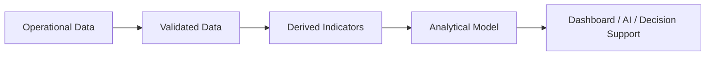

# Analytical Data Model

## 1. Purpose

This document defines the logical model for indicators, metrics, KPIs, aggregations, and derived datasets — the layer between Operational data and the dashboard/AI/decision-support consumers. No actual indicator values are invented; only the structural pattern is defined.

## 2. The Analytical Pipeline

This restates [data-architecture.md](../04_Data_Engineering/data-architecture.md) Section 6's lifecycle at the database layer, narrowed to the Analytical stage specifically.

## 3. Core Analytical Entities

Unchanged from [entity-catalog.md](entity-catalog.md) Section 3 — restated here with their analytical role:

| Entity | Role |
|---|---|
| Indicator Definition (E-ANA-001) | The reusable, named definition of a metric (what it measures, what domain, what unit) |
| Analytical Result (E-ANA-002) | A specific computed value of an Indicator, for a specific entity, at a specific time — the physical home of nearly every dashboard-facing number |

This two-entity pattern (definition + result) is deliberately generic across domains, rather than one physical table per domain-specific indicator (per AD-DB-002, [logical-data-model.md](logical-data-model.md) Section 19) — a new indicator (e.g., a new M2 healthcare metric) requires a new Indicator Definition row, not a new table.

## 4. Domain Examples (Illustrative Structure Only — No Values Invented)

### 4.1 Healthcare

| Indicator (conceptual) | Computed From |
|---|---|
| Facility count | Count of Health Facility records per District/Mandal/Village (spatial join) |
| Facility capacity (aggregate) | Sum of Health Facility capacity attribute per geographic unit |
| Coverage | Villages with ≥1 facility within a threshold distance ÷ total villages (Section 21.1, [spatial-database-design.md](spatial-database-design.md)) |
| Accessibility | Average/median travel time from villages to nearest facility (routing-based, Section 9 of [spatial-database-design.md](spatial-database-design.md)) |

### 4.2 Transportation

| Indicator (conceptual) | Computed From |
|---|---|
| Road connectivity | Count/density of Road Segments per geographic unit |
| Accessibility | Same pattern as Healthcare accessibility, generalized to any facility type |
| Affected routes | Routes whose shortest path changes under a Scenario (Section 21.2, [spatial-database-design.md](spatial-database-design.md)) — a **Scenario State** result, not a standing Analytical Result |

### 4.3 Agriculture

| Indicator (conceptual) | Computed From |
|---|---|
| Area under cultivation | Sum of Agricultural Observation area_hectares per geographic unit/season |
| Weather relationship | Correlation/join between Agricultural Observation and nearest Weather Station's rainfall history — an analytical join, not a stored relationship (per [relationship-model.md](relationship-model.md) Section 3) |
| Risk (crop) | A Prediction (M4 — Future, Blueprint §12.5), not a plain Analytical Result — see Section 6 |

### 4.4 Disaster

| Indicator (conceptual) | Computed From |
|---|---|
| Risk | Either a Derived heuristic (M2 — Future, e.g. simple proximity-to-water-body scoring) or a Predicted model output (M4 — Future, Blueprint §12.1) — these are structurally distinct, per [digital-twin-state-model.md](digital-twin-state-model.md), and must not share a table without a state discriminator |
| Impact | Computed from Impact Observation records linked to a Disaster Event |
| Affected population | Population Observation of affected villages, aggregated via the Disaster Event's spatial intersection (Section 6.1, [relationship-model.md](relationship-model.md)) |

## 5. Aggregation Levels

| Level | Example |
|---|---|
| Village | Base-level Analytical Result (most granular) |
| Mandal | Aggregation of constituent Village-level results |
| District | Aggregation of constituent Mandal-level results |

Aggregation is a computed rollup (Section 6, [database-normalization.md](database-normalization.md)), not independently ingested data — a district-level indicator is always traceable back to the village-level facts that produced it (Reproducibility, [data-lineage.md](../04_Data_Engineering/data-lineage.md)).

## 6. Analytical Data vs. Prediction Data — A Critical Boundary

An Analytical Result (Section 3) is always a **Derived State** value — computed deterministically from current/historical Observed data, describing the present or past. A Prediction (E-PRD-002) is always a **Predicted State** value — a model's estimate of the future or of an unobserved quantity. These must never share a table or be presented without a clear distinguishing marker, because a dashboard or AI response that cannot tell "this is what we measured" from "this is what a model guessed" violates the Grounded AI and Explainable AI principles. This boundary is enforced structurally, not just documented — see [digital-twin-state-model.md](digital-twin-state-model.md) Section 5.

## 7. Dashboards and Analytical Queries

Dashboard queries (FR-016, FR-017, FR-025, FR-026) read exclusively from Analytical Result (and, where relevant, Prediction) — never directly from raw Operational tables for anything beyond a single-entity detail view (e.g., "show District X's basic info" reads District directly; "show District X's healthcare coverage trend" reads Analytical Result). This keeps dashboard query performance decoupled from Operational-table structure, per [database-performance.md](database-performance.md).

## 8. Milestone Traceability

| Analytical Capability | Milestone |
|---|---|
| Basic District/Mandal/Village attribute display (no Analytical Result needed) | M1 |
| Full Indicator Definition/Analytical Result pattern, all domain indicators | M2 — Future |
| Predictive indicators (forecasts, risk scores) | M4 — Future |
| Scenario-derived indicators | M5 — Future |
| Recommendation-scoring indicators | M6 — Future |

## 9. Open Decisions

- Which Analytical Results are precomputed/materialized vs. computed on-demand — deferred to [database-performance.md](database-performance.md) and physical design, dependent on real query-frequency data.
- Exact aggregation refresh cadence (Section 5) — **To Be Evaluated**.
