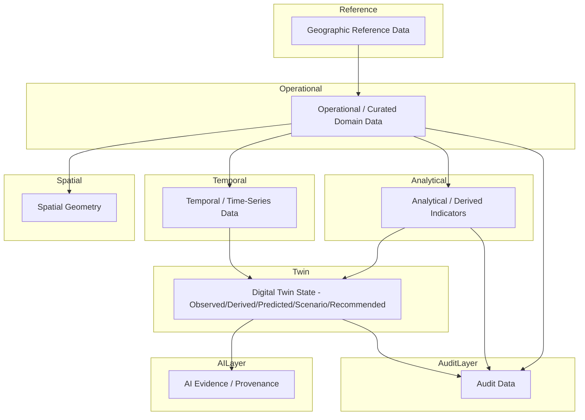

# Database Design

## 1. Purpose

This document defines the complete **logical** database architecture for DistrictMind: the categories of data the database must hold, how they relate, and the principles governing their design. It is the anchor document for `05_Database_Design/`. It contains no SQL, no migrations, no ORM models, and no physical schema — those are explicitly out of scope for this milestone (ED-M2 Part 2B-1) and remain future implementation work.

This document was authored after the current author's full prior authorship of ED-M1 (`00_Engineering_Overview/`, `01_Requirements/`), ED-M2 Part 1 (`02_System_Architecture/`, `03_Project_Structure/`), and ED-M2 Part 2A (`04_Data_Engineering/`) within this same engineering documentation effort, and after reading in full the original **DistrictMind Abstract** (`DistricMind_Abstract.pdf`) and **DistrictMind Architecture & Development Blueprint** (`DistrictMind_Architecture_Blueprint.pdf`). Terminology, entity names, and worked examples below are drawn from those sources wherever available, and are otherwise marked **Proposed (engineering inference)**.

## 2. Scope

In scope: logical entities, logical relationships, normalization strategy, spatial and temporal modeling, the digital twin state model at the database layer, the AI data-access boundary, indexing strategy, and performance strategy — all at the conceptual/logical level. Out of scope: physical schema (table DDL), SQL, migrations, ORM models, API specifications, and any implementation code, per the milestone's explicit restrictions.

## 3. Database Responsibilities

The database is responsible for:
- Persisting Curated, Analytical, and AI/ML-ready data as defined in [data-architecture.md](../04_Data_Engineering/data-architecture.md) Section 7.
- Enforcing referential and spatial integrity for the geographic hierarchy and every domain attached to it.
- Preserving the five-way Digital Twin State distinction (Section 11; [data-architecture.md](../04_Data_Engineering/data-architecture.md) Section 20) so that Observed, Derived, Predicted, Scenario, and Recommended data are never structurally confusable.
- Supporting the controlled, typed data-access pattern required by the AI/ML layer ([ai-architecture.md](../02_System_Architecture/ai-architecture.md), [data-architecture.md](../04_Data_Engineering/data-architecture.md) Section 21) — the database itself never grants an AI component unrestricted query access (Section 12; [ai-data-access-model.md](ai-data-access-model.md)).
- Providing the query performance (indexed spatial, temporal, and analytical access) that the eventual UI's responsiveness depends on ([database-performance.md](database-performance.md)).

## 4. Relationship to Data Architecture

This document elaborates, at the logical database level, the layered architecture already established in [data-architecture.md](../04_Data_Engineering/data-architecture.md) Section 7 (Source → Raw → Validation → Curated → Analytical → AI/ML-ready → Serving). The database itself is the physical/logical home of the **Curated, Analytical, AI/ML-ready, and audit** layers — Raw and Validation-stage data may or may not live in the same database instance (an open decision, Section 22) but conceptually pass through the same integrity rules before reaching the database layers this document designs.

## 5. Database Architectural Principles

Inherits all principles from [engineering-principles.md](../00_Engineering_Overview/engineering-principles.md), most directly: Data Integrity, Grounded AI, Explainable AI, Reproducibility, Scalability, and the repeated "do not overengineer" guidance. Two principles specific to this document's discipline:
- **Logical entities are not automatically physical tables** (Section 6, AD-DB-002) — a logical entity may be realized as a table, a view, a computed relationship, or an embedded attribute set, depending on its actual access pattern.
- **State categories are structurally separated**, not merely labeled (Section 11) — this is what makes the Digital Twin State Model enforceable rather than aspirational.

## 6. Logical Database Layers

## 7. Operational Data

The Curated-layer domain data itself: District, Mandal, Village, Health Facility, Road, Population Observation, Weather Observation, Agricultural Record, Disaster Event, Infrastructure Asset — the primary, day-to-day queried entities. Full inventory in [logical-data-model.md](logical-data-model.md) and [entity-catalog.md](entity-catalog.md).

## 8. Spatial Data

Geometry-bearing attributes and entities (boundaries, facility points, road lines) attached to the geographic hierarchy. Full treatment in [spatial-database-design.md](spatial-database-design.md).

## 9. Temporal Data

Time-stamped observations, historical snapshots, and forecast horizons. Full treatment in [temporal-database-design.md](temporal-database-design.md).

## 10. Analytical Data

Derived indicators, KPIs, and aggregations computed from Operational + Spatial + Temporal data. Full treatment in [analytical-data-model.md](analytical-data-model.md).

## 11. Digital Twin State

The database must structurally distinguish five state categories per [data-architecture.md](../04_Data_Engineering/data-architecture.md) Section 20: **Observed, Derived, Predicted, Scenario, Recommended**. This document's [digital-twin-state-model.md](digital-twin-state-model.md) defines exactly how that distinction is realized at the logical database level (separate logical namespaces/entity families per state, never a shared mutable table across categories).

## 12. AI Evidence / Provenance

Every fact returned to an AI agent carries evidence metadata (source, freshness, confidence) sufficient to support citation, per [data-architecture.md](../04_Data_Engineering/data-architecture.md) Section 21. The database's role is to make this metadata a first-class, queryable part of every record, not an afterthought — full treatment in [ai-data-access-model.md](ai-data-access-model.md).

## 13. Audit Data

Append-only records of administrative actions and AI-recommendation review events (FR-036, FR-037), structurally isolated from mutable operational data, per [security-architecture.md](../02_System_Architecture/security-architecture.md) Section 11 and [database-architecture.md](../02_System_Architecture/database-architecture.md) Section 9 — unchanged by this document, elaborated with concrete entities in [logical-data-model.md](logical-data-model.md) Section 15.

## 14. Reference / Master Data

Stable, low-change lookup data: the Geographic hierarchy itself (State, District, Mandal, Village — Section 3 of [logical-data-model.md](logical-data-model.md)), facility-type enumerations, indicator definitions. Reference data changes rarely and is versioned/audited when it does ([data-governance.md](../04_Data_Engineering/data-governance.md) Section 7), not silently overwritten.

## 15. Derived Data

Deterministically computed from Operational + Reference data (e.g., coverage-gap indicators). Never itself treated as a new source — see [data-transformation.md](../04_Data_Engineering/data-transformation.md) Section 4 and Section 11 of this document.

## 16. Prediction Data

Model-generated forecasts, always carrying model/version metadata and a confidence indicator (NFR-032). Full treatment in [logical-data-model.md](logical-data-model.md) Section 11 and [digital-twin-state-model.md](digital-twin-state-model.md).

## 17. Scenario Data

Sandboxed what-if computation results, referencing a baseline snapshot and never written back into Operational data (AD-DE-004, [data-architecture.md](../04_Data_Engineering/data-architecture.md)). Full treatment in [logical-data-model.md](logical-data-model.md) Section 12.

## 18. Recommendation Data

Ranked, evidence-linked suggestions requiring human review before acceptance (FR-032). Full treatment in [logical-data-model.md](logical-data-model.md) Section 13.

## 19. Data Ownership

Conceptual ownership follows [data-governance.md](../04_Data_Engineering/data-governance.md) Section 2 (Data Owner/Steward roles) — this document does not assign new ownership, only notes that every logical entity in [entity-catalog.md](entity-catalog.md) traces to a domain with an existing (if currently unassigned) conceptual owner.

## 20. Data Lifecycle

Mirrors [data-architecture.md](../04_Data_Engineering/data-architecture.md) Section 6 (Source → Ingestion → Raw → Validation → Transformation → Curated → Analytics/AI/ML → Serving), with the database as the persistent home of the Curated stage onward. A record's lifecycle within the database itself: created (upserted from ingestion) → versioned on update ([temporal-database-design.md](temporal-database-design.md)) → optionally superseded → retained per a retention policy that remains an open decision ([data-architecture.md](../04_Data_Engineering/data-architecture.md) Section 30, unchanged here).

## 21. Security Boundaries

Data-specific security is owned by [security-architecture.md](../02_System_Architecture/security-architecture.md) and [data-governance.md](../04_Data_Engineering/data-governance.md) Section 4 — not duplicated here. This document's only security-relevant addition: the AI data-access boundary (Section 12) is enforced partly at the database layer, via least-privilege database roles distinct from the general application role, consistent with [security-architecture.md](../02_System_Architecture/security-architecture.md) Section 9.

## 22. Backup / Recovery Considerations

Unchanged from [database-architecture.md](../02_System_Architecture/database-architecture.md) Section 15 and [data-architecture.md](../04_Data_Engineering/data-architecture.md) Section 31: backup frequency and RTO/RPO remain undefined (NFR-037, NFR-038). Because this document keeps Operational, Spatial, Temporal, Analytical, Twin-state, Evidence, and Audit data within the same logical database platform (Section 6), backup/recovery strategy can remain unified — restated, not re-decided, here.

## 23. Scalability

- The logical model avoids embedding assumptions that hardcode a single district or a fixed small data volume (Scalability principle, [engineering-principles.md](../00_Engineering_Overview/engineering-principles.md)).
- Historical/temporal data volume is expected to be the fastest-growing category (Section 9); [database-performance.md](database-performance.md) Section 6 addresses this without prematurely introducing partitioning or distributed storage.
- No horizontal database scaling (sharding, read replicas) is committed in this document — deferred until real load data exists, consistent with [system-architecture.md](../02_System_Architecture/system-architecture.md) Section 14.

## 24. Performance

Full treatment in [database-performance.md](database-performance.md) and [database-indexing-strategy.md](database-indexing-strategy.md); this section only restates that query performance is treated as a logical-design concern (which entities need which access patterns), not deferred entirely to physical tuning.

## 25. Technology Decision Status

| Technology | Status (as of this document) | Source |
|---|---|---|
| PostgreSQL (relational engine) | **Proposed** | Carried forward unchanged from [technology-stack.md](../00_Engineering_Overview/technology-stack.md) §4.3 (Candidate) and [database-architecture.md](../02_System_Architecture/database-architecture.md) (pattern-level Proposed via AD-DB-001), further justified by the Blueprint (§10.1–10.2) per [data-architecture.md](../04_Data_Engineering/data-architecture.md) AD-DE-001 |
| PostGIS (spatial extension) | **Proposed** | Same lineage as above |
| pgvector / standalone vector store | **Candidate** | [technology-stack.md](../00_Engineering_Overview/technology-stack.md) §4.6 — unresolved, not addressed further by this document |
| Redis (caching) | **Proposed** | [data-architecture.md](../04_Data_Engineering/data-architecture.md) Section 25, sourced from Blueprint §5.3 |

**This document does not upgrade any of these to Confirmed.** No formal architecture decision authorizing Confirmed status has occurred in any milestone to date. This table exists to prevent drift — every subsequent document in this folder must cite these same statuses, not invent new ones.

## 26. Milestone Traceability

See Section 19 of the milestone brief's requirements, elaborated in full in each document's own traceability section and consolidated in [ED-M2-P2B1-VALIDATION.md](ED-M2-P2B1-VALIDATION.md) Section 8.

## 27. Open Decisions

- Whether Raw/Validation-stage data lives in the same database instance as Curated/Analytical data, or a separate staging store (Section 4) — not resolved here, deferred to physical design.
- Final relational engine and spatial extension confirmation (Section 25).
- Retention policy (Section 20).
- Sharding/replication strategy, if/when scale requires it (Section 23).
