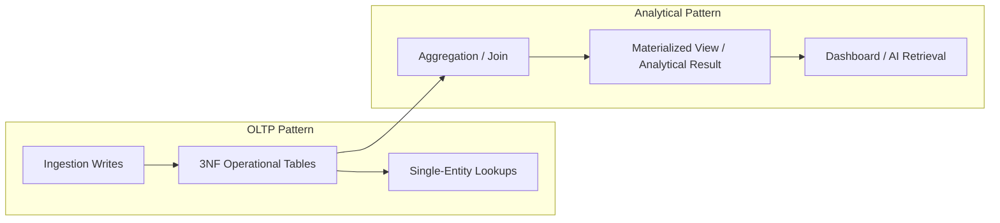

# Database Normalization

## 1. Purpose

This document defines DistrictMind's normalization strategy: where strict normalization is applied, where it is deliberately relaxed for analytical workloads, and why. No SQL or DDL is defined here.

## 2. First Normal Form (1NF)

**Rule:** every attribute holds a single, atomic value; no repeating groups within a row.

**Application:** applied throughout the Operational layer — e.g., a Health Facility record does not embed a repeating list of contact numbers as a single delimited string; a Population Observation does not embed multiple years' counts in one row (each year is its own row, per [temporal-database-design.md](temporal-database-design.md)).

**Deliberate exception:** Scenario Parameters ([entity-catalog.md](entity-catalog.md) E-SIM-001) are stored as a structured (e.g., JSON-like) attribute set rather than atomic columns, because parameter shape varies by scenario type (a "rainfall change" scenario has different parameters than a "road closure" scenario — Blueprint §13.2). Forcing this into strict 1NF would require either a sparse, mostly-null wide table or a fully normalized key-value parameter table (Section 5) — the structured-attribute approach is chosen as the pragmatic middle ground for a project of DistrictMind's scale, and is recorded as **AD-DB-003** (Section 8).

## 3. Second Normal Form (2NF)

**Rule:** every non-key attribute depends on the *whole* primary key, not part of it (relevant for entities with compound keys).

**Application:** entities with compound keys (Population Observation: village + year; Weather Observation: station + date + type) are checked against this rule — e.g., a Weather Station's *name* is not stored redundantly on every Weather Observation row; it lives once on the Weather Station entity and is referenced, not duplicated (avoiding a partial-key dependency).

## 4. Third Normal Form (3NF)

**Rule:** no non-key attribute depends on another non-key attribute (no transitive dependency).

**Application:** e.g., a Health Facility's district is not stored directly on the Health Facility row (it would be transitively dependent via the facility's containing village/mandal) — it is instead computed via the spatial-join relationship defined in [relationship-model.md](relationship-model.md) Section 4, avoiding both a transitive dependency and, more importantly for DistrictMind specifically, a stale stored value if boundaries are corrected ([spatial-data.md](../04_Data_Engineering/spatial-data.md) Section 12).

**3NF is the default target** for all Operational-layer, table-realized entities in [entity-catalog.md](entity-catalog.md) — this is a deliberate, stated baseline (Section 8, AD-DB-004), not left implicit.

## 5. Where Normalization Is Beneficial

| Scenario | Why 3NF Helps |
|---|---|
| Geographic hierarchy (State/District/Mandal/Village) | Prevents inconsistent duplication of a district's name across every village row referencing it |
| Facility Type, Indicator Definition (reference/lookup entities) | A single definition, referenced everywhere, so a correction (e.g., renaming an indicator) does not require updating every Analytical Result row |
| Population/Weather/Agriculture time-series entities | Each observation is its own atomic fact, independently versionable, independently queryable by date range ([temporal-database-design.md](temporal-database-design.md)) |
| Recommendation Evidence (association entity) | A clean many-to-many between Recommendations and heterogeneous evidence types, without duplicating evidence data into the Recommendation row itself |

## 6. Where Analytical Workloads Justify Denormalization

DistrictMind has two distinct access patterns that pull in opposite directions:
- **OLTP-like access**: ingestion, validation, individual-entity lookups (e.g., "show me Village X's details") — strict normalization serves this well: fewer anomalies, smaller write footprint, easier correctness reasoning.
- **Analytical access**: dashboard aggregates, AI-grounding retrieval, map-wide indicator overlays — these often need to read a large, join-heavy result set repeatedly and would incur real query cost if computed fresh from fully normalized tables every time.

| Technique | Where Applied | Rationale |
|---|---|---|
| Denormalized summary attribute | Village's current-population cache ([entity-catalog.md](entity-catalog.md) E-GEO-004) | Avoids a join + latest-row lookup against Population Observation on every dashboard load of basic village info; explicitly documented as a cache of Population Observation, not an independent source (per [data-transformation.md](../04_Data_Engineering/data-transformation.md) Section 4's Derived Data category) |
| Materialized view (candidate) | Coverage-gap indicators, mandal/district-level rollups of village data | Recomputing a statewide coverage-gap spatial join on every dashboard request is unnecessary if the underlying facility/village data changes infrequently — a materialized view refreshed on a schedule (or on underlying-data change) avoids repeated computation, per [data-architecture.md](../04_Data_Engineering/data-architecture.md) Section 25 |
| Precomputed indicators | Analytical Result entity itself ([entity-catalog.md](entity-catalog.md) E-ANA-002) | The Analytical Result pattern *is* a form of controlled denormalization — indicators are computed once and stored, not recomputed from raw Operational data on every read |

**Denormalization is applied only where a specific, named access pattern justifies it** (Section 6 table above) — it is never applied by default or "for performance" without a stated reason, consistent with the "do not overengineer" guidance repeated throughout this documentation set.

## 7. OLTP vs. Analytical Access Patterns — Summary

The Operational (3NF) layer remains the single source of truth in both patterns; the Analytical layer is always a derived, recomputable projection of it — never a divergent parallel copy that could drift without a defined refresh/invalidation rule ([data-architecture.md](../04_Data_Engineering/data-architecture.md) Section 25's caching-invalidation principle, restated here for the database layer specifically).

## 8. Architectural Decisions

**AD-DB-003 — Structured Attribute Sets for Variable-Shape Data (Scenario Parameters)**
- **Decision:** Where an entity's attribute shape genuinely varies by subtype (Scenario Parameters varying by scenario type) and the subtype set is expected to grow (new scenario types across M5+), use a structured/semi-structured attribute set rather than a fully key-value-normalized table or a sparse wide table.
- **Context:** A fully 1NF/3NF-normalized "parameter" table (parameter name, parameter value, scenario reference) would technically satisfy normal forms but adds join overhead and loses type safety for a case where the parameter set per scenario type is small and known at scenario-definition time.
- **Alternatives considered:** A generic key-value parameter table (rejected — adds complexity disproportionate to DistrictMind's scale); a wide table with one column per possible parameter across all scenario types (rejected — sparse, hard to extend without schema changes for every new scenario type).
- **Evaluation criteria:** Query simplicity, extensibility as new scenario types are added (M5+), avoidance of premature complexity.
- **Trade-offs:** Structured attribute sets are less queryable via plain relational predicates than fully normalized columns; acceptable because Scenario Parameters are read as a whole by the Simulation Engine, not filtered/queried column-by-column at the database layer.
- **Consequences:** [entity-catalog.md](entity-catalog.md) E-SIM-001 documents this attribute as structured, not decomposed.
- **Status:** Proposed.

**AD-DB-004 — 3NF as the Default Target for Operational Entities, With Named Exceptions Only**
- **Decision:** Every table-realized Operational-layer entity in [entity-catalog.md](entity-catalog.md) targets 3NF by default; any denormalization must be individually justified and recorded (Section 6).
- **Context:** Prevents "convenience" denormalization from accumulating undocumented across a multi-milestone project, which would eventually undermine Data Integrity.
- **Alternatives considered:** A blanket "denormalize for read performance" default — rejected as premature optimization contradicting the "do not overengineer" guidance, and risking data-integrity drift given DistrictMind's emphasis on Grounded AI (ungoverned denormalization risks an AI response citing a stale, divergent copy of a fact).
- **Evaluation criteria:** Data integrity, maintainability, alignment with Data Integrity and Grounded AI principles.
- **Trade-offs:** Some queries will require joins that a denormalized schema could avoid; accepted in exchange for a single, trustworthy source of truth per fact.
- **Consequences:** Every denormalization in this document (Section 6) is explicitly named and justified, not left implicit.
- **Status:** Proposed.

## 9. Milestone Traceability

| Normalization Concern | First Relevant |
|---|---|
| 3NF Operational layer (Geography) | M1 |
| 3NF across all domains + first denormalized caches (village population summary) | M2 — Future |
| Materialized/precomputed Analytical Results | M2 — Future (indicators), M4 — Future (predictions feeding dashboards) |
| Structured Scenario Parameters | M5 — Future |

## 10. Open Decisions

- Exact refresh cadence/trigger for any materialized views (Section 6) — deferred to physical design and real usage data.
- Whether Recommendation Evidence's polymorphic reference (Section 5 of [relationship-model.md](relationship-model.md)) is implemented as separate typed association tables (more normalized) or a single generic association table (less normalized, more flexible) — **To Be Evaluated**.
