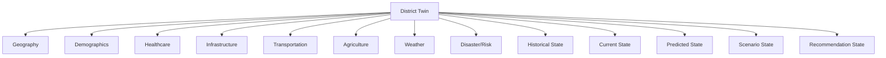

# Digital Twin State Model

## 1. Purpose

This document is mandatory per the milestone brief. It defines how DistrictMind's database represents the district digital twin as an evolving logical state, and — most importantly — how the database structurally prevents Source-of-Truth, Derived Knowledge, Prediction, Simulation, Recommendation, and AI Response data from ever being confused with one another. This elaborates [data-architecture.md](../04_Data_Engineering/data-architecture.md) Section 20 and [temporal-data.md](../04_Data_Engineering/temporal-data.md) Section 3 with concrete database-design commitments.

## 2. The District Twin, Decomposed



Each domain branch (Geography through Disaster/Risk) is realized by the entities cataloged in [entity-catalog.md](entity-catalog.md), organized by the domains in [data-domain-model.md](../04_Data_Engineering/data-domain-model.md). The state branches (Historical, Current, Predicted, Scenario, Recommendation) are **cross-cutting** — every domain's data can exist in any of these state categories, which is exactly why the state categories must be a structural property of the schema, not a per-domain convention that could be applied inconsistently.

## 3. The Six Categories, Restated for the Database Layer

| Category | Database-Level Definition | Table/Entity Pattern |
|---|---|---|
| **Source of Truth** | Data ingested from an external provider, validated, and curated — the Observed State | Append-only or versioned tables per [temporal-database-design.md](temporal-database-design.md) Section 3 (Population Observation, Weather Observation, Health Facility, etc.) |
| **Derived Knowledge** | Data computed deterministically from Source of Truth data | Analytical Result ([entity-catalog.md](entity-catalog.md) E-ANA-002) and its indicator-specific rows |
| **Prediction** | A model's estimate of a future or unobserved value | Prediction/Forecast (E-PRD-002), always referencing Model Execution Metadata |
| **Simulation** | A sandboxed, hypothetical computation | Scenario Output (E-SIM-002), always referencing a Scenario and a baseline snapshot |
| **Recommendation** | A proposed action pending human review | Recommendation (E-REC-001), with an explicit status field and Recommendation Evidence links |
| **AI Response** | A composed natural-language answer citing the above | AI Response (E-AI-004) — never itself a row in any of the other five categories' tables |

## 4. Why These Must Not Be Mixed

If a Prediction were stored in the same table as an Observed value (distinguished only by, say, a loosely-enforced "type" flag that application code might forget to check), a single missing filter in one query path could present a forecast as a measured fact — directly violating the Grounded AI principle and, more concretely, misleading a district official making a real decision. The Blueprint itself treats this as a first-order design constraint, not a nicety: the Simulation Engine's entire sandboxing design (§9.4, §13.1) exists specifically so "no what-if question can ever corrupt the real district model." This document's structural commitment (Section 5) is the database-layer enforcement of that same intent, extended to all five non-Observed categories, not just Simulation.

## 5. Structural Enforcement Mechanisms

Two independent mechanisms enforce the separation, so a failure in one does not silently collapse the distinction:

1. **Schema/table separation** (this document, Section 3): each category has its own entity family with its own table(s) — an Observed Population count and a Predicted Population count are never rows in the same table distinguished only by a mutable flag; they are Population Observation and Prediction, structurally different entities with different attribute sets ([entity-catalog.md](entity-catalog.md)).
2. **Temporal-key separation** ([temporal-database-design.md](temporal-database-design.md) Section 6): each category's temporal key pattern (append-only Observed, immutable Prediction/Scenario Output/Recommendation-status-event) is itself category-specific, so even a query that joins across categories must explicitly bridge different key shapes — there is no accidental "just union these tables" path.

Both mechanisms trace to the same root decision, recorded formally as **AD-DB-005** (Section 10).

## 6. State Progression Example

```
Observed district state at T1 (Population Observation, Health Facility rows as of T1)
  ↓
Derived district state (Analytical Result: coverage gap, computed from T1 Observed data)
  ↓
Prediction at T2 (Prediction: population forecast for T2, referencing T1 Observed data as its Dataset Version)
  ↓
Scenario state (Scenario Output: "what if a new hospital is built," referencing the T1 baseline + the T2 Prediction as inputs)
  ↓
Recommendation (Recommendation: "build the new hospital here," citing the Derived coverage gap, the T2 Prediction, and the Scenario Output as its Recommendation Evidence)
```

Every arrow in this chain is a **stored reference** ([relationship-model.md](relationship-model.md) Section 7), not an implicit assumption — the Recommendation's evidence links are real foreign keys into the Derived, Prediction, and Scenario tables, which is what makes the chain auditable end to end ([data-lineage.md](../04_Data_Engineering/data-lineage.md)).

## 7. Provenance Preservation Requirement

Every Derived, Prediction, Scenario, and Recommendation record must carry enough reference metadata to answer "what Observed data (and, where applicable, what model and what prior Derived/Predicted/Scenario records) produced this?" without ambiguity. This is not a new requirement invented here — it restates [data-lineage.md](../04_Data_Engineering/data-lineage.md) Section 3's per-stage metadata table as a hard database-design constraint: **no non-Observed record may be created without a resolvable reference to its inputs.**

## 8. AI Response — A Special Case

AI Response (E-AI-004) is explicitly **not** one of the five twin-state categories that describe the district itself — it is a *narrative artifact* that cites them. An AI Response's "citations" are stored references into Tool Execution results (which themselves reference Observed/Derived/Predicted/Scenario/Recommendation records), per [relationship-model.md](relationship-model.md) Section 8. An AI Response is never re-ingested as if it were Observed data about the district (per [data-governance.md](../04_Data_Engineering/data-governance.md) Section 6's governance rule) — this document's contribution is confirming that no schema-level path exists for an AI Response row to be mistaken for, or promoted into, any of the five state-category tables.

## 9. Versioning Across State Categories

| Category | Versioning Behavior |
|---|---|
| Source of Truth | Append-only (time series) or explicitly versioned (reference data) — never destructively overwritten |
| Derived Knowledge | Append-only — each recomputation is a new Analytical Result row |
| Prediction | Immutable once created — a new inference run creates a new row |
| Simulation | Immutable once created |
| Recommendation | Mutable only via its status field, and only through a recorded, audited human action (FR-032) — the recommendation's content/justification itself is not edited after generation; a materially different recommendation is a new Recommendation record |

## 10. Architectural Decision

**AD-DB-005 — Structural (Schema-Level) Separation of the Six Digital Twin State Categories**
- **Decision:** Source of Truth, Derived Knowledge, Prediction, Simulation, Recommendation, and AI Response are realized as structurally distinct entity families (separate tables/table groups), never a shared table distinguished only by a mutable type/status flag.
- **Context:** DistrictMind's core trust guarantee — that predictions, simulations, and recommendations are clearly distinguishable from measured fact — depends on this separation holding under all query paths, not just well-behaved ones.
- **Alternatives considered:** A single "district_fact" table with a `state_type` discriminator column covering all six categories — rejected because a missing `WHERE state_type = 'observed'` filter in any future query would silently blend categories, and because the six categories genuinely have different attribute shapes (a Prediction needs model/confidence metadata an Observed record does not).
- **Evaluation criteria:** Safety against accidental category-blending, alignment with Grounded AI/Explainable AI/Fail-Safe Behavior principles, consistency with the Blueprint's own sandboxing design intent (§9.4).
- **Trade-offs:** Cross-category queries (e.g., "show me the Observed value alongside its Prediction") require an explicit join across distinct tables rather than a single-table filter — a small query-ergonomics cost accepted in exchange for structural safety.
- **Consequences:** Every entity in [entity-catalog.md](entity-catalog.md) is pre-assigned to exactly one of the six categories (Section 3); no future entity may be added to this model without the same assignment.
- **Status:** Proposed.

## 11. Milestone Traceability

| State Category | First Populated |
|---|---|
| Source of Truth (Geography) | M1 |
| Source of Truth (all domains), Derived Knowledge | M2 — Future |
| AI Response | M3 — Future |
| Prediction | M4 — Future |
| Simulation | M5 — Future |
| Recommendation | M6 — Future |

## 12. Open Decisions

- Whether Recommendation Evidence's polymorphic references (Section 6) are physically implemented as typed columns or a generic type+ID pattern — noted already in [relationship-model.md](relationship-model.md) Section 13, restated as still open here since it directly affects how easily this document's provenance requirement (Section 7) can be queried.
- Whether a unifying read-only "twin state summary" view is ever introduced for dashboard convenience — if so, it must be a *view* (computed at read time from the six separate underlying categories), never a materialized table that re-introduces the blending risk this document's AD-DB-005 exists to prevent.
