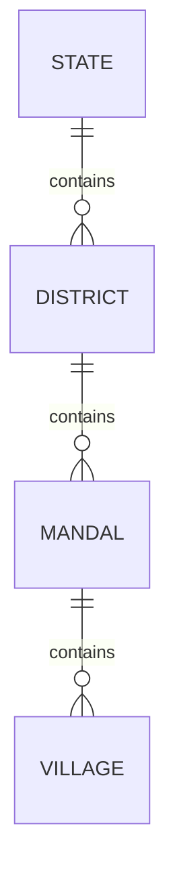
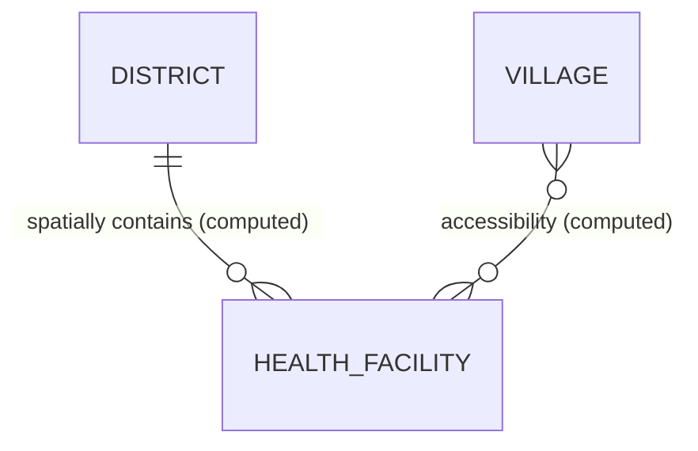
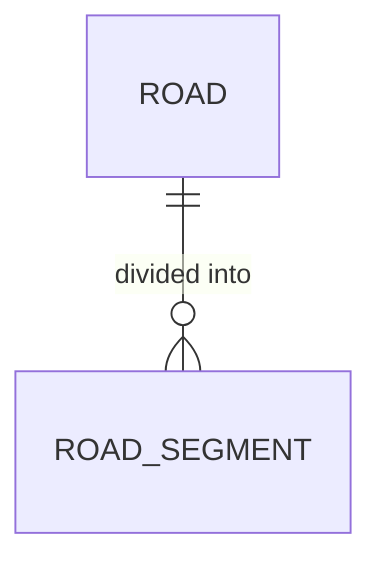
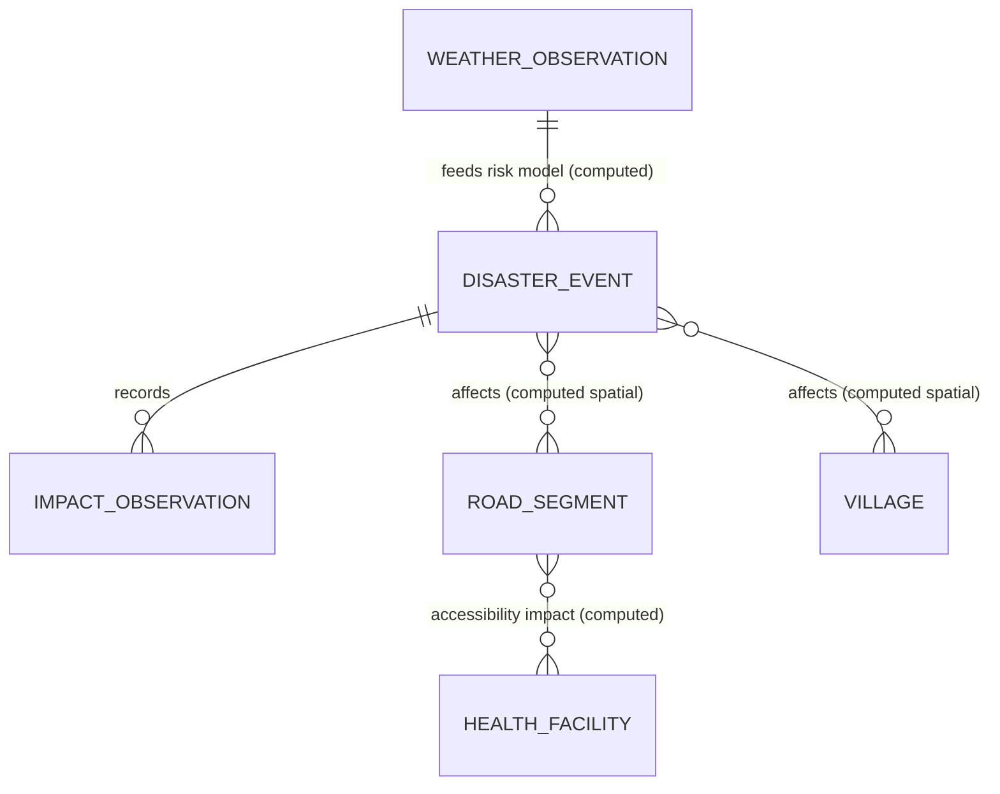
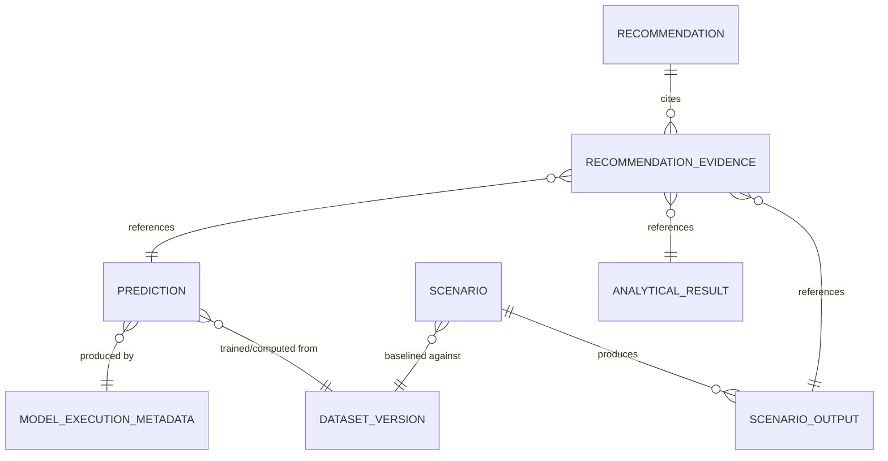
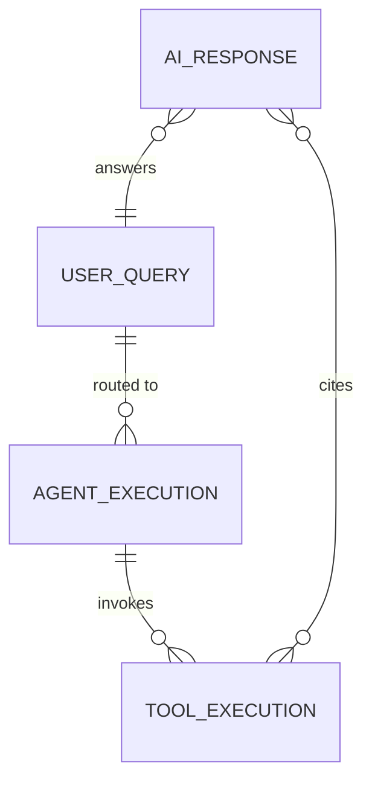
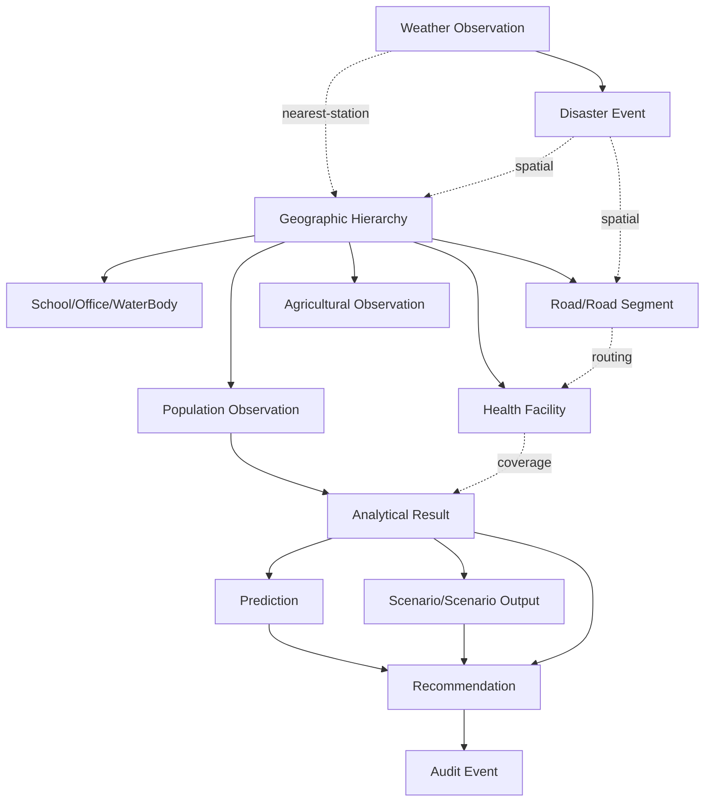

# Relationship Model

## 1. Purpose

This document defines the relationships between the entities cataloged in [entity-catalog.md](entity-catalog.md), including cardinality and — critically — the cross-domain relationships that make DistrictMind's reasoning possible ([data-domain-model.md](../04_Data_Engineering/data-domain-model.md) Section 13). Relationships are distinguished as **stored** (a foreign key or equivalent) versus **computed** (a spatial or temporal join evaluated at query time), consistent with [data-domain-model.md](../04_Data_Engineering/data-domain-model.md) Section 3's "coverage is a computed, not fixed, relationship" principle.

## 2. Geographic Hierarchy Relationships

| From | To | Cardinality | Nature |
|---|---|---|---|
| State | District | 1:N | Stored (FK) |
| District | Mandal | 1:N | Stored (FK) |
| Mandal | Village | 1:N | Stored (FK) |

This is the only strictly hierarchical, always-stored relationship chain in the model — every other domain attaches to this hierarchy either by a stored reference (Section 3) or a computed spatial join (Section 4).

## 3. Direct (Stored) Domain-to-Geography Relationships

| From | To | Cardinality | Nature |
|---|---|---|---|
| Population Observation | Village | N:1 | Stored (FK) — a population count directly belongs to a village |
| Agricultural Area/Observation | Village | N:1 | Stored (FK) |
| Weather Observation | Weather Station | N:1 | Stored (FK) |

These are stored because the source data itself directly assigns the record to a village or station — there is no ambiguity to compute.

## 4. Computed (Spatial-Join) Domain-to-Geography Relationships

| From | To | Cardinality | Nature |
|---|---|---|---|
| District | Health Facility | 1:N (computed) | Spatial containment (`ST_Contains`-equivalent) — a facility's containing district is computed, not stored, per Blueprint §10.4 |
| Village | Health Facility (accessibility) | N:M (computed) | Spatial proximity/routing — "accessibility" is a computed distance/travel-time relationship, not a fixed assignment (Section 8, [spatial-database-design.md](spatial-database-design.md)) |
| District | Road | 1:N (computed) | Spatial containment/intersection |
| Village | School / Government Office / Water Body | 1:N (computed) | Same spatial-join pattern as Health Facility |
| Weather Station | Village (nearest-station lookup) | N:1 (computed, dynamic) | Nearest-neighbor spatial query, not a fixed FK — "one station serves many villages" (Blueprint §10.4) |

**Why this distinction matters:** a stored FK from Health Facility to Village would go stale the moment a village boundary is corrected ([spatial-data.md](../04_Data_Engineering/spatial-data.md) Section 12); a computed relationship stays correct automatically, at the cost of requiring an indexed spatial query rather than a simple join ([database-indexing-strategy.md](database-indexing-strategy.md)).

## 5. Transportation Relationships

| From | To | Cardinality | Nature |
|---|---|---|---|
| Road | Road Segment | 1:N | Stored (FK) |
| Road Segment | Road Segment (graph adjacency) | N:M | Computed — the routable graph (Transport Connection, [logical-data-model.md](logical-data-model.md) Section 7) is derived from segment endpoint proximity, not stored as an explicit adjacency table by default |

## 6. Cross-Domain Relationships — The Core of DistrictMind's Reasoning

This section directly addresses the milestone brief's mandatory cross-domain examples.

### 6.1 Weather → Disaster → Transportation → Healthcare (Full Chain)

| From | To | Cardinality | Nature |
|---|---|---|---|
| Weather Observation | Disaster Event | N:1 (computed/model-derived) | A rainfall reading feeds a flood-risk model whose output may *generate* a Disaster Event (Predicted or Observed, per [digital-twin-state-model.md](digital-twin-state-model.md)) |
| Disaster Event | Impact Observation | 1:N | Stored (FK) |
| Disaster Event | affected Road Segment | N:M (computed) | Spatial intersection of the event's affected geometry with road geometry |
| Disaster Event | affected Village | N:M (computed) | Spatial intersection |
| affected Road Segment | Health Facility (accessibility impact) | N:M (computed, dynamic) | Recomputed routing under the "segment removed/degraded" condition — this is a **Scenario State** computation when hypothetical, or a **Derived/Observed State** computation when the event is real ([digital-twin-state-model.md](digital-twin-state-model.md)) |

This is the direct data-relationship realization of the Blueprint's flagship example (§1.1): *"If rainfall increases by 30%, which villages lose road access to their nearest hospital?"*

### 6.2 Population → Healthcare → Accessibility

| From | To | Cardinality | Nature |
|---|---|---|---|
| Population Observation | Village | N:1 | Stored |
| Village | Health Facility | N:M (computed) | Coverage/accessibility (Section 4) |
| Population Observation + coverage result | Healthcare Indicator (Analytical Result) | Computed aggregation | "Population uncovered within radius" — the direct input to Recommendation scoring (Blueprint §14.2) |

### 6.3 Population → Infrastructure → Planning

| From | To | Cardinality | Nature |
|---|---|---|---|
| Population Observation | Village | N:1 | Stored |
| Village | School / Government Office | N:M (computed) | Same coverage pattern as 6.2 |
| Coverage result + Prediction (population growth) | Recommendation | N:1 (via Recommendation Evidence) | The full facility-siting chain (Blueprint §8.2, §14.1) |

## 7. Analytical, Predictive, and Simulation Relationships

| From | To | Cardinality | Nature |
|---|---|---|---|
| Analytical Result | Indicator Definition | N:1 | Stored (FK) |
| Analytical Result | target entity (District/Mandal/Village — polymorphic) | N:1 | Stored (FK, polymorphic reference) |
| Prediction | Model Execution Metadata | N:1 | Stored (FK) |
| Prediction | Dataset Version (input snapshot) | N:1 | Stored (FK) — required for reproducibility |
| Scenario | baseline snapshot (a Dataset Version or explicit snapshot reference) | N:1 | Stored (FK) |
| Scenario Output | Scenario | N:1 | Stored (FK) |
| Recommendation | Recommendation Evidence | 1:N | Stored (FK) |
| Recommendation Evidence | Analytical Result / Prediction / Scenario Output (polymorphic) | N:1 each | Stored (FK, polymorphic — a single Recommendation can cite multiple evidence types) |

## 8. AI Relationships

| From | To | Cardinality | Nature |
|---|---|---|---|
| User Query | Agent Execution | 1:N | Stored (FK) — a Coordinator query may fan out to multiple agents (Blueprint §7.3) |
| Agent Execution | Tool Execution | 1:N | Stored (FK) |
| Tool Execution | Analytical Result / Prediction / Scenario Output (whatever it retrieved) | N:1 (polymorphic) | Stored — a Tool Execution's result references the specific record(s) it read, forming the Evidence chain |
| AI Response | User Query | N:1 | Stored (FK) |
| AI Response | Evidence (cited records) | N:M | Stored (association) — every citation is a real, stored reference, not free text |

## 9. Audit Relationships

| From | To | Cardinality | Nature |
|---|---|---|---|
| Audit Event | target entity (any auditable entity — polymorphic) | N:1 | Stored (FK, polymorphic) |
| Audit Event | actor (a User) | N:1 | Stored (FK) |
| Dataset Version | every versioned Curated record | 1:N | Stored (FK) — every ingested record references the Dataset Version that produced it |

## 10. Population→Time and Prediction→Dataset Version (Explicit Examples from the Brief)

| Relationship | Cardinality | Explanation |
|---|---|---|
| Population Observation → Time | N:1 (each observation has exactly one effective period) | Modeled as an `effective_year` (or equivalent) attribute on Population Observation itself, not a separate "Time" entity — per [temporal-database-design.md](temporal-database-design.md) Section 3, time is a dimension/attribute pattern applied consistently across temporal entities, not a standalone joinable table (which would add join overhead with no benefit at DistrictMind's granularity) |
| Prediction → Dataset Version | N:1 | Every Prediction stores which Dataset Version (input snapshot) it was computed from, directly supporting Reproducibility |

## 11. Relationship Summary Diagram

## 12. Milestone Traceability

| Relationship Group | First Needed |
|---|---|
| Geographic hierarchy | M1 |
| Direct + computed domain-to-geography relationships | M2 — Future |
| Cross-domain (Weather→Disaster→Transportation→Healthcare) | M2 — Future (data), M4/M5 — Future (full computed reasoning) |
| Analytical/Predictive/Simulation relationships | M2 (Analytical), M4 (Prediction), M5 (Simulation) — Future |
| AI relationships | M3 — Future |
| Audit relationships | M1 (administrative), M6 — Future (recommendation review) |

## 13. Open Decisions

- Whether the Road Segment adjacency graph (Section 5) is ever materialized as a stored table for performance reasons, versus always computed at query/routing time — deferred to physical/routing-library design.
- Exact polymorphic-reference implementation strategy (a single typed foreign key per possible target vs. a generic type+ID pair) for Analytical Result's target entity, Recommendation Evidence, and Audit Event — a physical-design decision, **To Be Evaluated**, not resolved at the logical level.
