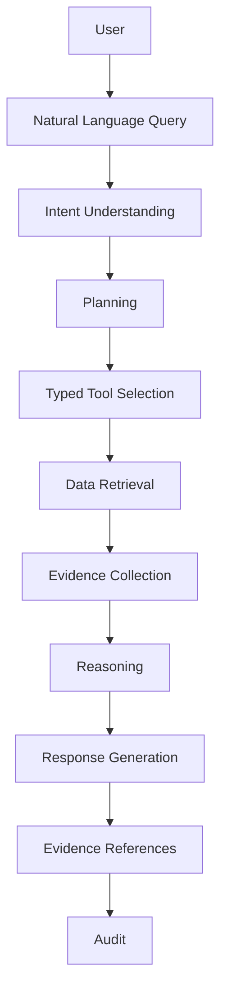
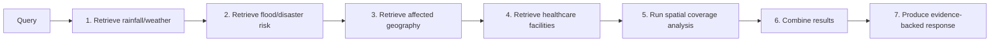

# AI Agent Integration

## 1. Purpose

This document defines how the AI Agent Layer integrates with DistrictMind's API and service layer, as a conceptual workflow only. No agent, orchestrator, or LangGraph implementation exists in this document.

## 2. The Conceptual Flow

This restates and elaborates [ai-architecture.md](../02_System_Architecture/ai-architecture.md) Section 3's pipeline with the API/service-layer detail this milestone adds: **Planning** and **Typed Tool Selection** are now explicit, distinct stages, reflecting that a real DistrictMind query often requires composing more than one tool (Section 4).

## 3. Stage Definitions

| Stage | What Happens |
|---|---|
| Natural Language Query | The user's question, submitted via [api-contracts.md](api-contracts.md) Operation 16 |
| Intent Understanding | The Coordinator classifies the query's domain(s) and shape (a direct data question, a facility-siting request, a what-if question) |
| Planning | The Coordinator decomposes the query into a sequence (or parallel set) of sub-tasks, per Blueprint §7's supervised multi-agent pattern |
| Typed Tool Selection | For each sub-task, the responsible agent selects the specific Typed AI Tool(s) needed ([ai-tool-contracts.md](ai-tool-contracts.md)) — never an open-ended query |
| Data Retrieval | The selected tools execute, each calling into the corresponding Domain Service ([service-layer-design.md](service-layer-design.md)) |
| Evidence Collection | Tool results, with their provenance/freshness/confidence annotations ([ai-data-access-model.md](../05_Database_Design/ai-data-access-model.md) Section 10), are assembled |
| Reasoning | The LLM/agent composes an answer strictly from the collected Evidence — never from unmediated model knowledge (Grounded AI) |
| Response Generation | The AI Response is composed, with each factual claim linked to its supporting Evidence |
| Evidence References | The AI Response's citations are stored, resolvable references (per [relationship-model.md](../05_Database_Design/relationship-model.md) Section 8), not free text |
| Audit | Every Agent Execution and Tool Execution is logged ([entity-catalog.md](../05_Database_Design/entity-catalog.md) E-AI-002/003) |

## 4. Worked Example — Multi-Tool Cross-Domain Query

**User:** *"Which villages are at higher flood risk and lack nearby healthcare access?"*

| Step | Tool Invoked | Domain Service Reached |
|---|---|---|
| 1 | `get_weather` | Weather Service |
| 2 | `get_disaster_risk` | Disaster Service |
| 3 | `spatial_query` (intersection/affected-area) | GIS Service, via Disaster Service |
| 4 | `get_healthcare` | Healthcare Service |
| 5 | `coverage_analysis` | GIS Service, via Healthcare Service |
| 6 | (Agent-internal composition, no new tool call) | — |
| 7 | (Response Generation stage) | AI Orchestration Service |

Every step is a bounded, typed tool call ([ai-tool-contracts.md](ai-tool-contracts.md)); the cross-domain reasoning emerges from the Coordinator's **planning and composition** of multiple bounded calls (Blueprint §7.3's fan-out/fan-in pattern), not from any single tool being granted broader access. This is the direct realization of AD-API-002 for a genuinely complex, multi-domain question.

## 5. Agent Roster (Conceptual, Restated)

Unchanged from [ai-architecture.md](../02_System_Architecture/ai-architecture.md) and the Blueprint §7.1 (Coordinator, Healthcare, Traffic, Agriculture, Disaster, Planning, Weather, GIS, Prediction agents) — this document does not redefine the agent roster, only its integration surface with the API/service layer established in this milestone.

## 6. Multi-Agent Composition at the Integration Layer

When the Coordinator fans out to multiple domain agents in parallel (e.g., Healthcare + Traffic, per Blueprint §7.3), each agent's tool calls are independently authorized, validated, and audited (Section 8, [authentication-authorization.md](authentication-authorization.md)) — parallel execution does not relax any per-call boundary. All calls belonging to the same originating user interaction share a single correlation ID ([api-design-principles.md](api-design-principles.md) Section 13), so the full fan-out/fan-in trace remains reconstructable.

## 7. Failure Handling Within the Workflow

| Failure Point | Handling |
|---|---|
| A single tool call fails/returns no data | The Coordinator proceeds with available evidence where the answer can still be meaningfully grounded, or declines if the missing piece is essential — never silently substituting a guess (Fail-Safe Behavior) |
| Intent understanding cannot classify the query | An explicit "unsupported question" response, per [ai-data-access-model.md](../05_Database_Design/ai-data-access-model.md) Section 13 |
| Reasoning stage cannot ground a claim in collected Evidence | The Grounding Validation step ([ai-architecture.md](../02_System_Architecture/ai-architecture.md) Section 3) rejects the claim before it reaches the user |

## 8. Milestone Traceability

| AI Integration Capability | Milestone |
|---|---|
| Single-tool, single-domain queries (e.g., `get_district`, `get_healthcare`) | M3 — Future |
| Multi-tool, cross-domain planning (Section 4 worked example, partial — weather/disaster/healthcare) | M3 — Future (data-only parts), M4 — Future (risk-scoring parts) |
| Prediction-tool integration (`request_prediction`) | M4 — Future |
| Simulation-tool integration (`create_scenario`/`run_scenario`) | M5 — Future |
| Recommendation-tool integration, full multi-agent orchestration | M6 — Future |

## 9. Open Decisions

- Exact planning/decomposition algorithm (rule-based intent classification vs. LLM-driven planning) — an implementation detail, not decided in this documentation-only milestone.
- Whether streaming partial results (e.g., "still retrieving weather data...") is exposed to the user during a multi-step plan — **Under Evaluation**, related to [api-contracts.md](api-contracts.md) Operation 16's sync/async note.
