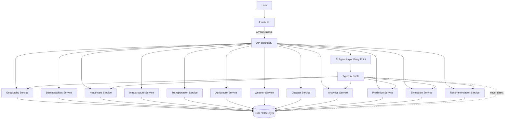

# API Architecture

## 1. Purpose

This document defines the complete logical API architecture for DistrictMind: how the frontend, service layer, GIS layer, analytics/prediction/simulation layer, and AI agent layer are exposed and bounded through an API. It elaborates [backend-architecture.md](../02_System_Architecture/backend-architecture.md) and [system-architecture.md](../02_System_Architecture/system-architecture.md) with API-specific detail, and is grounded in the detailed data/database model established in `04_Data_Engineering/` and `05_Database_Design/`. No API implementation, OpenAPI file, or endpoint code exists in this document.

## 2. Scope

In scope: logical API boundaries, the API-to-service-to-data relationship, GIS/analytics/AI integration at the API layer, authentication/authorization/validation/error/audit/provenance boundaries, sync/async operation classification, versioning strategy, and performance implications. Out of scope: OpenAPI specifications, endpoint implementation, request/response serialization code, and any application code, per this milestone's explicit restrictions.

## 3. API Responsibilities

The API is responsible for: request routing to the correct Domain Service, authentication/authorization enforcement (Section 11–12), input validation (Section 13), consistent error shaping (Section 14), response pagination/shaping for the frontend, and — critically for DistrictMind — ensuring every response that carries a factual claim can be traced to its evidence ([evidence-provenance-flow.md](evidence-provenance-flow.md)). The API is **not** responsible for business logic itself (that belongs to the Service Layer, [service-layer-design.md](service-layer-design.md)) and is **never** a path through which any client — including the AI Agent Layer — reaches raw database access (Principle J, [database-design.md](../05_Database_Design/database-design.md) Section 21).

## 4. API Boundaries

Every domain service listed mirrors the 14-domain data model already established in [logical-data-model.md](../05_Database_Design/logical-data-model.md) and [entity-catalog.md](../05_Database_Design/entity-catalog.md); this is an intentional 1:1 correspondence — the API/service boundary is drawn along the same domain lines as the data model, not an independently invented grouping.

## 5. Client / API Relationship

The frontend (per [frontend-architecture.md](../02_System_Architecture/frontend-architecture.md) Section 7) communicates with the API exclusively through the versioned REST contract ([api-contracts.md](api-contracts.md)); no client-side code queries any service or the database directly. This is unchanged from AD-BE-002 ([backend-architecture.md](../02_System_Architecture/backend-architecture.md)) — this document elaborates, not revises, that decision.

## 6. API / Service Relationship

The API layer is a thin routing, validation, and authorization boundary in front of the Service Layer ([service-layer-design.md](service-layer-design.md)) — it contains no business logic itself, per [backend-architecture.md](../02_System_Architecture/backend-architecture.md) Section 4. Each domain service (Geography, Demographics, Healthcare, etc.) is invoked through its own API surface, but all surfaces share the same cross-cutting boundaries (auth, validation, error shaping) applied uniformly (Section 11–14).

## 7. Service / Database Relationship

Each Domain Service accesses data exclusively through the Data Access Layer patterns already defined in [backend-architecture.md](../02_System_Architecture/backend-architecture.md) Section 7 and [database-design.md](../05_Database_Design/database-design.md) — a service never issues unrestricted SQL, and the API never grants a client (human or AI) a path around this. This is restated, not newly decided, here.

## 8. GIS Integration

Spatial operations are not scattered across every domain service — they are centralized in a dedicated GIS Service ([gis-service-design.md](gis-service-design.md)) that Geography, Healthcare, Infrastructure, Transportation, Agriculture, Weather, and Disaster services all call into for containment/proximity/routing/intersection operations, consistent with [gis-architecture.md](../02_System_Architecture/gis-architecture.md) Section 1's "every domain agent that needs spatial context calls into the GIS Agent" pattern, now restated at the API/service level rather than only the AI-agent level.

## 9. Analytics Integration

The Analytics Service ([service-layer-design.md](service-layer-design.md)) reads from every domain service's Curated data (via the Data Access Layer) to compute and serve Analytical Results ([analytical-data-model.md](../05_Database_Design/analytical-data-model.md)) — it does not duplicate domain data, only aggregates and derives from it.

## 10. AI Integration

The AI Agent Layer enters the system through its own API surface (a conversational/query endpoint, [api-contracts.md](api-contracts.md) Operation 16), but internally reaches domain data **exclusively** through the same Typed AI Tools defined in [ai-tool-contracts.md](ai-tool-contracts.md) — which themselves call the same Domain Services every other client uses, never a separate, more permissive path. This directly satisfies Principle G/J and is restated formally as **AD-API-002** (Section 20).

## 11. Authentication Boundary

Every request, including AI-agent-originated tool calls, passes through the same authentication boundary before reaching any Domain Service — full detail in [authentication-authorization.md](authentication-authorization.md). No endpoint is exempt by default.

## 12. Authorization Boundary

Enforced immediately after authentication, before request routing to Domain Service logic, per [backend-architecture.md](../02_System_Architecture/backend-architecture.md) Section 10 and [security-architecture.md](../02_System_Architecture/security-architecture.md) Section 4 — restated with API-specific detail in [authentication-authorization.md](authentication-authorization.md).

## 13. Validation Boundary

Structural/type validation occurs at the API boundary before any request reaches a Domain Service; business-rule validation occurs within the Service Layer itself — the same two-stage pattern already established in [backend-architecture.md](../02_System_Architecture/backend-architecture.md) Section 8, restated here as an API-layer responsibility split.

## 14. Error Boundary

Every API response uses a consistent, structured error shape ([technical-requirements.md](../01_Requirements/technical-requirements.md) API Requirements); internal exceptions are translated at the API boundary, never leaked directly to a client — full conceptual error model in Section 20 of the milestone's own numbering, realized here as a cross-reference to error handling covered later in this document's Section 20-series topics (see Section 24).

## 15. Audit Boundary

Every administrative action, every AI tool call, and every state-changing operation (scenario submission, recommendation review) is logged through the Audit mechanism established in [security-architecture.md](../02_System_Architecture/security-architecture.md) Section 11 and [entity-catalog.md](../05_Database_Design/entity-catalog.md) E-AUD-001/E-AI-003 — the API layer is where this logging is triggered, consistently, for every applicable request.

## 16. Provenance Boundary

Every API response that carries a factual claim (a district's population, a coverage indicator, a prediction) includes enough reference metadata for the client to know the claim's source, freshness, and — where applicable — confidence, per [ai-data-access-model.md](../05_Database_Design/ai-data-access-model.md) Section 10, generalized here from the AI-specific case to every API consumer (a human-facing dashboard benefits from the same transparency an AI response requires). Full treatment in [evidence-provenance-flow.md](evidence-provenance-flow.md).

## 17. Synchronous Operations

| Operation Class | Examples |
|---|---|
| Single-entity reads | Get district, get facility list, get weather observation |
| Simple spatial reads | Get boundary geometry, get facility locations within a district |
| Analytical reads (precomputed) | Get an Analytical Result / indicator value |

These are expected to complete within a single request/response cycle, consistent with [database-performance.md](../05_Database_Design/database-performance.md) Section 11's sync/async table.

## 18. Asynchronous Operations

| Operation Class | Examples |
|---|---|
| Long-running spatial computation | A statewide coverage-gap recomputation not already precomputed |
| Prediction requests | Model inference (M4 — Future) |
| Scenario execution | Sandboxed simulation runs (M5 — Future) |
| Recommendation generation | Multi-step evidence assembly (M6 — Future) |
| Data ingestion triggers | Administrator-initiated ingestion runs |

These are submitted via the API but executed as background jobs, with the API providing a way to poll or be notified of completion — consistent with [database-performance.md](../05_Database_Design/database-performance.md) Section 11 and [backend-architecture.md](../02_System_Architecture/backend-architecture.md) Section 12. No specific async mechanism (polling vs. webhook vs. WebSocket) is confirmed here — see Section 20's open decisions.

## 19. API Versioning

Restated from [naming-conventions.md](../03_Project_Structure/naming-conventions.md) Section 8 and [backend-architecture.md](../02_System_Architecture/backend-architecture.md) AD-BE-002: path-embedded versioning (e.g., a `/v1/` prefix) is the **Proposed** direction, consistent with REST + OpenAPI already being Proposed. No specific version string or URL format is newly confirmed by this document — full detail in [api-design-principles.md](api-design-principles.md) Section 15.

## 20. Performance Considerations

Full treatment in Section 18 (API Performance) of this milestone's brief, realized across [api-design-principles.md](api-design-principles.md) and cross-referenced to [database-performance.md](../05_Database_Design/database-performance.md) — this document notes only that the API boundary is where pagination, response-size limits, and caching headers are actually applied to the client-facing contract, even though the underlying mechanisms (indexing, precomputation) live at the database layer.

## 21. Architectural Decisions

**AD-API-001 — Domain-Aligned Service Boundaries at the API Layer, Within the Existing Modular Monolith**
- **Decision:** The API layer exposes one logical surface per data domain (Geography, Demographics, Healthcare, Infrastructure, Transportation, Agriculture, Weather, Disaster, Analytics, Prediction, Simulation, Recommendation), each routing to a correspondingly named Domain Service — but these remain logical service boundaries within the single modular-monolith deployment established by AD-002/AD-BE-001 ([system-architecture.md](../02_System_Architecture/system-architecture.md), [backend-architecture.md](../02_System_Architecture/backend-architecture.md)), not independent microservices.
- **Context:** [logical-data-model.md](../05_Database_Design/logical-data-model.md) and [entity-catalog.md](../05_Database_Design/entity-catalog.md) already establish 14 fine-grained data domains; this decision aligns the API/service boundary to the same granularity for consistency, refining (not replacing) the coarser M1-era "District module" named in [backend-structure.md](../03_Project_Structure/backend-structure.md).
- **Alternatives considered:** A single undifferentiated "District API" covering all domains in one surface (rejected — would violate Separation of Concerns as domain count grows across M2–M6); independent microservices per domain (rejected — the modular monolith decision, AD-BE-001, remains in force; nothing about API-layer domain alignment requires network-boundary separation).
- **Evaluation criteria:** Consistency with the existing data domain model, Modularity, avoidance of premature microservice complexity ("do not overengineer," repeated throughout ED-M1/ED-M2).
- **Trade-offs:** More named service surfaces to maintain consistently (auth, validation, error shape) than a single coarse API, in exchange for clearer domain ownership as the system grows toward M6.
- **Consequences:** [backend-structure.md](../03_Project_Structure/backend-structure.md)'s `modules/` directory structure is expected to grow to reflect this same per-domain granularity in a future structural revision — not performed by this documentation-only milestone, but flagged as a natural consequence for a later structure update.
- **Status:** Proposed.

**AD-API-002 — AI Agent Layer Has No API Path to Unrestricted Data Access**
- **Decision:** The AI Agent Layer's entry point (a conversational API surface) internally resolves every data need through the same Typed AI Tools ([ai-tool-contracts.md](ai-tool-contracts.md)), which themselves call the identical Domain Services every other API client uses — there is no separate, more permissive API surface for AI.
- **Context:** Directly required by Principle G/J of this milestone and consistent with AD-DE-005 ([data-architecture.md](../04_Data_Engineering/data-architecture.md)) and AD-DB-006 ([ai-data-access-model.md](../05_Database_Design/ai-data-access-model.md)), now extended explicitly to the API layer itself (not just the database layer) so no future API addition can accidentally create a bypass.
- **Alternatives considered:** A privileged "AI internal API" with relaxed validation for performance — rejected as directly undermining the controlled-access guarantee this documentation set has established at every layer so far.
- **Evaluation criteria:** Safety, auditability, consistency with prior AD-DE-005/AD-DB-006 decisions.
- **Trade-offs:** AI tool calls incur the same validation/authorization overhead as any other API request — accepted, since DistrictMind's trust model depends on this being true without exception.
- **Consequences:** [ai-tool-contracts.md](ai-tool-contracts.md) and [ai-agent-integration.md](ai-agent-integration.md) are designed around this constraint as a hard boundary, not a best-effort guideline.
- **Status:** Proposed.

## 22. Milestone Traceability

See [ED-M2-P2B2A-VALIDATION.md](ED-M2-P2B2A-VALIDATION.md) Section 10 for the consolidated M1–M6 table; per-document traceability appears in each sibling document's own section.

## 23. Traceability to the DistrictMind Problem

| Problem | API Architecture Response |
|---|---|
| Data fragmentation (Blueprint §1.2.1) | A unified API surface across 12 domain services, all reading from the same Curated data model ([data-architecture.md](../04_Data_Engineering/data-architecture.md)) |
| Multiple disconnected domains | Domain-aligned service boundaries (AD-API-001) that still compose through the GIS Service and Analytics Service for cross-domain queries |
| Untrusted AI answers | The evidence/provenance boundary (Section 16), enforced identically for every API response |

Full traceability matrix in [ED-M2-P2B2A-VALIDATION.md](ED-M2-P2B2A-VALIDATION.md) Section 9.

## 24. Cross-Reference to Error/Observability Detail

The milestone brief's Sections 20–21 (Error Handling, Observability and Audit) are covered in full within [api-design-principles.md](api-design-principles.md) Sections 12–13, not duplicated as separate top-level documents, since neither is one of the 13 named required files — this document's Section 14–15 references above point there.

## 25. Open Decisions

- Specific async operation notification mechanism (polling vs. webhook vs. WebSocket) — **Under Evaluation**.
- Specific API framework/technology — remains unconfirmed; implementation technology remains under evaluation, consistent with [technology-stack.md](../00_Engineering_Overview/technology-stack.md) §4.2/§4.10 (Candidate/Proposed, not Confirmed).
- Exact version-string format (`/v1/` vs. header-based versioning) — deferred to [api-design-principles.md](api-design-principles.md) Section 15.
