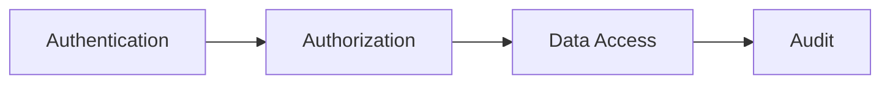

# Authentication and Authorization

## 1. Purpose

This document defines authentication and authorization at the API layer, elaborating [security-architecture.md](../02_System_Architecture/security-architecture.md) Sections 3–4 with API-specific role and boundary detail. No authentication mechanism is newly confirmed here — implementation technology remains under evaluation, consistent with [technology-stack.md](../00_Engineering_Overview/technology-stack.md) §4.9.

## 2. Authentication

Every API request (human or AI-agent-originated) requires a valid session/token, per FR-004/FR-005 and [security-architecture.md](../02_System_Architecture/security-architecture.md) Section 3. The specific mechanism (OAuth 2.0/OIDC — Proposed protocol; Auth0/Keycloak or custom JWT — Candidate) remains as established in ED-M1/ED-M2 Part 1, unchanged by this document.

## 3. Conceptual Roles (Proposed — Not Confirmed by Existing Documentation)

No role beyond the M1-scoped "administrator and standard user" distinction (FR-003) has been formally confirmed in any prior milestone. The roles below are **Proposed**, introduced by this milestone to support the finer-grained authorization needs of the expanded API surface (`06_API_and_Integration/`), and require future stakeholder confirmation.

| Role (Proposed) | Description | Illustrative Scope |
|---|---|---|
| **Public Viewer** | Unauthenticated or minimally-authenticated read access to non-sensitive, aggregate data | District boundaries, basic demographics — **Proposed**; whether any endpoint is genuinely public (vs. requiring at least basic authentication per FR-004) is itself an open question, since FR-004 states authentication is required before any protected resource — Public Viewer may in practice mean "the least-privileged authenticated role," not literal anonymous access |
| **Analyst** | Read access across all domains; can request predictions and create/run scenarios | Operations 1–14 ([api-contracts.md](api-contracts.md)) |
| **District Officer** | Analyst scope plus recommendation review authority | Operations 1–15, including the review command ([api-resource-model.md](api-resource-model.md) Section 5) |
| **Administrator** | Full scope, including user/role management, data source configuration, and audit/AI-execution retrieval | All operations, including Operation 18 |

These four roles are **Proposed**, not final — a future architecture or product decision may introduce, rename, or consolidate them. They are recorded here to give the API contract something concrete to authorize against, not as a governance commitment.

## 4. Permission Boundaries

Permissions are scoped by **domain** (which data domains a role may read/write) and, for command operations, by **operation type** (read vs. request-prediction vs. create-scenario vs. review-recommendation) — not by individual endpoint, keeping the permission model tractable as the API surface grows across M2–M6.

## 5. District-Level Access

No current requirement or source document establishes district-level access partitioning (i.e., a user restricted to only certain districts) — this is **not** assumed present. If DistrictMind's real deployment context requires it (e.g., a district-specific official who should only see their own district), this would be a future, explicitly confirmed extension to the role model in Section 3, not assumed here.

## 6. Domain-Level Access

Some domains may warrant elevated authorization even for read access — specifically Disaster ([api-contracts.md](api-contracts.md) Operation 8) given its higher potential sensitivity and currently unconfirmed source reliability ([data-sources.md](../04_Data_Engineering/data-sources.md)). This is marked **Under Evaluation** — not yet a confirmed restriction, but flagged as a candidate one.

## 7. Administrative Access

Unchanged from FR-034 ([functional-requirements.md](../01_Requirements/functional-requirements.md)): user/role management and data-source configuration are Administrator-only, enforced at the API boundary before reaching the Admin Service.

## 8. AI Tool Authorization

Every AI Tool Execution ([ai-tool-contracts.md](ai-tool-contracts.md)) inherits the authorization scope of the human user on whose behalf the requesting agent acts — restated from [ai-data-access-model.md](../05_Database_Design/ai-data-access-model.md) Section 6 and AD-API-002 ([api-architecture.md](api-architecture.md)). A Public Viewer's AI query cannot retrieve data an Administrator-only endpoint would gate; the tool layer enforces this identically to a direct API call, not as a separate, weaker check.

## 9. Audit Requirements

Every authentication attempt (success/failure), authorization failure, and role/permission change is logged, per NFR-014 and [security-architecture.md](../02_System_Architecture/security-architecture.md) Section 18 — restated here as an API-layer obligation, not newly decided.

## 10. The Security Flow

Every request, without exception — including every AI Tool Execution — passes through all four stages. There is no shortcut that skips Authorization or Audit for an AI-originated request (Section 8; AD-API-002).

## 11. Milestone Traceability

| Capability | Milestone |
|---|---|
| Basic authentication, administrator/standard-user distinction | M1 |
| Full role model (Section 3), domain-level access decisions | M2 — Future |
| AI tool authorization inheritance | M3 — Future |
| Analyst-scoped prediction requests | M4 — Future |
| Analyst/District-Officer-scoped scenario operations | M5 — Future |
| District-Officer/Administrator-scoped recommendation review | M6 — Future |

## 12. Open Decisions

- Whether the four Proposed roles (Section 3) are confirmed, renamed, or replaced by a future architecture/product decision.
- Whether any endpoint is genuinely unauthenticated (Section 3's Public Viewer ambiguity).
- Whether district-level access partitioning (Section 5) is ever required.
- Whether Disaster-domain read access requires elevation (Section 6).
- Final authentication mechanism (Section 2) — remains under evaluation.
