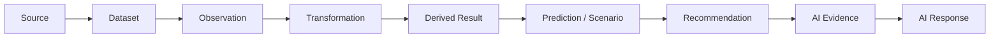

# Evidence and Provenance Flow

## 1. Purpose

This is one of the most important documents in this milestone. It defines the complete evidence/provenance chain from source through AI response, at the API/integration level — the mechanism that makes every important AI-generated factual statement traceable, and that prevents confidence from ever being mistaken for truth. It elaborates [data-lineage.md](../04_Data_Engineering/data-lineage.md) and [digital-twin-state-model.md](../05_Database_Design/digital-twin-state-model.md) with the API-facing detail this milestone adds.

## 2. The Chain

This is the same chain as [data-lineage.md](../04_Data_Engineering/data-lineage.md) Section 2, restated here because the API layer is where this chain becomes *queryable by a client* (Operation 17, [api-contracts.md](api-contracts.md)) rather than only an internal database property.

## 3. Metadata Per Link

| Link | Metadata Carried |
|---|---|
| Source identity | Which external provider/category ([data-sources.md](../04_Data_Engineering/data-sources.md)) |
| Dataset identity | The specific Dataset Version ([entity-catalog.md](../05_Database_Design/entity-catalog.md) E-AUD-002) |
| Observation timestamp | The effective date/time the underlying fact concerns, distinct from ingestion time ([temporal-database-design.md](../05_Database_Design/temporal-database-design.md) Section 2) |
| Transformation | Which transformation logic/version produced a Derived result ([data-transformation.md](../04_Data_Engineering/data-transformation.md) Section 5) |
| Model/version | For Predictions, the Model Execution Metadata reference (model name, version, training snapshot) |
| Query/tool used | For AI Evidence, the specific Typed AI Tool and its Tool Execution record ([ai-tool-contracts.md](ai-tool-contracts.md)) |
| Execution timestamp | When the tool call / computation actually ran |
| Evidence reference | A resolvable pointer into the underlying Analytical Result/Prediction/Scenario Output/Recommendation record, never a free-text description |
| Confidence (where applicable) | The stored confidence indicator on Prediction records (NFR-032) — carried through unmodified, never summarized away |

## 4. The Six Categories — Restated for the API/Integration Layer

Directly required by the milestone brief; consistent with [digital-twin-state-model.md](../05_Database_Design/digital-twin-state-model.md) Section 3, restated here as an **API response contract obligation**, not only a database property.

| Category | API-Level Rule |
|---|---|
| **FACT** (Source of Truth / Observed) | Every API response field sourced from Observed data carries its source + observation timestamp; never presented without them when the response is evidence-bearing |
| **DERIVED FACT** | Every Analytical Result response carries its computation-logic version and timestamp; visibly distinct from a raw Observed field |
| **PREDICTION** | Every Prediction response carries model/version metadata and a confidence indicator; the API schema for a Prediction resource is structurally different from an Observed resource — a client cannot mistake one shape for the other |
| **SIMULATION RESULT** | Every Scenario Output response carries its baseline snapshot reference and an explicit "Scenario" flag; never returned through the same resource shape as an Observed or Derived result |
| **RECOMMENDATION** | Every Recommendation response carries its full Recommendation Evidence chain, resolvable by the client via Operation 15/17 ([api-contracts.md](api-contracts.md)) |
| **AI INTERPRETATION** (AI Response) | Every AI Response is structurally distinct from all five categories above (Section 8, [digital-twin-state-model.md](../05_Database_Design/digital-twin-state-model.md)) and is retrievable via Operation 16, with its citations independently resolvable via Operation 17 |

## 5. Confidence Is Not Truth

Restated explicitly per the milestone brief's own instruction: a Prediction's confidence indicator describes the model's own estimated reliability — it is not a measure of whether the prediction is correct, and it must never be presented, in any API response or AI Response text, in a way that implies certainty. A high-confidence Prediction remains, structurally and presentationally, a Prediction — never promoted to the FACT category regardless of how confident the model is. This is enforced by the same structural separation as [digital-twin-state-model.md](../05_Database_Design/digital-twin-state-model.md) AD-DB-005 — there is no API-level mechanism by which a Prediction response can be relabeled as a Fact response, confidence notwithstanding.

## 6. How the API Exposes This Chain

| API Operation | Chain Stage Exposed |
|---|---|
| Operations 1–8 ([api-contracts.md](api-contracts.md)) | FACT — Source/Dataset/Observation |
| Operation 10 | DERIVED FACT — Analytical Result |
| Operation 11 | PREDICTION |
| Operations 12–14 | SIMULATION RESULT |
| Operation 15 | RECOMMENDATION (with full evidence chain) |
| Operation 16 | AI INTERPRETATION (the AI Response itself) |
| Operation 17 | The chain, made directly queryable — the AI Response's citations resolved back to their FACT/DERIVED FACT/PREDICTION/SIMULATION RESULT origins |
| Operation 18 | The Tool Execution/Agent Execution trail — how the chain was actually traversed for a given interaction |

## 7. Why This Matters for Trust

A district official reviewing a Recommendation (Operation 15) can, without needing to trust the AI Orchestration Service's own claims, independently resolve every evidence reference back to a specific Analytical Result, Prediction, or Scenario Output — and from there back to the specific Observed dataset and ingestion run that ultimately grounds it (Operation 17). This is the API-layer realization of the Blueprint's own stated goal: *"a defensible, explainable decision trail: every AI recommendation is traceable to the tools and data it used"* (Blueprint §1.2.3).

## 8. Failure Modes This Prevents

| Failure Mode | Prevention Mechanism |
|---|---|
| A stale Observed value presented as current | Observation timestamp always carried (Section 3); freshness disclosed, not hidden ([api-design-principles.md](api-design-principles.md) Section 12) |
| A Derived indicator mistaken for a directly measured fact | Structural distinction (Section 4); computation-logic version always present |
| A Prediction presented as a certainty | Section 5's explicit rule |
| A Scenario result mistaken for the real district's current state | Explicit Scenario flag, always present, per AD-DE-004 |
| A Recommendation accepted without verifiable basis | Full evidence chain required for every Recommendation response (Section 4) |
| An AI Response's claim that cannot actually be traced | The Grounding Validation stage ([ai-architecture.md](../02_System_Architecture/ai-architecture.md) Section 3) rejects any claim lacking a resolvable Evidence reference before the response reaches the user |

## 9. Milestone Traceability

| Evidence/Provenance Capability | Milestone |
|---|---|
| FACT-level provenance (source + observation timestamp) | M1 |
| DERIVED FACT provenance | M2 — Future |
| AI INTERPRETATION + Evidence retrieval (Operations 16–18) | M3 — Future |
| PREDICTION provenance + confidence disclosure | M4 — Future |
| SIMULATION RESULT provenance | M5 — Future |
| RECOMMENDATION full evidence chain | M6 — Future |

## 10. Open Decisions

- Exact API response field naming for provenance metadata (deferred to implementation).
- Whether provenance metadata is always inline in every response or available via a separate, linked provenance endpoint for large responses (a payload-size/performance trade-off, per [database-performance.md](../05_Database_Design/database-performance.md) Section 10) — **Under Evaluation**.
