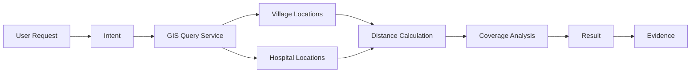
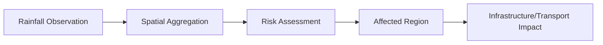

# GIS Service Design

## 1. Purpose

This is a core DistrictMind document. The GIS Service is the centralized spatial-computation module every domain service calls into ([service-layer-design.md](service-layer-design.md) Section 7), elaborating [gis-architecture.md](../02_System_Architecture/gis-architecture.md) and [spatial-database-design.md](../05_Database_Design/spatial-database-design.md) with service-layer responsibility detail. No GIS code or query implementation exists in this document.

## 2. GIS Service Responsibilities

| Responsibility | Description |
|---|---|
| Boundary retrieval | Serve District/Mandal/Village boundary geometry, with detail-level simplification |
| District map data | Compose boundary + facility + road layer data for a district view (backs [api-contracts.md](../06_API_and_Integration/api-contracts.md) Operation 2) |
| Point queries | Retrieve/filter point-geometry entities (facilities, weather stations) |
| Line queries | Retrieve/filter line-geometry entities (roads, road segments) |
| Polygon queries | Retrieve/filter polygon-geometry entities (boundaries, water bodies, affected areas) |
| Distance queries | Straight-line distance between two geometries ([spatial-query-services.md](spatial-query-services.md)) |
| Buffer queries | Generate a radius zone around a geometry |
| Intersection queries | Determine geometry overlap |
| Containment queries | Determine whether a point/geometry falls within another |
| Nearest-feature queries | Find the closest matching feature to a reference geometry |
| Coverage analysis | Combine proximity/buffer with population/facility data to compute coverage gaps |
| Accessibility analysis | Combine routing with facility locations to compute travel-time-based accessibility |
| Affected-area analysis | Combine disaster/event geometry with intersecting infrastructure/population |
| Route/network analysis | Shortest-path and connectivity queries over the derived road-network graph |

Every responsibility above maps directly to a spatial operation category defined in [spatial-database-design.md](../05_Database_Design/spatial-database-design.md) Sections 16–20 and is realized as a bounded, typed capability of the GIS Service — never an open-ended geometry-expression interface.

## 3. DistrictMind Example 1 — Healthcare Coverage Gap

**"Which villages do not have a hospital within 10 km?"**

This is the same conceptual flow as [ai-agent-integration.md](ai-agent-integration.md)'s AI-facing version, but here shown as the *service-layer* path any client (dashboard or AI) triggers: the GIS Service reads Village and Health Facility geometry (via the Healthcare/Geography services' data access, per [service-layer-design.md](service-layer-design.md) Section 3), computes distance (Section 16, [spatial-query-services.md](spatial-query-services.md)), applies the threshold, and returns a coverage-gap result annotated with the provenance/evidence metadata every GIS Service response carries (Section 8 below).

## 4. DistrictMind Example 2 — Bridge Closure Accessibility Impact

Realized as a **Scenario** ([database-design.md](../05_Database_Design/database-design.md) Section 17): the GIS Service's route/network analysis capability is invoked within the sandboxed Simulation Engine ([service-layer-design.md](service-layer-design.md) Section 3's Simulation Service), removing the affected Road Segment from the routable graph, recomputing shortest paths, and comparing against baseline accessibility — never touching production Road/Health Facility data (AD-DE-004).

## 5. DistrictMind Example 3 — Rainfall Impact Assessment

Realized via: the GIS Service's spatial aggregation (Section 2, Polygon queries) combines Weather Observation station readings across a geographic region, feeds a Risk Assessment (either a Derived heuristic or, from M4, a Predicted model output — per [digital-twin-state-model.md](../05_Database_Design/digital-twin-state-model.md)), and the resulting affected-region geometry is intersected (Section 2, Intersection queries) against Road/Infrastructure geometry to determine impact — matching the Blueprint's flagship cross-domain example (§1.1).

## 6. Validation

Every GIS Service operation validates its geometry/parameter inputs per [data-validation.md](../04_Data_Engineering/data-validation.md) Section 4 (geometry validity, CRS consistency) before executing — malformed input never silently produces a degraded or partial result.

## 7. Performance

- Boundary/map-data queries use the geometry-simplification/level-of-detail strategy from [gis-architecture.md](../02_System_Architecture/gis-architecture.md) Section 15.
- Coverage/accessibility computations prefer a precomputed Analytical Result where one exists ([database-normalization.md](../05_Database_Design/database-normalization.md) Section 6), falling back to on-demand computation only when no precomputed value is fresh enough.
- Every spatial index defined in [database-indexing-strategy.md](../05_Database_Design/database-indexing-strategy.md) Section 4 is what makes these operations viable at interactive speed — the GIS Service does not itself define indexing, it depends on it.

## 8. Provenance

Every GIS Service result carries: the source dataset version(s) the geometries were read from, the computation timestamp, and — for coverage/accessibility/impact results specifically — whether the result reflects the real Observed/Curated state or a Scenario sandbox (Section 4), since these must never be presented ambiguously ([digital-twin-state-model.md](../05_Database_Design/digital-twin-state-model.md) Section 4).

## 9. Consumers

Every Domain Service ([service-layer-design.md](service-layer-design.md)), the Analytics Service (for precomputing coverage/accessibility indicators), the Simulation Service (Example 2), and — exclusively through the `spatial_query`, `coverage_analysis`, and `accessibility_analysis` Typed AI Tools — the AI Agent Layer ([ai-tool-contracts.md](ai-tool-contracts.md)). No consumer, including the dashboard's own backend calls, receives a lower-level geometry-expression interface than these bounded operations.

## 10. Milestone Traceability

| GIS Service Capability | Milestone |
|---|---|
| Boundary retrieval, district map data, point/line/polygon queries | M1 |
| Distance, buffer, intersection, containment, nearest-feature, coverage analysis | M2 — Future |
| Accessibility analysis (routing) | M2 — Future (data), M5 — Future (scenario use, per Example 2) |
| Affected-area analysis | M2 — Future (data), M4 — Future (predicted risk input) |

## 11. Open Decisions

- Precise level-of-detail thresholds per zoom level (implementation-time tuning, per [gis-architecture.md](../02_System_Architecture/gis-architecture.md) Section 19).
- Whether coverage/accessibility Analytical Results are refreshed on a schedule or on underlying-data change — unchanged open item from [database-performance.md](../05_Database_Design/database-performance.md) Section 18.
