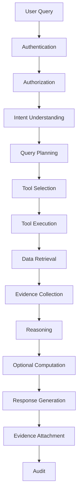
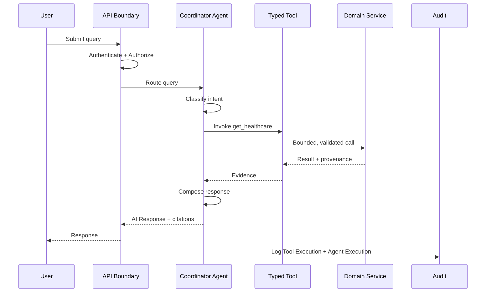
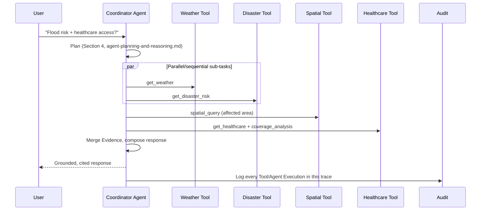

# Agent Execution Architecture

## 1. Purpose

This document defines the conceptual execution lifecycle of an AI agent interaction, from user query to audit, elaborating [ai-agent-integration.md](../06_API_and_Integration/ai-agent-integration.md) with the full lifecycle detail this milestone requires, including sync/async classification and failure recovery. No agent implementation exists here.

## 2. The Execution Lifecycle

Every stage maps to an already-established mechanism: Authentication/Authorization are unchanged from [authentication-authorization.md](../06_API_and_Integration/authentication-authorization.md) Section 10; Intent Understanding through Reasoning restate [ai-agent-integration.md](../06_API_and_Integration/ai-agent-integration.md) Section 3; Optional Computation is new here (Section 5); Evidence Attachment and Audit restate [evidence-provenance-flow.md](../06_API_and_Integration/evidence-provenance-flow.md) and [ai-tool-contracts.md](../06_API_and_Integration/ai-tool-contracts.md)'s per-tool audit field.

## 3. Sequence Diagram — Single-Tool Query

## 4. Sequence Diagram — Multi-Tool Cross-Domain Query

This is the same worked example as [ai-agent-integration.md](../06_API_and_Integration/ai-agent-integration.md) Section 4, now shown as a sequence diagram to make the fan-out/merge timing explicit.

## 5. Optional Computation

Some queries require a computation step beyond simple tool retrieval before reasoning can proceed — e.g., a `coverage_analysis` or `accessibility_analysis` tool call (Section 12–13 of [ai-tool-contracts.md](../06_API_and_Integration/ai-tool-contracts.md)) is itself a bounded computation, not a plain read. This stage is where such a tool's execution occurs, distinct from plain Data Retrieval — it still passes through the identical typed-tool boundary (AD-API-002), never a separate, less-governed compute path.

## 6. Synchronous Agent Operations

| Operation | Why Synchronous |
|---|---|
| Single-domain data retrieval (`get_district`, `get_weather`, etc.) | Fast, indexed reads, per [database-performance.md](../05_Database_Design/database-performance.md) Section 11 |
| Bounded spatial queries (`spatial_query`, `coverage_analysis` at district scale) | Fast given proper indexing ([database-indexing-strategy.md](../05_Database_Design/database-indexing-strategy.md)) |
| Response composition and evidence attachment | In-process, no external dependency beyond the LLM call itself |

## 7. Asynchronous Operations

| Operation | Why Asynchronous |
|---|---|
| `request_prediction` | Model inference may exceed a synchronous-safe duration (M4 — Future) |
| `run_scenario` | Sandboxed simulation recomputation, potentially statewide in scope (M5 — Future) |
| Multi-step Recommendation generation | Composes multiple upstream Prediction/Simulation reads (M6 — Future) |
| A statewide, non-precomputed spatial aggregation | Escalates from Section 6 per [spatial-query-services.md](../06_API_and_Integration/spatial-query-services.md) Section 8's async-escalation note |

## 8. Long-Running Operations

For operations in Section 7, the agent's response to the user is either (a) an immediate acknowledgment with a job reference the user/UI can poll ([api-architecture.md](../06_API_and_Integration/api-architecture.md) Section 18), or (b) a streamed intermediate status ("still retrieving flood risk data...") — the exact mechanism remains **Under Evaluation** (unchanged open item from [ai-agent-integration.md](../06_API_and_Integration/ai-agent-integration.md) Section 9). In either case, the agent never blocks silently with no user-visible indication for an operation known in advance to be long-running.

## 9. Failure Recovery

| Failure | Recovery Behavior |
|---|---|
| A single tool call fails | The Coordinator retries per [integration-architecture.md](../02_System_Architecture/integration-architecture.md) Section 13's bounded retry policy if the failure is transient; if retries are exhausted, the Coordinator proceeds with partial evidence (Section 10) or declines, never silently omitting the gap from its response |
| A downstream Domain Service is unavailable | The specific tool returns an explicit failure result ([ai-data-access-model.md](../05_Database_Design/ai-data-access-model.md) Section 13); the agent surfaces this as a limitation in its response, not a silent gap |
| The LLM/reasoning provider itself is unavailable | The entire interaction fails explicitly, per [ai-architecture.md](../02_System_Architecture/ai-architecture.md) Section 15 — no partial LLM output is presented as complete |

## 10. Partial Results

When some, but not all, planned tool calls succeed, the agent may compose a response from the available Evidence **only if** the missing piece does not invalidate the parts that are grounded — e.g., a healthcare-coverage answer can still be meaningful if the weather tool call failed but the healthcare tool call succeeded, provided the response clearly states what could not be assessed (Fail-Safe Behavior; consistent with [ai-safety-and-grounding.md](ai-safety-and-grounding.md) Section 6). If the missing piece is essential to the question asked (e.g., the user specifically asked about flood risk and the disaster tool failed), the agent declines rather than answering a materially different, narrower question without saying so.

## 11. Tool Errors

Every tool error (validation failure, authorization failure, execution failure) is classified per [api-design-principles.md](../06_API_and_Integration/api-design-principles.md) Section 12's error taxonomy, logged via the Tool Execution audit record ([entity-catalog.md](../05_Database_Design/entity-catalog.md) E-AI-003), and surfaced to the Coordinator as a structured failure, never as an ambiguous empty result the Coordinator might misinterpret as "no data" when it actually means "the call failed."

## 12. Stale Data

If a tool's underlying data is older than what the query context implies is needed (e.g., a "current" population figure that is several years old), the tool result's freshness metadata ([evidence-provenance-flow.md](../06_API_and_Integration/evidence-provenance-flow.md) Section 3) is passed through to the response, and the AI Response text discloses this — restated in depth in [ai-safety-and-grounding.md](ai-safety-and-grounding.md) Section 4.

## 13. Missing Data

A tool returning an explicit "no data" result (per [ai-data-access-model.md](../05_Database_Design/ai-data-access-model.md) Section 12) is treated by the Coordinator as a hard fact to reason about and disclose, not as a signal to fall back on ungrounded model knowledge — restated per FR-022/NFR-031.

## 14. Conflicting Data

If two tool calls (or two records within a single tool's result) disagree, the Coordinator surfaces the conflict explicitly in its response rather than silently preferring one source — restated from [ai-data-access-model.md](../05_Database_Design/ai-data-access-model.md) Section 12, elaborated further in [ai-safety-and-grounding.md](ai-safety-and-grounding.md) Section 5.

## 15. Milestone Traceability

| Execution Capability | Milestone |
|---|---|
| Single-tool synchronous execution, basic failure handling | M3 — Future |
| Multi-tool planning, parallel fan-out | M3 — Future (data-domain tools), extended M4–M6 as new tools are added |
| Asynchronous long-running operations | M4 — Future (prediction), M5 — Future (simulation), M6 — Future (recommendation) |

## 16. Open Decisions

- Exact streaming/polling mechanism for long-running operations (Section 8) — Under Evaluation, unchanged from prior milestones.
- Exact retry-count/backoff parameters (Section 9) — implementation-time tuning.
