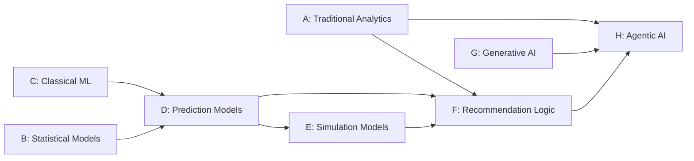

# AI/ML Architecture

## 1. Purpose

This document defines the logical AI/ML architecture as eight distinct categories of computation, each with its own purpose, dependencies, and uncertainty profile. No final algorithm is selected unless the original source material explicitly names one — every specific algorithm below is drawn from the Blueprint and marked accordingly; where DistrictMind's documentation is silent, the category is marked **Under Evaluation**.

## 2. Category Comparison Table

| Category | Purpose | Input | Output | Data Dependency | Temporal | Spatial | Uncertainty | Evaluation | Provenance | Milestone |
|---|---|---|---|---|---|---|---|---|---|---|
| A. Traditional analytics | Aggregate/summarize Observed data | Curated domain data | Analytical Result | Curated data | Low–Medium | Often | None (deterministic) | Correctness against source, not accuracy | Computation logic version | M2 |
| B. Statistical models | Trend/seasonality-aware forecasting | Historical time series | Forecast + interval | High (multi-year/period history) | High | Low | Confidence interval | Backtesting against holdout periods | Model + training snapshot version | M4 |
| C. Machine learning (classical) | Classification/regression on structured features | Engineered features | Class/score | Medium–High | Medium | Medium | Class probability / prediction interval | Train/validation/test split metrics | Model + feature-set version | M4 |
| D. Prediction models | The applied instance of B/C for a specific DistrictMind target (flood, rainfall, population, traffic, crop — [prediction-architecture.md](prediction-architecture.md)) | Domain-specific features | Prediction/Forecast record | High | High | High | Per-model confidence indicator (NFR-032) | Domain-specific backtesting | Full Model Execution Metadata chain | M4 |
| E. Simulation models | Deterministic/rule-based recomputation under a hypothetical | Baseline state + scenario parameters | Scenario Output | Medium (baseline snapshot) | Medium | High | Sensitivity to assumption validity, not statistical confidence | Consistency against baseline, not "accuracy" (no ground truth exists for a hypothetical) | Baseline + scenario version | M5 |
| F. Recommendation logic | Multi-criteria scoring/ranking of candidates | Analytics + Prediction + Simulation + constraints | Ranked, justified candidates | High (composes B–E) | High | High | Rank sensitivity to weighting choices | Evaluated by human review outcome (accepted/rejected), not a model metric | Full evidence chain ([recommendation-engine.md](recommendation-engine.md)) | M6 |
| G. Generative AI | Natural-language composition from retrieved Evidence | Evidence (structured data) | AI Response text | N/A directly (operates on already-governed data) | N/A directly | N/A directly | Grounded/ungrounded binary + per-claim traceability, not a confidence score of its own | Grounding validation ([ai-safety-and-grounding.md](ai-safety-and-grounding.md)) | Cites every Evidence item used | M3 |
| H. Agentic AI | Multi-step planning and tool orchestration across A–G | User query | Composed, evidence-linked response | Indirect (via tools) | Indirect | Indirect | Inherits the uncertainty of every category it composes, disclosed per-claim | Audited via Tool/Agent Execution trail | Full Agent Execution/Tool Execution audit | M3 (basic), M6 (full orchestration) |

## 3. A — Traditional Analytics

**Purpose:** deterministic aggregation of Curated data into Analytical Results (facility counts, coverage percentages, population density). **No model, no training, no uncertainty in the statistical sense** — the only "error" possible is a bug in the computation logic itself, which is why its evaluation is correctness-testing, not accuracy-testing. Already fully specified in [analytical-data-model.md](../05_Database_Design/analytical-data-model.md); restated here only for taxonomic completeness.

## 4. B — Statistical Models

**Purpose:** capture trend/seasonality in a time series without a full ML pipeline. **Algorithm status:** the Blueprint names Prophet specifically for Rainfall Prediction (§12.2) and, conditionally, Population Growth (§12.3: "Prophet or a simple regression model, depending on how many historical snapshots are available") — both are **Proposed**, not Confirmed, consistent with [technology-stack.md](../00_Engineering_Overview/technology-stack.md) §4.7's Candidate status for Prophet/statsmodels.

## 5. C — Machine Learning (Classical)

**Purpose:** classification/regression on structured, engineered features where trend-only statistical models are insufficient. **Algorithm status:** the Blueprint names XGBoost for Traffic Prediction (§12.4) and Crop Prediction (§12.5), and XGBoost-or-scikit-learn for Flood Prediction classification/regression (§12.1) — all **Proposed**, matching [technology-stack.md](../00_Engineering_Overview/technology-stack.md) §4.7's Candidate status for scikit-learn/XGBoost.

## 6. D — Prediction Models (The Applied Layer)

The five specific applied predictions the Blueprint names (§12.1–12.5: Flood, Rainfall, Population Growth, Traffic, Crop) are the concrete instances of categories B/C applied to DistrictMind's domains. Full treatment, including the Abstract-vs-Blueprint discrepancy on Healthcare Demand forecasting, is in [prediction-architecture.md](prediction-architecture.md) Section 4.

## 7. E — Simulation Models

**Purpose:** recompute downstream state under a hypothetical, without training a model on historical outcomes (there is no "correct" future to train against for a hypothetical). The Blueprint's Simulation Engine (§13) is described as combining GeoPandas/NetworkX recomputation with the *already-trained* Prediction Engine models (§13.1's "GeoPandas, NetworkX... the trained Prediction Engine models") — i.e., Simulation reuses D's models as an input, it does not train its own. This is **deterministic/rule-based** in the Blueprint's own framing (recompute routes, recompute flood extent under adjusted rainfall), not itself a statistical or ML model category — restated as **Proposed** per [technology-stack.md](../00_Engineering_Overview/technology-stack.md)'s NetworkX/GeoPandas Candidate status. Full treatment in [simulation-architecture.md](simulation-architecture.md).

## 8. F — Recommendation Logic

**Purpose:** combine outputs from A–E into ranked, justified candidates via multi-criteria scoring. **Algorithm status:** the Blueprint specifies a weighted-sum scoring formula (§14.2's implied criteria, §14's worked example) — **Proposed**, described as "multi-criteria decision analysis (weighted scoring)" in [technology-stack.md](../00_Engineering_Overview/technology-stack.md)'s implicit framing (no dedicated technology-stack entry exists for this — flagged as a minor documentation gap in Section 32 of [ED-M2-P2B2B-VALIDATION.md](ED-M2-P2B2B-VALIDATION.md)). Full treatment in [recommendation-engine.md](recommendation-engine.md).

## 9. G — Generative AI

**Purpose:** compose natural-language responses strictly from retrieved Evidence. **Provider status:** unresolved, per the AI-provider divergence first identified in [data-architecture.md](../04_Data_Engineering/data-architecture.md) Section 33 (#2) and restated unchanged in every subsequent milestone through [external-integration-design.md](../06_API_and_Integration/external-integration-design.md) — ED-M1's [technology-stack.md](../00_Engineering_Overview/technology-stack.md) lists Claude/Anthropic among undifferentiated Candidates; the Blueprint specifically proposes local Llama 3 via Ollama with OpenAI GPT as an optional cloud fallback (§5.4). **This document does not resolve this discrepancy**, per the milestone brief's explicit instruction not to choose a provider "merely because it is convenient." Both positions remain preserved as open.

## 10. H — Agentic AI

**Purpose:** multi-step planning and typed-tool orchestration (Blueprint §7, LangGraph — Candidate per [technology-stack.md](../00_Engineering_Overview/technology-stack.md) §4.4/§4.5). Full treatment in [agent-execution-architecture.md](agent-execution-architecture.md) and [agent-planning-and-reasoning.md](agent-planning-and-reasoning.md).

## 11. Cross-Category Dependency

No category is bypassed by a "shortcut" path — Agentic AI (H) reaches A–F exclusively through the Typed AI Tools already established in [ai-tool-contracts.md](../06_API_and_Integration/ai-tool-contracts.md), never a direct model/computation call.

## 12. Milestone Traceability

See the per-category table in Section 2's rightmost column — consolidated further in [ED-M2-P2B2B-VALIDATION.md](ED-M2-P2B2B-VALIDATION.md) Section 12.

## 13. Open Decisions

- Final confirmation of any algorithm named above (Prophet, XGBoost, scikit-learn, NetworkX) — all remain Proposed/Candidate, unchanged.
- Final AI/LLM provider (Section 9) — explicitly unresolved.
- Whether Recommendation Logic's scoring approach needs its own `technology-stack.md` entry — flagged as a documentation-completeness gap, not resolved here.
