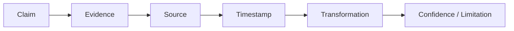

# AI Safety and Grounding

## 1. Purpose

This document defines DistrictMind's safeguards against hallucination, unsupported claims, and every other AI failure mode named in this milestone's brief, consolidating and extending the grounding mechanisms already established in [ai-architecture.md](../02_System_Architecture/ai-architecture.md), [ai-data-access-model.md](../05_Database_Design/ai-data-access-model.md), and [evidence-provenance-flow.md](../06_API_and_Integration/evidence-provenance-flow.md).

## 2. The Grounding Policy

**Every factual claim in an AI Response must resolve through this entire chain before being presented to the user.** A claim that cannot be traced to Evidence, cannot be traced to a Source, or lacks a Timestamp, is not a permissible claim — it is either rewritten to only state what *is* supported, or the response declines that part of the question explicitly (Section 8).

## 3. Safeguard Inventory

| Threat | Safeguard | Established In |
|---|---|---|
| Hallucination | Grounding Validation stage rejects any claim not traceable to retrieved Evidence | [ai-architecture.md](../02_System_Architecture/ai-architecture.md) Section 3, Section 11 |
| Unsupported claims | Same as above — the grounding chain (Section 2) is mandatory, not advisory | This document, Section 2 |
| Stale data | Every Evidence item carries freshness metadata; a response using stale data discloses its age | [evidence-provenance-flow.md](../06_API_and_Integration/evidence-provenance-flow.md) Section 3; restated Section 4 below |
| Conflicting sources | A tool result with disagreeing records surfaces the conflict rather than silently resolving it | [ai-data-access-model.md](../05_Database_Design/ai-data-access-model.md) Section 12; restated Section 5 below |
| Missing data | An explicit "no data" tool result, never a fabricated substitute | [ai-data-access-model.md](../05_Database_Design/ai-data-access-model.md) Section 12; restated Section 6 below |
| Unauthorized data | Every tool call inherits the caller's authorization scope; a tool cannot retrieve data the user's role would not permit | [ai-data-access-model.md](../05_Database_Design/ai-data-access-model.md) Section 6, [authentication-authorization.md](../06_API_and_Integration/authentication-authorization.md) Section 8 |
| Prompt injection | Retrieved content is treated as data to summarize/cite, never as instructions to follow; the fixed tool set cannot be expanded by retrieved or user-supplied content | [security-architecture.md](../02_System_Architecture/security-architecture.md) Section 12 |
| Tool misuse | Typed, schema-validated parameters; a fixed, allow-listed operation set (e.g., `spatial_query`'s allow-listed operation types) | [ai-tool-contracts.md](../06_API_and_Integration/ai-tool-contracts.md) Section 2 |
| Fabricated evidence | Evidence is never generated by the LLM itself — it is always a real, resolvable reference into a Tool Execution result | [ai-data-access-model.md](../05_Database_Design/ai-data-access-model.md) Section 11 |
| False precision | Numeric claims carry only as much precision as their source data/model actually supports; a Prediction's confidence interval is never dropped to make the number look more certain than it is | Section 7 below, and [ai-uncertainty-and-confidence.md](ai-uncertainty-and-confidence.md) |

## 4. Stale Data — Detail

A response that uses data older than what a reasonable user would assume "current" means (e.g., a population figure from several years ago) states its actual observation date explicitly ("as of the last available data, from [year]...") rather than presenting it as an unqualified current fact. This is a disclosure requirement, not a refusal requirement — stale data is still usable Evidence, provided its staleness is visible.

## 5. Conflicting Sources — Detail

If `get_healthcare` (for example) returns two records for what appears to be the same facility with different capacity figures (pending entity-matching resolution, per [data-transformation.md](../04_Data_Engineering/data-transformation.md) Section 6), the AI Response does not silently pick one — it either reports the discrepancy or reports the most recently validated figure while noting the conflict exists, depending on what the Coordinator's grounding logic determines is more useful to disclose; in no case is the conflict hidden.

## 6. Missing Data — Detail

If Evidence is unavailable for a necessary part of the question, **the system states that evidence is unavailable. It does not invent an answer.** This is the milestone brief's own instruction, restated verbatim as policy. This applies even under conversational pressure — a follow-up question rephrasing the same unanswerable request does not eventually produce a fabricated answer merely because the user asked again.

## 7. False Precision — Detail

A Prediction's stored confidence indicator (NFR-032) is carried through to the response verbatim, never summarized into a false certainty ("the model predicts X" rather than "the model predicts X, with moderate confidence based on limited historical data" when that qualifier is what the underlying record actually carries). Full treatment of how confidence is communicated is in [ai-uncertainty-and-confidence.md](ai-uncertainty-and-confidence.md).

## 8. Explicit "Cannot Answer" Behavior

Per FR-022 and NFR-031, unchanged and reaffirmed here: when grounding is not achievable, the AI Response is an explicit, clearly-labeled inability to answer — never a plausible-sounding guess. This is the terminal safe state for every safeguard in Section 3 when a claim cannot be made safely.

## 9. Prompt Injection — Extended Detail

Because retrieved unstructured content (e.g., a policy document in the Knowledge Base, [ai-architecture.md](../02_System_Architecture/ai-architecture.md) Section 7) could itself contain adversarial text, the Reasoning stage treats all retrieved content — structured or unstructured — as data to be reasoned about, never as system instructions. The fixed Typed Tool set (Section 3 above) means even a successful injection attempt cannot expand what the agent is capable of doing, only what it might (incorrectly) claim — and any such incorrect claim is still subject to Grounding Validation (Section 2) before reaching the user.

## 10. Auditability of Safety Decisions

Every instance where Grounding Validation rejects a drafted response, every explicit "cannot answer," and every disclosed conflict/staleness is itself logged via the Tool Execution/Agent Execution audit trail ([entity-catalog.md](../05_Database_Design/entity-catalog.md) E-AI-002/003) — safety decisions are not invisible; they are inspectable via [api-contracts.md](../06_API_and_Integration/api-contracts.md) Operation 18.

## 11. Milestone Traceability

| Safeguard | Milestone |
|---|---|
| Grounding policy, explicit cannot-answer, missing/stale/conflicting data disclosure | M3 — Future |
| False-precision discipline for confidence indicators | M4 — Future |
| Prompt injection resistance for Knowledge Base content | M3 — Future (once unstructured retrieval is active) |

## 12. Open Decisions

- Exact phrasing/UX for disclosing staleness, conflicts, and limitations (Section 4–6) — an implementation/content-design detail, not resolved here.
- Whether a dedicated Knowledge Base corpus (referenced in Section 9) is ever actually sourced — unchanged open item from [data-sources.md](../04_Data_Engineering/data-sources.md) Section 9.
