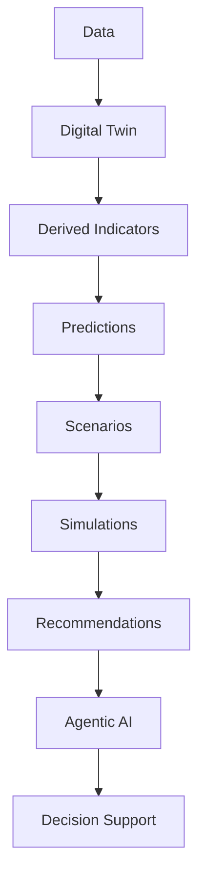

# Intelligence Architecture

## 1. Purpose

This document is the anchor for `07_AI_GIS_and_Intelligence/`. It defines DistrictMind's complete intelligence architecture — how raw data becomes decision support — and classifies each stage against the standard intelligence taxonomy (descriptive/diagnostic/predictive/prescriptive/agentic). It builds directly on the six-category state separation already established in [digital-twin-state-model.md](../05_Database_Design/digital-twin-state-model.md) (AD-DB-005) and the evidence/provenance chain in [evidence-provenance-flow.md](../06_API_and_Integration/evidence-provenance-flow.md), without redefining either.

## 2. The Intelligence Pipeline

This restates the milestone brief's own pipeline exactly, and is the single throughline every other document in this folder elaborates one stage of.

## 3. The Five Intelligence Categories, Mapped to DistrictMind

| Category | Definition | DistrictMind Realization | Milestone |
|---|---|---|---|
| **Descriptive intelligence** | "What is happening?" — summarizing current/historical Observed and Derived data | Dashboards, District Intelligence indicators (population, facility counts, coverage) — [analytical-data-model.md](../05_Database_Design/analytical-data-model.md) | M1–M2 |
| **Diagnostic intelligence** | "Why is it happening?" — explaining a pattern by relating it to other data | Cross-domain joins (e.g., correlating a coverage gap with population density and terrain) — [data-domain-model.md](../04_Data_Engineering/data-domain-model.md) Section 13 | M2 |
| **Predictive intelligence** | "What is likely to happen?" — model-generated forecasts | Prediction/Forecast entities ([prediction-architecture.md](prediction-architecture.md)) | M4 |
| **Prescriptive intelligence** | "What could/should be done?" — scenario evaluation and ranked recommendations | Simulation ([simulation-architecture.md](simulation-architecture.md)) and Recommendation ([recommendation-engine.md](recommendation-engine.md)) | M5–M6 |
| **Agentic decision support** | "Reason across all of the above, on demand, in natural language, with evidence" | The AI Agent Layer ([agent-execution-architecture.md](agent-execution-architecture.md)) composing every prior category into a grounded response | M3 (grounded Q&A), M6 (full agentic orchestration) |

This taxonomy is a standard analytics/BI framework applied here as an organizing lens — it is not itself sourced from the Abstract or Blueprint, and is marked **Proposed (engineering framing)** to classify, not redefine, DistrictMind's already-established capabilities.

**AD-AI-001 — Adopt the Descriptive/Diagnostic/Predictive/Prescriptive/Agentic Taxonomy as the Organizing Framework for Intelligence Documentation**
- **Context:** This documentation set needed a consistent vocabulary to classify DistrictMind's six milestones' worth of intelligence capability (dashboards through autonomous recommendation) without inventing new, DistrictMind-specific terms that could drift from established analytics/BI usage.
- **Decision:** Adopt the standard five-category intelligence taxonomy (Section 3) as the classification lens for every document in `07_AI_GIS_and_Intelligence/`, mapped explicitly onto the existing M1–M6 milestone scheme (Section 5) rather than replacing it.
- **Alternatives considered:** Inventing DistrictMind-specific category names; using only the M1–M6 milestone names as the sole classification (rejected — milestones bundle multiple intelligence categories, e.g., M2 spans both Descriptive and Diagnostic).
- **Reasoning:** A standard taxonomy is immediately legible to technical reviewers and avoids reinventing well-understood distinctions; mapping it onto M1–M6 (not replacing M1–M6) preserves the milestone scheme's authority per [naming-conventions.md](../03_Project_Structure/naming-conventions.md) Section 14.
- **Trade-offs:** Adds a second classification axis alongside M1–M6, which readers must learn to distinguish (mitigated by Section 4's explicit clarification that it is a lens, not a replacement).
- **Consequences:** Every document in this folder references this taxonomy consistently (Section 6 below; [ai-ml-architecture.md](ai-ml-architecture.md), [decision-intelligence-workflows.md](decision-intelligence-workflows.md)).
- **Status:** Proposed.

## 4. Why Agentic Decision Support Is Not "Just Another Category"

The Blueprint is explicit that DistrictMind is "not a chatbot" (§2.2, §7) — the Agentic layer does not sit *after* Predictive/Prescriptive intelligence in a simple linear pipeline; it *orchestrates* calls into every other category on demand, per a specific user's question (Blueprint §7.3's fan-out/fan-in pattern, already detailed in [ai-agent-integration.md](../06_API_and_Integration/ai-agent-integration.md)). Section 2's pipeline diagram should be read as the *data-maturity* pipeline (what capabilities must exist before they can be reasoned over), not as the literal request-time execution order for every query — a Descriptive-only question (e.g., "what is District X's population?") does not need to traverse Prediction/Scenario/Recommendation stages at all.

## 5. Intelligence Evolution Through M1–M6

| Milestone | Intelligence Capability Added | Category |
|---|---|---|
| M1 — Digital Twin Foundation | The queryable digital twin itself (geography, boundaries) — the substrate every later category depends on | Pre-Descriptive (foundation) |
| M2 — District Intelligence | Multi-domain Descriptive and Diagnostic intelligence (indicators, coverage gaps, cross-domain correlation) | Descriptive, Diagnostic |
| M3 — Grounded Agentic AI | Natural-language access to M1–M2 intelligence, with evidence and citation | Agentic (grounded Q&A over existing categories) |
| M4 — Predictive Intelligence | Forecasts and risk scores | Predictive |
| M5 — Scenario Simulation & Recommendations | What-if evaluation and ranked, justified suggestions | Prescriptive |
| M6 — Advanced Agentic District Intelligence | Multi-agent orchestration across all categories, producing evidence-linked recommendations autonomously | Full Agentic (orchestrating Descriptive through Prescriptive) |

This is unchanged from, and directly restates, the six-milestone framing in [engineering-overview.md](../00_Engineering_Overview/engineering-overview.md) Section 8 — this document does not introduce a new milestone scheme, only classifies each milestone's contribution against the five-category taxonomy in Section 3.

## 6. Relationship to the Digital Twin State Model

Every stage in Section 2 corresponds to exactly one of the six state categories from [digital-twin-state-model.md](../05_Database_Design/digital-twin-state-model.md):

| Pipeline Stage | State Category |
|---|---|
| Data, Digital Twin | Source of Truth |
| Derived Indicators | Derived |
| Predictions | Prediction |
| Scenarios, Simulations | Simulation |
| Recommendations | Recommendation |
| Agentic AI's output | AI Response |

**These six categories are never collapsed into one generic "AI result."** This is restated here as the intelligence-architecture-level consequence of AD-DB-005, and is the single most important invariant this entire folder must respect — every document in `07_AI_GIS_and_Intelligence/` is checked against it in [ED-M2-P2B2B-VALIDATION.md](ED-M2-P2B2B-VALIDATION.md).

## 7. Non-Negotiable Boundary: AI-Generated Text Is Not Source Data

Restated from [data-governance.md](../04_Data_Engineering/data-governance.md) Section 6 and the milestone brief's explicit instruction: an AI Response, regardless of how it is phrased or how confident it sounds, is never re-ingested, never treated as a new Observed fact, and never used as an input to a future Prediction, Simulation, or Recommendation. This boundary is structural (schema-level, per AD-DB-005), not merely a style guideline.

## 8. Milestone Traceability

See Section 5 above — the primary traceability table for this document, cross-referenced against [ED-M2-P2B2B-VALIDATION.md](ED-M2-P2B2B-VALIDATION.md) Section 12 for the consolidated M1–M6 table spanning all 14 content documents in this folder.

## 9. Open Decisions

- Whether the five-category taxonomy (Section 3) is formally adopted as DistrictMind terminology in a future revision of [engineering-glossary.md](../00_Engineering_Overview/engineering-glossary.md), or remains an internal organizing device for this documentation folder only — not decided here, since this milestone does not modify prior documents.
