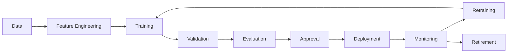

# Model Lifecycle

## 1. Purpose

This document defines the conceptual lifecycle every DistrictMind prediction model passes through, from data to retirement, even though no implementation currently exists. No metric or threshold is invented.

## 2. The Lifecycle

## 3. Stage Definitions

| Stage | Detail |
|---|---|
| Data | The Curated/historical time-series data a model consumes ([temporal-database-design.md](../05_Database_Design/temporal-database-design.md)) |
| Feature Engineering | Per [feature-engineering.md](feature-engineering.md) — Source/Derived features shaped into Model features |
| Training | Fitting a model to historical data — offline, per the Blueprint's own model-serving pattern (§12.6: "trained offline... At runtime, the Prediction Engine loads these artifacts") |
| Validation | Checking the trained model against held-out data before it is trusted for any real prediction |
| Evaluation | Assessing the validated model's performance — using whatever metric is appropriate to the specific model type (the Blueprint mentions "accuracy/RMSE/F1 as appropriate," §4.2 Phase 6 Deliverables, without committing DistrictMind to specific target values) |
| Approval | A human decision that a model's evaluation results are acceptable for production use — an explicit, recorded gate, not automatic |
| Deployment | The approved model becomes the active Model Execution Metadata version new Predictions reference |
| Monitoring | Ongoing observation of the deployed model's real-world performance and input-data characteristics |
| Retraining | Triggered by monitoring findings (Section 8) or simply by new data becoming available (e.g., a new census year) |
| Retirement | A model version is no longer used for new predictions, though its historical Prediction records remain retained (Reproducibility — a past forecast's basis is never deleted merely because the model producing it was retired) |

## 4. Versioning Concepts

| Concept | Definition | Where Stored |
|---|---|---|
| Dataset version | The specific Dataset Version(s) used for training | Model Execution Metadata reference ([entity-catalog.md](../05_Database_Design/entity-catalog.md) E-PRD-001) |
| Feature version | The specific feature-engineering logic version applied ([feature-engineering.md](feature-engineering.md) Section 6) | Same |
| Model version | A unique identifier for a specific trained model artifact | Same |
| Evaluation result | The metrics produced during the Evaluation stage, retained alongside the model version for audit | Model Execution Metadata (extended, if a physical schema later adds an evaluation-result field — not specified here) |
| Deployment status | Whether a given model version is currently active, retired, or never-deployed | Model Execution Metadata |

Every Prediction record ([entity-catalog.md](../05_Database_Design/entity-catalog.md) E-PRD-002) references a specific Model Execution Metadata entry, which in turn carries all five concepts above — this is what makes a Prediction fully reproducible (Section 5).

## 5. Reproducibility Requirement

Given the same Dataset version, Feature version, and Model version, re-running the pipeline should, in principle, reproduce the same Prediction — this is the Reproducibility principle applied specifically to models, and it is why every version above is stored, not just the final output value.

## 6. Rollback Concept

If a newly deployed model version performs worse in practice than its evaluation suggested (a monitoring finding, Section 8), the prior model version can become the active one again — a conceptual rollback, realized by simply changing which Model Execution Metadata version new Predictions reference, since prior versions are never deleted (Section 3's Retirement stage retains, not removes, historical versions).

## 7. Drift Monitoring

**Concept, not a committed metric:** drift monitoring observes whether the statistical characteristics of incoming data (e.g., a shift in typical rainfall patterns, a change in population growth rate) diverge from what the deployed model was trained on — a signal that retraining may be warranted. No specific drift-detection method or threshold is specified by any source document, and none is invented here; this document establishes only that drift monitoring is a required *concept* in the lifecycle (Section 2), not a specified implementation.

## 8. Performance Monitoring

**Concept, not a committed metric:** ongoing tracking of how a deployed model's predictions compare to eventual real-world outcomes, once those outcomes become observable (e.g., an actual rainfall reading arriving after a rainfall forecast's target date) — this closes the loop between Prediction and later Observed data, without ever treating the Prediction itself as having become an Observed fact (the comparison is a Derived analytical exercise about the model, not a retroactive reclassification of the Prediction record).

## 9. Relationship to Non-Functional Requirements

NFR-032 ("Forecasting models shall expose a confidence indicator... where methodologically feasible") is the only model-related NFR currently established in ED-M1; it constrains Prediction Execution/Storage (Section 2), not the lifecycle stages themselves. No other model-lifecycle-specific NFR (e.g., a mandated retraining cadence) exists in [non-functional-requirements.md](../01_Requirements/non-functional-requirements.md) — this document does not invent one.

## 10. Milestone Traceability

| Lifecycle Capability | Milestone |
|---|---|
| Data, Feature Engineering readiness | M2 — Future |
| Training, Validation, Evaluation, Approval, Deployment (first models) | M4 — Future |
| Monitoring, Retraining, Rollback, Retirement | M4 — Future onward (an ongoing operational concern once any model is deployed) |

## 11. Open Decisions

- Specific evaluation metrics per model type (Section 3) — not specified by any source document, deferred to model-specific design at implementation time.
- Specific drift-detection method and retraining trigger (Section 7) — Under Evaluation.
- Model governance/approval authority (who performs the Approval stage) — an organizational decision, not resolved here.
