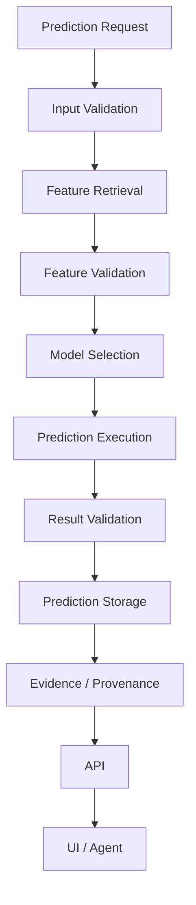

# Prediction Architecture

## 1. Purpose

This document defines the prediction request pipeline and the specific prediction domains DistrictMind's source material supports, elaborating [ai-architecture.md](../02_System_Architecture/ai-architecture.md) Section 8 (tool calling) and [entity-catalog.md](../05_Database_Design/entity-catalog.md) E-PRD-001/002 with full pipeline and per-domain detail.

## 2. The Prediction Pipeline

| Stage | Detail |
|---|---|
| Prediction Request | Via `request_prediction` ([ai-tool-contracts.md](../06_API_and_Integration/ai-tool-contracts.md) Section 16) or [api-contracts.md](../06_API_and_Integration/api-contracts.md) Operation 11 |
| Input Validation | Target entity, indicator, and horizon are well-formed and resolve to known entities |
| Feature Retrieval | Per [feature-engineering.md](feature-engineering.md), sourced from the relevant domain service(s) |
| Feature Validation | Sufficient historical depth exists; if not, the pipeline halts here with an explicit insufficient-data result (NFR-031) rather than proceeding with sparse input |
| Model Selection | Resolves to the specific Model Execution Metadata for the requested indicator/domain |
| Prediction Execution | The model produces a value + confidence indicator (where methodologically available, NFR-032) |
| Result Validation | The output is checked for basic sanity (e.g., a population forecast is not negative) before storage — a failed sanity check halts the pipeline with an explicit failure, not a silently-stored bad value |
| Prediction Storage | Written as an immutable Prediction record ([temporal-database-design.md](../05_Database_Design/temporal-database-design.md) Section 3) |
| Evidence / Provenance | The stored record's Model Execution Metadata and input Dataset Version references become the Evidence chain ([evidence-provenance-flow.md](../06_API_and_Integration/evidence-provenance-flow.md)) |
| API | Served via [api-contracts.md](../06_API_and_Integration/api-contracts.md) Operations 11/13 |
| UI / Agent | Consumed by the dashboard or, via `get_prediction`/`request_prediction`, the AI Agent Layer |

## 3. Sync/Async Classification

Restated from [agent-execution-architecture.md](agent-execution-architecture.md) Section 7: Prediction Execution is an **asynchronous** operation given model-inference latency; Storage/Evidence retrieval of an *already-computed* Prediction is synchronous.

## 4. Prediction Domains

Every domain below is checked against both source documents; where the Blueprint and the Abstract disagree, this is recorded explicitly (Section 4.6) rather than silently resolved, per this milestone's instruction.

### 4.1 Flood / Disaster Risk

| Field | Detail |
|---|---|
| Status | **Proposed** — Blueprint §12.1 |
| Target | Flood-risk classification or extent severity per area |
| Input | Historical rainfall, terrain elevation (Candidate source, [feature-engineering.md](feature-engineering.md) Section 4), proximity to water bodies, historical flood-extent records |
| Horizon | A hypothetical or near-term rainfall condition, not a fixed calendar horizon in the Blueprint's own framing |
| Spatial Scope | Per-village or per-area |
| Output | Risk classification + confidence score |
| Uncertainty | Model confidence score (Blueprint §12.1) |
| Provenance | Model Execution Metadata, input Dataset Version |
| Evaluation | **Under Evaluation** — no accuracy metric is specified by any source document; not invented here |

### 4.2 Rainfall

| Field | Detail |
|---|---|
| Status | **Proposed** — Blueprint §12.2 |
| Target | Future rainfall value for a date range |
| Input | Historical daily/monthly rainfall time series per station |
| Horizon | A requested future date range |
| Spatial Scope | Per weather station |
| Output | Forecast value + confidence interval |
| Uncertainty | Confidence interval, per the Blueprint's own description |
| Provenance | Same as above |
| Evaluation | **Under Evaluation** |

### 4.3 Population Growth

| Field | Detail |
|---|---|
| Status | **Proposed** — Blueprint §12.3 |
| Target | Population figure N years out |
| Input | Historical census snapshots per village (or mandal, where village-level history is sparse — Blueprint's own conditional) |
| Horizon | N years, per request |
| Spatial Scope | Per village or mandal |
| Output | Projected population figure |
| Uncertainty | Not explicitly specified by the Blueprint beyond the model choice itself being conditional on data sparsity |
| Provenance | Same as above |
| Evaluation | **Under Evaluation** |

### 4.4 Traffic / Transportation Disruption

| Field | Detail |
|---|---|
| Status | **Proposed** — Blueprint §12.4 ("Traffic Prediction," traffic-volume estimation) |
| Target | Traffic-volume change for a road segment/scenario |
| Input | Road class, historical/proxy traffic-volume data, population density along the corridor, proximity to hubs |
| Horizon | A given scenario condition (e.g., after a road closure reroutes traffic) — closely tied to Simulation ([simulation-architecture.md](simulation-architecture.md)), since the Blueprint's own example use is scenario-driven |
| Spatial Scope | Per road segment |
| Output | Estimated traffic-volume change |
| Uncertainty | Not explicitly specified |
| Provenance | Same as above |
| Evaluation | **Under Evaluation** |

### 4.5 Agricultural / Crop Conditions

| Field | Detail |
|---|---|
| Status | **Proposed** — Blueprint §12.5 |
| Target | Estimated yield for a village, crop, and season |
| Input | Historical crop-yield records, rainfall, soil/agricultural land-use data per village |
| Horizon | A given season |
| Spatial Scope | Per village |
| Output | Estimated yield |
| Uncertainty | Not explicitly specified |
| Provenance | Same as above |
| Evaluation | **Under Evaluation** |

### 4.6 Healthcare Demand — Discrepancy Between Sources

| Field | Detail |
|---|---|
| Status | **Proposed, with an unresolved source discrepancy** |
| Discrepancy | The **Abstract** explicitly names healthcare demand as a forecasting target: *"forecast events such as flood risks, traffic congestion, and healthcare demand."* The **Blueprint**'s concrete five-model list (§12.1–12.5: Flood, Rainfall, Population Growth, Traffic, Crop) does **not** include a Healthcare Demand model, and no corresponding dataset/algorithm is specified for it anywhere in the Blueprint. |
| Resolution | **Not silently resolved**, per this milestone's explicit instruction. Healthcare Demand is recorded here as a **Proposed** prediction domain on the strength of the Abstract alone, with its input/algorithm/evaluation fields marked **Under Evaluation** since no source specifies them. This discrepancy is also recorded in [ED-M2-P2B2B-VALIDATION.md](ED-M2-P2B2B-VALIDATION.md) Section 14 (Contradictions). |
| Plausible Input (if pursued) | Population, existing facility capacity/coverage, historical facility utilization (not currently an ingested dataset — Candidate) |

### 4.7 Environmental Conditions

Substantially the same as Rainfall (4.2) and, where temperature is concerned, covered by the same Weather Observation entity ([entity-catalog.md](../05_Database_Design/entity-catalog.md) E-WTH-002) — not treated as a separate model in the Blueprint, so not listed as a distinct prediction domain here beyond Rainfall.

### 4.8 Infrastructure Demand

Not named as a prediction target by either source document. **Not included** as a prediction domain in this document, consistent with the instruction to include a domain "only if supported by existing DistrictMind documentation."

## 5. Milestone Traceability

| Prediction Domain | First Available |
|---|---|
| All domains in Section 4 | M4 — Future (Predictive Intelligence) |

## 6. Open Decisions

- Every "Evaluation: Under Evaluation" cell in Section 4 — no accuracy/evaluation metric is specified by any source document; deferred to [model-lifecycle.md](model-lifecycle.md) and future model-specific design.
- Whether Healthcare Demand forecasting (4.6) is ultimately pursued, given its unresolved source discrepancy.
- Elevation/drainage data sourcing (Section 4.1), unchanged from [feature-engineering.md](feature-engineering.md) Section 4.
