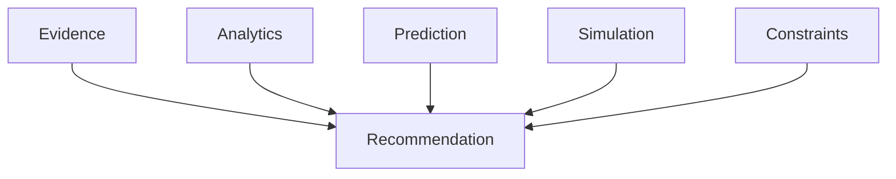
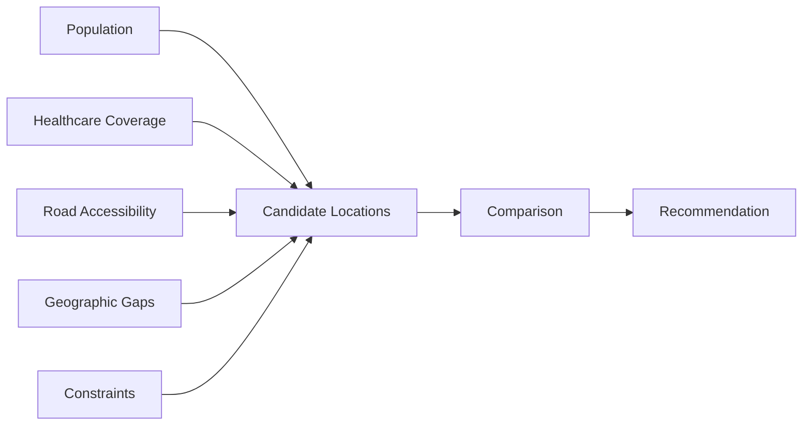

# Recommendation Engine

## 1. Purpose

This document defines how DistrictMind composes Evidence, Analytics, Prediction, and Simulation outputs into a Recommendation, elaborating [entity-catalog.md](../05_Database_Design/entity-catalog.md) E-REC-001/002 and [ai-ml-architecture.md](ai-ml-architecture.md) Section 8 (Category F) with full architectural detail. **Recommendations are never presented as commands or guaranteed outcomes** — this principle governs every section below.

## 2. The Composition

A Recommendation is never produced from a single input category — it is always a composition of Analytics (current/historical fact), Prediction (forecasted trend), Simulation (hypothetical outcome, where relevant), and Constraints (policy/budget/domain limits), all tied together by an Evidence chain that a human reviewer can independently verify ([evidence-provenance-flow.md](../06_API_and_Integration/evidence-provenance-flow.md)).

## 3. Required Documentation Per Recommendation

| Element | Definition |
|---|---|
| Recommendation rationale | The reasoning connecting the cited evidence to the suggested action, in human-readable form |
| Evidence | Resolvable references to the specific Analytical Result/Prediction/Scenario Output records used ([entity-catalog.md](../05_Database_Design/entity-catalog.md) E-REC-002) |
| Assumptions | Any hypothetical conditions inherited from a cited Simulation, explicitly named (never silently absorbed as fact) |
| Alternatives | Other candidates that were considered and scored, not only the top-ranked one — so a reviewer can see the comparison, not just the conclusion |
| Constraints | The domain-specific limits applied during scoring (e.g., budget zone, population threshold — Blueprint §14.1) |
| Trade-offs | What the recommended option gives up relative to alternatives (e.g., a closer candidate site with lower projected growth vs. a farther one with higher growth) |
| Uncertainty | Inherited from every cited Prediction's confidence indicator and every cited Simulation's assumption set — disclosed, not smoothed over ([ai-uncertainty-and-confidence.md](ai-uncertainty-and-confidence.md) Section 7) |
| Affected domains | Which domains the recommendation touches (e.g., Healthcare + Transportation for a facility-siting recommendation) |
| Affected population/assets | The specific population and/or infrastructure the recommendation concerns |
| Provenance | Generating Agent Execution reference, generation timestamp ([entity-catalog.md](../05_Database_Design/entity-catalog.md) E-REC-001) |

## 4. Worked Example — Healthcare Facility Placement

| Step | Detail |
|---|---|
| Population | Population Observation data, and its Prediction-derived growth forecast (M4 — Future) |
| Healthcare coverage | The coverage-gap Analytical Result ([spatial-query-services.md](../06_API_and_Integration/spatial-query-services.md) Section 7) |
| Road accessibility | The `accessibility_analysis` result ([spatial-query-services.md](../06_API_and_Integration/spatial-query-services.md) Section 8) |
| Geographic gaps | Uncovered village centroids, per [spatial-database-design.md](../05_Database_Design/spatial-database-design.md) Section 21.1 |
| Constraints | Policy/budget-zone limits, where a Knowledge Base document ([ai-architecture.md](../02_System_Architecture/ai-architecture.md) Section 7) provides them |
| Candidate locations | Every uncovered village centroid, scored per Section 5 |
| Comparison | Ranked candidates with their contributing scores, per the Blueprint's own weighted-sum formula (§14.2–14.3) |
| Recommendation | The top-ranked candidate(s), with the full Section 3 documentation attached |

**This document does not claim an exact optimal location** — no computation exists yet. The worked example describes the conceptual composition only, per the milestone brief's explicit instruction.

## 5. Scoring Approach (Conceptual, Proposed)

Per the Blueprint's own formula (§14.3), reused unchanged: `score = w1*(population_uncovered) + w2*(distance_to_nearest_facility) + w3*(projected_growth) - w4*(construction_cost_proxy, if available)`. This is a **Proposed** multi-criteria weighted-scoring approach; specific weight values (`w1`–`w4`) are not specified by any source document and are not invented here — assigning them is an implementation-time calibration task, not a documentation-milestone decision.

**AD-AI-005 — Recommendation Scoring Uses a Documented, Inspectable Weighted Formula, Not an Opaque Model**
- **Context:** Recommendation ranking could be implemented either as a transparent, weighted multi-criteria formula (each factor and its contribution visible) or as a trained ranking model (e.g., learning-to-rank) whose internal weighting is not directly inspectable.
- **Decision:** Recommendation scoring uses the explicit, documented weighted-sum formula above (and its facility-type-specific criteria, Section 6) — every factor contributing to a candidate's rank is named and traceable, never hidden inside a trained model's internal weights.
- **Alternatives considered:** A trained ranking/scoring model (rejected for this milestone — the Blueprint itself does not propose one for recommendation scoring, and an opaque model would undermine the Evidence-Based Recommendations and Explainable AI principles this entire folder is built around, since a human reviewer could not inspect *why* a candidate ranked where it did).
- **Reasoning:** Directly sourced from the Blueprint's own approach (§14.3); consistent with Section 7's "never a command or guarantee" requirement — a formula a reviewer can recompute by hand is inherently more reviewable than a model's opaque output.
- **Trade-offs:** A hand-tunable weighted formula may rank less accurately than a well-trained model could, in principle — accepted, since DistrictMind's Recommendation output is explicitly advisory (Section 7) and reviewability is prioritized over marginal ranking-accuracy gains for a human-in-the-loop decision.
- **Consequences:** Section 5's weight values remain an open, implementation-time calibration task (not a modeling task); any future move toward a trained ranking model would require revisiting this decision explicitly, not a silent substitution.
- **Status:** Proposed.

## 6. Facility-Type-Specific Criteria

Restated unchanged from the Blueprint §14.2 (Hospitals, Schools, Roads, Fire Stations, Police Stations, Government Buildings), each with its own primary scoring criteria — not re-derived here, only referenced, since [data-architecture.md](../04_Data_Engineering/data-architecture.md) Section 24 already incorporated this table.

## 7. Never a Command or Guarantee

Every Recommendation's presentation — in the API ([api-contracts.md](../06_API_and_Integration/api-contracts.md) Operation 15), in the dashboard, and in any AI Response citing it — uses advisory framing (*"the system recommends... for consideration"*), never directive framing (*"build here"*) or outcome-guaranteeing framing (*"this will solve the coverage gap"*). This is the direct realization of the Human-in-the-Loop principle and FR-032's requirement that a Recommendation cannot become "accepted" without an explicit, recorded human action.

## 8. Milestone Traceability

| Recommendation Capability | Milestone |
|---|---|
| Full composition (Section 2), scoring (Section 5), documentation requirements (Section 3) | M6 — Future |

## 9. Open Decisions

- Specific scoring weights (Section 5) — not specified by any source document, deferred to implementation-time calibration, likely requiring domain-expert input rather than an engineering decision alone.
- Whether a Knowledge Base corpus (Section 4's "Constraints" input) is ever sourced — unchanged open item from [data-sources.md](../04_Data_Engineering/data-sources.md) Section 9.
