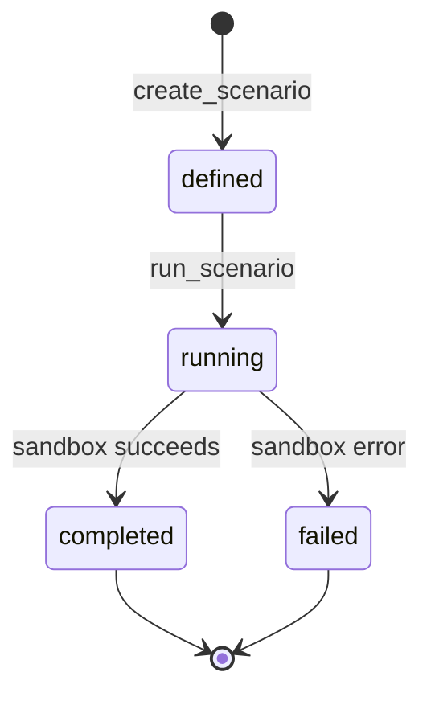

# Scenario Engine

## 1. Purpose

This document defines the conceptual structure of a Scenario, elaborating [entity-catalog.md](../05_Database_Design/entity-catalog.md) E-SIM-001/002 and [database-normalization.md](../05_Database_Design/database-normalization.md) AD-DB-003 with the full field-level detail this milestone requires. No implementation exists here.

## 2. Scenario Structure

| Field | Definition |
|---|---|
| Scenario ID | A stable, assigned identifier ([entity-catalog.md](../05_Database_Design/entity-catalog.md) Section 4's identifier-strategy pattern) |
| Name | A human-readable label (e.g., "R42 Bridge Closure") |
| Description | Free-text explanation of the hypothetical, for human review context |
| District scope | The district(s) the scenario concerns |
| Spatial scope | The specific geometry affected (e.g., a road segment, a rainfall-affected region) |
| Temporal scope | Scenario Time, per [temporal-database-design.md](../05_Database_Design/temporal-database-design.md) Section 2 — not a real calendar date, but a reference to the baseline snapshot's timestamp |
| Assumptions | The explicit hypothetical conditions being assumed (e.g., "road segment R42 is entirely impassable") |
| Parameters | The structured, type-specific parameter set ([database-normalization.md](../05_Database_Design/database-normalization.md) Section 2, AD-DB-003) |
| Baseline | A reference to the specific Dataset Version/snapshot the scenario is computed against |
| Requested change | The specific modification applied within the sandbox (e.g., "remove Road Segment X from the routable graph") |
| Execution status | defined → running → completed / failed |
| Outputs | Scenario Output records ([entity-catalog.md](../05_Database_Design/entity-catalog.md) E-SIM-002) |
| Comparison | Baseline vs. scenario deltas per affected entity |
| Provenance | Requesting user, submission timestamp, baseline snapshot reference — per [evidence-provenance-flow.md](../06_API_and_Integration/evidence-provenance-flow.md) |

## 3. Scenario Types (Per the Blueprint, §13.2)

| Type | What Changes in the Sandbox | What Gets Recomputed |
|---|---|---|
| Build Hospital | A new hospital point added at a candidate location | Coverage-gap analysis |
| Close Road | A road segment removed from the routing graph | Shortest-path routes and travel times |
| Flood | Affected villages/roads flagged based on Flood Prediction output | Facility accessibility and population-at-risk |
| Rainfall Change | The rainfall input feature adjusted | Flood-risk classification, then accessibility impact |
| Bridge Collapse | A specific edge (bridge) removed from the road graph | Rerouted paths, travel-time increases |
| New School | A new school point added at a candidate location | Education coverage-gap analysis |

These six types are **Proposed**, drawn directly and unchanged from the Blueprint; no new scenario type is invented by this document.

## 4. Worked Example — Bridge Closure

| Stage | Detail |
|---|---|
| Baseline | Normal transportation network — the current, Observed Road/Road Segment state |
| Scenario | A specific bridge (a Road Segment) unavailable |
| Simulation | Network accessibility recomputed: shortest paths for all origin-destination pairs dependent on the removed segment ([spatial-query-services.md](../06_API_and_Integration/spatial-query-services.md) Section 8) |
| Impact | Affected villages/facilities identified via the recomputed accessibility deltas |
| Decision support | Healthcare accessibility consequences — e.g., "Village X's nearest-hospital travel time increases from 12 to 27 minutes" (the Blueprint's own worked figures, §13.3) |

This is the identical example used in [gis-service-design.md](../06_API_and_Integration/gis-service-design.md) Example 2 and [simulation-architecture.md](simulation-architecture.md); this document adds the full Scenario *structure* (Section 2) that example's underlying data would populate.

## 5. Provenance Detail

Every Scenario Output carries: its originating Scenario's identifier, the baseline Dataset Version it was computed against, and the execution timestamp — enabling a later reviewer to reconstruct exactly what assumptions produced a given comparison (Reproducibility), and to distinguish it unambiguously from any Observed or Predicted data (Section 6, [digital-twin-state-model.md](../05_Database_Design/digital-twin-state-model.md)).

## 6. Execution Status Transitions

A `failed` scenario never partially populates Scenario Output records — per [simulation-architecture.md](simulation-architecture.md) Section 3, a simulation failure is complete and explicit, never a silently incomplete result.

## 7. Milestone Traceability

| Scenario Engine Capability | Milestone |
|---|---|
| Scenario structure, all six Blueprint-sourced types | M5 — Future |

## 8. Open Decisions

- Whether additional scenario types beyond the Blueprint's six are ever introduced — no commitment, would require a new Architecture Decision if pursued.
- Exact structured-parameter representation per type — unchanged open item from [database-normalization.md](../05_Database_Design/database-normalization.md) Section 10.
