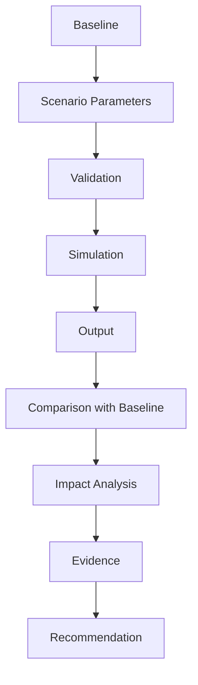

# Simulation Architecture

## 1. Purpose

**Simulation is not Prediction.** This document defines the simulation lifecycle and draws the explicit boundary between Prediction, Simulation, Recommendation, and AI Response, elaborating [digital-twin-state-model.md](../05_Database_Design/digital-twin-state-model.md) and AD-DE-004 with the full architectural detail this milestone requires.

## 2. The Four Questions

| Category | Question It Answers | DistrictMind Example |
|---|---|---|
| **Prediction** | "What is likely to happen?" | "Rainfall next month is estimated at X mm." |
| **Simulation** | "What could happen under specified assumptions?" | "If road R42 closes, travel time to the nearest hospital becomes Y minutes." |
| **Recommendation** | "What should we consider doing?" | "Consider siting the next PHC at Village Z, given coverage gaps and growth forecasts." |
| **AI Response** | "How should the system explain this?" | The natural-language synthesis of any of the above, with citations |

These four are structurally distinct entity families ([digital-twin-state-model.md](../05_Database_Design/digital-twin-state-model.md) Section 3) — this document does not redefine that separation, only restates it as the organizing frame for Simulation specifically.

## 3. The Simulation Lifecycle

| Stage | Detail |
|---|---|
| Baseline | A snapshot reference of current Curated/Derived state ([entity-catalog.md](../05_Database_Design/entity-catalog.md) E-AUD-002, Dataset Version) |
| Scenario Parameters | The hypothetical modification, per [scenario-engine.md](scenario-engine.md) |
| Validation | Parameters checked against their expected shape/range before any computation runs ([backend-architecture.md](../02_System_Architecture/backend-architecture.md) Section 8) |
| Simulation | The sandboxed, discard-after-use computation (AD-DE-004) — clone the relevant baseline subset, apply the change, recompute |
| Output | Scenario Output records ([entity-catalog.md](../05_Database_Design/entity-catalog.md) E-SIM-002) |
| Comparison with Baseline | Before/after deltas per affected entity, per the Blueprint's own structured-delta output format (§13.3) |
| Impact Analysis | Interpreting which assets/population are meaningfully affected by the computed deltas |
| Evidence | The comparison + impact results become citable Evidence for a downstream Recommendation or AI Response |
| Recommendation | Optional — not every Simulation leads to a Recommendation; some are run purely for exploratory decision support |

## 4. Deterministic vs. Rule-Based vs. Analytical Simulation

| Type | Definition | DistrictMind Fit |
|---|---|---|
| Deterministic simulation | Given the same baseline and parameters, always produces the same output | The Blueprint's described approach — recompute routing/flood extent given a specific hypothetical change (§13.1–13.3), no randomness involved |
| Rule-based simulation | Applies explicit, human-defined rules to determine outcomes (e.g., "if road segment removed, recompute shortest path") | Matches the Blueprint's road-closure and bridge-collapse scenario types (§13.2) |
| Analytical simulation | Reuses already-trained Prediction models as inputs under modified conditions (e.g., flood risk under an adjusted rainfall parameter) | Matches the Blueprint's rainfall-change scenario type (§13.2), which explicitly reuses the Flood Prediction model (§13.1: "the trained Prediction Engine models") |
| Candidate future approaches | Monte Carlo / stochastic simulation, agent-based modeling | **Not** specified by any source document — recorded here only as a conceptual future possibility, **Candidate**, no commitment |

DistrictMind's simulation approach, per the Blueprint, is a combination of rule-based and analytical simulation — **deterministic**, not stochastic. No simulation technology is chosen as final beyond the Candidate/Proposed status already established in [technology-stack.md](../00_Engineering_Overview/technology-stack.md) (GeoPandas, NetworkX).

**AD-AI-002 — Simulation Reuses Trained Prediction Models Rather Than Training Independent Simulation Models**
- **Context:** The Simulation Engine needs to recompute domain outcomes (e.g., flood extent) under a hypothetical input change, but training a separate model specifically for simulation would duplicate the Prediction layer's own modeling effort and risk the two diverging.
- **Decision:** Analytical simulation types (e.g., "Rainfall Change") invoke the already-trained Prediction models ([prediction-architecture.md](prediction-architecture.md)) with a modified input, rather than training or maintaining a separate simulation-specific model.
- **Alternatives considered:** Independent simulation models trained specifically for hypothetical scenarios (rejected — doubles modeling/maintenance effort for no accuracy benefit, since the underlying physical/statistical relationship being modeled is the same whether the input is real or hypothetical); a purely stochastic/Monte Carlo simulation approach (rejected as a current commitment — recorded only as a Candidate future possibility, Section 4).
- **Reasoning:** Directly sourced from the Blueprint's own design (§13.1: "the trained Prediction Engine models"); reduces model-lifecycle burden ([model-lifecycle.md](model-lifecycle.md)) by reusing one governed model family instead of two.
- **Trade-offs:** Simulation's outcome quality is bounded by whatever the underlying Prediction model already supports — a simulation type requiring a model DistrictMind has not yet built (e.g., a hypothetical crop-yield scenario, if no Crop Prediction model exists) cannot be supported until that model exists.
- **Consequences:** Every analytical Scenario type in [scenario-engine.md](scenario-engine.md) Section 3 is only as capable as its corresponding Prediction model's domain coverage ([prediction-architecture.md](prediction-architecture.md) Section 4).
- **Status:** Proposed.

## 5. Why Simulation Is Not Prediction

A Prediction estimates a real future value with an associated confidence based on historical patterns; it has no "assumption" beyond "current patterns continue." A Simulation explicitly assumes a hypothetical condition that may never occur (a bridge closing, a 30% rainfall increase) and asks what would follow *if* it did — there is no historical ground truth to evaluate a Simulation's "accuracy" against, which is why Section 2 of [ai-ml-architecture.md](ai-ml-architecture.md) explicitly notes Simulation's evaluation criterion is consistency against baseline, not accuracy.

## 6. Sandboxing Guarantee — Restated

Unchanged from AD-DE-004: the Simulation stage clones only the relevant baseline subset, computes in isolation, and discards the sandbox — **the production Curated layer is never mutated by a simulation.** This document adds no new mechanism; it restates the guarantee as the specific safety property this entire lifecycle depends on.

## 7. Milestone Traceability

| Simulation Capability | Milestone |
|---|---|
| Baseline snapshotting, scenario parameter validation | M5 — Future |
| Full lifecycle (Section 3) | M5 — Future |
| Recommendation consumption of Simulation Evidence | M6 — Future |

## 8. Open Decisions

- Final simulation compute technology (GeoPandas/NetworkX remain Proposed/Candidate, unchanged).
- Whether any future Candidate approach (Monte Carlo, agent-based modeling, Section 4) is ever pursued — no commitment, not evaluated further here.
