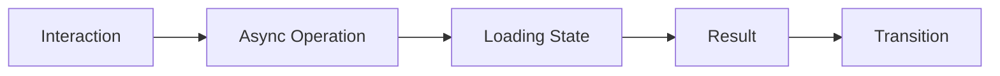

# Coding Standards

## 1. Purpose

This document defines coding standards for every language/technology category DistrictMind's architecture supports, elaborating [naming-conventions.md](../03_Project_Structure/naming-conventions.md) with implementation-level discipline. No formatter/linter is selected where none is already established — such choices are marked **Under Evaluation**.

## 2. Python (Backend, AI/ML, Data Engineering)

| Concern | Standard |
|---|---|
| Naming | `snake_case` for functions/variables/modules, `PascalCase` for classes — per [naming-conventions.md](../03_Project_Structure/naming-conventions.md) Sections 4, 6 |
| Functions | Verb-first, single responsibility, per Section 4 of naming-conventions.md |
| Classes | Named after the domain entity they represent where applicable (`District`, `HealthFacility`) — per Section 6 |
| Modules/files | One module per logical concern, matching [backend-structure.md](../03_Project_Structure/backend-structure.md) Section 4's per-module shape |
| Imports | No wildcard imports; imports ordered standard-library → third-party → local, per common Python convention (not itself a DistrictMind-specific decision) |
| Type safety | Type hints on all public function signatures — supports the two-stage validation discipline in [backend-architecture.md](../02_System_Architecture/backend-architecture.md) Section 8 |
| Formatter/Linter | **Under Evaluation** — no tool (e.g., Black, Ruff) is confirmed by any prior document |

## 3. JavaScript / TypeScript / React

Applicable only if React (Proposed) is the eventual frontend framework — [technology-stack.md](../00_Engineering_Overview/technology-stack.md) §4.1.

| Concern | Standard |
|---|---|
| Naming | `PascalCase` for components, `camelCase` for functions/variables — per [naming-conventions.md](../03_Project_Structure/naming-conventions.md) Sections 3–4 |
| Components | Named for what they render, tiered as primitive/domain/page per [frontend-architecture.md](../02_System_Architecture/frontend-architecture.md) Section 5 |
| Type safety | TypeScript throughout (Proposed, [technology-stack.md](../00_Engineering_Overview/technology-stack.md) §4.1) — no untyped `.js` files in new code once confirmed |
| Formatter/Linter | **Under Evaluation** — no tool (e.g., ESLint/Prettier) is confirmed |

## 4. SQL

| Concern | Standard |
|---|---|
| Naming | `snake_case`, plural table names, unprefixed columns — per [naming-conventions.md](../03_Project_Structure/naming-conventions.md) Sections 9–10 |
| Migrations | Versioned, forward-only in normal operation, per [database-architecture.md](../02_System_Architecture/database-architecture.md) Section 14 |
| Queries | No raw string-concatenated queries — parameterized queries only, per [security-architecture.md](../02_System_Architecture/security-architecture.md) Section 2 (injection prevention) |
| No SQL is written by this document or milestone — these standards govern future implementation only |

## 5. Markdown (Documentation)

| Concern | Standard |
|---|---|
| Structure | Every document begins with the required metadata block (Document Name, ID, Version, Status, Owner, Created, Last Updated) — unchanged since ED-M1 |
| Diagrams | Mermaid, per the convention established across every architecture document in this program |
| Cross-referencing | Relative Markdown links to other documents in this set, as used consistently throughout `00_Engineering_Overview/` through `08_Implementation_Foundation/` |

## 6. API Implementation

| Concern | Standard |
|---|---|
| Style | REST + OpenAPI, per AD-BE-002 | 
| Contract source of truth | [api-contracts.md](../06_API_and_Integration/api-contracts.md) — implementation must match the documented contract, not diverge from it silently; a divergence requires updating the documentation, not the other way around (Documentation as a Source of Truth) |
| Error responses | The structured, classified error model in [api-design-principles.md](../06_API_and_Integration/api-design-principles.md) Section 12 |

## 7. GIS Processing

| Concern | Standard |
|---|---|
| CRS discipline | All stored/exchanged geometry in the canonical CRS (WGS84/EPSG:4326, Proposed) — reprojection happens once, at ingestion, never per-query, per [gis-architecture.md](../02_System_Architecture/gis-architecture.md) Section 6 |
| Validation | Every geometry validated per [data-validation.md](../04_Data_Engineering/data-validation.md) Section 4 before use |
| No raw geometry math | Spatial operations use the library/engine's native operators (per the eventual PostGIS/GeoPandas/Shapely choice — all still Proposed/Candidate), never hand-rolled trigonometry, per the Blueprint's own §10.2 rationale |

## 8. AI/ML Implementation

| Concern | Standard |
|---|---|
| Tool boundary | Every AI data access implemented as a Typed AI Tool per [ai-tool-contracts.md](../06_API_and_Integration/ai-tool-contracts.md) — no direct database or unrestricted query code path, ever |
| Model versioning | Every trained model artifact tagged with a version, referenced by Model Execution Metadata — per [model-lifecycle.md](../07_AI_GIS_and_Intelligence/model-lifecycle.md) Section 4 |
| No fabricated confidence | Per AD-AI-003 ([ai-uncertainty-and-confidence.md](../07_AI_GIS_and_Intelligence/ai-uncertainty-and-confidence.md)) — implementation code must not invent a confidence value where the underlying method provides none |

## 9. Error Handling (Cross-Cutting)

Every language/layer implements the error classification and disclosure discipline in [api-design-principles.md](../06_API_and_Integration/api-design-principles.md) Section 12 and [ai-safety-and-grounding.md](../07_AI_GIS_and_Intelligence/ai-safety-and-grounding.md) — no internal detail (stack traces, credentials, internal service names) ever reaches a client-facing error message, and every error is logged before being surfaced.

## 10. Logging

Structured logging (NFR-025), never including secrets or unredacted personal data, per [technical-requirements.md](../01_Requirements/technical-requirements.md) Logging Requirements — restated as an implementation-code obligation, not newly decided.

## 11. Comments and Documentation

Code comments explain *why*, not *what* — matching this documentation program's own house style (stated in the system-level engineering guidance this project operates under). Every public function/class carries a docstring/comment describing its contract (inputs, outputs, side effects) sufficient for another engineer to use it without reading its implementation.

## 12. Validation and Security (Cross-Cutting)

Every input is validated at the layer boundary before use (two-stage pattern, [backend-architecture.md](../02_System_Architecture/backend-architecture.md) Section 8); every external input is treated as untrusted (Security by Design); no secret is ever hardcoded (Section 8, [configuration-management.md](configuration-management.md)).

## 13. Testing

Every standard above is verifiable by the testing pyramid defined in [engineering-quality-gates.md](engineering-quality-gates.md) Section 8 — coding standards and testability are treated as inseparable, per the Testability principle ([engineering-principles.md](../00_Engineering_Overview/engineering-principles.md)).

## 14. UI Engineering Requirements

DistrictMind's eventual UI must be responsive, polished, modern, professional, visually clear, and animation-rich but performance-safe — restated unchanged from [frontend-architecture.md](../02_System_Architecture/frontend-architecture.md) Sections 18–19. This section defines the implementation-level discipline that requirement demands, since no dedicated file in this milestone covers it separately.

### 14.1 The Interaction Pattern

Every user interaction that triggers data movement (a district selection, a filter change, a scenario submission) follows this pattern — never a synchronous, UI-blocking call, per [frontend-architecture.md](../02_System_Architecture/frontend-architecture.md) Section 18.

### 14.2 Required Implementation Patterns

| Requirement | Implementation Discipline |
|---|---|
| Smooth page transitions | Route-level code splitting so a transition does not stall on downloading unrelated code ([frontend-architecture.md](../02_System_Architecture/frontend-architecture.md) Section 18) |
| District-map interactions (pan/zoom/select) | Debounced/throttled event handling; expensive re-fetches (e.g., mandal detail on zoom) are not triggered on every intermediate frame |
| Hover/selection states | Local component state only — never a network round-trip merely to reflect a hover |
| Dashboard transitions | Skeleton loading states matching the eventual content's shape ([frontend-architecture.md](../02_System_Architecture/frontend-architecture.md) Section 10), not a generic spinner |
| Loading skeletons | Rendered immediately on navigation, replaced by real content once the async operation (14.1) resolves |
| Progressive rendering | Above-the-fold content (map, primary indicators) renders before below-the-fold widgets |
| Chart animation | Animates a *transition between data states*, never used to disguise a slow query — the animation begins only once real data has arrived |
| Map-layer transitions | Layer visibility/opacity changes are GPU-accelerated CSS/canvas transitions, not full layer re-fetch-and-redraw |
| Modal/drawer transitions | Short, interruptible, never blocking the underlying page's own interactivity |
| Scenario controls | Submission triggers the async pattern (14.1) with explicit "running" status, per [scenario-engine.md](../07_AI_GIS_and_Intelligence/scenario-engine.md) Section 6 |
| AI response streaming/progressive display (where the provider supports it) | Reduces perceived latency for Operation 16 ([api-contracts.md](../06_API_and_Integration/api-contracts.md)) — an Under Evaluation mechanism, per [ai-agent-integration.md](../06_API_and_Integration/ai-agent-integration.md) Section 9 |

### 14.3 The Critical Rule

**Animations must never block:** API calls, map rendering, user interaction, data loading, or navigation. An animation is a presentation-layer concern layered *on top of* the async pattern (14.1) — it never gates when a real operation starts or how quickly its result becomes usable.

### 14.4 What to Avoid

Unnecessary re-renders (addressed by the state-separation discipline in [frontend-architecture.md](../02_System_Architecture/frontend-architecture.md) Section 6), giant DOM trees (addressed by virtualization for long lists, Section 18 of the same document), blocking synchronous operations (addressed by 14.1's mandatory async pattern), heavy animation loops (bounded, interruptible animations only, per 14.3), and unoptimized map layers (addressed by geometry simplification, [gis-architecture.md](../02_System_Architecture/gis-architecture.md) Section 15).

## 15. Milestone Traceability

| Standard Category | First Enforced |
|---|---|
| Python, SQL, Markdown, API | M1 |
| JavaScript/TypeScript/React, UI Engineering Requirements | M1 (frontend shell) |
| GIS processing | M1 |
| AI/ML implementation | M3 |

## 16. Open Decisions

- Python formatter/linter (Section 2).
- JavaScript/TypeScript formatter/linter (Section 3).
- Whether a pre-commit hook or CI check enforces any of the above — implementation-time tooling, not decided here.
