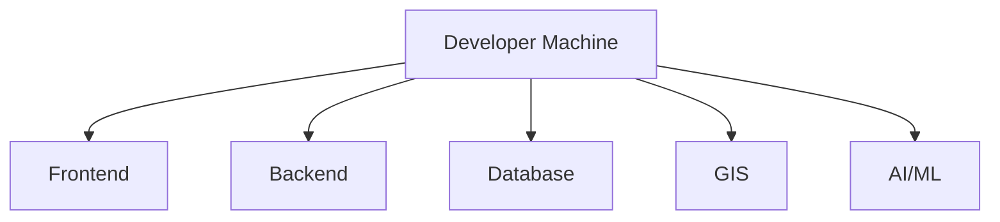

# Development Environment

## 1. Purpose

This document defines the proposed developer environment for DistrictMind. No exact version is asserted unless already established elsewhere in this documentation set; every technology carries its existing status, unchanged.

## 2. The Environment Stack

## 3. Operating System Considerations

No operating system is confirmed or required by any prior document. DistrictMind's technology candidates (Python, Node.js, PostgreSQL/PostGIS, Docker) are all cross-platform — this document does not mandate a specific developer OS. **Status: Not applicable / no constraint identified.**

## 4. VS Code

**Status: Proposed.** Not previously confirmed in any document, but consistent with the current session's own tooling context and with [system-requirements.md](../01_Requirements/system-requirements.md) Development Requirements' call for "a documented local development setup." No specific extension set is mandated here.

## 5. Git

**Status: Confirmed.** Per [technology-stack.md](../00_Engineering_Overview/technology-stack.md) §4.14 — the only Confirmed technology in the entire documentation set to date. GitHub (hosting/PR review) remains **Proposed**, unchanged.

## 6. Python Environment

**Status: Candidate.** Per [technology-stack.md](../00_Engineering_Overview/technology-stack.md) §4.2 (FastAPI/Python among backend Candidates) and the Blueprint's own strong preference (§5.2: "Python... single language across data engineering, ML, and AI orchestration"). No specific Python version is confirmed by any source document — not invented here.

## 7. Node.js Environment

**Status: Candidate,** required only if the frontend framework (React — Proposed, [technology-stack.md](../00_Engineering_Overview/technology-stack.md) §4.1) is confirmed. No specific Node.js version is confirmed.

## 8. Frontend Development Server

**Status: Under Evaluation** — dependent on the final frontend framework/build-tool choice (React/Next.js remain Candidate/Proposed). No specific dev-server tooling (e.g., Vite) is named by any prior document.

## 9. Backend Development Server

**Status: Under Evaluation** — dependent on the final backend framework choice (FastAPI/Node.js/Django remain Candidate, [technology-stack.md](../00_Engineering_Overview/technology-stack.md) §4.2).

## 10. Database Development Environment

**Status: Proposed** for PostgreSQL + PostGIS specifically (AD-DE-001, [data-architecture.md](../04_Data_Engineering/data-architecture.md); AD-DB-001, [database-architecture.md](../02_System_Architecture/database-architecture.md)), among the Candidate options in [technology-stack.md](../00_Engineering_Overview/technology-stack.md) §4.3–4.4. A local database instance (containerized or natively installed) is required for development; the specific mechanism (Docker Compose — Proposed, §4.12) is not further confirmed here.

## 11. GIS Development Requirements

A local database with spatial extension capability (Section 10) plus, per the Blueprint's Proposed stack (§5.7), GeoPandas/Shapely/OSMnx (all **Candidate**, [technology-stack.md](../00_Engineering_Overview/technology-stack.md) §4.4 and this program's later AI/ML documents). Boundary/road source data must be locally available for meaningful GIS development — see [data-sources.md](../04_Data_Engineering/data-sources.md), which notes no specific source is yet confirmed accessible.

## 12. AI Development Requirements

Depends entirely on the unresolved AI-provider decision ([data-architecture.md](../04_Data_Engineering/data-architecture.md) Section 33 #2; restated through every subsequent milestone including [ai-ml-architecture.md](../07_AI_GIS_and_Intelligence/ai-ml-architecture.md) Section 9) — **Under Evaluation**. If the Blueprint's local-model proposal (Llama 3 via Ollama, §5.4) is pursued, local development would additionally require sufficient compute for local model inference; if a hosted provider (e.g., among ED-M1's Candidate list) is pursued instead, development requires only API credentials (never committed to documentation or version control, per Section 9 of [configuration-management.md](configuration-management.md)).

## 13. Technology Status Summary Table

| Technology | Category | Status |
|---|---|---|
| Git | Version control | **Confirmed** |
| GitHub | Hosting/PR review | Proposed |
| VS Code | Editor | Proposed |
| Python | Backend/AI/ML language | Candidate |
| Node.js | Frontend tooling | Candidate |
| React / Next.js | Frontend framework | Proposed / Candidate |
| FastAPI / Node.js / Django | Backend framework | Candidate |
| PostgreSQL + PostGIS | Database | Proposed |
| Docker | Local environment parity | Proposed |
| GeoPandas / Shapely / OSMnx | GIS libraries | Candidate |
| AI/LLM provider | AI development | Under Evaluation (unresolved) |

## 14. Local Development vs. Future Production

| Aspect | Local Development | Future Production |
|---|---|---|
| Database | Local instance (containerized or native), seeded with limited/sample data | A confirmed hosting target — **not yet decided** ([constraints.md](../01_Requirements/constraints.md) Infrastructure Constraints) |
| AI provider | May use a lower-cost or local model for iteration, per the Blueprint's own local-first rationale (§5.4: "no per-token API cost") | Provider decision still unresolved |
| Secrets | Local `.env`-style files, never committed ([configuration-management.md](configuration-management.md)) | A confirmed secrets-management approach — **not yet decided** ([security-architecture.md](../02_System_Architecture/security-architecture.md) Section 20) |
| Data | Sample/fixture data only, never real production data ([environment-management.md](environment-management.md) Section 5) | Real Curated data, subject to full governance ([data-governance.md](../04_Data_Engineering/data-governance.md)) |

This document does not create any actual configuration, `.env` file, or `requirements.txt` — per the milestone's explicit restrictions.

## 15. Milestone Traceability

| Environment Capability | First Needed |
|---|---|
| Git, VS Code, basic Python/Node.js setup | Before M1 implementation begins |
| Database + GIS local environment | M1 |
| AI development environment | M3 |

## 16. Open Decisions

Every "Status" cell in Section 13 marked Candidate/Proposed/Under Evaluation remains genuinely open — this document elevates none of them, consistent with Section 25 of the milestone brief.
