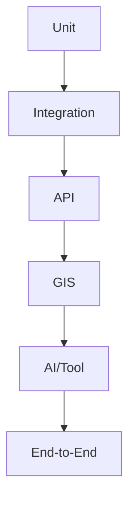

# Engineering Quality Gates

## 1. Purpose

This document defines the ten gates that must be passed before implementation progresses to the next phase, and — because no dedicated file exists for them among this milestone's 12 required files — the Performance, Security, Error-Handling, Observability, and Testing foundations that every gate's validation criteria draw from. No numerical threshold is invented anywhere in this document.

**AD-IMP-005 — Ten Qualitative Gates Aligned to M1–M6, No Invented Numerical Thresholds**
- **Context:** A quality-gate system needs enough structure to meaningfully block progression on real problems, without inventing false precision (a specific test-coverage percentage, a specific response-time number) that no prior document has established or validated.
- **Decision:** Ten gates (Section 2), each aligned to a specific point in the M1–M6 progression (Section 9), with qualitative entry/exit criteria (does the behavior demonstrably and correctly work) rather than numerical thresholds.
- **Alternatives considered:** A single "done when the milestone is done" gate per product milestone (rejected — too coarse to catch a specific-layer regression before it compounds, per [implementation-strategy.md](implementation-strategy.md) Section 3's Risk-First principle); gates with invented numerical thresholds for consistency with typical engineering practice (rejected — directly contradicts this milestone's explicit "do not invent numerical thresholds" instruction, and would repeat the False Precision failure mode already named in [ai-safety-and-grounding.md](../07_AI_GIS_and_Intelligence/ai-safety-and-grounding.md) Section 7).
- **Reasoning:** Ten gates map cleanly onto the layered architecture (Repository → Database → Backend → GIS → Frontend → AI → Prediction → Simulation → Recommendation → Integration) already established across `02_System_Architecture/` through `07_AI_GIS_and_Intelligence/`; qualitative criteria remain consistent with every quality/confidence metric left deliberately unset throughout this documentation program (e.g., [data-quality.md](../04_Data_Engineering/data-quality.md) Section 3).
- **Trade-offs:** Qualitative gates require human judgment to assess "correctly work," which is less mechanically automatable than a numeric threshold — accepted, since inventing a threshold with no empirical basis would be worse than requiring judgment.
- **Consequences:** Every future revision of this document that adds a numeric threshold must justify it against real, gathered data (per the pattern already established in [non-functional-requirements.md](../01_Requirements/non-functional-requirements.md)'s "Initial Target / To Be Validated" convention), not invent one.
- **Status:** Proposed.

## 2. The Ten Gates

| Gate | Scope |
|---|---|
| 1 — Repository Foundation | Project scaffolding, environment setup, documentation linkage |
| 2 — Database Foundation | Schema for Geography domain, migrations working, spatial extension operational |
| 3 — Backend Foundation | API layer + Geography Service, structural validation, error shaping |
| 4 — GIS Foundation | Boundary retrieval, containment queries, CRS discipline |
| 5 — Frontend Foundation | Application shell, routing, district map rendering |
| 6 — AI Foundation | Typed AI Tools for existing domains, grounding validation active |
| 7 — Prediction | At least one working Prediction domain with confidence disclosure |
| 8 — Simulation | Sandboxed scenario execution with no production-data mutation |
| 9 — Recommendation | Evidence-linked recommendation generation with human-review gating |
| 10 — Integrated System | End-to-end vertical slice across all layers, validated |

## 3. Gate Definitions

### Gate 1 — Repository Foundation

| Field | Detail |
|---|---|
| Entry criteria | Documentation set (ED-M1 through this milestone) exists and is reviewed |
| Required validation | Repository structure matches [repository-implementation-map.md](repository-implementation-map.md); local development environment ([development-environment.md](development-environment.md)) is reproducible by a new contributor without undocumented manual steps ([system-requirements.md](../01_Requirements/system-requirements.md) Development Requirements) |
| Exit criteria | A contributor can clone the repository and run a local environment following only the documentation |
| Known risks | Undocumented manual setup steps; environment drift between contributors |
| Rollback condition | If the environment cannot be reproduced, the foundation is not exited — documentation is corrected before proceeding |

### Gate 2 — Database Foundation

| Field | Detail |
|---|---|
| Entry criteria | Gate 1 passed |
| Required validation | Geography domain schema ([entity-catalog.md](../05_Database_Design/entity-catalog.md) Section 4) implemented and migrated; a District/Mandal/Village record can be created, versioned, and queried; spatial indexing operational ([database-indexing-strategy.md](../05_Database_Design/database-indexing-strategy.md) Section 4) |
| Exit criteria | Containment queries return correct results against a known test boundary set |
| Known risks | Database/spatial-extension product still Proposed, not Confirmed — a late product change would require schema rework |
| Rollback condition | Containment queries produce incorrect results, or CRS handling is inconsistent |

### Gate 3 — Backend Foundation

| Field | Detail |
|---|---|
| Entry criteria | Gate 2 passed |
| Required validation | API layer routes to the Geography Service ([api-architecture.md](../06_API_and_Integration/api-architecture.md)); two-stage validation active ([backend-architecture.md](../02_System_Architecture/backend-architecture.md) Section 8); structured error responses per [api-design-principles.md](../06_API_and_Integration/api-design-principles.md) Section 12 |
| Exit criteria | `get_district`-equivalent read path (Operation 1, [api-contracts.md](../06_API_and_Integration/api-contracts.md)) works end-to-end with correct authorization enforcement |
| Known risks | Backend framework still Candidate, not Confirmed |
| Rollback condition | Authorization can be bypassed, or errors leak internal detail |

### Gate 4 — GIS Foundation

| Field | Detail |
|---|---|
| Entry criteria | Gate 3 passed |
| Required validation | Boundary retrieval with level-of-detail simplification ([gis-architecture.md](../02_System_Architecture/gis-architecture.md) Section 15); spatial index performance validated against NFR-035's Initial Target |
| Exit criteria | District map data resolves correctly for at least the pilot district (per [implementation-strategy.md](implementation-strategy.md) Section 4's vertical-slice approach) |
| Known risks | Boundary data source not yet identified ([data-sources.md](../04_Data_Engineering/data-sources.md)) |
| Rollback condition | Rendering performance falls materially short of NFR-035's target |

### Gate 5 — Frontend Foundation

| Field | Detail |
|---|---|
| Entry criteria | Gate 3 passed (Gate 4 not required — per [implementation-order.md](implementation-order.md) Section 4's parallel-development note) |
| Required validation | Application shell, routing, and skeleton loading states ([frontend-architecture.md](../02_System_Architecture/frontend-architecture.md) Sections 2, 10) |
| Exit criteria | District Map (once Gate 4 also passes) renders the pilot district with pan/zoom |
| Known risks | Frontend framework still Proposed/Candidate |
| Rollback condition | Application shell fails to load, or map interaction is unresponsive |

### Gate 6 — AI Foundation

| Field | Detail |
|---|---|
| Entry criteria | Gates 3–5 passed for at least the domains a first tool set wraps |
| Required validation | Typed AI Tools implemented per [ai-tool-contracts.md](../06_API_and_Integration/ai-tool-contracts.md); Grounding Validation active ([ai-safety-and-grounding.md](../07_AI_GIS_and_Intelligence/ai-safety-and-grounding.md) Section 2); no unrestricted database access exists anywhere in the AI code path (AD-API-002, AD-DB-006, AD-DE-005) |
| Exit criteria | A grounded query returns a cited response; an unanswerable query returns an explicit "cannot answer" (FR-022) |
| Known risks | AI provider unresolved — Gate 6 cannot fully close until a provider is selected |
| Rollback condition | Any AI code path is found to bypass the Typed Tool boundary — this is treated as a critical failure, not a minor defect |

### Gate 7 — Prediction

| Field | Detail |
|---|---|
| Entry criteria | Gate 6 passed; sufficient historical data exists for at least one prediction domain |
| Required validation | Model Lifecycle stages (Data → Feature Engineering → Training → Validation → Evaluation → Approval → Deployment, [model-lifecycle.md](../07_AI_GIS_and_Intelligence/model-lifecycle.md)) completed for one domain; confidence disclosed per NFR-032 |
| Exit criteria | A Prediction is retrievable via the API with full provenance ([evidence-provenance-flow.md](../06_API_and_Integration/evidence-provenance-flow.md)) |
| Known risks | No evaluation metric is specified by any source document ([prediction-architecture.md](../07_AI_GIS_and_Intelligence/prediction-architecture.md)) — Gate 7's Approval stage requires a human judgment call in the absence of a predefined threshold |
| Rollback condition | A Prediction is presented without confidence/provenance metadata |

### Gate 8 — Simulation

| Field | Detail |
|---|---|
| Entry criteria | Gate 7 passed (for analytical scenario types reusing a Prediction model) |
| Required validation | Sandboxing guarantee verified — a simulation run demonstrably does not mutate Curated/production data (AD-DE-004) |
| Exit criteria | A Scenario runs and produces a Scenario Output distinguishable from Observed/Predicted data |
| Known risks | Simulation compute technology still Proposed/Candidate |
| Rollback condition | Any simulation run is found to have written to a non-sandboxed table — treated as a critical failure |

### Gate 9 — Recommendation

| Field | Detail |
|---|---|
| Entry criteria | Gates 7–8 passed |
| Required validation | A Recommendation's full evidence chain resolves correctly (FR-031); status cannot transition to "accepted" without a recorded human action (FR-032) |
| Exit criteria | A Recommendation is generated, reviewed, and its review action is audit-logged |
| Known risks | Recommendation scoring weights unresolved ([recommendation-engine.md](../07_AI_GIS_and_Intelligence/recommendation-engine.md) Section 9) |
| Rollback condition | A Recommendation can be accepted without a human action, or its evidence chain is broken |

### Gate 10 — Integrated System

| Field | Detail |
|---|---|
| Entry criteria | Gates 1–9 passed |
| Required validation | A full vertical slice — Workflow 10 (Cross-Domain Agent Query, [decision-intelligence-workflows.md](../07_AI_GIS_and_Intelligence/decision-intelligence-workflows.md)) — executes end-to-end, correctly composing every layer |
| Exit criteria | The Blueprint's flagship example ("If rainfall increases by 30%, which villages lose road access to their nearest hospital?") can be answered, grounded, with full evidence |
| Known risks | Every unresolved technology decision (Section 8) compounds at this integration point |
| Rollback condition | Any single-layer regression breaks the end-to-end flow — the system reverts to the last passing Gate 10 checkpoint |

## 4. Performance Foundation

| Layer | Principle |
|---|---|
| Frontend | Code splitting, lazy loading, memoization where justified, debouncing, virtualization for long lists, map layer optimization, progressive rendering — per [frontend-architecture.md](../02_System_Architecture/frontend-architecture.md) Section 18 |
| Backend | Async processing for long-running work, pagination, caching, efficient serialization, disciplined query construction — per [backend-architecture.md](../02_System_Architecture/backend-architecture.md), [database-performance.md](../05_Database_Design/database-performance.md) |
| GIS | Spatial indexes (mandatory, not optional), geometry simplification, bounded query results, server-side computation over client-side — per [database-indexing-strategy.md](../05_Database_Design/database-indexing-strategy.md), [gis-computation-engine.md](../07_AI_GIS_and_Intelligence/gis-computation-engine.md) |
| AI | Bounded context assembly, tool-result limits, evidence caching where safe, async execution for long-running tool calls — per [ai-data-access-model.md](../05_Database_Design/ai-data-access-model.md) Section 9, [agent-execution-architecture.md](../07_AI_GIS_and_Intelligence/agent-execution-architecture.md) Section 7 |

No technology is prescribed beyond what is already Proposed/Candidate elsewhere in this documentation set.

## 5. Security Foundation

| Concern | Principle |
|---|---|
| Secret handling | Never committed, never logged, never in documentation — per [configuration-management.md](configuration-management.md) |
| Authentication / Authorization | Every request passes both checks before reaching Domain logic — per [authentication-authorization.md](../06_API_and_Integration/authentication-authorization.md) |
| Input validation / API validation | Two-stage validation, untrusted-by-default — per [backend-architecture.md](../02_System_Architecture/backend-architecture.md) Section 8 |
| SQL injection prevention | Parameterized queries only, no raw string concatenation — per [coding-standards.md](coding-standards.md) Section 4 |
| XSS prevention | Frontend output encoding/escaping — a standard web-security practice not specific to DistrictMind, applied consistently once a frontend framework is confirmed |
| CSRF (where applicable) | Applies if session-cookie-based authentication is the confirmed mechanism ([authentication-authorization.md](../06_API_and_Integration/authentication-authorization.md) Section 2, still under evaluation) |
| Prompt injection | Retrieved content treated as data, never instructions — per [ai-safety-and-grounding.md](../07_AI_GIS_and_Intelligence/ai-safety-and-grounding.md) Section 9 |
| Tool abuse | Fixed, allow-listed tool operations and parameters — per [ai-tool-contracts.md](../06_API_and_Integration/ai-tool-contracts.md) Section 2 |
| Data leakage | AI tool calls scoped to the caller's authorization — per [ai-data-access-model.md](../05_Database_Design/ai-data-access-model.md) Section 6 |
| Logging of sensitive information | Never logs credentials or unredacted personal data — per [technical-requirements.md](../01_Requirements/technical-requirements.md) Logging Requirements |

**The single most important security rule, restated once more:** AI → Typed Tools → Authorized Services → Controlled Data. **Never** AI → unrestricted database. Every gate above (particularly Gate 6) treats a violation of this rule as a critical failure, not a defect to be scheduled for later.

## 6. Error-Handling Foundation

| Category | Detection | Logging | User-Facing Response | Recovery | Audit |
|---|---|---|---|---|---|
| Validation errors | API-boundary schema check | Yes | Structured, field-level detail | Client corrects and resubmits | Standard request log |
| Authentication errors | Missing/invalid token | Yes | Generic 401-equivalent | Re-authenticate | Security event log ([security-architecture.md](../02_System_Architecture/security-architecture.md) Section 18) |
| Authorization errors | Role/permission check failure | Yes | Generic 403-equivalent | N/A (by design) | Security event log |
| Not found | Identifier does not resolve | Yes | 404-equivalent | N/A | Standard request log |
| Conflict | Concurrent/idempotency conflict | Yes | 409-equivalent, explicit conflict description | Client retries with correct state | Standard request log |
| Database failure | Connection/query error | Yes | Generic 500-equivalent | Retry with backoff ([database-performance.md](../05_Database_Design/database-performance.md) Section 14) | Operational log |
| GIS failure | Invalid geometry, unsupported operation | Yes | Generic 400/500-equivalent | N/A or client corrects input | Operational log |
| AI failure | Tool/provider error | Yes | Explicit "cannot answer" or failure disclosure — never fabricated | Bounded retry, then explicit decline | Tool Execution audit ([entity-catalog.md](../05_Database_Design/entity-catalog.md) E-AI-003) |
| External service failure | Integration adapter error | Yes | Generic 502/503-equivalent | Bounded retry ([integration-architecture.md](../02_System_Architecture/integration-architecture.md) Section 13) | Operational log |
| Timeout | Operation exceeds allotted time | Yes | 504-equivalent, async-eligibility surfaced if applicable | Client may poll/retry | Operational log |
| Insufficient evidence | Grounding Validation rejects a claim | Yes | Explicit "cannot answer" | N/A | Tool/Agent Execution audit |

## 7. Observability Foundation

| Category | What Is Tracked |
|---|---|
| Application logs | Structured, per NFR-025 |
| API logs | Request ID, endpoint, execution time, status — per [api-design-principles.md](../06_API_and_Integration/api-design-principles.md) Section 13 |
| Database errors | Connection/query failures, per [database-performance.md](../05_Database_Design/database-performance.md) |
| GIS computation logs | Operation type, input dataset versions, execution time — per [gis-computation-engine.md](../07_AI_GIS_and_Intelligence/gis-computation-engine.md) |
| AI tool execution logs | Tool name, arguments, result summary, timestamp — per [ai-tool-contracts.md](../06_API_and_Integration/ai-tool-contracts.md), mandatory on every call |
| Prediction execution logs | Model/version, input Dataset Version, confidence — per [model-lifecycle.md](../07_AI_GIS_and_Intelligence/model-lifecycle.md) |
| Simulation execution logs | Scenario ID, baseline reference, status transitions — per [scenario-engine.md](../07_AI_GIS_and_Intelligence/scenario-engine.md) Section 6 |
| Recommendation generation logs | Generating Agent Execution reference, evidence set assembled | 
| Audit events | Administrative actions, AI recommendation review — per FR-036/FR-037 |

**Correlation IDs, conceptually:** a single ID generated at the originating request and propagated through every downstream service, tool, and agent call belonging to that interaction — per [api-design-principles.md](../06_API_and_Integration/api-design-principles.md) Section 13. AI activity is fully auditable via this mechanism without exposing secrets, since correlation IDs and log content never include credential material (Section 5's logging rule).

## 8. Testing Foundation

| Level | Verifies |
|---|---|
| Unit | Individual function/service-method correctness, isolated from I/O — per [technical-requirements.md](../01_Requirements/technical-requirements.md) Testing Requirements |
| Integration | Correct interaction between a Domain Service and its Data Access Layer |
| API | Contract conformance against [api-contracts.md](../06_API_and_Integration/api-contracts.md); authorization enforcement; error shaping |
| GIS | Spatial operation correctness against known test geometries ([spatial-database-design.md](../05_Database_Design/spatial-database-design.md)) |
| AI/tool | Typed tool contract conformance, grounding validation behavior, authorization inheritance |
| End-to-end | Full workflows ([decision-intelligence-workflows.md](../07_AI_GIS_and_Intelligence/decision-intelligence-workflows.md)) |

### DistrictMind-Specific Test Scenarios

| Test | Verifies |
|---|---|
| District selection | Correct district resolves and renders from a map interaction |
| Spatial coverage | The 10 km healthcare coverage-gap example produces correct results against known test data |
| Bridge closure | A Scenario correctly recomputes accessibility without mutating production Road data |
| Rainfall/disaster chain | The full Weather→Disaster→Transportation→Healthcare composition produces a correctly evidenced result |
| Evidence grounding | An AI Response's every citation resolves to a real, correct underlying record |
| Unauthorized AI access | An AI tool call attempting to exceed the caller's authorization scope is rejected |
| Scenario isolation | A completed Scenario run leaves the production Curated layer unchanged (AD-DE-004 verification) |
| Prediction/result separation | A Prediction is never returned through the same response shape as an Observed fact |
| Recommendation provenance | Every Recommendation's evidence chain resolves correctly end to end |

No test is implemented by this document — this is the testing *foundation*, defining what must eventually be verified.

## 9. Milestone Traceability

| Gate | Product Milestone |
|---|---|
| 1–5 | M1 |
| 6 | M3 |
| 7 | M4 |
| 8 | M5 |
| 9 | M6 |
| 10 | Ongoing, formally closed at the completion of M6 |

## 10. Open Decisions

No numerical threshold is defined for any gate's exit criteria, per this milestone's explicit instruction — every gate's validation is qualitative (does the behavior demonstrably work correctly) rather than quantitative (does it exceed a specific invented number), consistent with the treatment of every metric across `04_Data_Engineering/` through `07_AI_GIS_and_Intelligence/`.
