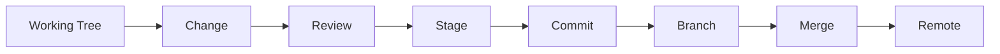

# Git Development Workflow

## 1. Purpose

This document defines the conceptual Git workflow for DistrictMind implementation. **No Git operation is performed by this document or by Claude in producing it.** This restates and makes explicit a rule already followed throughout every prior milestone of this engineering documentation program.

## 2. The Workflow

| Stage | Detail |
|---|---|
| Working tree | The developer's local, uncommitted changes |
| Change | A meaningful, scoped edit (Section 3) |
| Review | The developer inspects `git status` and `git diff` before staging — never staging blindly |
| Stage | `git add` of the specific, reviewed files — never a blanket `git add -A` without having reviewed what it captures |
| Commit | A single, atomic, well-described commit (Section 3) |
| Branch | Per [branching-and-commit-strategy.md](branching-and-commit-strategy.md) |
| Merge | Reviewed before merging into a shared branch |
| Remote | Pushed only when the developer is ready to share the change |

## 3. Meaningful, Atomic Commits

A commit represents one coherent unit of change — e.g., "implement Geography Service's `get_district` read path," not "various fixes." This mirrors the discipline this documentation program has itself followed: each milestone's own commit (visible in this repository's history) corresponds to one complete, coherent documentation deliverable, never a partial or mixed one.

## 4. Documentation Checkpoints vs. Implementation Checkpoints

| Checkpoint Type | What It Captures |
|---|---|
| Documentation checkpoint | A completed engineering documentation milestone (as this program has done for ED-M1 through ED-M2 Part 2B-2B) |
| Implementation checkpoint | A completed, validated vertical slice ([implementation-strategy.md](implementation-strategy.md) Section 4) — e.g., "District boundary rendering, end-to-end, for one district" |

Both are legitimate commit boundaries; neither should be skipped in favor of one giant, unreviewable commit spanning both documentation and implementation changes.

## 5. Avoiding Generated/Debris Files

Per the safety guidance already established in this session's own operating context (and directly relevant given a stray, malformed debris file was previously observed and flagged, unrelated to any of this program's actual milestones): before staging, a developer reviews `git status` for unexpected files — build artifacts, editor swap files, or accidental output — and excludes them (via `.gitignore` or by not staging them), rather than committing anything that appears merely to have been dropped into the working tree.

## 6. Checking Git Status and Reviewing Diffs Before Commit

Restated as a hard discipline, not optional: `git status` before staging, `git diff --staged` before committing — every commit is reviewed by the developer for exactly what it contains, catching accidental inclusions (a secret, an unintended file, an unrelated change) before they enter history.

## 7. Claude Does Not Perform Git Operations

**This is a preserved, non-negotiable rule of the established workflow, restated explicitly per this milestone's instruction.** Throughout every milestone of this engineering documentation program — ED-M1 through ED-M2 Part 2B-2B and this document itself — no `git init`, `git add`, `git commit`, or `git push` has been performed by the assistant. Every commit visible in this repository's history (per `git log`) was made by the user or the user's own tooling between sessions, never by Claude. This document formalizes that observed practice as the standing rule for all future implementation work: **the developer/user performs all Git commands manually; Claude's role is limited to read-only inspection (`git status`, `git log`, `git diff`) when asked to help understand repository state.**

## 8. Milestone Traceability

| Workflow Capability | First Needed |
|---|---|
| The full workflow (Section 2) | Before any implementation commit — i.e., from the start of M1 implementation |

## 9. Open Decisions

None specific to this document — the workflow described is a practice discipline, not a technology choice requiring a status label.
