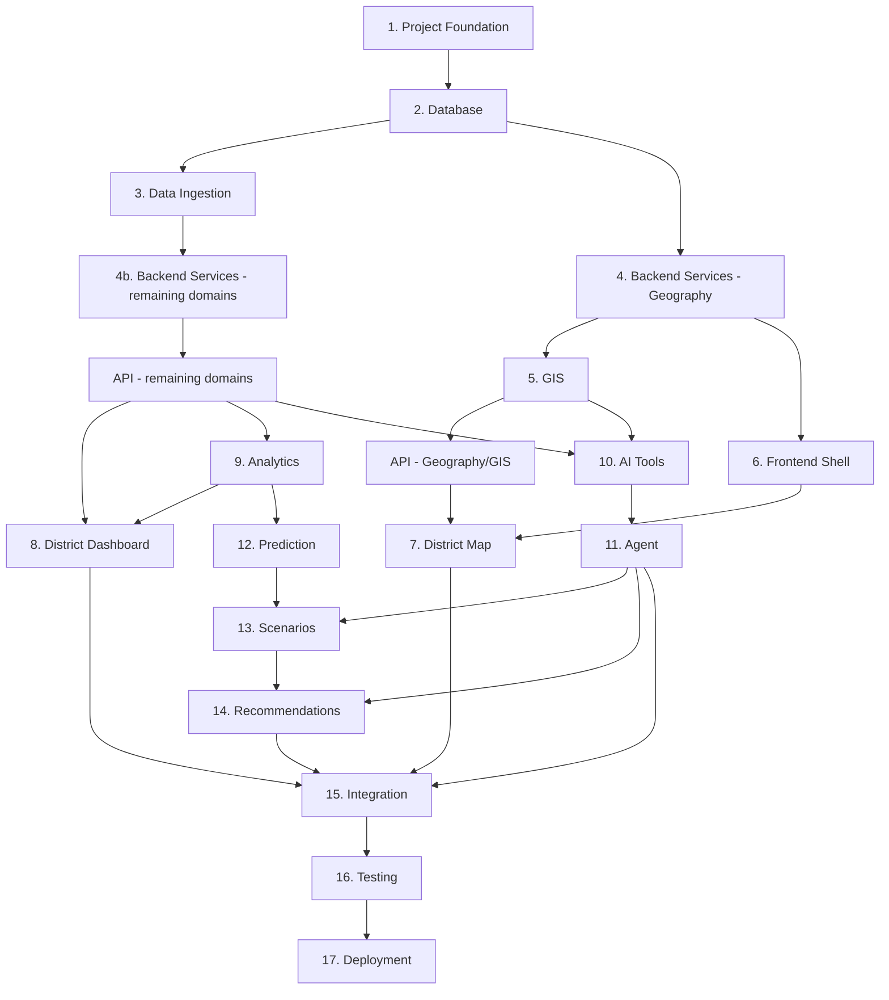

# Implementation Order

## 1. Purpose

This is a critical document. It defines the recommended implementation sequence for the 17 components named in this milestone's brief, verified against the actual architecture established in `02_System_Architecture/` through `07_AI_GIS_and_Intelligence/`, not assumed. Where a component can be developed in parallel with another, this is stated explicitly.

## 2. The Verified Dependency Diagram

## 3. Sequential Dependencies (Cannot Be Reordered)

| From | To | Why |
|---|---|---|
| Project Foundation → Database | The database schema needs the repository/environment scaffolding to exist first ([repository-implementation-map.md](repository-implementation-map.md)) |
| Database → Backend Services | Domain Services depend on their Data Access Layer, which depends on the database existing ([backend-architecture.md](../02_System_Architecture/backend-architecture.md) Section 7) |
| Backend Services (Geography) → GIS | GIS operations (containment, boundary retrieval) require the Geography Service's data to exist ([gis-service-design.md](../06_API_and_Integration/gis-service-design.md)) |
| Backend Services + GIS → API (per domain) | The API layer routes to already-existing services; it cannot expose a domain that has no backing service ([api-architecture.md](../06_API_and_Integration/api-architecture.md) Section 6) |
| API → Frontend (Map, Dashboard) | The frontend consumes the API exclusively ([frontend-architecture.md](../02_System_Architecture/frontend-architecture.md) Section 7) — it cannot render data no API yet serves |
| API (domain services) + GIS → AI Tools | Typed AI Tools are thin wrappers around existing service calls (AD-API-002) — a tool cannot wrap a service that does not yet exist |
| AI Tools → Agent | Agent Orchestration composes Typed AI Tools ([agent-execution-architecture.md](../07_AI_GIS_and_Intelligence/agent-execution-architecture.md)) — it cannot orchestrate tools that do not exist |
| Analytics → Prediction | Prediction's Feature Engineering draws on Analytical Results ([feature-engineering.md](../07_AI_GIS_and_Intelligence/feature-engineering.md)) |
| Prediction → Scenarios | Analytical simulation types reuse trained Prediction models (AD-AI-002, [simulation-architecture.md](../07_AI_GIS_and_Intelligence/simulation-architecture.md)) — Scenarios cannot reuse a Prediction model that does not exist |
| Agent → Scenarios (tool-triggered) | `create_scenario`/`run_scenario` are Agent-invokable Typed Tools ([ai-tool-contracts.md](../06_API_and_Integration/ai-tool-contracts.md)) — though Scenarios can also be exercised directly via the API without the Agent (Section 4) |
| Scenarios + Agent → Recommendations | The Recommendation Engine composes Analytics + Prediction + Simulation Evidence, orchestrated via Agent tools for the full M6 experience ([recommendation-engine.md](../07_AI_GIS_and_Intelligence/recommendation-engine.md)) |
| All prior → Integration → Testing → Deployment | Standard closing sequence — integration validates the assembled system, testing validates integration, deployment follows validated testing ([engineering-quality-gates.md](engineering-quality-gates.md)) |

## 4. What Can Be Developed in Parallel

| Parallel Set | Why They Don't Block Each Other |
|---|---|
| Frontend Shell (6) and Backend Services — Geography (4) | The Frontend Shell (routing, layout, application chrome — [frontend-architecture.md](../02_System_Architecture/frontend-architecture.md) Section 2) has no data dependency; it can be built against a stub/contract before the real API is ready, per API-First Design ([engineering-principles.md](../00_Engineering_Overview/engineering-principles.md)) |
| Remaining domain Backend Services (Demographics, Healthcare, Infrastructure, Transportation, Agriculture, Weather, Disaster) | Per [service-layer-design.md](../06_API_and_Integration/service-layer-design.md) Section 2, these are independent logical modules within the modular monolith — none depends on another (only on Geography and the GIS Service, both already built by this point) |
| GIS worked-example capabilities (coverage, accessibility, affected-area — [gis-computation-engine.md](../07_AI_GIS_and_Intelligence/gis-computation-engine.md)) | Can be built incrementally alongside whichever domain services need them first — Coverage alongside Healthcare, Accessibility alongside Transportation, Affected-Area alongside Disaster |
| Analytics (9) and AI Tools for already-built domains (10, partial) | Analytics reads from whatever domain services already exist; AI Tools wrapping those same already-built services do not need to wait for Analytics specifically, only for their own target service |
| Prediction models for independent domains (Flood, Rainfall, Population, Traffic, Crop — [prediction-architecture.md](../07_AI_GIS_and_Intelligence/prediction-architecture.md)) | Each model's training/feature pipeline is domain-specific and does not depend on another domain's model being built first |
| Scenario types that reuse different Prediction models (Section 3 of [scenario-engine.md](../07_AI_GIS_and_Intelligence/scenario-engine.md)) | "Rainfall Change" (needs Flood Prediction) and "Close Road" (needs no Prediction model, only the road graph) can be built independently |

## 5. Correction to the Milestone Brief's Illustrative Sequence

The brief's own illustrative example (Database foundation → Data services → GIS services → API → Frontend, with AI tools → Agent and Prediction → Scenario → Recommendation as separate chains) is **substantially correct** and is preserved in Section 2's diagram, with two refinements verified against the actual architecture:
1. **Frontend Shell does not need to wait for the full API** (Section 4) — only District Map/Dashboard, which consume real data, are gated on the API.
2. **GIS is not a single monolithic stage before API** — foundational GIS (containment, boundary) gates the Geography API; advanced GIS (routing, accessibility) can mature alongside later domain APIs, per Section 4's parallel-development note.

## 6. Full 17-Item Sequence Table

| # | Component | Depends On | Can Parallelize With |
|---|---|---|---|
| 1 | Project Foundation | — | — |
| 2 | Database | 1 | — |
| 3 | Data Ingestion | 2 | 4 (Geography) once 2 is done |
| 4 | Backend Services (Geography first, then remaining domains) | 2, 3 (for non-Geography domains) | Frontend Shell (6); remaining domains parallel each other |
| 5 | GIS | 4 (Geography) | Remaining domain services (4b) |
| 6 | Frontend Shell | — (contract-first against 4/API) | 4, 5 |
| 7 | District Map | 5, 6, API (Geography/GIS) | — |
| 8 | District Dashboard | API (remaining domains), 9 | — |
| 9 | Analytics | 4b | 8 (in progress), 10 (partial) |
| 10 | AI Tools | 4b, 5 | 9 |
| 11 | Agent | 10 | — |
| 12 | Prediction | 9 | Other domains' Prediction models parallel each other |
| 13 | Scenarios | 12, 11 (for agent-triggered use) | Different scenario types parallel each other |
| 14 | Recommendations | 13, 11 | — |
| 15 | Integration | 7, 8, 11, 14 | — |
| 16 | Testing | 15 (and continuously alongside every prior item, per [engineering-quality-gates.md](engineering-quality-gates.md)) | — |
| 17 | Deployment | 16 | — |

## 7. Milestone Traceability

| Implementation Items | Product Milestone |
|---|---|
| 1–2, 4 (Geography), 5, 6, 7 | M1 |
| 3, 4b, 8, 9 | M2 |
| 10, 11 | M3 |
| 12 | M4 |
| 13 | M5 |
| 14 | M6 |
| 15–17 | Ongoing, closing each milestone's implementation phase |

## 8. Open Decisions

- Exact parallelization achievable depends on actual team size/composition, unconfirmed per [constraints.md](../01_Requirements/constraints.md) Development-Team Constraints — Section 4's parallel sets describe what is *architecturally* independent, not a staffing plan.
