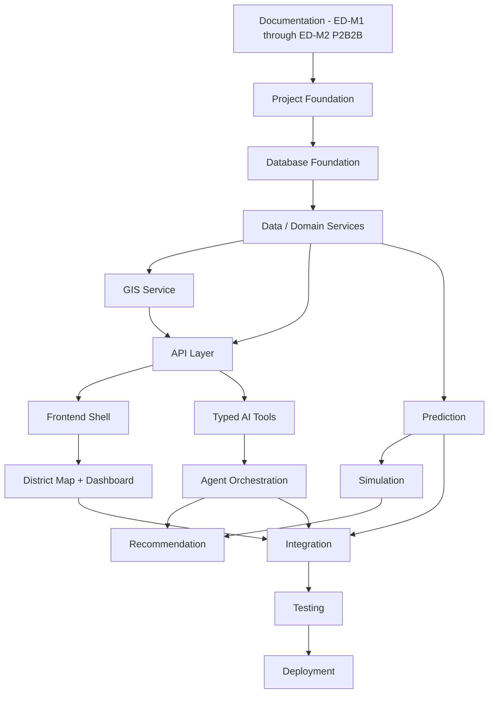

# Implementation Strategy

## 1. Purpose

This document defines how DistrictMind moves from documentation (ED-M1 through ED-M2 Part 2B-2B) to implementation. It is the anchor document for `08_Implementation_Foundation/`. No application code is created by this document or milestone.

**Terminology note, restated per this milestone's explicit instruction:** "ED-M3" refers to this *engineering documentation* milestone (Implementation Engineering Design), distinct from product capability milestone **M3 — Grounded Agentic AI** ([engineering-overview.md](../00_Engineering_Overview/engineering-overview.md) Section 8). The two numbering schemes are never conflated, per [naming-conventions.md](../03_Project_Structure/naming-conventions.md) Section 14, which already established this exact rule for `ED-M<N>[-P<N>]` vs. `M1`–`M6`.

## 2. Documentation-to-Implementation Sequence — Evaluated, Not Assumed

The milestone brief offers an illustrative linear sequence (Documentation → Foundation → Database → Backend → GIS → Frontend → AI/Agent → Prediction → Simulation → Recommendation → Integration → Testing → Deployment) but explicitly instructs that this must be evaluated against actual architectural dependencies, not assumed. Cross-referencing [system-architecture.md](../02_System_Architecture/system-architecture.md), [database-design.md](../05_Database_Design/database-design.md), [api-architecture.md](../06_API_and_Integration/api-architecture.md), and [agent-execution-architecture.md](../07_AI_GIS_and_Intelligence/agent-execution-architecture.md), the actual dependency graph is:

This matches the milestone brief's illustrative sequence closely but corrects two points where a strictly linear reading would misrepresent the actual architecture:
1. **GIS and API are co-dependent, not sequential** — the GIS Service is a logical service *within* the API/service layer ([gis-service-design.md](../06_API_and_Integration/gis-service-design.md) Section 9, [service-layer-design.md](../06_API_and_Integration/service-layer-design.md) Section 7), not a separate stage the API waits on end-to-end; foundational GIS operations (containment, boundary retrieval) must exist before the API can serve district/map endpoints, but full GIS capability (routing, accessibility) can mature alongside the API layer.
2. **AI Tools depend on the API/Domain Services existing, not the reverse** — per AD-API-002 ([api-architecture.md](../06_API_and_Integration/api-architecture.md)), Typed AI Tools are thin, governed wrappers around already-existing Domain Service calls; Agent Orchestration cannot be meaningfully built before at least the Geography and one further domain service exist.

## 3. Implementation Principles

| Principle | Application |
|---|---|
| Documentation precedes implementation | Restated unchanged from [engineering-overview.md](../00_Engineering_Overview/engineering-overview.md) Section 9 — no component is implemented without a corresponding requirement/architecture document already existing (all now do, through ED-M2 Part 2B-2B) |
| Vertical-slice strategy | Each implementation phase delivers a thin, working slice through every layer for one capability (e.g., "render a district boundary end-to-end") rather than building one layer fully before starting the next — see Section 4 |
| Incremental delivery | Matches the product's own M1–M6 progression — each product milestone is itself an increment; implementation phases within a product milestone are further sliced (Section 4) |
| Dependency management | Per Section 2's corrected dependency graph — no phase begins before its actual (not assumed) prerequisites exist |
| Risk-first implementation | The highest-uncertainty components (GIS spatial accuracy, AI grounding, the unresolved AI-provider decision) are addressed early within their milestone, not deferred to the end where a late discovery would be most costly |
| Validation before expansion | Each vertical slice is validated (per [engineering-quality-gates.md](engineering-quality-gates.md)) before the next slice begins — consistent with Fail-Safe Behavior |
| Rollback philosophy | Every implementation checkpoint is a reversible Git commit (per [git-development-workflow.md](git-development-workflow.md)); a failed validation rolls back to the last passing checkpoint rather than accumulating unvalidated work |

## 4. Vertical-Slice Strategy — Worked Example

Rather than "build the entire database, then the entire backend, then the entire frontend," a vertical slice for M1 (Digital Twin Foundation) would be: *one* district's boundary — ingested (Database Foundation), served (API), and rendered (Frontend) — validated end-to-end before expanding to all Telangana districts. This directly serves Risk-First Implementation (Section 3): if GIS rendering or CRS handling has a fundamental problem, it surfaces on slice one, not after all district data has been loaded.

## 5. Alignment with M1–M6

| Product Milestone | Implementation Focus | Primary New Dependency (Per Section 2's Graph) |
|---|---|---|
| M1 — Digital Twin Foundation | Project Foundation, Database Foundation, Geography domain service, GIS boundary rendering, Frontend Shell, District Map | None beyond Documentation |
| M2 — District Intelligence | Remaining domain services, Analytics Service, Dashboard | M1's Database/GIS/API/Frontend foundation |
| M3 — Grounded Agentic AI | Typed AI Tools, Agent Orchestration, AI Assistant UI | M2's full domain-service set (tools wrap existing services) |
| M4 — Predictive Intelligence | Prediction Service, Model Lifecycle tooling | M2's historical/temporal data depth |
| M5 — Scenario Simulation & Recommendations (Simulation half) | Simulation Service, Scenario Engine | M4's trained Prediction models (AD-AI-002, [simulation-architecture.md](../07_AI_GIS_and_Intelligence/simulation-architecture.md)) |
| M6 — Advanced Agentic District Intelligence | Recommendation Service, full multi-agent orchestration | M3's Agent Orchestration + M4's Predictions + M5's Simulations |

This table is the implementation-planning restatement of [intelligence-architecture.md](../07_AI_GIS_and_Intelligence/intelligence-architecture.md) Section 5 — it does not redefine the milestone scheme, only maps implementation phases onto it.

## 6. Relationship to Implementation Order and Quality Gates

This document defines the *strategy* (why this sequence, what principles govern it); the concrete phase-by-phase sequence is in [implementation-order.md](implementation-order.md), and the validation criteria between phases are in [engineering-quality-gates.md](engineering-quality-gates.md) — the three documents are designed to be read together, not duplicated against each other.

## 7. Architectural Decision

**AD-IMP-001 — Vertical-Slice, Risk-First Implementation Over Full-Layer-First (Waterfall) Implementation**
- **Context:** The milestone brief's illustrative sequence could be read as "build the entire database, then the entire backend, then..." — a full-layer-first approach — but this would defer integration risk (e.g., GIS rendering correctness, AI grounding behavior) to very late in the project, when it is most expensive to fix.
- **Decision:** Implementation proceeds in vertical slices (Section 4) through the corrected dependency graph (Section 2), validating each slice ([engineering-quality-gates.md](engineering-quality-gates.md)) before expanding scope, rather than completing each architectural layer in full before starting the next.
- **Alternatives considered:** Full-layer-first/waterfall (rejected — defers risk, per Section 3); a fully parallel, unsequenced free-for-all (rejected — ignores real dependencies from Section 2, e.g., Agent Orchestration genuinely cannot precede Domain Services).
- **Reasoning:** Directly required by the milestone brief's risk-first/validation-before-expansion instructions; consistent with the Reproducibility and Fail-Safe Behavior principles ([engineering-principles.md](../00_Engineering_Overview/engineering-principles.md)).
- **Trade-offs:** A vertical slice through one district is not representative of statewide data-volume/performance characteristics — mitigated by explicitly expanding scope (all districts) as a distinct, later validation step within the same phase, not skipped.
- **Consequences:** [implementation-order.md](implementation-order.md) and [engineering-quality-gates.md](engineering-quality-gates.md) are both structured around this slice-and-validate pattern.
- **Status:** Proposed.

## 8. DistrictMind-Specific Implementation Priorities

Restated explicitly, since generic implementation planning would lose sight of what actually differentiates DistrictMind (per this milestone's own instruction). None of the following is implemented — this is a priority ordering only, cross-referenced to the concrete sequence in [implementation-order.md](implementation-order.md).

| Priority | Item | Why It Is Prioritized Here | Source |
|---|---|---|---|
| 1 | Telangana/district map | The foundational digital twin substrate — nothing else is meaningful without it | M1, [gis-architecture.md](../02_System_Architecture/gis-architecture.md) |
| 2 | District selection | The primary navigation interaction (FR-008) | M1, [frontend-architecture.md](../02_System_Architecture/frontend-architecture.md) |
| 3 | District digital twin (queryable state, not just visual) | The Blueprint's own explicit differentiator from a static GIS map (§9.1) | M1–M2, [digital-twin-state-model.md](../05_Database_Design/digital-twin-state-model.md) |
| 4 | Cross-domain data | What makes DistrictMind more than a single-domain dashboard | M2, [data-domain-model.md](../04_Data_Engineering/data-domain-model.md) Section 13 |
| 5 | GIS analysis (coverage, accessibility, impact) | The specific spatial reasoning every DistrictMind worked example depends on | M2, [gis-computation-engine.md](../07_AI_GIS_and_Intelligence/gis-computation-engine.md) |
| 6 | Healthcare coverage | The single most-repeated worked example across both source documents | M2 |
| 7 | Transportation/bridge scenario | The Blueprint's flagship Simulation example | M5, [scenario-engine.md](../07_AI_GIS_and_Intelligence/scenario-engine.md) |
| 8 | Rainfall/disaster workflow | The Blueprint's flagship cross-domain example (§1.1) | M2 (data) / M4 (prediction) / M5 (simulation) |
| 9 | Analytics | Descriptive/Diagnostic intelligence underlying every later capability | M2 |
| 10 | Grounded AI | The system's core "agentic" differentiator (Abstract, Blueprint §2.2) | M3 |
| 11 | Prediction | Predictive Intelligence | M4 |
| 12 | Simulation | Prescriptive intelligence, what-if analysis | M5 |
| 13 | Recommendation | Full decision-support output | M6 |
| 14 | Evidence/provenance | The trust mechanism underlying every AI-influenced output — deliberately not last in importance despite appearing last in this list; in practice it is built *alongside* items 10–13, never bolted on afterward | M3–M6, [evidence-provenance-flow.md](../06_API_and_Integration/evidence-provenance-flow.md) |

**No item above is claimed to be implemented** — this is the implementation plan's priority ordering only, consistent with every prior milestone's restriction against claiming implementation readiness.

## 9. Milestone Traceability

See Section 5's table — this document's primary traceability is to product milestones M1–M6, cross-referenced to the ED-M3 documentation milestone status in [ED-M3-P1-VALIDATION.md](ED-M3-P1-VALIDATION.md).

## 10. Open Decisions

- Exact slice boundaries within each product milestone (e.g., which single district is the M1 pilot slice) — an implementation-time planning decision, not fixed by this document.
- Whether any phase's vertical slice is further subdivided once real development capacity/team size is known (unconfirmed, per [constraints.md](../01_Requirements/constraints.md) Development-Team Constraints).
