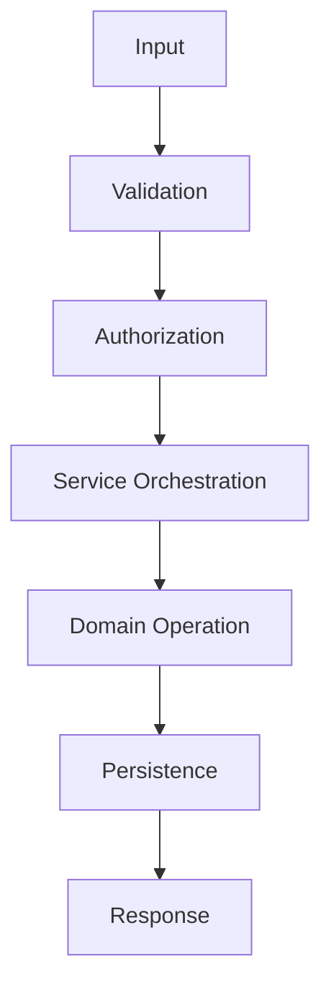

# Application Layer Design

## 1. Purpose

This document defines the Application (use-case orchestration) layer established by AD-BE-003 ([backend-implementation-architecture.md](backend-implementation-architecture.md)). The Application Layer coordinates operations across Domain Logic, Repositories, and cross-cutting services (GIS, Prediction, Simulation, Recommendation) **without owning database implementation details or business rules of its own**. No code exists in this document.

## 2. The Use-Case Pattern

Every use case below follows this identical shape.

## 3. Use Case — Get District Overview

| Stage | Detail |
|---|---|
| Input | District identifier |
| Validation | Identifier well-formed ([request-response-validation.md](request-response-validation.md)) |
| Authorization | Any authenticated role ([authorization-implementation.md](authorization-implementation.md)) |
| Service orchestration | Call Geography module's read operation |
| Domain operation | None beyond entity resolution — a pure Descriptive read |
| Persistence | None (read-only) |
| Response | District record + provenance |

## 4. Use Case — Get District Indicators

| Stage | Detail |
|---|---|
| Input | District identifier, optional domain filter |
| Validation | Identifier + filter against known enumerations |
| Authorization | Any authenticated role |
| Service orchestration | Call Analytics module |
| Domain operation | None — reads precomputed Analytical Results |
| Persistence | None |
| Response | Analytical Result records |

## 5. Use Case — Query Healthcare Coverage

| Stage | Detail |
|---|---|
| Input | District identifier, coverage radius |
| Validation | Radius within a sane bound |
| Authorization | Any authenticated role |
| Service orchestration | Call Healthcare module, which calls GIS module's `coverage_analysis` |
| Domain operation | Coverage-gap determination is a Domain rule owned by Healthcare (Section 5 of [domain-layer-design.md](domain-layer-design.md)) |
| Persistence | Optionally caches the result as an Analytical Result ([caching-and-performance.md](caching-and-performance.md)) |
| Response | Coverage-gap set + evidence |

## 6. Use Case — Analyze Transportation Accessibility

| Stage | Detail |
|---|---|
| Input | Origin, destination-type |
| Validation | Origin resolves to a known entity |
| Authorization | Any authenticated role |
| Service orchestration | Call Transportation module, which calls GIS module's `accessibility_analysis` |
| Domain operation | Route validity determination |
| Persistence | None (or cached, per [caching-and-performance.md](caching-and-performance.md)) |
| Response | Route + travel time, or explicit "no route" |

## 7. Use Case — Analyze Bridge Closure

| Stage | Detail |
|---|---|
| Input | Road segment identifier (the "bridge") |
| Validation | Segment exists |
| Authorization | Analyst/District Officer role ([authorization-implementation.md](authorization-implementation.md)) |
| Service orchestration | Create a Scenario ("Close Road" type), then invoke Simulation module → GIS module's Network Impact operation → Healthcare module for accessibility re-evaluation |
| Domain operation | The Simulation sandboxing invariant (Section 5 of [domain-layer-design.md](domain-layer-design.md)) — this Scenario must not mutate the real Road Segment |
| Persistence | Scenario + Scenario Output records only, never a write to the Road/Road Segment table |
| Response | Before/after accessibility deltas, explicitly labeled Scenario State |

This is Worked Example 2 (Section 23 of this milestone's brief), fully detailed in [backend-implementation-architecture.md](backend-implementation-architecture.md) Section 15 and cross-referenced throughout.

## 8. Use Case — Analyze Rainfall/Disaster Impact

| Stage | Detail |
|---|---|
| Input | District/region identifier, optional hypothetical rainfall adjustment |
| Validation | Region resolves; adjustment (if present) within a sane bound |
| Authorization | Any authenticated role (Analyst+ if run as a Scenario) |
| Service orchestration | Weather module → Disaster module (risk assessment, Derived or Predicted) → GIS module (affected-area intersection) → Transportation module (network impact) → Healthcare module (accessibility) |
| Domain operation | The Observed/Derived/Predicted/Scenario state-category discipline (Section 6 of [domain-layer-design.md](domain-layer-design.md)) — every stage's output must be explicitly labeled |
| Persistence | Depends on whether run as a real-time assessment (Analytics/Disaster module writes) or a hypothetical Scenario (Simulation module writes, sandboxed) |
| Response | Cross-domain impact result, fully evidenced |

This is Worked Example 3 (Section 24 of this milestone's brief), the Blueprint's flagship cross-domain example.

## 9. Use Case — Request Prediction

| Stage | Detail |
|---|---|
| Input | Model/indicator identifier, target entity, horizon |
| Validation | Sufficient historical data exists (checked by Prediction module, not the Application Layer itself — the layer only orchestrates the check) |
| Authorization | Analyst role or above |
| Service orchestration | Call Prediction module — asynchronous ([background-job-architecture.md](background-job-architecture.md)) |
| Domain operation | Insufficient-data handling (NFR-031) is a Domain rule owned by Prediction |
| Persistence | Prediction record, immutable once created |
| Response | Job reference (async) resolving to a Prediction with confidence indicator |

## 10. Use Case — Create Scenario

| Stage | Detail |
|---|---|
| Input | Scenario type, structured parameters, optional baseline reference |
| Validation | Type against allow-list; parameters against that type's expected shape |
| Authorization | Analyst/District Officer role or above |
| Service orchestration | Call Simulation module's definition operation (synchronous — definition only, no computation) |
| Domain operation | Parameter-shape validation is a Domain rule owned by Simulation |
| Persistence | Scenario record, status = defined |
| Response | Scenario identifier |

## 11. Use Case — Execute Simulation

| Stage | Detail |
|---|---|
| Input | Scenario identifier |
| Validation | Scenario exists and is runnable |
| Authorization | Same as Create Scenario |
| Service orchestration | Call Simulation module's execution operation — asynchronous, sandboxed (AD-DE-004) |
| Domain operation | The sandboxing invariant (Section 5, [domain-layer-design.md](domain-layer-design.md)) |
| Persistence | Scenario Output records |
| Response | Job reference resolving to Scenario Output |

## 12. Use Case — Compare Scenario with Baseline

| Stage | Detail |
|---|---|
| Input | Scenario identifier |
| Validation | Scenario has a completed Scenario Output |
| Authorization | Same as above |
| Service orchestration | Call Simulation module's comparison read operation |
| Domain operation | None beyond reading the already-computed comparison |
| Persistence | None (read-only) |
| Response | Baseline vs. scenario deltas |

## 13. Use Case — Generate Recommendation

| Stage | Detail |
|---|---|
| Input | Recommendation type, target scope, constraints |
| Validation | Type/scope well-formed |
| Authorization | Analyst/District Officer or above for generation; District Officer/Administrator for the separate review action |
| Service orchestration | Call Recommendation module, which reads from Analytics, Prediction, and Simulation modules |
| Domain operation | The evidence-completeness invariant (Section 5, [domain-layer-design.md](domain-layer-design.md)) — a Recommendation is never generated if its evidence assembly was incomplete |
| Persistence | Recommendation + Recommendation Evidence records, status = draft |
| Response | Recommendation with full evidence chain |

## 14. Use Case — Ask Grounded AI Question

| Stage | Detail |
|---|---|
| Input | Natural-language query |
| Validation | Query non-empty, within a maximum length; treated as untrusted |
| Authorization | Any authenticated role — the AI response is scoped to what that role could otherwise see |
| Service orchestration | AI Orchestration module: intent → planning → Typed AI Tool selection → tool execution (each tool call itself an Application Layer invocation of the relevant domain module) |
| Domain operation | Grounding Validation ([ai-safety-and-grounding.md](../07_AI_GIS_and_Intelligence/ai-safety-and-grounding.md) Section 2) — owned by the AI/Agent module |
| Persistence | AI Response, Agent Execution, Tool Execution records |
| Response | Grounded AI Response with citations, or explicit "cannot answer" |

## 15. What the Application Layer Never Does

Per AD-BE-003: it never contains a business rule itself (e.g., it does not decide *what* counts as a coverage gap — that is [domain-layer-design.md](domain-layer-design.md) Section 5); it never issues a raw database query (that is [repository-layer-design.md](repository-layer-design.md)); it never formats an HTTP response body directly (that is the API Boundary, per [backend-implementation-architecture.md](backend-implementation-architecture.md) Section 5).

## 16. Milestone Traceability

| Use Case | First Available |
|---|---|
| Get District Overview | M1 |
| Get District Indicators, Query Healthcare Coverage, Analyze Transportation Accessibility | M2 |
| Analyze Rainfall/Disaster Impact (data-only parts) | M2 |
| Ask Grounded AI Question | M3 |
| Request Prediction | M4 |
| Analyze Bridge Closure, Create Scenario, Execute Simulation, Compare Scenario with Baseline | M5 |
| Generate Recommendation | M6 |

## 17. Open Decisions

None specific to this document — every open item is inherited from the underlying modules it orchestrates (Section 3 of [backend-module-design.md](backend-module-design.md)).
