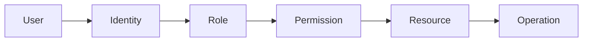
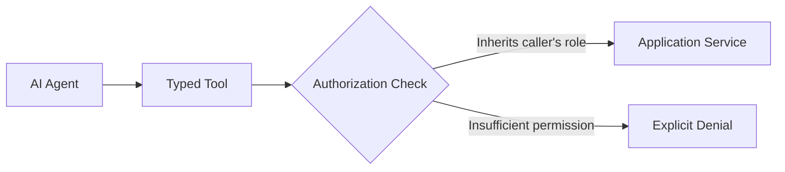

# Authorization Implementation

## 1. Purpose

This document defines authorization implementation, elaborating [authentication-authorization.md](../06_API_and_Integration/authentication-authorization.md) with implementation-blueprint detail, and carries the AI Tool Boundary content required by Section 25 of this milestone's brief. **The Proposed role model is not silently confirmed** — every role below remains exactly as Proposed as it was when first introduced.

## 2. The Authorization Chain

## 3. Role Model — Restated, Still Proposed

| Role | Status | Source |
|---|---|---|
| Public Viewer | Proposed, with the ambiguity already noted (whether it means literal anonymous access or "least-privileged authenticated role") | [authentication-authorization.md](../06_API_and_Integration/authentication-authorization.md) Section 3 |
| Analyst | Proposed | Same |
| District Officer | Proposed | Same |
| Administrator | Proposed | Same |

This document does not resolve the ambiguity or elevate any role's status.

## 4. Permission Categories

| Category | Description | Example |
|---|---|---|
| Read permissions | View existing data/results | `GET /districts/{id}` |
| Command permissions | Trigger a computation or state change | `POST /predictions:request`, `POST /scenarios/{id}:run` |
| Scenario permissions | Create/run scenarios | Analyst/District Officer or above |
| Simulation permissions | Same as Scenario (Simulation is the execution of a Scenario) | Same |
| Administrative permissions | User/role management, data-source configuration | Administrator only |
| AI tool permissions | Section 8 below | Inherited from the requesting user |
| Evidence access | View provenance/evidence for a claim the user could otherwise see | Any role that could view the original claim |

## 5. Permission-to-Role Mapping (Illustrative, Proposed)

| Permission Category | Public Viewer | Analyst | District Officer | Administrator |
|---|---|---|---|---|
| Read (non-sensitive domains) | Yes | Yes | Yes | Yes |
| Read (Disaster domain, if elevated per Section 6 of [authentication-authorization.md](../06_API_and_Integration/authentication-authorization.md)) | Under Evaluation | Yes | Yes | Yes |
| Request Prediction | No | Yes | Yes | Yes |
| Create/Run Scenario | No | Yes | Yes | Yes |
| Review Recommendation | No | No | Yes | Yes |
| Administrative operations | No | No | No | Yes |

Every cell above is **Proposed**, inheriting the role model's own unconfirmed status (Section 3) — this table operationalizes [authentication-authorization.md](../06_API_and_Integration/authentication-authorization.md) Section 4's "permissions are scoped by domain and operation type" principle into a concrete illustrative matrix, not a confirmed policy.

## 6. Enforcement Point

Authorization is enforced at the API Boundary, immediately after Authentication and before the request reaches the Application Layer ([backend-implementation-architecture.md](backend-implementation-architecture.md) Section 2) — restated unchanged from [backend-architecture.md](../02_System_Architecture/backend-architecture.md) Section 10. A Domain Logic-level check (Section 4 of [domain-layer-design.md](domain-layer-design.md)) may additionally apply business-rule-level constraints (e.g., "can this specific role transition a Recommendation to accepted") as defense-in-depth, not as the primary gate.

## 7. Resource-Scoped Authorization

No current requirement establishes district-level or other resource-instance-scoped authorization (a user restricted to only certain districts) — restated unchanged from [authentication-authorization.md](../06_API_and_Integration/authentication-authorization.md) Section 5, not assumed present.

## 8. AI Tool Authorization — The Critical Boundary

**The AI must never decide its own authorization.** Every Typed AI Tool invocation ([ai-tool-contracts.md](../06_API_and_Integration/ai-tool-contracts.md)) passes through the identical server-side Authorization enforcement point (Section 6) as any other API request — the tool call carries the requesting user's authenticated identity and role, and the Authorization check is performed by the same server-side mechanism, never by the LLM/agent reasoning about whether it "should" be allowed to do something.

| AI Tool Authorization Rule | Detail |
|---|---|
| Inherited, not self-determined | A tool call's authorization scope is exactly the calling user's role — the agent has no mechanism to request elevated privilege for itself |
| Server-side enforcement only | The check happens in the Application Service layer the tool wraps, never in agent/LLM logic, which is not a trusted enforcement point (an LLM's own "reasoning" about permissions is not a security boundary) |
| Denial is explicit and audited | A denied tool call returns an explicit authorization-failure result to the agent (logged via Tool Execution, per [entity-catalog.md](../05_Database_Design/entity-catalog.md) E-AI-003) — the agent must disclose this limitation in its response, never silently omit the denied capability without explanation |
| No tool escalation path | The fixed, allow-listed tool set ([ai-tool-contracts.md](../06_API_and_Integration/ai-tool-contracts.md) Section 2) means there is no tool whose invocation could grant broader access than the ones already authorization-scoped — restated from AD-API-002 |

This is the direct, implementation-level realization of Principle J (API must not expose unrestricted database access) and the AI safety principles in [ai-safety-and-grounding.md](../07_AI_GIS_and_Intelligence/ai-safety-and-grounding.md) — restated once more because this milestone's brief specifically calls it "most importantly."

## 9. Milestone Traceability

| Authorization Capability | First Needed |
|---|---|
| Basic role enforcement (Administrator vs. standard user) | M1 |
| Full role model (Section 3), domain-level access decisions | M2 |
| AI tool authorization inheritance (Section 8) | M3 |
| Analyst-scoped Prediction | M4 |
| Analyst/District-Officer-scoped Scenario/Simulation | M5 |
| District-Officer/Administrator-scoped Recommendation review | M6 |

## 10. Open Decisions

- Whether the four Proposed roles are ever confirmed, renamed, or replaced (unchanged from [authentication-authorization.md](../06_API_and_Integration/authentication-authorization.md) Section 12).
- Whether resource-scoped (district-level) authorization is ever required (Section 7).
- Whether Disaster-domain read access requires elevation (Section 5's Under Evaluation cell).
