# Backend Implementation Architecture

## 1. Purpose

This document is the anchor for `09_Backend_Implementation/`. It translates [backend-architecture.md](../02_System_Architecture/backend-architecture.md), [api-architecture.md](../06_API_and_Integration/api-architecture.md), and [service-layer-design.md](../06_API_and_Integration/service-layer-design.md) into a detailed backend runtime blueprint. No application code exists in this document or milestone.

## 2. The Runtime Layer Chain

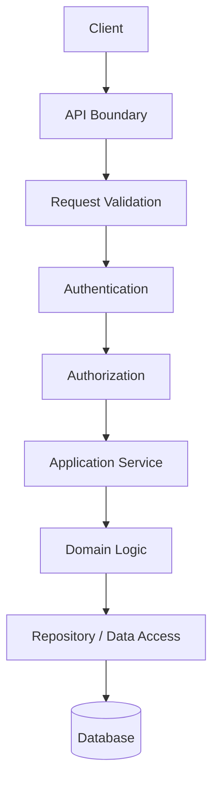

This elaborates the two-stage validation and layer-separation pattern already established in [backend-architecture.md](../02_System_Architecture/backend-architecture.md) Sections 4–8, now made explicit as a runtime request path with an added, previously implicit layer: **Application Service**, distinct from **Domain Logic** (Section 4, AD-BE-003).

## 3. Cross-Cutting Service Dependencies

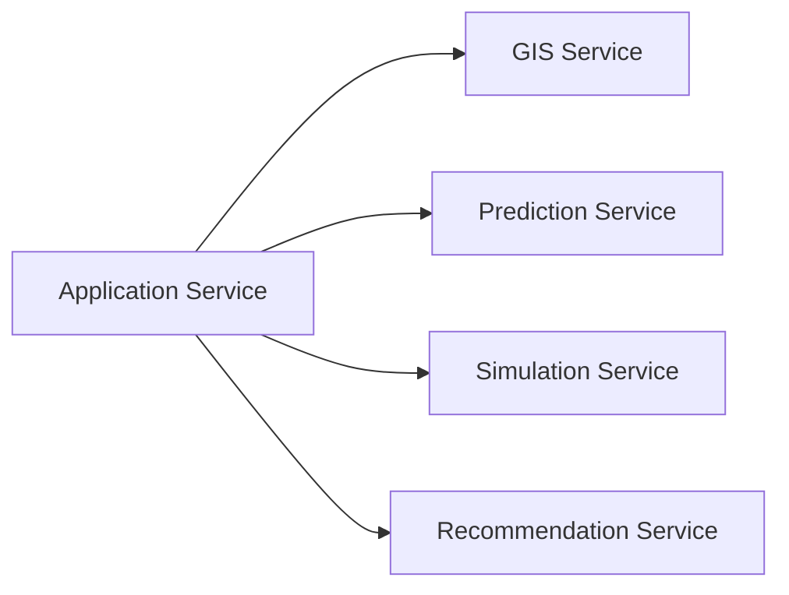

Any Application Service (District, Healthcare, Transportation, etc.) may call into GIS, Prediction, Simulation, or Recommendation services as needed for its use case — restated unchanged from [service-layer-design.md](../06_API_and_Integration/service-layer-design.md) Section 7's "every domain service calls into the GIS Service" pattern, generalized to the other cross-cutting services.

## 4. Application Layer vs. Domain Logic — A New Explicit Split

**AD-BE-003 — Explicit Application Layer, Distinct From Domain Logic**
- **Context:** [backend-architecture.md](../02_System_Architecture/backend-architecture.md) Section 6 defines a single "Domain layer" holding both business rules *and* use-case orchestration (routing a request to the right sequence of operations). At implementation-blueprint granularity, these are two different responsibilities: orchestrating a use case (e.g., "Analyze Bridge Closure": call Transportation, then GIS, then Healthcare, then compose a result) is different from a business rule itself (e.g., "a Simulation cannot mutate Source of Truth data").
- **Decision:** The backend implementation introduces an explicit **Application Layer** (Section 8, [application-layer-design.md](application-layer-design.md)) sitting between the API boundary and Domain Logic (Section 9, [domain-layer-design.md](domain-layer-design.md)). The Application Layer orchestrates use cases by calling Domain Logic and Repository operations in sequence; it owns no business rules itself.
- **Alternatives considered:** Keeping a single undifferentiated "service" layer that mixes orchestration and business rules (rejected — this is what [backend-architecture.md](../02_System_Architecture/backend-architecture.md) Section 6 already does at the architecture level, and this milestone's brief explicitly asks for a distinct Application Layer document, Section 8 of the brief).
- **Reasoning:** Separation of Concerns; makes each use case's orchestration independently testable from the business rules it invokes ([engineering-quality-gates.md](../08_Implementation_Foundation/engineering-quality-gates.md) Section 8).
- **Trade-offs:** One more named layer to navigate — accepted, since it does not change the physical module structure ([backend-structure.md](../03_Project_Structure/backend-structure.md)), only clarifies, within each module, which functions are orchestration vs. rules.
- **Consequences:** [application-layer-design.md](application-layer-design.md) and [domain-layer-design.md](domain-layer-design.md) are the direct realization of this split; [backend-module-design.md](backend-module-design.md) documents modules that contain both.
- **Status:** Proposed.

## 5. Responsibilities Per Layer

| Layer | Responsibility | Does Not Do |
|---|---|---|
| API Boundary | Routing, structural validation, auth enforcement trigger, response shaping | Business logic, direct data access |
| Application Service | Use-case orchestration — the sequence of Domain/Repository/cross-cutting-service calls for one use case | Own business rules; own persistence details |
| Domain Logic | Business rules, invariants, state transitions (Section 9, [domain-layer-design.md](domain-layer-design.md)) | Database queries, HTTP concerns |
| Repository | Query/persistence abstraction (Section 11, [repository-layer-design.md](repository-layer-design.md)) | Business rules |
| Database | Storage | Everything above |

## 6. Dependency Direction

Strictly top-to-bottom in Section 2's chain — a lower layer never calls upward (the Database does not call the Repository; the Repository does not call the Domain Layer). This is the standard Dependency Inversion discipline, restated as a hard rule for DistrictMind's implementation, consistent with [backend-architecture.md](../02_System_Architecture/backend-architecture.md) Section 5.

## 7. Synchronous Operations

Restated from [agent-execution-architecture.md](../07_AI_GIS_and_Intelligence/agent-execution-architecture.md) Section 6 and [database-performance.md](../05_Database_Design/database-performance.md) Section 11: single-entity reads, bounded spatial queries, and precomputed Analytical Result reads are synchronous — full criteria in [background-job-architecture.md](background-job-architecture.md) Section 3.

## 8. Asynchronous Operations

Prediction execution, Simulation execution, and multi-step Recommendation generation — full criteria and lifecycle in [background-job-architecture.md](background-job-architecture.md).

## 9. Failure Propagation

An error at any layer propagates upward as a classified failure (never a raw exception reaching the API boundary unclassified), per [error-handling-design.md](error-handling-design.md) — each layer either handles an error it can recover from (e.g., Repository retrying a transient connection failure, per [database-performance.md](../05_Database_Design/database-performance.md) Section 14) or wraps and re-raises it as a domain-meaningful failure for the layer above.

## 10. Transaction Boundaries

A transaction boundary is owned by the Application Layer (Section 8), which declares the atomic unit of work (e.g., "persist a Scenario definition") and delegates its execution to the Repository layer — Domain Logic never opens or commits a transaction itself. Full treatment (Section 20 of this milestone's brief) is in [repository-layer-design.md](repository-layer-design.md) Section 4.

## 11. The AI Agent Path

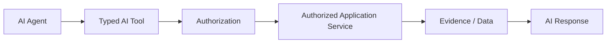

This is the API-layer chain restated at the backend-implementation level — the AI Agent never appears left of "Typed AI Tool" in any call path, and "Typed AI Tool" always routes through the identical Application Service layer every other client uses (AD-API-002, restated unchanged; full detail in Section 17 below and [authorization-implementation.md](authorization-implementation.md) Section 8).

## 12. DistrictMind Worked Example 1 — 10 km Healthcare Coverage

**"Which areas are outside the 10 km healthcare coverage?"**

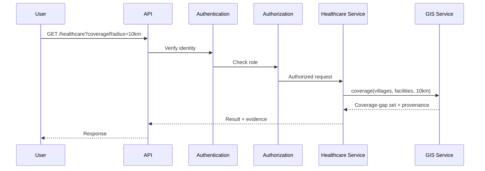

| Stage | Detail |
|---|---|
| Request | `GET /healthcare` with a coverage-radius parameter ([api-route-implementation.md](api-route-implementation.md)) |
| Validation | Radius within a sane bound ([request-response-validation.md](request-response-validation.md) Section 8) |
| Service calls | Healthcare Service → GIS Service's `coverage` operation ([gis-computation-engine.md](../07_AI_GIS_and_Intelligence/gis-computation-engine.md) Section 2.8) |
| Data access | Village and Health Facility geometry, via each module's Repository ([repository-layer-design.md](repository-layer-design.md)) |
| Spatial computation | Buffer + Containment composed into Coverage, per [spatial-database-design.md](../05_Database_Design/spatial-database-design.md) Section 21.1 |
| Result | The coverage-gap village set, a **Derived State** result |
| Provenance | Village and facility dataset versions, computation timestamp |
| UI consumption | Rendered as a map highlight + dashboard card, per [decision-intelligence-workflows.md](../07_AI_GIS_and_Intelligence/decision-intelligence-workflows.md) Workflow 2 |

This request is entirely **synchronous** (Section 7) — no background job is needed for a district-scoped coverage computation, per [database-performance.md](../05_Database_Design/database-performance.md) Section 11.

## 13. DistrictMind Worked Example 2 — Bridge Closure

**"How would a bridge closure affect healthcare accessibility?"**

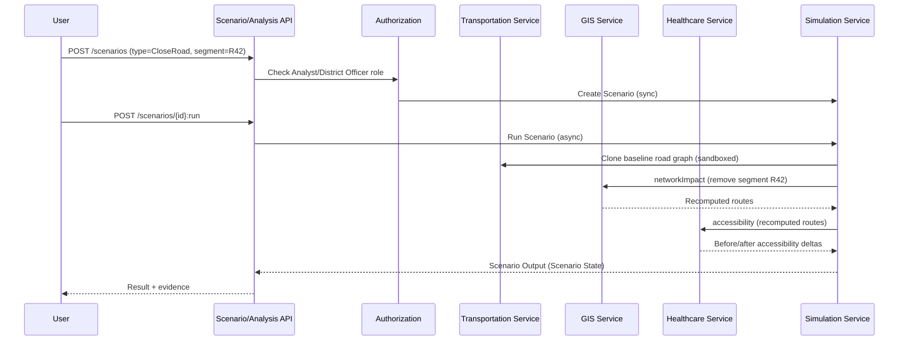

| Aspect | Detail |
|---|---|
| Baseline vs. Scenario | The baseline (current Road/Road Segment state) is read but never written to; the Scenario's hypothetical removal of segment R42 exists only within the sandboxed clone (AD-DE-004) |
| The scenario must NOT modify source-of-truth data | Enforced by the Domain Logic invariant in [domain-layer-design.md](domain-layer-design.md) Section 4 — the Simulation Service's only write target is the Scenario Output table |
| Sync/Async | `POST /scenarios` (definition) is synchronous; `POST /scenarios/{id}:run` (execution) is asynchronous ([background-job-architecture.md](background-job-architecture.md)) |
| Result | Before/after accessibility deltas, explicitly labeled **Scenario State** |
| UI consumption | Scenario control panel with before/after map comparison, per [decision-intelligence-workflows.md](../07_AI_GIS_and_Intelligence/decision-intelligence-workflows.md) Workflow 4 |

## 14. DistrictMind Worked Example 3 — Rainfall / Disaster / Transportation / Healthcare Chain

**"How could heavy rainfall affect disaster risk, transportation, and healthcare access?"**

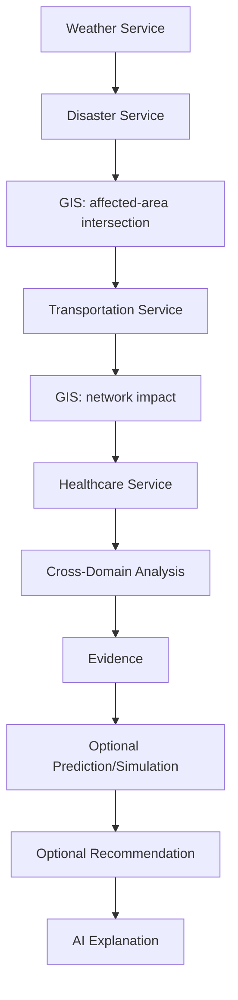

| Step | Backend Responsibility |
|---|---|
| Weather → Disaster | Weather Service supplies rainfall observations (or a hypothetical adjustment); Disaster Service computes/retrieves a risk assessment, explicitly labeled Derived (M2) or Predicted (M4) |
| Disaster → Transportation | GIS Service intersects the affected-area geometry with Road Segment geometry; Transportation Service (or, if hypothetical, the Simulation Service sandbox) recomputes network impact |
| Transportation → Healthcare | Healthcare Service re-evaluates accessibility under the (possibly degraded) network state |
| Cross-domain analysis | The Application Layer's "Analyze Rainfall/Disaster Impact" use case ([application-layer-design.md](application-layer-design.md) Section 8) composes all of the above |
| Evidence | Every stage's output retains its source/computation provenance, per [evidence-provenance-flow.md](../06_API_and_Integration/evidence-provenance-flow.md) |
| Optional Prediction/Simulation | If the rainfall figure is hypothetical, this becomes a Simulation (Section 13's pattern); if it is a genuine forecast, this invokes the Prediction Service (Section 16 below) |
| Optional Recommendation | If pursued further, invokes the Recommendation Service (Section 18 below) |
| AI explanation | If the whole chain was triggered by a natural-language query, the AI Orchestration module composes the final response, citing every stage's Evidence — this is the Blueprint's flagship example, realized end to end at the backend layer |

## 15. AI Tool Boundary

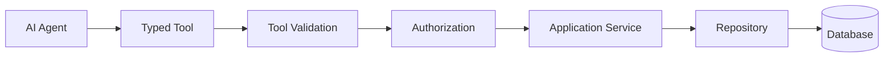

**Not:** AI Agent → Database, at any point, under any condition.

| Concern | Detail |
|---|---|
| Tool validation | Every tool call's parameters are validated identically to a human-originated request ([request-response-validation.md](request-response-validation.md) Section 13) |
| Authorization | Inherited from the calling user, enforced server-side — never self-determined by the agent ([authorization-implementation.md](authorization-implementation.md) Section 8) |
| Tool timeout | Every tool call has a bounded execution time; a timeout produces an explicit failure result (504-equivalent, [error-handling-design.md](error-handling-design.md)), not an indefinitely hanging agent |
| Tool errors | Classified per [error-handling-design.md](error-handling-design.md), surfaced to the agent as a structured failure, never silently swallowed |
| Result limits | Every tool result is bounded in size ([ai-data-access-model.md](../05_Database_Design/ai-data-access-model.md) Section 9) |
| Provenance | Every tool result carries source/freshness/confidence metadata ([evidence-provenance-flow.md](../06_API_and_Integration/evidence-provenance-flow.md)) |
| Audit | Every tool call is logged as a Tool Execution record, unconditionally |

AI-generated natural language remains strictly downstream of evidence and computation — restated from [ai-safety-and-grounding.md](../07_AI_GIS_and_Intelligence/ai-safety-and-grounding.md) Section 2 as a hard backend-implementation boundary, not merely a documentation aspiration.

## 16. GIS Boundary

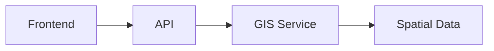

**The frontend must not perform authoritative district-level GIS computation.** All coverage, accessibility, intersection, and containment computation happens server-side, in the GIS Service. Reasons:

| Reason | Explanation |
|---|---|
| Consistency | Every client (dashboard, AI agent, future integrations) must see the identical computed result for the identical input — a client-computed result could drift from another client's computation due to differing library versions or floating-point behavior |
| Security | Server-side computation keeps the underlying geometry data behind the same authorization boundary as everything else — client-side computation would require shipping raw geometry data to the client regardless of what the client actually needed to display |
| Performance | The server can leverage spatial indexing ([database-indexing-strategy.md](../05_Database_Design/database-indexing-strategy.md) Section 4); a client re-deriving the same result from raw geometry would be slower and would not benefit from server-side precomputation/caching ([caching-and-performance.md](caching-and-performance.md)) |
| Reproducibility | A stored Analytical Result or Scenario Output must be reproducible from its recorded inputs (Reproducibility principle) — a client-side computation is not a durable, replayable record |
| Auditability | Server-side computation is what makes every GIS operation auditable via [backend-observability.md](backend-observability.md)'s GIS execution timing/logging — a client-side computation leaves no server-side trace |

Client-side visualization (rendering already-computed geometry, per [frontend-architecture.md](../02_System_Architecture/frontend-architecture.md) Section 11 and [gis-architecture.md](../02_System_Architecture/gis-architecture.md) Section 9) remains a frontend responsibility and is not affected by this boundary — the boundary is specifically about *authoritative computation*, not rendering.

## 17. Prediction Boundary

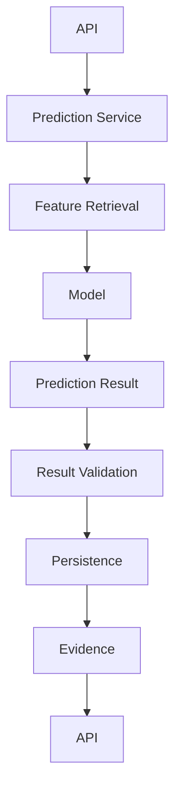

Restated from [prediction-architecture.md](../07_AI_GIS_and_Intelligence/prediction-architecture.md) Section 2 at the backend-implementation level. **Prediction output must remain structurally separate from observations, derived indicators, simulations, recommendations, and AI responses** — enforced by AD-DB-005's schema-level separation, never by a shared table with a type flag.

## 18. Simulation Boundary

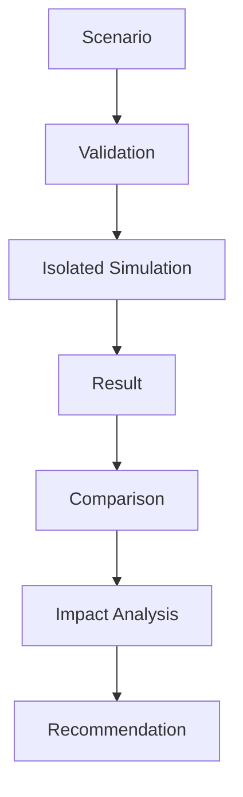

Restated from [simulation-architecture.md](../07_AI_GIS_and_Intelligence/simulation-architecture.md) Section 3. **Simulation must not mutate source-of-truth data** — the sandbox/isolation requirement (AD-DE-004) is enforced at the Repository layer: the Simulation Service's repository interface exposes no write operation against any Observed-state table, only against Scenario/Scenario Output tables.

## 19. Recommendation Boundary

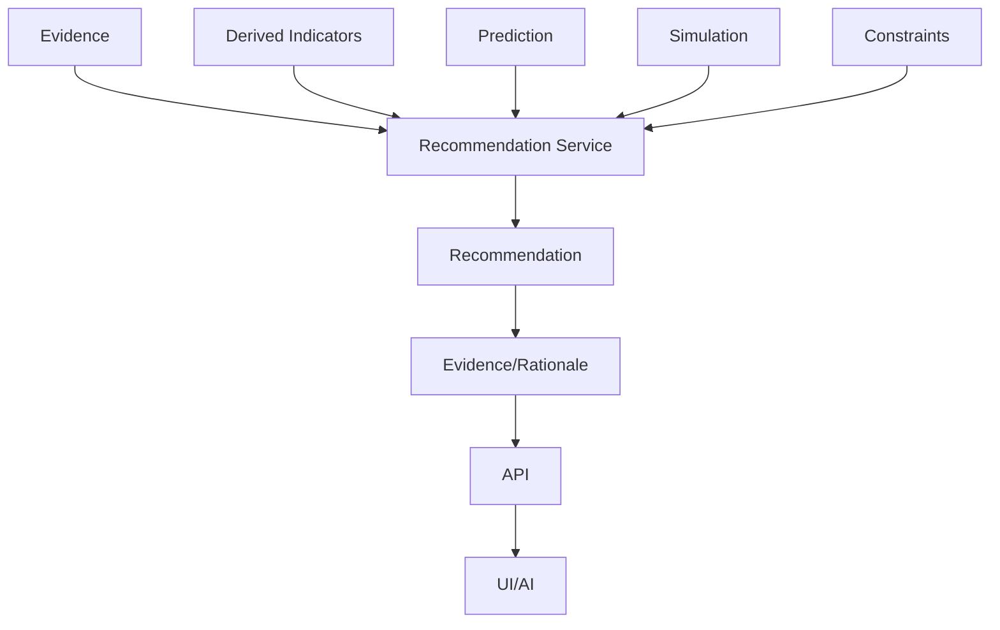

Restated from [recommendation-engine.md](../07_AI_GIS_and_Intelligence/recommendation-engine.md) Section 2. **Recommendations must be explainable and are never described as guaranteed optimal decisions** — every Recommendation response uses advisory framing (Section 7 of that document), enforced at the API/response-shaping layer, never left to a client's own presentation choice.

## 20. Milestone Traceability

See each sibling document's own traceability section; consolidated in [ED-M3-P2-VALIDATION.md](ED-M3-P2-VALIDATION.md) Section 12.

## 21. Open Decisions

- Final backend framework (Candidate, unchanged).
- Exact Application/Domain layer code-organization convention (e.g., separate files vs. separate classes within one module file) — implementation-time detail, not decided here.
