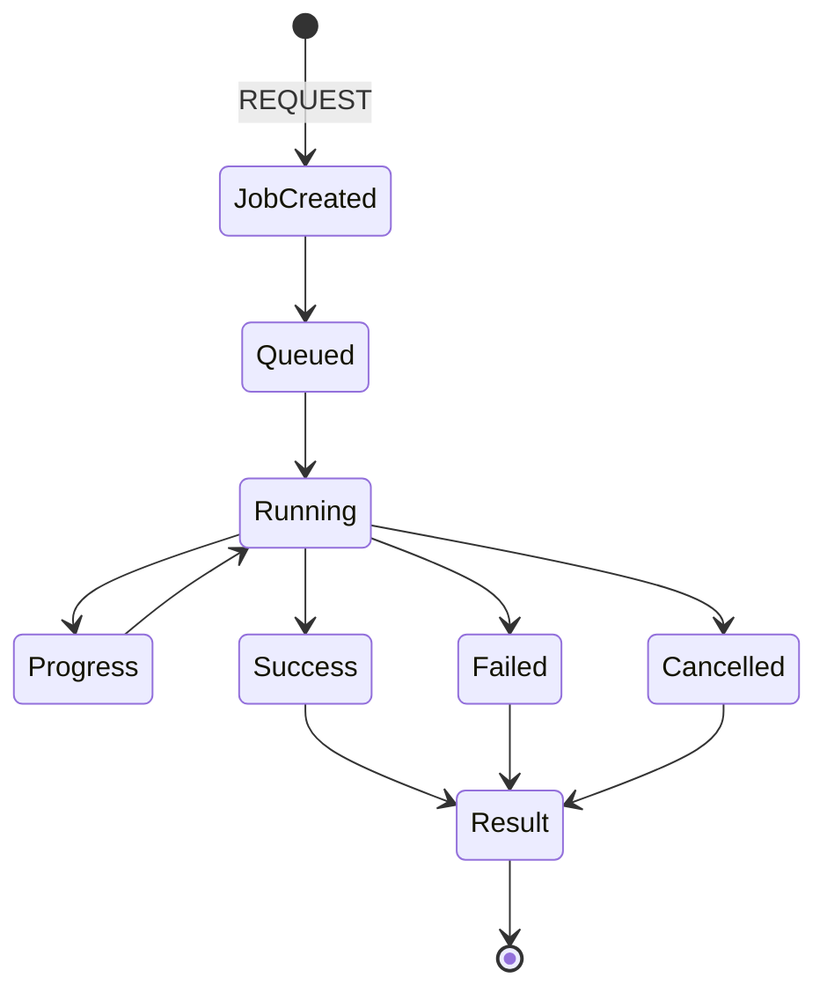

# Background Job Architecture

## 1. Purpose

This document identifies which operations are too expensive for synchronous request handling, defines the sync/async decision criteria, the job lifecycle, and — since no dedicated file exists for it among the 15 required files — the Concurrency handling required by Section 21 of this milestone's brief.

## 2. Candidate Categories

| Category | Why It May Be Expensive |
|---|---|
| Large GIS computation | A statewide (not district-scoped) spatial aggregation or network recomputation |
| Prediction execution | Model inference latency (Blueprint §12.6's offline-training/online-inference split still implies non-trivial inference time for some models) |
| Simulation | Sandboxed clone-and-recompute, potentially statewide in scope |
| Batch ingestion | Per [data-ingestion.md](../04_Data_Engineering/data-ingestion.md), inherently a multi-record, potentially long-running operation |
| Model processing (training/retraining) | Per [model-lifecycle.md](../07_AI_GIS_and_Intelligence/model-lifecycle.md), an offline stage by design |
| Large analytical queries | A cross-district or statewide aggregate not already precomputed |

**Not every operation in these categories is automatically asynchronous** — restated from this milestone's explicit instruction. Section 3 defines the actual decision criteria.

## 3. Synchronous vs. Asynchronous — Decision Criteria

| Criterion | Synchronous If... | Asynchronous If... |
|---|---|---|
| Scope | District/village-scoped, bounded by an indexed query | Statewide or cross-district, unbounded without aggregation |
| Precomputation availability | A fresh Analytical Result already exists ([database-normalization.md](../05_Database_Design/database-normalization.md) Section 6) | No precomputed result exists and computing one is expensive |
| External dependency | No external call, or a fast, bounded one | Involves model inference, an external AI provider call, or a multi-step sandboxed computation |
| Expected latency | Within an interactive response budget (consistent with NFR-001–NFR-003's Initial Targets) | Exceeds that budget by design (e.g., model training is inherently offline) |

Applying these criteria to Section 2's categories: district-scoped GIS computation and a single-domain Prediction *read* (of an already-computed Prediction) are synchronous; statewide GIS aggregation, Prediction *execution*, Simulation *execution*, and batch ingestion are asynchronous — restated consistently with [database-performance.md](../05_Database_Design/database-performance.md) Section 11 and [backend-implementation-architecture.md](backend-implementation-architecture.md) Sections 7–8.

**AD-BE-004 — Four-Criterion Test Determines Sync vs. Async, Not a Per-Operation Guess**
- **Context:** Without an explicit test, sync/async classification risks becoming an ad hoc, per-endpoint judgment call that drifts inconsistently as new operations (new Prediction domains, new Scenario types) are added across M2–M6.
- **Decision:** Every operation is classified using the four criteria in Section 3 (Scope, Precomputation availability, External dependency, Expected latency) — not assumed synchronous or asynchronous merely because of which product milestone or domain it belongs to.
- **Alternatives considered:** A blanket rule ("everything GIS/AI/ML-related is async," rejected — this milestone's brief explicitly warns against assuming every operation in Section 2's categories must be asynchronous, and a district-scoped coverage query is demonstrably fast enough to be synchronous, per Worked Example 1); per-operation ad hoc judgment with no stated criteria (rejected — inconsistent and unreviewable).
- **Reasoning:** Directly required by this milestone's explicit instruction ("do not assume every operation must be asynchronous... define criteria"); consistent with [database-performance.md](../05_Database_Design/database-performance.md) Section 11's existing sync/async table, which this decision generalizes into a reusable test rather than a fixed list.
- **Trade-offs:** Requires evaluating four criteria for each new operation as the system grows, rather than a quick default — accepted, since a wrong classification (a slow operation left synchronous) directly harms UI responsiveness ([caching-and-performance.md](caching-and-performance.md) Section 11), which is a named, high-priority DistrictMind requirement.
- **Consequences:** Every new Prediction domain, Scenario type, or Recommendation variant introduced in a future milestone is classified against this same four-criterion test, not given an ad hoc default.
- **Status:** Proposed.

## 4. Job Lifecycle

| State | Detail |
|---|---|
| Request | The triggering API call (e.g., `POST /scenarios/{id}:run`) |
| Job Created | A job record is created, atomically, as its own transaction ([repository-layer-design.md](repository-layer-design.md) Section 4.3) |
| Queued | Awaiting execution — mechanism (in-process worker, external queue) is **Under Evaluation** |
| Running | Execution in progress |
| Progress | Where meaningful (e.g., a multi-step Recommendation generation), an intermediate status is available for polling |
| Success / Failed / Cancelled | Terminal states |
| Result | The actual Prediction/Scenario Output/Recommendation record, persisted once the job reaches Success |

## 5. Retry

A job failing due to a transient cause (e.g., a momentary database connection issue) is retried with bounded backoff, per [integration-architecture.md](../02_System_Architecture/integration-architecture.md) Section 13's pattern, restated for internal jobs — a non-transient failure (e.g., insufficient historical data for a Prediction) is not retried, since retrying would not change the outcome; it is surfaced as an explicit Failed state instead.

## 6. Timeout

Every job has a maximum allowed duration; exceeding it transitions the job to Failed with a timeout classification ([error-handling-design.md](error-handling-design.md), 504-equivalent) — a job is never left in an indefinite Running state.

## 7. Cancellation

A user (or an automated process, e.g., a superseding request) may request cancellation of a Running or Queued job; cancellation transitions the job to Cancelled, and any partial computation is discarded (consistent with AD-DE-004's sandboxing for Simulation specifically — a cancelled Simulation never leaves a partial write anywhere, sandboxed or otherwise).

## 8. Idempotency

Per [api-design-principles.md](../06_API_and_Integration/api-design-principles.md) Section 16: a job-triggering request may carry a client-supplied idempotency token; a retried request with the same token does not create a duplicate job — it returns the status/result of the already-existing job instead.

## 9. Duplicate Requests

Without an idempotency token, a duplicate job-triggering request (e.g., a user double-clicking "Run Scenario") creates a second, independent job by default — this is a deliberate, simple default; the Section 8 idempotency mechanism is the explicit opt-in for callers that need stronger guarantees, since forcing idempotency-by-default would require inferring "sameness" between requests, which is itself error-prone.

## 10. Partial Failure

Restated from [simulation-architecture.md](../07_AI_GIS_and_Intelligence/simulation-architecture.md) Section 3 and [recommendation-engine.md](../07_AI_GIS_and_Intelligence/recommendation-engine.md): a job that completes only part of its intended work (e.g., a multi-step Recommendation generation where one evidence-gathering step failed) does not persist a partial result presented as complete — it either completes fully or transitions to Failed, consistent with the Domain Layer's evidence-completeness invariant ([domain-layer-design.md](domain-layer-design.md) Section 5).

## 11. Stale Jobs

A job left in Queued or Running beyond a reasonable operational threshold (distinct from its own Section 6 timeout — this concerns jobs stuck due to a worker crash or similar operational fault) is detected by a periodic sweep and transitioned to Failed with a distinct "stale" classification, so it does not silently block a user's UI indefinitely waiting for a job that will never complete.

## 12. Concurrency

### 12.1 Simultaneous Updates

Where two requests could concurrently modify the same record (e.g., two Recommendation reviews submitted near-simultaneously), the Repository layer applies optimistic concurrency where appropriate — a write checks that the record's version has not changed since it was read, and rejects (409, [error-handling-design.md](error-handling-design.md)) if it has, rather than silently overwriting a concurrent change.

### 12.2 Duplicate Scenario Execution

Restated from Section 8–9: a duplicate `run` request for the same Scenario, without an idempotency token, is rejected with a 409 if the Scenario is already Running (per [api-route-implementation.md](api-route-implementation.md)'s `/scenarios/{id}:run` route), since re-running an in-progress Scenario would be wasteful and could produce two divergent Scenario Output records for what a user likely intended as one action.

### 12.3 Duplicate Prediction Requests

Same pattern as 12.2, applied to `request_prediction`.

### 12.4 Repeated AI Tool Calls

An agent repeating an identical tool call within the same interaction (e.g., re-calling `get_weather` for the same station/date it already retrieved) is a planning inefficiency, not a concurrency-safety issue — addressed by [agent-planning-and-reasoning.md](../07_AI_GIS_and_Intelligence/agent-planning-and-reasoning.md) Section 6's "avoid unnecessary tool calls" discipline, not a backend-enforced lock.

### 12.5 Stale Results

A cached or precomputed result served during a concurrent underlying-data update is handled by the invalidation discipline in [caching-and-performance.md](caching-and-performance.md) — the served result's freshness metadata always reflects when it was actually computed, so even a technically-stale result is never presented as more current than it is.

### 12.6 Concurrent Background Jobs

Multiple jobs (e.g., two different Scenarios) may run concurrently without interfering, since each Simulation's sandbox is isolated per AD-DE-004 — the sandboxing guarantee that prevents a Simulation from mutating production data is the same mechanism that prevents two concurrent Simulations from interfering with each other.

### 12.7 Optimistic Concurrency — Where Appropriate

Applied specifically to low-contention, human-driven writes (Recommendation review, Section 12.1) — not applied to high-frequency system-generated writes (e.g., Analytical Result recomputation), where "last write wins with a new versioned row" (per [temporal-database-design.md](../05_Database_Design/temporal-database-design.md) Section 3's append-only pattern) is already the correct behavior without needing a conflict check.

## 13. Milestone Traceability

| Background Job Capability | First Needed |
|---|---|
| Batch ingestion jobs | M2 |
| AI tool execution (bounded, mostly synchronous, per Section 3) | M3 |
| Prediction execution jobs | M4 |
| Simulation execution jobs | M5 |
| Recommendation generation jobs | M6 |

## 14. Open Decisions

- Job queue/worker technology — **Under Evaluation**, unchanged from [data-ingestion.md](../04_Data_Engineering/data-ingestion.md) Section 12 and [backend-architecture.md](../02_System_Architecture/backend-architecture.md) Section 12.
- Stale-job sweep interval and threshold (Section 11) — implementation-time tuning.
