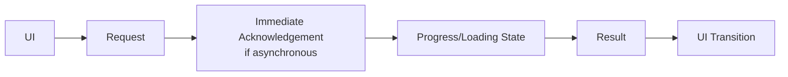

# Caching and Performance

## 1. Purpose

This document defines backend performance strategy — caching, pagination, query optimization, serialization, and spatial/analytical query optimization — elaborating [database-performance.md](../05_Database_Design/database-performance.md) with implementation-blueprint detail, and carries this milestone's required UI Responsiveness Contract (Section 30 of the brief), since no dedicated file exists for it.

## 2. Caching by Category

**Source data caching, Derived-data caching, Prediction caching, Simulation caching, and AI response caching are never conflated** — each has its own cache key shape, TTL/invalidation trigger, and safety consideration, per the six-category state separation this entire documentation program enforces.

| Category | Cache Key Basis | Invalidation Trigger | Safety Consideration |
|---|---|---|---|
| Source data caching | Entity identifier + version ([entity-catalog.md](../05_Database_Design/entity-catalog.md) Section 4) | Boundary/facility version change — cache key changes on new version, no explicit purge needed for old versions (Section 12, [gis-architecture.md](../02_System_Architecture/gis-architecture.md)) | Never serves a version older than what the client's own request implies (e.g., "current state") without disclosing it |
| Derived-data caching | Indicator + target entity + computation timestamp | Underlying Source data change ([database-normalization.md](../05_Database_Design/database-normalization.md) Section 6) or a scheduled refresh | Freshness metadata always accompanies the cached value ([evidence-provenance-flow.md](../06_API_and_Integration/evidence-provenance-flow.md)) |
| Prediction caching | Model execution + target entity + horizon | Never invalidated by newer data alone — a Prediction is immutable once created ([temporal-database-design.md](../05_Database_Design/temporal-database-design.md) Section 3); a "cache" here is really just fast retrieval of an already-persisted, immutable record | A cached Prediction retrieval never silently substitutes a newer Prediction for an older, specifically-requested one |
| Simulation caching | Scenario identifier | Never invalidated — a Scenario Output is immutable once created (same rationale as Prediction) | A cached Scenario Output is always clearly linked to its originating Scenario, never presented generically |
| AI response caching | Query text + resolved Evidence set | Any change in the underlying Evidence invalidates the cache — an identical-looking query against changed data must not return a stale AI Response | AI responses are the *least* safe category to cache broadly, since grounding freshness matters most here — caching is applied conservatively, short-TTL only, per Section 9 of [ai-agent-integration.md](../06_API_and_Integration/ai-agent-integration.md)'s streaming/latency discussion |

## 3. Pagination

Restated unchanged from [api-design-principles.md](../06_API_and_Integration/api-design-principles.md) Section 6 and [database-performance.md](../05_Database_Design/database-performance.md) Section 9 — every list-returning Repository method and API route applies pagination; no unbounded list response exists anywhere in the backend.

## 4. Query Optimization

Every query pattern named throughout `05_Database_Design/` has a corresponding index ([database-indexing-strategy.md](../05_Database_Design/database-indexing-strategy.md)) — query optimization at the backend-implementation level means ensuring every Repository method's query actually uses the intended index (e.g., filters on the indexed compound key, not a derived expression that would bypass it), a discipline enforced through code review rather than a new architectural mechanism.

## 5. Response Size

Every response is bounded (Section 9, [ai-data-access-model.md](../05_Database_Design/ai-data-access-model.md); Section 10, [database-performance.md](../05_Database_Design/database-performance.md)) — restated unchanged, applied uniformly whether the consumer is the dashboard or an AI tool.

## 6. Serialization

Response serialization follows the predictable-shape principle ([api-design-principles.md](../06_API_and_Integration/api-design-principles.md) Section 5) and avoids over-fetching — a Repository method returns only the fields its calling use case ([application-layer-design.md](application-layer-design.md)) actually needs, not an entire entity's full column set by default.

## 7. Spatial Query Optimization

Restated from [gis-service-design.md](../06_API_and_Integration/gis-service-design.md) Section 7 and [gis-computation-engine.md](../07_AI_GIS_and_Intelligence/gis-computation-engine.md): geometry simplification at low detail levels, spatial indexing (mandatory), and precomputed coverage/accessibility Analytical Results where the underlying data changes infrequently.

## 8. Analytical Query Optimization

Restated from [analytical-data-model.md](../05_Database_Design/analytical-data-model.md) Section 7: dashboard/AI-facing reads consume precomputed Analytical Result rows, never recomputing an aggregate from raw Operational data on every request.

## 9. Expensive AI Tool Results

Where a tool's underlying computation is itself expensive (e.g., `coverage_analysis`, `accessibility_analysis`), the tool's result is cached per Section 2's Derived-data or AI response caching rules, whichever the specific tool's output category matches — a `coverage_analysis` result is Derived-data-cacheable (its underlying data changes infrequently); an AI Response composing multiple tool results is only conservatively cacheable (Section 2's AI response row).

## 10. Prediction/Scenario Result Caching

Restated from Section 2 — both are effectively free to "cache" indefinitely once computed, since both are immutable, versioned records, not values subject to staleness in the usual sense.

## 11. UI Responsiveness Contract

Restated from Section 30 of this milestone's brief, since this is the natural backend-side counterpart to [frontend-architecture.md](../02_System_Architecture/frontend-architecture.md) Section 18 and [coding-standards.md](../08_Implementation_Foundation/coding-standards.md) Section 14.

| Backend Requirement | Why |
|---|---|
| Fast initial dashboard requests | Precomputed Analytical Results (Section 8) keep the most common dashboard load fast |
| Pagination | Section 3 — no unbounded response ever blocks initial render |
| Incremental data retrieval | List endpoints support fetching additional pages without re-fetching everything |
| Asynchronous expensive operations | [background-job-architecture.md](background-job-architecture.md) — the backend never forces a synchronous wait for Prediction/Simulation/large GIS computation |
| Job status | Every async job's status ([background-job-architecture.md](background-job-architecture.md) Section 4) is pollable, so the frontend can show meaningful progress rather than an indefinite spinner |
| Partial/progressive results where appropriate | E.g., a multi-step cross-domain query ([backend-implementation-architecture.md](backend-implementation-architecture.md) Section 14) may surface which sub-steps have completed, where the calling pattern supports it |
| Cancellation | [background-job-architecture.md](background-job-architecture.md) Section 7 — a user abandoning a slow operation is not left with an orphaned, still-running job consuming resources indefinitely |
| Caching | Section 2 — keeps repeat interactions (e.g., re-selecting a previously-viewed district) fast |
| Bounded payloads | Section 5 — the frontend is never forced to parse/render an unbounded response before it can update the UI |

**The frontend must never be forced to wait indefinitely** for a Simulation, a large GIS calculation, an expensive Prediction, or a large cross-domain query — every such operation is asynchronous (per [background-job-architecture.md](background-job-architecture.md) Section 3's criteria) specifically so the frontend can show a loading/progress state and remain interactive, per [coding-standards.md](../08_Implementation_Foundation/coding-standards.md) Section 14.3's "animations must never block" rule — the backend's async design is the precondition that rule depends on.

## 12. Milestone Traceability

| Performance Capability | First Needed |
|---|---|
| Pagination, query optimization, response bounding | M1 |
| Source/Derived-data caching, spatial/analytical query optimization | M2 |
| AI response caching (conservative), job status polling for AI | M3 |
| Prediction result caching | M4 |
| Simulation result caching | M5 |
| Full UI responsiveness contract across Recommendation generation | M6 |

## 13. Open Decisions

- Caching technology (Redis remains Proposed, unchanged — [database-design.md](../05_Database_Design/database-design.md) Section 25).
- Exact cache TTLs per category (Section 2) — implementation-time tuning, no numeric value invented here.
