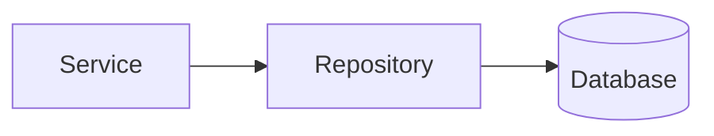

# Repository Layer Design

## 1. Purpose

This document defines the repository/data-access abstraction — the only path from any service to the database, restated from [backend-architecture.md](../02_System_Architecture/backend-architecture.md) Section 7 with implementation-blueprint detail. It also carries this milestone's required Transaction Design content (Section 20 of the brief), since no dedicated file exists for it among the 15 required files. No SQL or ORM code exists here.

## 2. The Abstraction

**The service layer must not depend on raw database access** — every query and persistence operation is expressed through a repository interface specific to its owning module's entities (e.g., a `DistrictRepository`, a `PredictionRepository`), never a shared, generic "run query" interface. This restates [backend-architecture.md](../02_System_Architecture/backend-architecture.md) Section 7 unchanged.

## 3. Repository Responsibilities

| Responsibility | Detail |
|---|---|
| Query responsibilities | Retrieve entities by identifier, by filter, by spatial/temporal predicate |
| Persistence responsibilities | Create/update records, always through the module's own repository — never a cross-module write |
| Transaction interaction | Declares transaction boundaries on behalf of the Application Layer (Section 4) |
| Spatial queries | Delegates to the GIS service's underlying spatial index-backed operations ([spatial-database-design.md](../05_Database_Design/spatial-database-design.md)), never hand-rolled geometry math |
| Temporal queries | Respects the append-only/versioned key patterns per entity ([temporal-database-design.md](../05_Database_Design/temporal-database-design.md) Section 3) — a "current state" query filters to the latest non-superseded version; a "state as of date X" query filters accordingly |
| Analytical queries | Reads from the Analytical Result table, never recomputing aggregates ad hoc within the repository itself (that is the Analytics service's own Domain Logic) |
| Pagination | Every list-returning repository method accepts and applies pagination parameters, per [api-design-principles.md](../06_API_and_Integration/api-design-principles.md) Section 6 |
| Filtering | Applies only allow-listed filter predicates (matching a domain's known enumerations, [data-validation.md](../04_Data_Engineering/data-validation.md) Section 3) — never an arbitrary passthrough filter expression |
| Sorting | Same allow-listing discipline as filtering, per [api-design-principles.md](../06_API_and_Integration/api-design-principles.md) Section 8 |
| Entity retrieval | By stable identifier ([entity-catalog.md](../05_Database_Design/entity-catalog.md) Section 4's identifier strategy), never by a mutable natural key |

## 4. Transaction Design

Restated and elaborated from Section 20 of this milestone's brief.

### 4.1 What Must Be Atomic

| Operation | Atomicity Requirement |
|---|---|
| Source-data ingestion | A batch's validated records and its ingestion-run outcome (success/failure/count) are committed together — no partial batch is visible mid-commit ([data-ingestion.md](../04_Data_Engineering/data-ingestion.md) Section 6) |
| Scenario creation | The Scenario definition record is committed as a single atomic write |
| Simulation-result persistence | Every Scenario Output row belonging to one Scenario run is committed together — a partially-written comparison result is never visible (Section 6 of [scenario-engine.md](../07_AI_GIS_and_Intelligence/scenario-engine.md)) |
| Recommendation persistence | The Recommendation record and its Recommendation Evidence rows are committed together — a Recommendation is never visible without its evidence links |
| Evidence persistence (as part of AI Response) | The AI Response record and its cited Tool Execution references are committed together |
| Recommendation review | The status-transition write and its Audit Event write are committed together (or the review is not considered to have happened) — this directly implements FR-032's "cannot become accepted without a recorded human action" |

### 4.2 What Can Be Eventually Consistent

| Item | Rationale |
|---|---|
| Analytical Result recomputation | A dashboard reading a slightly-stale precomputed indicator is acceptable, disclosed via freshness metadata ([evidence-provenance-flow.md](../06_API_and_Integration/evidence-provenance-flow.md)) — recomputation does not need to be transactionally coupled to every underlying data change |
| Cache invalidation | Per [caching-and-performance.md](caching-and-performance.md), cache entries are invalidated on a defined trigger, not necessarily within the same transaction as the underlying write |
| Audit log delivery to any downstream observability system (if one exists beyond the primary Audit Event table) | The primary Audit Event write is atomic with its triggering action (Section 4.1); a secondary observability pipeline reading from it is eventually consistent |

### 4.3 What Can Be Asynchronous

Restated from [background-job-architecture.md](background-job-architecture.md): Prediction execution, Simulation execution, and multi-step Recommendation generation are asynchronous — their *triggering* write (a job record) is atomic and immediate; their *completion* write (the actual Prediction/Scenario Output/Recommendation record) happens later, in its own atomic transaction, once the job completes.

### 4.4 No Distributed Transactions

**AD-BE-005 — Local ACID Transactions Only; No Distributed Transactions or Sagas**
- **Context:** Because DistrictMind's data platform is a single database instance (AD-DE-001, AD-DB-001) within a single modular-monolith deployment (AD-BE-001), every atomic operation named in Section 4.1 can be expressed as a standard local database transaction — there is no scenario, at the current architecture, where an atomic operation spans two separate database systems or two separate deployed services.
- **Decision:** No distributed-transaction pattern (two-phase commit, saga/compensating-transaction pattern) is introduced. Every "must be atomic" operation (Section 4.1) uses a single local transaction against the primary database.
- **Alternatives considered:** A saga pattern for cross-service atomicity (rejected — no current operation genuinely spans multiple independently-deployed services, since the modular monolith keeps every module in one process with one database connection scope; introducing sagas now would be solving a problem the architecture does not yet have).
- **Reasoning:** Directly follows from AD-BE-001's modular-monolith decision and the "do not overengineer" guidance repeated throughout this documentation program.
- **Trade-offs:** If the AI/ML module or Simulation module is ever extracted into a separately deployed service (the flagged future option in [backend-architecture.md](../02_System_Architecture/backend-architecture.md) Section 2), any operation spanning that boundary would need this decision revisited — explicitly flagged as a future trigger for reconsideration, not resolved now.
- **Consequences:** [background-job-architecture.md](background-job-architecture.md)'s job-completion writes (Section 4.3) are each their own local transaction, not part of a distributed saga.
- **Status:** Proposed.

## 5. Milestone Traceability

| Repository Capability | First Needed |
|---|---|
| Basic CRUD-style repositories, spatial queries | M1 |
| Temporal/versioned queries, analytical queries, pagination/filtering/sorting across all domains | M2 |
| Transaction patterns for AI Response persistence | M3 |
| Transaction patterns for Prediction | M4 |
| Transaction patterns for Simulation | M5 |
| Transaction patterns for Recommendation + review | M6 |

## 6. Open Decisions

- Final ORM/database-driver choice — Candidate, unchanged.
- Whether a secondary observability pipeline (Section 4.2) is ever introduced — deferred to [backend-observability.md](backend-observability.md).
