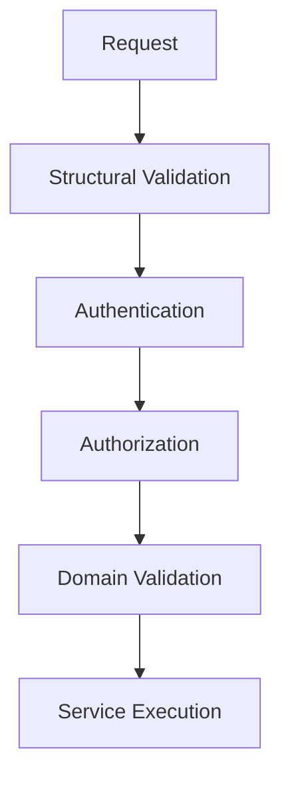

# Request/Response Validation

## 1. Purpose

This document defines backend validation at the request/response level, elaborating [backend-architecture.md](../02_System_Architecture/backend-architecture.md) Section 8's two-stage pattern and [data-validation.md](../04_Data_Engineering/data-validation.md) with API-boundary-specific detail. No executable schema exists in this document.

## 2. Validation Order

This is the single, binding validation order for every route in [api-route-implementation.md](api-route-implementation.md) — no route skips a stage, and no stage runs out of order.

## 3. Type Validation

Every request field is checked against its expected type (string, number, boolean, geometry, date) before any further processing — a type mismatch is rejected at Structural Validation, never coerced silently.

## 4. Required Fields

Fields required by the relevant contract in [api-contracts.md](../06_API_and_Integration/api-contracts.md) are checked for presence; a missing required field is a Structural Validation failure.

## 5. Optional Fields

Fields not required carry a documented default (where one exists, per [configuration-management.md](../08_Implementation_Foundation/configuration-management.md) Section 7's default-vs-no-default distinction, applied here to request parameters) or are treated as "not specified," never silently defaulted to a value that could be mistaken for user intent.

## 6. Enum Values

Fields constrained to a known set (facility type, scenario type, observation type) are checked against the exact enumeration defined in [data-validation.md](../04_Data_Engineering/data-validation.md) Section 3 — an unrecognized value is rejected, never coerced to the "closest" valid value.

## 7. Date/Time Validation

Per [data-validation.md](../04_Data_Engineering/data-validation.md) Section 5: well-formed, parseable, within a plausible range; an Observed-state request never accepts a future date (only Predicted/Scenario-state operations may reference the future, per [digital-twin-state-model.md](../05_Database_Design/digital-twin-state-model.md)).

## 8. Geographic Bounds

Coordinates and geometry inputs are checked for plausibility (within Telangana's known extent, non-degenerate) per [data-validation.md](../04_Data_Engineering/data-validation.md) Section 4, and for CRS consistency before any spatial computation is attempted.

## 9. Pagination

`page`/`cursor` and `pageSize`-equivalent parameters are validated against a bounded maximum, per [api-design-principles.md](../06_API_and_Integration/api-design-principles.md) Section 6 — a request for an unbounded page size is rejected, not silently capped without disclosure (the response indicates the effective size used).

## 10. Filtering

Filter parameters are checked against the target resource's allow-listed filterable fields ([api-design-principles.md](../06_API_and_Integration/api-design-principles.md) Section 7) — an unrecognized filter field is rejected, never silently ignored (silent ignoring could mislead a client into believing a filter was applied when it was not).

## 11. Scenario Parameters

Structural Validation confirms the Scenario type is in the fixed allow-list ([scenario-engine.md](../07_AI_GIS_and_Intelligence/scenario-engine.md) Section 3); Domain Validation (a later stage) confirms the parameter *values* are within that type's expected shape and range (e.g., a rainfall-change percentage within a plausible bound) — this two-tier split matches AD-DB-003's structured-attribute-set reasoning ([database-normalization.md](../05_Database_Design/database-normalization.md)).

## 12. Prediction Inputs

Target entity and horizon are Structurally validated for well-formedness; whether sufficient historical data actually exists is a Domain Validation concern owned by the Prediction service ([domain-layer-design.md](domain-layer-design.md)), not the API boundary — the boundary does not need to know what "sufficient" means for a given model.

## 13. AI Tool Inputs

Every Typed AI Tool's parameters ([ai-tool-contracts.md](../06_API_and_Integration/ai-tool-contracts.md)) pass through the identical Structural → Domain validation stages as a human-originated API request — restated from AD-API-002: there is no relaxed validation path for AI-originated calls.

## 14. Response Validation

Every response is checked, before being returned, against its documented shape ([api-contracts.md](../06_API_and_Integration/api-contracts.md)) — specifically: every provenance-bearing field is actually populated (Section 16, [api-architecture.md](../06_API_and_Integration/api-architecture.md)), and no field that should carry a state-category label (Observed/Derived/Predicted/Scenario/Recommendation) is ever returned without one. A response failing this check is treated as an internal error, not shipped to the client in a malformed state.

## 15. Milestone Traceability

| Validation Capability | First Needed |
|---|---|
| Type, required/optional fields, enum, date/time, geographic bounds, pagination, filtering | M1 |
| Full domain-validation coverage across all resources | M2 |
| AI tool input validation | M3 |
| Prediction input validation | M4 |
| Scenario parameter validation | M5 |
| Response validation for Recommendation Evidence completeness | M6 |

## 16. Open Decisions

- Specific validation library/framework — Under Evaluation, tied to the unresolved backend framework choice.
