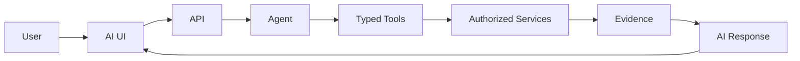

# Frontend AI Assistant UI

## 1. Purpose

This document designs the AI assistant user interface, elaborating [frontend-architecture.md](../02_System_Architecture/frontend-architecture.md) Section 14 and [ai-agent-integration.md](../06_API_and_Integration/ai-agent-integration.md) with implementation-blueprint detail. **The assistant operates exclusively through the backend typed-tool architecture** — no UI element in this document implies any other path.

## 2. The Boundary, Restated at the UI Layer

The AI UI is a thin presentation layer over this entire chain — it never itself calls an LLM provider, never itself queries a database, and never presents a claim the chain above did not produce.

## 3. Chat Interface

A conversational thread view, per [frontend-architecture.md](../02_System_Architecture/frontend-architecture.md) Section 14 — restated unchanged.

## 4. Query Input

A text input accepting natural-language queries (FR-020); client-side validation restricted to basic well-formedness (non-empty, within a maximum length, per [request-response-validation.md](../09_Backend_Implementation/request-response-validation.md) Section 13) — the frontend never attempts to interpret or classify the query's intent itself (that is the backend Agent's responsibility, [agent-planning-and-reasoning.md](../07_AI_GIS_and_Intelligence/agent-planning-and-reasoning.md)).

## 5. Conversation History

Maintained per the AI conversation state category ([frontend-state-management.md](frontend-state-management.md) Section 2, row 7) — an ordered list of user queries and AI Responses, each response carrying its own evidence citations independently, not inherited from prior turns.

## 6. Loading State

While a query is in flight, the UI shows a distinct "thinking" state (per [frontend-loading-error-empty-states.md](frontend-loading-error-empty-states.md)) — not a generic spinner, since an AI query's latency profile (potentially involving multiple tool calls, per [agent-execution-architecture.md](../07_AI_GIS_and_Intelligence/agent-execution-architecture.md) Section 4) differs from a simple data fetch.

## 7. Tool Execution State

Where the backend's response-delivery mechanism supports it (Under Evaluation, per [ai-agent-integration.md](../06_API_and_Integration/ai-agent-integration.md) Section 9), the UI may surface intermediate progress (e.g., "retrieving weather data...", "checking healthcare facilities...") reflecting the Agent's actual planned steps ([agent-planning-and-reasoning.md](../07_AI_GIS_and_Intelligence/agent-planning-and-reasoning.md) Section 2) — this is a UX enhancement, not a requirement, since it depends on a mechanism not yet confirmed.

## 8. Evidence Display

Every AI Response's citations are rendered as resolvable references (per [api-contracts.md](../06_API_and_Integration/api-contracts.md) Operation 17) — a user can inspect exactly which Analytical Result, Prediction, Scenario Output, or Observed record backs each claim.

## 9. Source/Provenance Display

Alongside each citation, the UI shows the underlying data's source and freshness ([evidence-provenance-flow.md](../06_API_and_Integration/evidence-provenance-flow.md) Section 3) — restated from [frontend-dashboard-design.md](frontend-dashboard-design.md) Section 11's state-category treatment, applied specifically within the conversation thread.

## 10. Confidence/Uncertainty Presentation

Restated unchanged from [ai-uncertainty-and-confidence.md](../07_AI_GIS_and_Intelligence/ai-uncertainty-and-confidence.md) Section 5's illustrative phrasing patterns — the UI never presents a numeric confidence value the backend did not itself provide (AD-AI-003), and every Predicted/Scenario/Recommendation claim within an AI Response uses the hedged/advisory phrasing pattern that document defines, not a flattened, equally-confident tone across all claim types.

## 11. Map-Linked AI Answers

Where an AI Response concerns spatial data (e.g., the healthcare coverage worked example below), the UI may highlight the relevant entities on an embedded or linked map view — the map rendering itself follows [frontend-gis-implementation.md](frontend-gis-implementation.md) in every respect; the AI Response only tells the UI *which* entities to highlight, it does not supply new geometry or computation of its own.

## 12. Chart-Linked AI Answers

Where an AI Response concerns a trend or comparison, the UI may render or highlight the relevant chart, following [frontend-dashboard-design.md](frontend-dashboard-design.md) Section 7's charting treatment.

## 13. Error Handling

An AI-specific failure (provider unavailable, tool failure) is surfaced as a distinct, honest message within the conversation thread — never a generic application error, and never a silently degraded response, per [ai-safety-and-grounding.md](../07_AI_GIS_and_Intelligence/ai-safety-and-grounding.md).

## 14. Unsupported Questions

Restated from FR-022: the UI renders an explicit "I cannot answer this" message when the backend returns that result — the UI does not attempt to reformulate or retry the query automatically, since doing so could mask the actual limitation from the user.

## 15. Ambiguous Questions

If the backend's Agent determines a query is ambiguous (per [agent-planning-and-reasoning.md](../07_AI_GIS_and_Intelligence/agent-planning-and-reasoning.md) Section 7), the UI presents the Agent's clarifying question (or its stated assumption) within the conversation thread, exactly as it would present any other AI Response.

## 16. Long-Running Analysis

Where a query triggers an asynchronous operation (a Prediction request, a Scenario run, per [background-job-architecture.md](../09_Backend_Implementation/background-job-architecture.md)), the conversation thread shows a distinct "processing" message with the same job-status polling pattern as [frontend-api-integration.md](frontend-api-integration.md) Section 16 — the chat input remains usable for a new query while a prior long-running one is still processing (non-blocking, per [coding-standards.md](../08_Implementation_Foundation/coding-standards.md) Section 14.3).

## 17. Cancellation

A user may cancel an in-flight query or a long-running analysis it triggered, per [background-job-architecture.md](../09_Backend_Implementation/background-job-architecture.md) Section 7 — the UI reflects the resulting Cancelled state honestly, not as a silent disappearance of the query.

## 18. Response Streaming — Only If Supported

**Explicitly conditional, per this milestone's instruction:** streaming/progressive response display is documented only as a possibility, contingent on [ai-agent-integration.md](../06_API_and_Integration/ai-agent-integration.md) Section 9's still-Under-Evaluation mechanism. If confirmed, the UI would render partial response text as it arrives; if not, the UI renders the complete response only once fully composed and grounding-validated. **This document does not assume streaming is available.**

## 19. Safety Messaging

Where a response is ungrounded, based on stale data, or based on conflicting sources ([ai-safety-and-grounding.md](../07_AI_GIS_and_Intelligence/ai-safety-and-grounding.md) Sections 4–6), the UI surfaces that disclosure prominently within the response itself, not buried in a tooltip a user might not notice.

## 20. Worked Example — "Which areas are outside the 10 km healthcare coverage?"

| Stage | UI Behavior |
|---|---|
| Query submitted | Rendered in the conversation thread |
| Loading | "Thinking" state (Section 6), possibly with tool-execution progress (Section 7) |
| Response received | The AI's natural-language summary, plus the resolvable coverage-gap Evidence (Section 8) |
| Map | The relevant villages highlighted on the map, per Section 11 — **the frontend presents the returned spatial result; it does not calculate it locally**, restated directly from this milestone's own instruction and AD-FE-004 |
| Provenance | Source/freshness of the underlying village and facility data (Section 9) |

## 21. Milestone Traceability

| AI UI Capability | First Needed |
|---|---|
| Chat interface, query input, conversation history, loading/error states, evidence display | M3 |
| Prediction-linked responses (confidence disclosure) | M4 |
| Scenario-linked responses (hypothetical framing) | M5 |
| Recommendation-linked responses (advisory framing, full evidence chain) | M6 |

## 22. Open Decisions

- Whether tool-execution progress display (Section 7) and response streaming (Section 18) are ever implemented — both Under Evaluation, contingent on backend mechanism confirmation.
- Final AI provider — unresolved, unchanged.
